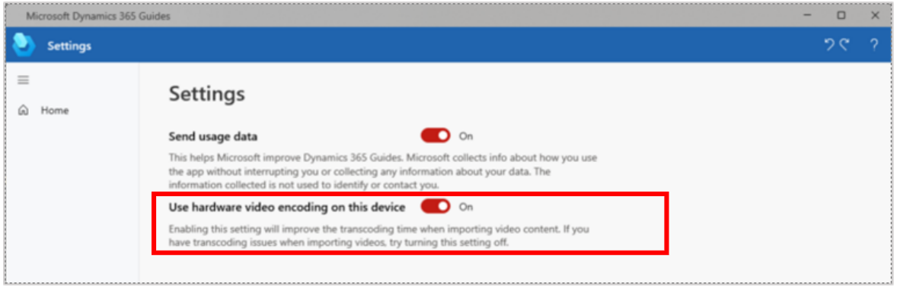

# Supported file formats for 3D models, images, and videos in Dynamics 365 Guides

In Microsoft [!include[pn-dyn-365-guides](../includes/pn-dyn-365-guides.md)], you can use the PC app to add 3D models, images, and videos to help operators with steps. The PC app  supports the following file formats for these types of files.

| Media | Supported formats | Best practice |
|-------|-------------------|---------------|
| 3D models | FBX, GLB, glTF, STL, PLY 
**Note:** Dynamics 365 Guides uses meters as the default scale unit. If your 3D model scale is set to millimeters when you export from your CAD solution, the model will be converted to meters in Dynamics 365 Guides. For example, if your model is 50 millimeters, it will be converted to 50 meters. To ensure size consistency between your CAD solution and Dynamics 365 Guides, make sure to set your model scale unit to meters when you  export. | Optimize your 3D models as much as possible, to help maintain optimal performance on [!include[pn-hololens](../includes/pn-hololens.md)]. For more information, see [Convert CAD drawings to use as holograms](author-convert-3D-models.md). |
| Images | PNG, JPG, JPEG, BMP, TIF | |
| Video/audio | MP4, MOV, WMV, ASF, AVI M2TS, MKV, WAV| Keep your videos less than two minutes long and focused on one step at a time. |

> [!IMPORTANT]
> - The August 9, 2022 release introduced a new setting that improves video transcoding. If the PC app detects a hardware transcoding failure, it automatically uses software transcoding instead. If the software transcoding is successful, the **Use hardware video encoding on this device** setting is automatically updated to switch off hardware encoding. 
>  
> 
> - The supported video format and resolution is 854 x 480 H.264 MP4 (commonly called Advanced Video Recording or "AVC"). Any other formats are transcoded when imported and may result in a larger file size than the original.
> - **The file size limit for a video, image, or 3D model is 128 MB. Transcoding may occur when uploading. This may change the size of the file that needs to be stored, which can cause the upload to fail if the file is too big.**
  

## What's next?

- [Step Editor overview](pc-app-step-editor-overview.md)
- [Add a 3D model from the 3D toolkit](pc-app-add-3D-model.md)
- [Add a 3D part](pc-app-add-3D-part.md)
- [Add an image or video file](pc-app-add-media.md)
- [How to make a great mixed-reality guide](great-guide.md) 
