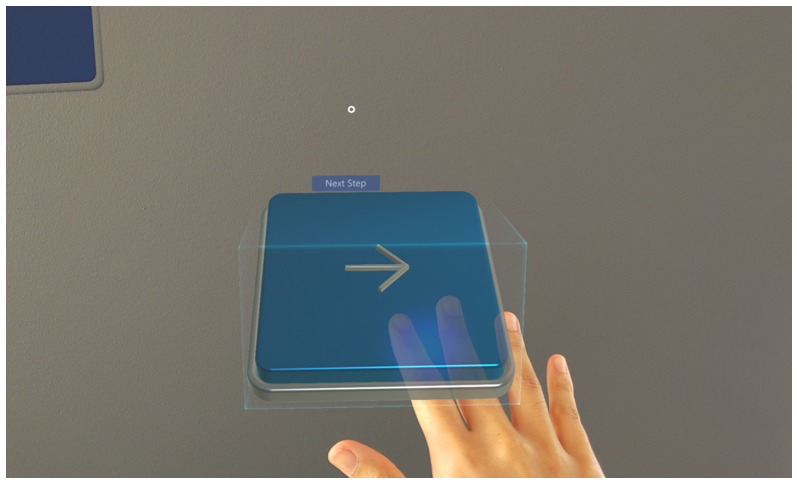
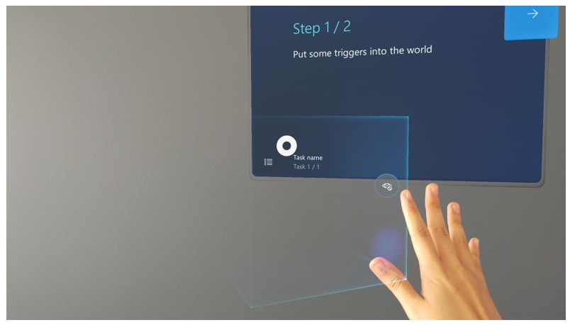
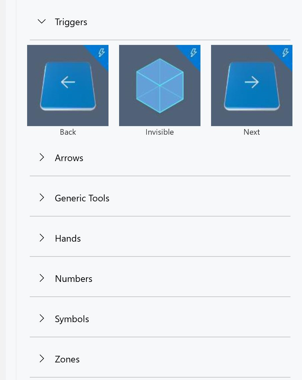

# Create a trigger for step navigation in the Dynamics 365 Guides PC app

If you’re using HoloLens 2 with Microsoft Dynamics 365 Guides, you can create a trigger that automatically advances an operator to the next step based on detection of their 
hand(s). This provides a very natural way for operators to complete a task. You place the triggers in the real world where the work takes place. The operator doesn’t have to 
disrupt the flow of their work by gazing at a button on the instruction card after completing each step. 

When an operator activates a trigger, they see a **Next Step** or **Previous Step** visual cue wherever they’re gazing to let them know that they’ve completed the step. They also receive audio feedback for extra reinforcement.

> [!NOTE]
> You can create a trigger with a HoloLens 1 device, but you can’t test a trigger on HoloLens 1, and operators on HoloLens 1 won’t be able to use the trigger since 
triggers require HoloLens 2 hand detection.

## Two types of triggers

There are two types of triggers:

- **Visible triggers.** Dynamics 365 Guides comes with pre-configured **Next** and **Back** buttons that you can place in the real world. Operators select a visible trigger with their hand(s) to move forward or backward. **The trigger is activated when the operator's hand exits the trigger area**. 

    
 
> [!TIP]
> You can add a dotted line to a visible trigger to tie it to a specific place in the real world.

- **Invisible triggers.** An invisible trigger automatically advances an operator to the next step when the **operator’s hand exits the trigger area**. Operators don’t see any evidence of the trigger until they activate it, at which time they’ll see a light green box. 

    
 
This reduces clutter for the operator and helps them focus on the task at hand.

## When is a trigger activated?

A trigger is activated when an operator's hand exits the trigger area. 

## Create a trigger 

You create a trigger in the same way that you create any other hologram in the PC app. 

> [!NOTE]
> You can also [create a trigger directly in the HoloLens app](HoloLens-app-trigger.md).

1. In the PC app, select the **3D toolkit** tab.

2. Open the **Triggers** section, and then drag the type of trigger (**Back**, **Invisible**, or **Next**) you want to the bin.

    
    
After adding the trigger in the PC app, you can [place and test it in the HoloLens app](hololens-app-trigger.md).
    
## What's next?

[Place and test a trigger in the HoloLens app](hololens-app-trigger.md)
 
