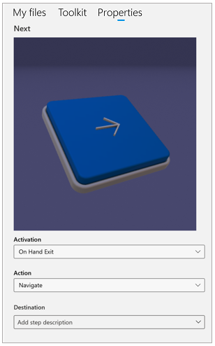

# Create a trigger for step navigation in the Dynamics 365 Guides PC app

If you’re using HoloLens 2 with Microsoft Dynamics 365 Guides, you can create a trigger that automatically advances an operator to the next step based on detection of their 
hand(s). This provides a very natural way for operators to complete a task. You place the triggers in the real world where the work takes place. The operator doesn’t have to 
disrupt the flow of their work by gazing at a button on the instruction card after completing each step. 

When an operator activates a trigger, they see a **Next Step** or **Previous Step** visual cue wherever they’re gazing to let them know that they’ve completed the step. They also receive audio feedback for extra reinforcement.

> [!NOTE]
> You can create a trigger with a HoloLens 1 device, but you can’t test a trigger on HoloLens 1, and operators on HoloLens 1 won’t be able to use the trigger since 
triggers require HoloLens 2 hand detection.

## Two types of triggers

There are two types of triggers:

- **Visible triggers.** Dynamics 365 Guides comes with pre-configured **Next** and **Back** buttons that you can place in the real world. Operators select a visible trigger with their hand(s) to move forward or backward.  

    
 
    > [!TIP]
    > You can add a dotted line to a visible trigger to tie it to a specific place in the real world.

- **Invisible triggers.** An invisible trigger automatically advances an operator to the next step when the trigger is activated. Operators don’t see any evidence of the trigger until they activate it, at which time they’ll see a light green box. 

    
 
    This reduces clutter for the operator and helps them focus on the task at hand.

## When is a trigger activated?

You can set up a trigger to activate when the operator's hand enters the trigger area or when it exits the trigger area. 

### When to use on-enter triggers

Use on-enter triggers for actions that require an immediate response.
        
- For visible triggers, use on enter, and activate the trigger as soon as the operator's hand enters the trigger area.  
     
- When alerting an operator that they've done an incorrect action, consider using a branch to take the operator to a pre-authored corrective step. [Learn more about branching](pc-app-branching.md).
     
- When alerting an operator about a safety concern, consider using a branch to take the operator to a pre-authored warning step. 
        
### When to use on-exit triggers

Use on-exit triggers for actions that require an operator to do something before moving to the next step. Examples:
    
- When using a tool to tighten a fastener, activate the trigger after the operator has finished the action.
        
- When collecting a tool or part needed for the next step, activate the trigger after the operator has acquired the tool or part.  

## Create a trigger 

You create a trigger in the same way that you create any other hologram in the PC app. 

> [!NOTE]
> You can also [create a trigger directly in the HoloLens app](hololens-app-trigger.md).

1. In the PC app, select the **3D toolkit** tab.

2. Open the **Triggers** section, and then drag the type of trigger (**Back**, **Invisible**, or **Next**) you want to the bin.

    

## Configure the trigger 

After creating your trigger, you need to configure it. 

1. Select the trigger in the bin. This opens the **Properties** tab on the right side of the screen. You can use this tab to preview the trigger and to view and set the trigger properties. 

    

2. In the **Activation** field, select one of the following:
    
      - **On Hand Enter** to activate the trigger as soon as the operator places their hand in the trigger area.
      
      - **On Hand Exit** to delay the trigger activation until the operator has removed their hand from the trigger area.
         
3. In the **Action** field, select one of the following:
    
      - **Back** to take the operator back to the previous step in the guide.
      
      - **Next** to take the operator to the next step in the guide.
      
      - **Navigate** if you want to take the operator to a specific step in the guide. After selecting **Navigate**, you can select the exact step to go to in the **Destination** list. Using the **Navigate** option enables you to have the operator skip multiple tasks or steps for different scenarios. 
 
      - **Use Response 1**, to configure the trigger to navigate to the destination set for Response 1 in a question step. For example, if the destination for the first response is set to **Task 3**, configuring the trigger to **Use Response 1** means the trigger will navigate to **Task 3** when activated. If you update the response’s destination, the trigger will also be updated. [Learn more about question steps and responses](pc-app-branching.md).
    
        
    
## What's next?

[Place and test a trigger in the HoloLens app](hololens-app-trigger.md)

[!INCLUDE[footer-include](../includes/footer-banner.md)]