# Add a website or Power Apps link to a step in Dynamics 365 Guides

You can use add a website link or a [!include[pn-powerapps](../includes/pn-powerapps.md)] link to a Step card in [!include[cc-microsoft](../includes/cc-microsoft.md)] [!include[pn-dyn-365-guides](../includes/pn-dyn-365-guides.md)].

- **Website link.** Add a website link to a step so that operators can see and interact with information outside [!include[pn-dyn-365-guides](../includes/pn-dyn-365-guides.md)]. For example, you might want to provide a link to a parts diagram, a parts inventory system, an analytics dashboard, or information about Internet of Things (IoT) sensors. Website links let authors create a seamless workflow for operators.

   

- **[!include[pn-powerapps](../includes/pn-powerapps.md)] link.** [Power Apps](https://products.office.com/business/microsoft-powerapps) enables teams to create custom applications with low-code tools to solve unique business workflows. By combining [!include[pn-dyn-365-guides](../includes/pn-dyn-365-guides.md)] and [!include[pn-powerapps](../includes/pn-powerapps.md)], you can extend [!include[pn-dyn-365-guides](../includes/pn-dyn-365-guides.md)] capabilities to create a more seamless end-to-end solution that fits the needs of your operators. For example, you can add a link to an interactive quiz app, a parts re-ordering app, or an app that provides the latest status on IoT sensors.  

   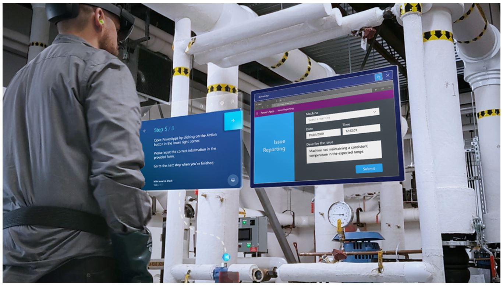

   > [!NOTE]
   > To run [!include[pn-powerapps](../includes/pn-powerapps.md)] from [!include[pn-dyn-365-guides](../includes/pn-dyn-365-guides.md)], operators need a [Power Apps license](https://powerapps.microsoft.com/pricing/). They must also have [permission](https://docs.microsoft.com/powerapps/maker/canvas-apps/share-app#share-an-app) to view the app that is created in [!include[pn-powerapps](../includes/pn-powerapps.md)].

## Add a website link to a step

To add a website link to a step, you add an action. You can add one action per step. If a step already includes an action, any new action that you add (regardless of whether it's a website link or a [!include[pn-powerapps](../includes/pn-powerapps.md)] link) overwrites the existing action. 

1. On the right side of the page, select the **Action** tab.

    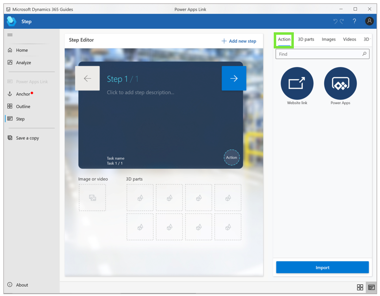
 
2. Drag the **Website link** circle to the **Action** circle in the lower-right corner of the **Step Editor** pane.

    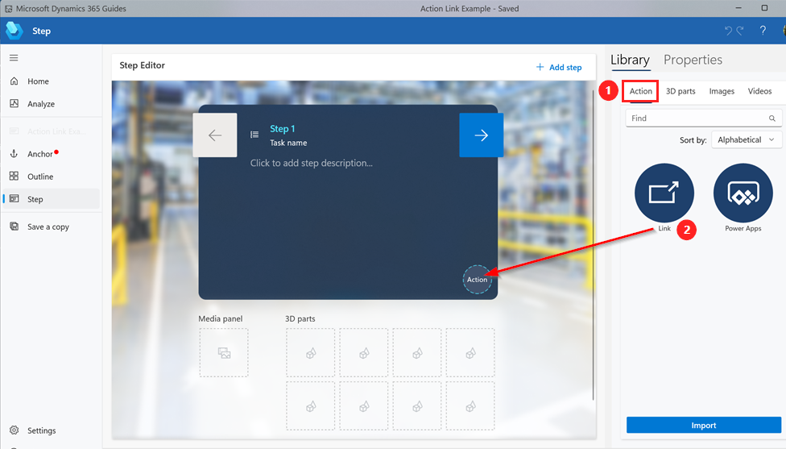

3. In the **Website link** dialog box that appears, enter a valid URL that begins with **http://** or **https://**, and then select **Save**.

    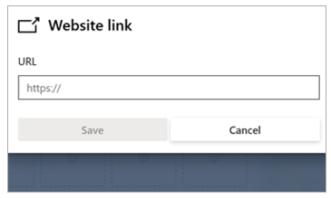

4. To view, edit, or delete the link, right-click the **Website link** button in the **Step Editor** pane, and then select the appropriate command.

    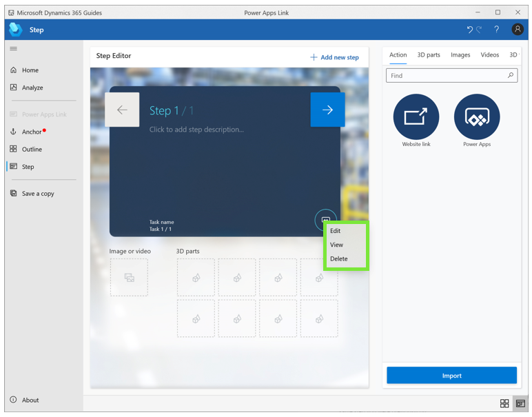

## Add a Power Apps link to a step

Adding a PowerApps link requires two steps:

1. Copy the [!include[pn-powerapps](../includes/pn-powerapps.md)] link.

2. Add the link to a step in the PC app.

### Copy the Power Apps link

You can link to a published app created in [!include[pn-powerapps](../includes/pn-powerapps.md)] if you have edit permissions for that app. 

1.	Go to <https://make.powerapps.com>.

2.	Select the **More Commands** button (**…**)  next to the appropriate app, and then select **Edit**.

     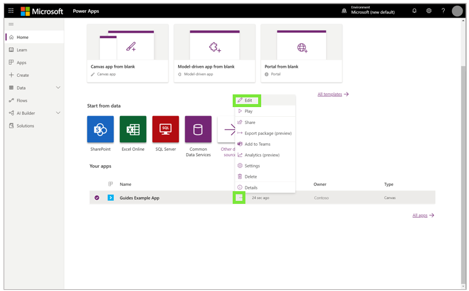
 
3.	In the left pane, select **File**, and then select **Share**.      
 
4.	Under **Guides [!include[pn-powerapps](../includes/pn-powerapps.md)] example**, select **Share**.

     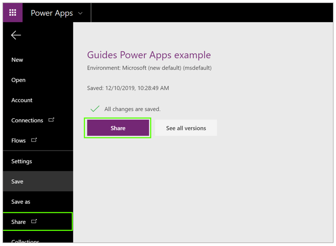

5.	In the **Share Guides [!include[pn-powerapps](../includes/pn-powerapps.md)] example** dialog box, select **Cancel**.

     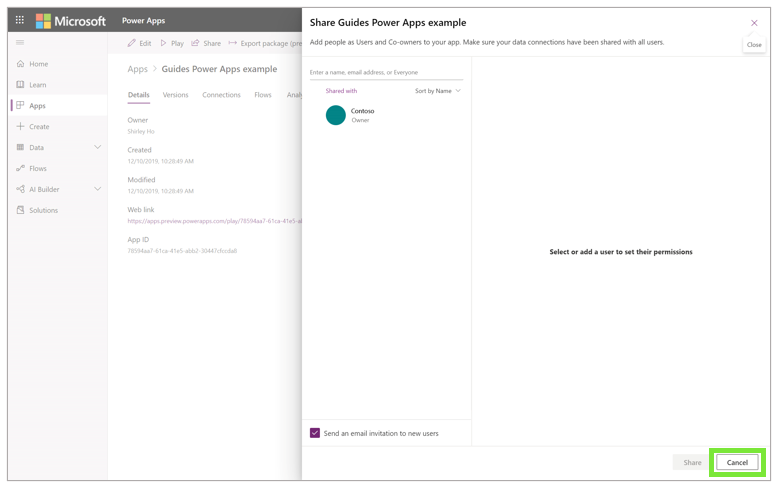

6.	In the **Web link** field, copy the URL. 

     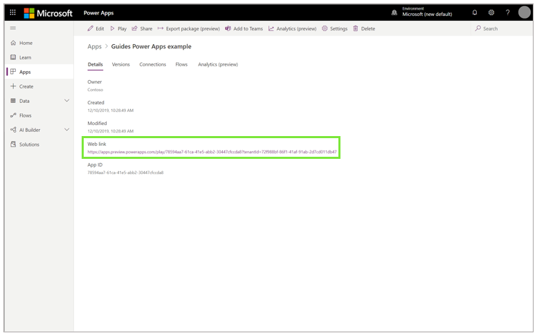

### Add a Power Apps link to a step 

To add a [!include[pn-powerapps](../includes/pn-powerapps.md)] link to a step, you add an action. You can add one action per step. If the step already includes an action, any new action that you add (regardless of whether it's a website link or a [!include[pn-powerapps](../includes/pn-powerapps.md)] link) overwrites the existing action.

1.	In the PC Authoring app, go to the appropriate step, and then select the **Action** tab.

     

2.	Drag the **[!include[pn-powerapps](../includes/pn-powerapps.md)]** circle to the **Action** circle in the lower-right corner of the **Step Editor** pane.

     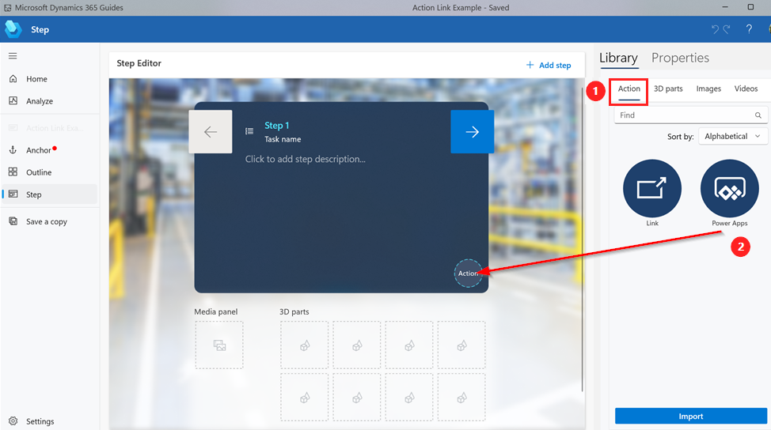
     
3.	In the **[!include[pn-powerapps](../includes/pn-powerapps.md)]** dialog box that appears, paste the URL for the [!include[pn-powerapps](../includes/pn-powerapps.md)] link, and then select **Save**.

     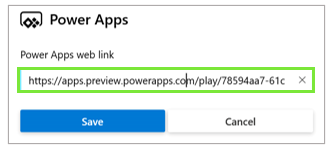

4.	To view, edit, or delete the [!include[pn-powerapps](../includes/pn-powerapps.md)] link, right-click the **[!include[pn-powerapps](../includes/pn-powerapps.md)]** button in the **Step Editor** pane, and then select the appropriate command.

     
     
## What's next?

[Step Editor overview](pc-app-step-editor-overview.md) 
[Add a 3D model from the 3D toolkit](pc-app-add-3D-model.md) 
[Add a 3D part](pc-app-add-3D-part.md) 
[Add an image or video file](pc-app-add-media.md) 
[Add a space-planning model](pc-app-space-planning.md) 
[How to make a great mixed-reality guide](great-guide.md) 

[!INCLUDE[footer-include](../includes/footer-banner.md)]
