# Use the PC authoring application to create a guide in Dynamics 365 Guides in preview

[!INCLUDE [cc-beta-prerelease-disclaimer](../includes/cc-beta-prerelease-disclaimer.md)]
 
Use the PC authoring application in Microsoft Dynamics 365 Guides in preview to:

- Create a guide
- Choose an alignment method
- Add tasks and steps
- Write the instructions for your steps
- Assign different types of assets to support those steps. Supporting assets include:
  - 3D parts
  - 3D objects, such as objects from the 3D toolkit (arrows and numbers, for example)
  - 2D media (images and videos)

## Install, open, and sign in to the PC application
Use these instructions to install the app (if it hasn't already been installed for you) and to sign in.

### Install the app 
1.	On your Windows 10 PC, make sure you have the Windows 10 Fall Creators Update 1709 or later installed (build 10.0.16299 or later).
2.	Go to Start  > Microsoft Store , and then search for “Guides.”
3.  Select the **Install** button to install Guides.

### Sign in to the app
1.	Launch the Guides application from the Start menu on your PC. 
2.	In the **Welcome to Guides** screen, choose **Sign in**.

    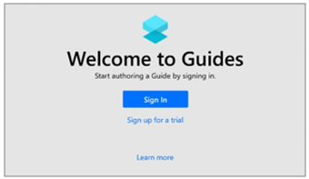
    
3.	In the **Sign in** dialog box, select **Work or school account**, and then select **Continue**. 
4.	In the **Sign in** screen, enter the user account and password assigned to you by your organization. If you’re the administrator, these are the credentials you created when you signed up for the trial subscription.

    
 
5.	Select the instance you want to use if there’s more than one instance, and then select **Continue**.

    

 
## 6 steps to authoring in the PC application
You always start the authoring process for a guide in the PC application. Use the PC application to:
1.	Create the guide
2.	Choose an alignment method 
3.	Add the structure (the tasks)
4.	Add the steps included in each task
5.	Write the short text for each step
6.	Assign assets to support the steps

## A note about saving in Guides
The PC Authoring app and the HoloLens app are connected through the cloud, where your guide files and assets are stored. 
When you author a guide, all changes are saved on both the PC and HoloLens. This makes it easy to switch between devices. 
Autosave checks for changes every 4 seconds. 

For public preview, there are a few things to be aware of when syncing devices:
- As a best practice, always select **Refresh** before making edits on a guide when you switch between devices. This ensures you 
have the latest version of that file from the other device. 
- If the same version of the guide is open on the PC and HoloLens, the app will automatically refresh when it detects that you've 
made a change in the other app. For example, if you have a guide open on HoloLens and add a new step on the PC, the guide will 
automatically refresh on HoloLens. You may notice the refresh process. 
- When adding text in the PC application, the auto publish only activates when you click outside the text box. If you add text 
to a step and keep your cursor in the text box and then make a change on HoloLens, you’ll lose the text you created on the PC when 
it updates with the changes from HoloLens. This issue will be addressed in our next release. 

## Create a new guide
1.	Open the Guides app.
2.	Select **Create a new guide**.
3.	Enter a name for the guide. If you’re planning to create multiple versions of the guide, you may want to add _v2, _v3, and 
so on as part of the name. 

## Choose an alignment method 
After you name your guide, you’ll see the **Choose an alignment method** screen. 

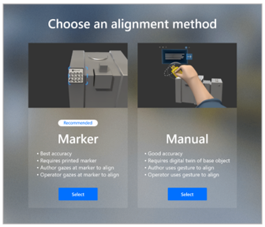

Alignment is used to spatially sync your instructions to the real world. When you align your guide, your instructions coincide 
with the space they live in and become meaningful. The alignment acts as the anchor that all your content is centered around.

There are two types of alignment:

- With **Marker alignment** (recommended), you attach a printed marker to a physical object in the real world. After creating the guide, 
to align the guide in the real world, you gaze at the marker using the HoloLens.
- With **Manual alignment**, you import a 3D representation (such as a CAD model or scanned model), and then lay that representation, 
called a “digital twin”, directly over a physical object in the real world. After creating the guide, to align it in the real world, 
you use a gesture.

**It’s extremely important to ensure that the alignment is correct and as precise as possible.** If alignment is not correct, your 
instructions can cause operator confusion and potentially costly damage. For example, an operator could drill a hole in the wrong 
place or assemble the wrong part. 

Marker alignment is recommended, because it’s more accurate. You may want or need to use manual alignment, however, for any of the 
following reasons:

- It may not be feasible to attach a marker because the authoring is done in a different location than where the parts are located.
- It may not be feasible to attach a marker due to moving parts.
- You can’t guarantee the placement of the marker will be the same every time.
- A part is too small to attach a marker to.

### Align your guide by using marker alignment
Marker alignment involves three basic steps:

1.	Print out a marker.
2.	Attach the marker to a physical object in the real world.
3.	Gaze at the marker to align the guide.

To print the marker:
1.  In the **Choose an alignment method** screen, in the **Marker** section, choose **Select**.

    

2.  In the **Marker** screen, select **Save to print** to save the marker.pdf file to your PC.

    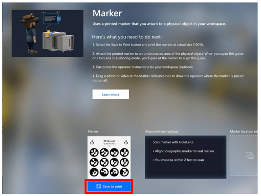

3.	Open the marker.pdf file on your PC in Adobe Acrobat Reader.
4.	On the **File** menu, select **Print**.
5.	Under **Page Sizing & Handling**, select the **Actual size** option.

    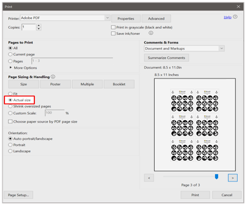

4.	Print the last page of the document on matte stock (glossy materials can affect scanning). 
5.	After printing, make sure the marker spacing matches the measurements shown in the following illustration:

    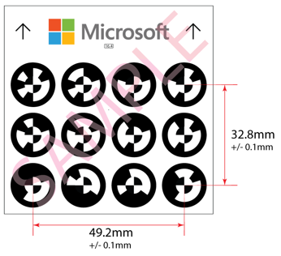
 
> [!NOTE]
> If the marker spacing is not within +/- 0.1mm, select the **Custom Scale** option in the **Print** dialog box, and then change the 
percentage to compensate for the size discrepancy. For example, if you print the marker and the result is 49 mm, you would need to 
change the scale to 100.4% to get 49.196 mm, which would be within tolerance.

#### Best practices for marker alignment
Keep the following in mind when working with marker alignment:

- **Size.** Make sure that your printed marker is the exact size indicated in this document. Incorrect marker size will cause guide misalignment. 
  - Some applications and printers may change the size of the image.
  - If the printed marker is bigger than indicated, HoloLens will interpret the scale difference in distance. This will cause the marker to be identified as closer than it really is. 
  - Note that printing from the pdf file (as described earlier in this section) is the best way to ensure that the marker is not resized. 
- **Location.** Place the marker in a location on the physical object that’s easy to access and out of the way.
  - Marker placement should ideally be central to the steps being done.
  - Content placed further away from the marker will be less accurate.
  - Place the marker where operators can quickly re-scan to realign at any time.
  - Take a photo or video to document the marker placement and add it to the guide instructions to increase operator confidence.
- **Scanning angle.** Make sure you’re facing the marker straight on at the correct distance when gazing at it. 
  - Scanning from an angle can cause misalignment.
  - Ideal scanning range is 60–80 cm.

#### How HoloLens establishes marker position, scale, and orientation
When scanning, the forward-facing camera on the HoloLens is used to measure the horizontal and vertical distances on the marker. 
This information is combined with the actual marker values stored internally in the application (49.2 mm and 32.8 mm as indicated 
in the illustration above) to establish the marker’s precise position, scale, and orientation in space.

Guides includes an additional correction method that enables the user to improve the alignment by manually overriding the offset 
that may be generated by the variability of the acquired image and marker size.

### Align your guide by using manual alignment
Manual alignment involves two basic steps:
1.	Using the PC Authoring app, import a 3D representation of a physical object. This could be a CAD model used to create the physical object or a scanned model after fabrication. 
2.	Using HoloLens Authoring mode, place the 3D digital representation directly over a physical part.

To import a 3D representation: 
1.	Open the PC Authoring app.
2.	On the right side of the screen, select the **Import** command. 
3.	In the **Open** dialog box, select the 3D representation that you want to use, and then select **Open**.
    This will add the 3D representation to the **3D parts** section of the library.
4.	In the library, select **3D parts**, and then drag your 3D representation to the **Digital twin** box in the lower-left side of the screen.

> [!NOTE]
> It’s a good practice to take a photo or video of the base physical object and location and upload the photo or video to the 
**Digital twin** reference box. You may also want to customize the instructions in the **Operator instructions** box to provide more specific 
directions.

When you switch to HoloLens authoring, you'll use a gesture to place the 3D representation directly over the physical object in your work environment.

#### Best practices for manual alignment
- **Size.** Select a digital twin that’s not too small or too big. 
  - Medium-size digital objects are best. Very small or very large holograms are difficult to manipulate. 
  - Shoebox size or slightly larger is ideal.
- **Placement.** Choose a digital twin that’s as close to the center of the work being done as possible. The further you place digital content away from the digital twin, the less accurate it becomes.
- **Shape.** Select a digital twin that has a non-uniform or uncommon shape. Unusual shapes are easiest to align to.
  - Avoid objects which are mirrored. This can cause 180-degree misalignment.
  - Pick shapes that have clear edges and corners to help orient your content properly.
- **Recognizable.** Select a digital twin that’s obvious, easily recognizable, and easy for the operator to find. Make sure they can access the object without any obstructions.
- **Alignment direction.** Always align the digital twin to your physical object from the same direction. This will maximize repeatability for operators.
  - Placement from different perspectives can cause misalignment.
  - Always look at it from multiple angles to ensure the digital twin is aligned to the physical object.

### More about alignment
Independent from the method used for alignment, the following additional factors can impact the accuracy of the alignment and/or user perception of the alignment:

- **Interpupillary distance (IPD) setting.** The IPD is the distance between the center of the user’s pupils. It’s crucial to set the appropriate IPD to enable HoloLens to adapt its display as different users may have different IPDs. An incorrect IPD setting might result in a wrong perception of holograms in space as well as instability of holograms. [Use the HoloLens Calibration app to calibrate your IPD](https://docs.microsoft.com/en-us/windows/mixed-reality/calibration). 
- **Pre-scanning the environment.** HoloLens actively scans its environment for visible features  to create maps of its surroundings. This happens whenever the device is turned on and a user is signed in. It’s independent of whether you’re in the HoloLens shell or running apps. HoloLens constantly improves the accuracy of these maps as it scans the environment from different viewpoints and stores them on the device. Holograms are placed in relation to these maps. The more accurate the map, the more accurate the hologram placement.
Before using Guides on a HoloLens that’s unfamiliar with its environment, the user should put on the HoloLens, sign into the device and walk around the space where holograms instructions are placed or will be placed. This can be done while the user is in the HoloLens shell, but we recommend the user hide the Start menu to see the space as they walk around. Walking at a leisurely pace while slowly looking up and down will give the device the opportunity to find features and construct accurate maps. We call this "pre-scanning" because it’s done before you run Guides. You only need to do this once for each environment as HoloLens stores the maps it created on the device and remembers the spaces it has scanned.
Very dark or very bright environments, or environments that include very reflective surfaces (mirrors), dark surfaces, or featureless surfaces, will cause a negative impact on HoloLens’s capability to recognize the space, which will impact hologram position and stability.
- **Impact of device positioning.** HoloLens uses a novel display technology to project images in the user’s field of view, creating holograms. The way a user wears a device on their head has a huge impact on the perceived position of the holograms. The best way to understand this is to adjust the device positioning while aligning holograms to their physical counterparts in Guides. Observe how the alignment of holograms is affected when you shift the device left and right, up and down, and when you slide the display forward and backward. Users should wear the device in a consistent way and understand that subtle shifts in device positioning may not feel different but can lead to significant changes to perceived hologram locations.

## Structure your guide in the Outline page
After you choose an alignment method, you’ll see the Outline page. This is where you create the framework for your guide by adding as many tasks and steps as you need. *Tasks* are groups of steps. *Steps* are the short, discrete work items that operators do to complete the task. Steps are the central building block that everything is built around in Guides.

When you open the Outline page for the first time, you’ll see that a single task and step is already created for you. 

  
To get started, enter a task name, and then start typing the instructions in the box for the first step. When you need to add a new step, select **Add step**. When you’re ready to add another task, select **Add task**. It’s that simple!

In reality, you’ll probably create most of your steps from inside the Step card (see the next section), but the Outline page provides a great way to map out your guide at the start, or to get an overall picture of the guide after you’ve added all your tasks and steps. You can also restructure your guide from the Outline page by dragging tasks and steps.

In addition to tasks and steps, the Outline page shows:
- Customizable operator instructions.
- A special step called a Completion step that lets operators know when they’ve reached the end of the guide. The Completion step includes default text that you can customize as you see fit.

  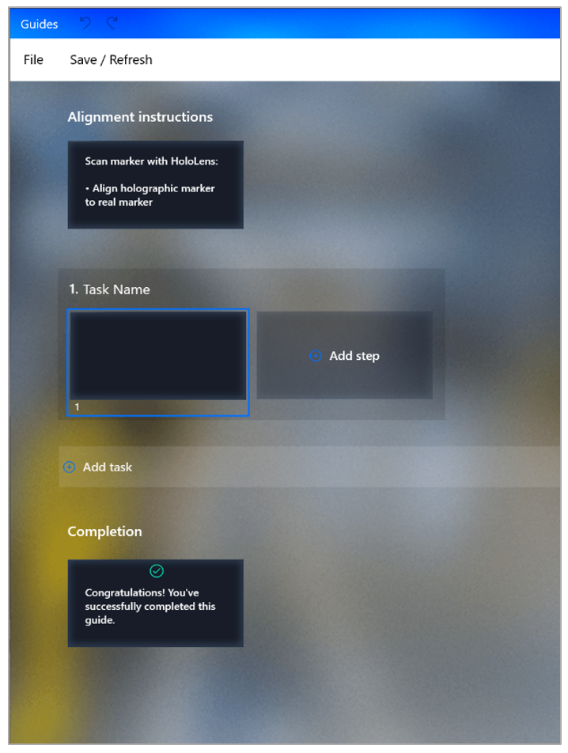
 
> [!NOTE]
> Whenever you start working on a guide, be sure to select **Refresh** to ensure you have the latest version. 

### Best practices for the Outline page
- To provide overall context, add an Overview task at the start of the guide. This task would include just one step that describes what the guide is about. This is also a good place to list all the tasks that the guide covers. 
- Add a step at the beginning and end of each task to let the operator know when they’re starting something new or ending a task and to make the operator feel successful when they complete a task.
- Don’t be afraid to add lots of steps but remember to keep them short for best effect. 
- Consider adding steps that show individual tips and tricks. 
- Remember to refresh your guide when moving between PC and HoloLens, and be sure to click outside the text box when writing steps to activate autosave. 

Here’s the Outline page for the Example Guide to show what a completed Outline page looks like:

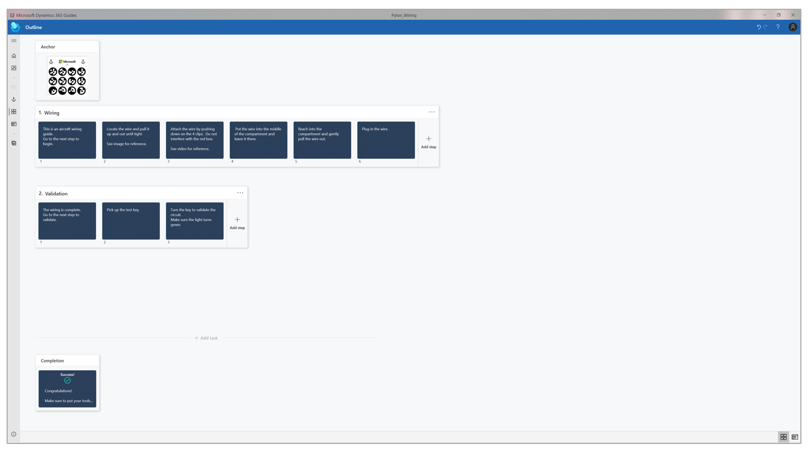
  
## Create steps and assign assets in the Step card page
You can create steps in the Outline page, but you’ll probably create most of your steps from the WYSIWYG Step card page.  

In the Step card page, you write your instructional text and assign supporting assets for that step, like 3D content or media (image or video). 

To open the Step card page and add instructions:

1. Double-click any step on the Outline page. 
2. Enter your instructional text in the black rectangle in the middle of the Step card screen.

To add 3D content or media to support a step: 

1. On the right side of the screen, select the label for the type of item you want to add (**3D parts**, **Images**, **Videos**, or **3D toolkit**).

2. Drag the object to the appropriate box below the step text. For example, to add an image or video, drag the image or video to the **Image or video** box. To add a 3D part or an object from the 3D toolkit , drag it to one of the **3D parts** boxes. 

   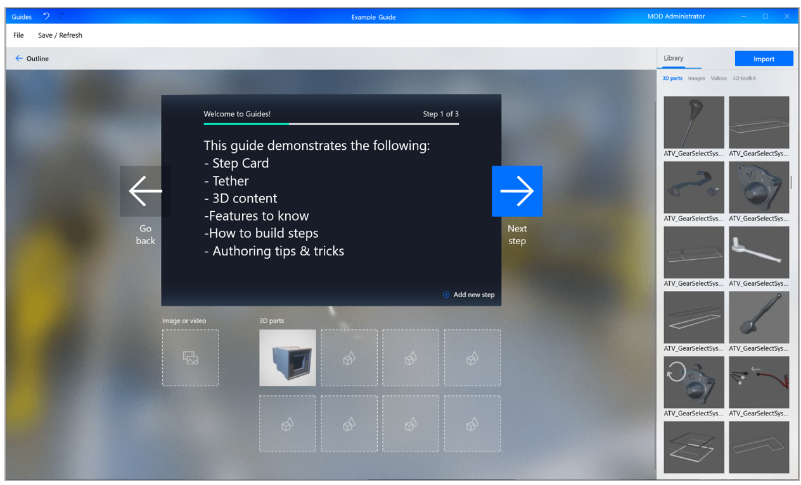

   > [!NOTE]
   > The collection of boxes below the instructional text is called the "bin."
  
When you view your guide on the HoloLens in Authoring mode, you’ll see all the assets that you associated with the steps, and can place the assets in their relevant spaces in the real world. For example, if you assign a pointer to a step in the PC application, you’ll align that pointer to the thing you want to point to in HoloLens authoring. What you see in the Step card page, is very similar to what you see on the HoloLens. 

### Best practices for the Step card page
- It’s easy to add another step from the Step card page. Just select **Add new step** in the lower-right corner of the page. No need to go back to the Outline page. 
- Don’t be afraid to add lots of steps but keep the text short. Instruction text is limited to 280 characters per step to help keep the text short.
- Try to stick to one type of asset (image, video, or 3D object) per step. Too much media or 3D content can be overwhelming to the operator and too time consuming to absorb. Think about what type of content gets the point across best.
- Write your guide in casual human language for best results. Don’t use technical jargon that people don’t know or understand.
- Use descriptive words like “locate,” “find,” “get,” “go to”, “pick up,” “put down,” “insert,” “attach,” and “remove.”
- Adding a **NOTE** step is useful for quality checks. These types of steps can come before or after a step. Just make sure to put it in the right spot.
- Add a **WARNING** step for things that could be dangerous or cause a quality issue. When you move to Authoring mode on the HoloLens, you can add a style to reinforce the warning.
- Adding numbered small steps inside a step can sometimes help, but don’t be afraid to create separate steps for easier reading.
- When you’re done writing a step, be sure to click outside of the text box to activate autosave. 

### Import your own custom 3D objects to add to the 3D parts list
You can import your own 3D objects to add to the **3D parts** list, and then assign parts to a step. 

To import your own 3D objects:
1.	Select the **Import** command in the upper-right corner of the Step card screen. 
2.	Locate the 3D object you want to import, and then select **Open**.

    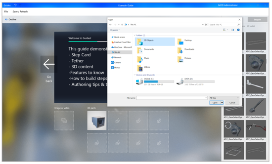
    
> [!NOTE]
> Guides supports GLTF, GLB, and FBX file formats. For additional file support (including some CAD formats) and automated 3D model optimization, you can use the [Import Tool](import-tool.md) available through Dynamics 365 Layout. 

### Add 3D objects from the 3D toolkit to support your steps
Guides comes with a library of pre-defined 3D objects included in the 3D toolkit that are optimized to work perfectly with HoloLens. Use objects from the 3D toolkit like any other asset to support your steps and get your point across. Having a ready-made library makes it easy to get started if your company doesn’t have any 3D content.

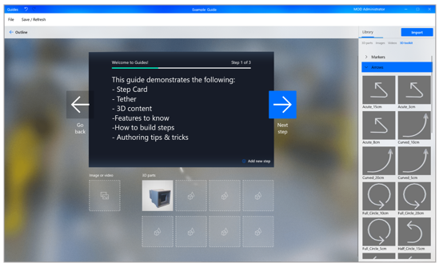
 
Here’s the complete list of 3D objects available in the 3D toolkit:

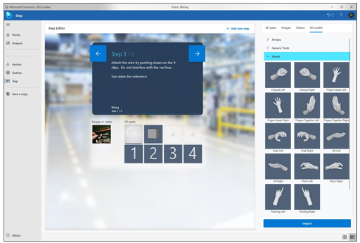

You add a 3D object from the 3D toolkit in the Step card page, and then place them in HoloLens Authoring mode. You can use the same object (instance) as many times as you like in a step.

> [!NOTE]
> You can also add 3D objects from the 3D toolkit in HoloLens authoring. You don't have to add them on the PC if you prefer to do it in HoloLens authoring.

To add an object from the 3D toolkit:
1.	Select the **Library** tab.
2.	Select the appropriate category of objects.

    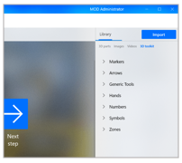

3.	Drag the object you want from the list to a **3D parts** box below the Step card.

    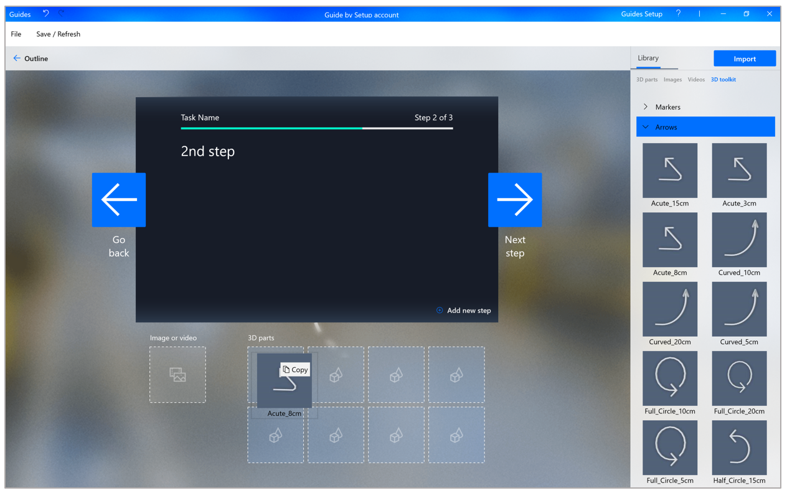
 
### Best practices for 3D toolkit
- Use pointers to communicate simple spatial information like position, direction, and translation.
- Use the arrow when you want the operator to insert a part into something stationary (hand tightening a bolt into a tapped hole, for example). 
- Use one of the hand poses when you want the operator to use their hand in a specific way to influence or manipulate something. There are various poses for specific interactions such as Pull, Push, Pinch, Grab, and others. Combine these standards with arrows and/or icons to add additional meaning.
- Adjust the size of the pointer but never go below 1 cm. Otherwise, it can cause errors.

## Keyboard shortcuts

You can use any of the following keyboard shortcuts in the PC application:

|Keyboard shortcut|Action|
|---------|-------------------------------------------------|
|Ctrl + S|Save the current guide|
|Ctrl + C|Copy|
|Ctrl + V|Paste|
|Ctrl + X|Cut|
|Ctrl + A|Select All|
|Ctrl + Z|Undo the last change to the guide|
|Ctrl + Y|Redo the last change to the guide|
|Ctrl + F4|Close the current window|
|Win + Down|Minimize the current window|
|Win + Up|Maximize the current window|

## What's next?
After you create your guide, select an alignment method, and create your tasks and steps, you’re ready to [test things out on the HoloLens in a real-world environment and place your holograms](hololens-authoring.md).

> [!Important]
> When working between PC and HoloLens be sure to select **Refresh** when starting work on a device to ensure you have the latest version of the guide. 

Don’t worry if your guide isn’t perfect before switching to HoloLens authoring. You can always go back to the PC application to edit and restructure your guide. In fact, we’ve found it’s generally a good idea to do a quick test of the flow on HoloLens, and then go back to the PC application to make changes before placing all your holograms in HoloLens.

> [!Tip]
> If you’re creating multiple versions of the same guide, you may want to use the **Save a Copy** command on the **File** menu. This is great for guides that are similar but have a few different steps. You don’t have to start from scratch!

### See also

[Overview of authoring a guide](authoring-overview.md) 
[Test your guide and place holograms in the HoloLens app](hololens-authoring.md) 
 
