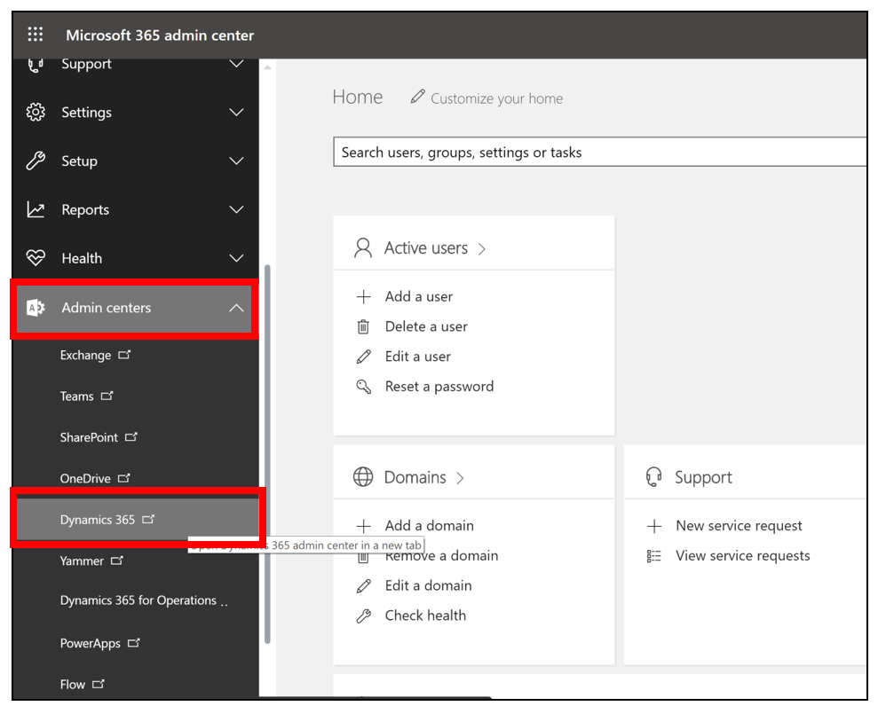
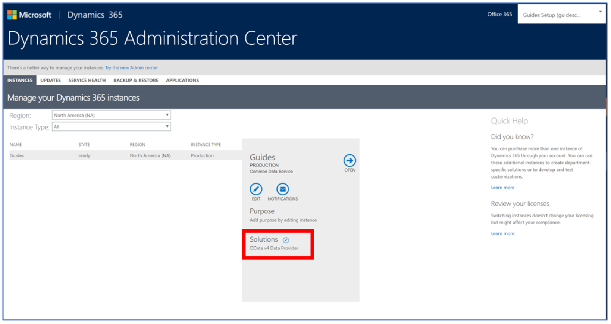
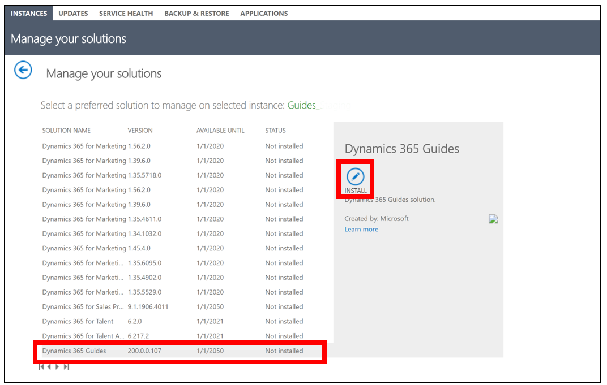
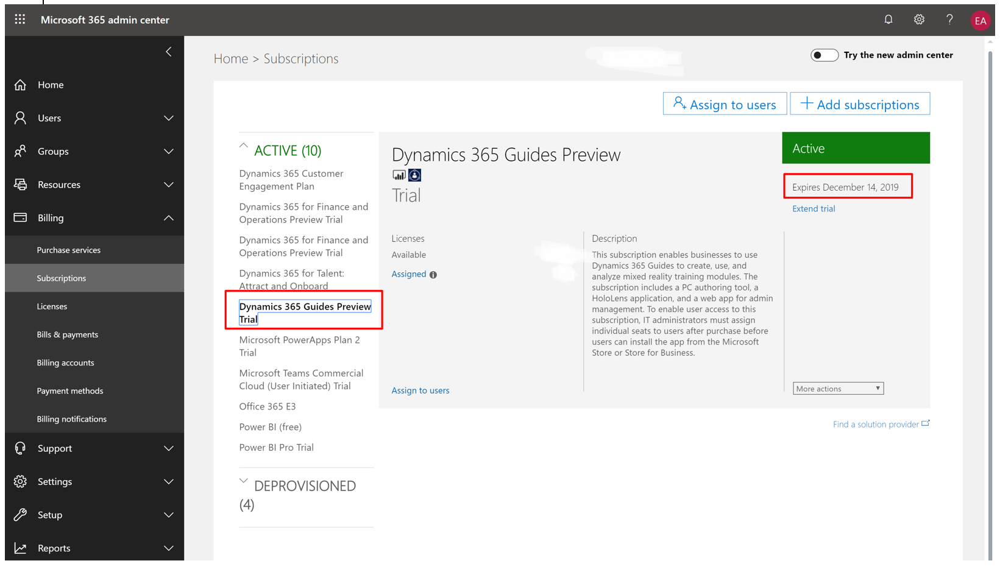
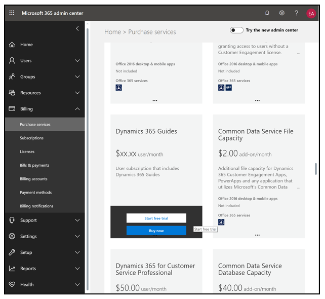

# Transition from Dynamics 365 Guides public preview to GA

Thank you for being part of the [!include[pn-dyn-365-guides](../includes/pn-dyn-365-guides.md)] Preview! Since the release of [!include[pn-dyn-365-guides](../includes/pn-dyn-365-guides.md)] to the public at the end February 
at Mobile World Congress in Barcelona, we have taken your feedback and invested in continually improving the experience and expanding 
functionality.  
 
**Starting October 1, 2019, [!include[pn-dyn-365-guides](../includes/pn-dyn-365-guides.md)] is generally available.**  
 
If you want to continue using [!include[pn-dyn-365-guides](../includes/pn-dyn-365-guides.md)] and receiving updates, you need to update the PC authoring app and the HoloLens app, 
and install the new [!include[pn-dyn-365-guides](../includes/pn-dyn-365-guides.md)] solution using the Dynamics 365 Admin Center.  
 
Please follow the instructions below to transition to GA.  
 
## Step 1: Update the apps  

Update the [!include[pn-dyn-365-guides](../includes/pn-dyn-365-guides.md)] PC and HoloLens apps to the latest versions available in the Microsoft Store. 
 
## Step 2: Get the latest Dynamics 365 Guides solution 

1. Go to the Dynamics 365 Administration Center and sign in with the user credentials that have admin permissions for [!include[pn-dyn-365-guides](../includes/pn-dyn-365-guides.md)]. 

   > [!NOTE]
   > To go to the Dynamics 365 Administration Center, go to the [Microsoft 365 Admin Center](https://admin.microsoft.com/AdminPortal/Home), and then select **Admin centers** > **Dynamics 365** as shown below.
   
    

2. Select the **Instances** tab, and then choose an instance that has the [!include[pn-dyn-365-guides](../includes/pn-dyn-365-guides.md)] Preview solution installed. 

3. Select the small edit button next to **Solutions** to see the list of solutions.  

     

4. In the list of solutions, select **[!include[pn-dyn-365-guides](../includes/pn-dyn-365-guides.md)]**, and then select **Install**. This will install the GA version of the solution and remove the preview solution.  

     
   
   > [!NOTE]
   > The [!include[pn-dyn-365-guides](../includes/pn-dyn-365-guides.md)] (Preview) solution is being delisted and is no longer available for update or installation.
   
5. Review the Terms of service, and then select **Accept** if you're ready to start the upgrade. 
The status of the solution changes to **Installation pending**, and then changes to **Installed** when the transition is complete. 

## When do I have to start paying for Dynamics 365 Guides?

You have to sign up for the GA license for [!include[pn-dyn-365-guides](../includes/pn-dyn-365-guides.md)] when your public preview license expires. When you sign up for the GA license, you receive a 30-day free trial before you have to start paying for the [!include[pn-dyn-365-guides](../includes/pn-dyn-365-guides.md)] license.   

### To check when your preview license expires

1. Go to the [Microsoft 365 admin portal](https://admin.microsoft.com/) and sign in with the admin account for the tenant that includes 
the [!include[pn-dyn-365-guides](../includes/pn-dyn-365-guides.md)] preview.  

2. Go to **Billing** > **Subscriptions**, and then select **[!include[pn-dyn-365-guides](../includes/pn-dyn-365-guides.md)] Preview Trial** in the main list to see when the preview license expires. 

     

### Get a trial or purchase license

1. Go to the [Microsoft 365 admin portal](https://admin.microsoft.com).

2. Sign in with the admin credentials for the tenant that you want to add the license to.

3. Select **Billing** > **Purchase Services**.

   

4. Find the [!include[pn-dyn-365-guides](../includes/pn-dyn-365-guides.md)] item, and then select **Start free trial** or **Buy now**. 

If you require a different type of license, please contact your mixed reality sales specialist or account executive.  
 

[!INCLUDE[footer-include](../includes/footer-banner.md)]