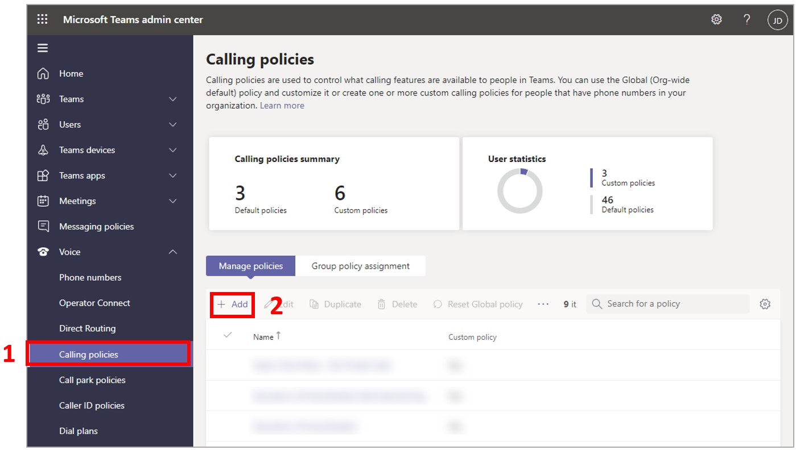

# Restrict calling and the ability to search and access contacts in Dynamics 365 Guides for HoloLens

If you [have a scenario where you need to protect company information](restricted-mode-overview.md), you can restrict the ability for Microsoft Dynamics 365 Guides users on HoloLens from:

- Initiating calls

- Searching for contacts and accessing contacts

When you restrict calling for Dynamics 365 Guides users, they can still join a meeting.

With this combination of restrictions and abilities, your company data stays safe and Dynamics 365 Guides users can continue to join meetings to troubleshoot issues with colleagues on an ad-hoc basis.

## Restrict calling

To restrict calling, first create a new Microsoft Teams policy, and then assign that policy to the appropriate user(s). The policy applied to a user takes affect on all devices and applications the user signs into, not just Guides.

1. Go to the [Microsoft Teams admin center](https://admin.teams.microsoft.com) and sign in with your admin credentials.

1. In the left pane, select **Voice** > **Calling policies**, and then select **Add**.

    

    > [!NOTE]
    > [Learn about Microsoft Teams policies supported by Dynamics 365 Guides](/dynamics365/mixed-reality/remote-assist/teams-policies)

1. Enter a name for your policy, turn the **Make private calls** setting to **Off**, and then select **Save**.

1. [Assign policy to individual users or groups](/microsoftteams/assign-policies-users-and-groups).

1. Apply the calling policy you created.

   Once the policy takes effect, users will be able to join meetings or receive notifications for meetings already in progress but they won't be able to initiate calls outside of a meeting. They also won't be able to search for contacts or access the contacts list.

    > [!NOTE]
    > It can take a few hours for the policy changes to go into effect.

## Next steps

- [Overview of restricting capabilities in Dynamics 365 Guides](restricted-mode-overview.md)
- [Restrict the ability to access OneDrive files](restricted-mode-files.md)
- [Restrict the ability to sign out of the HoloLens app](restricted-mode-signout.md)
