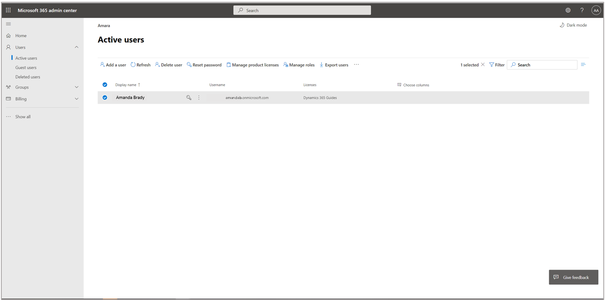
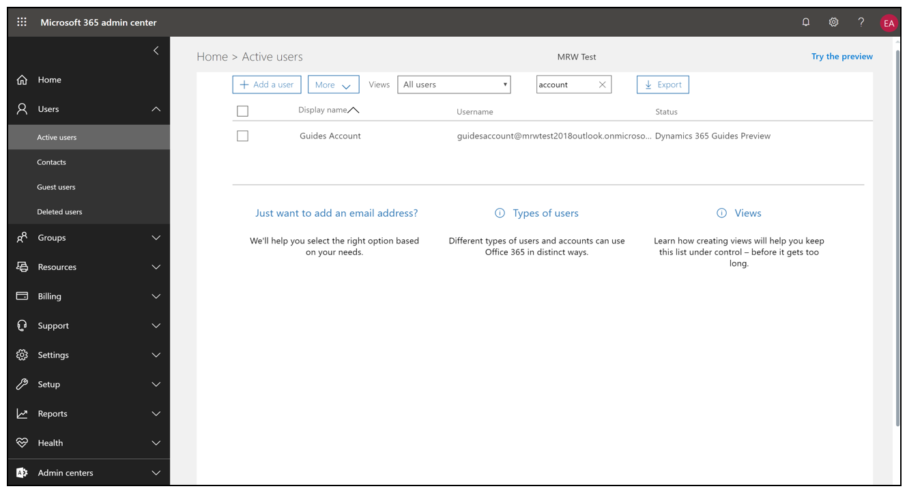
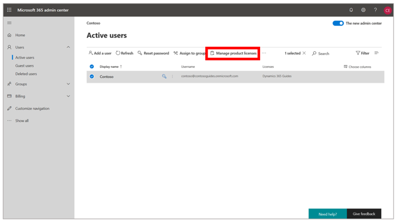
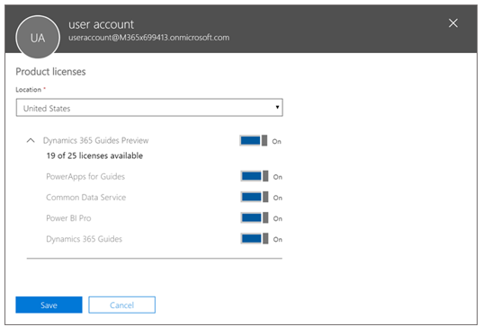
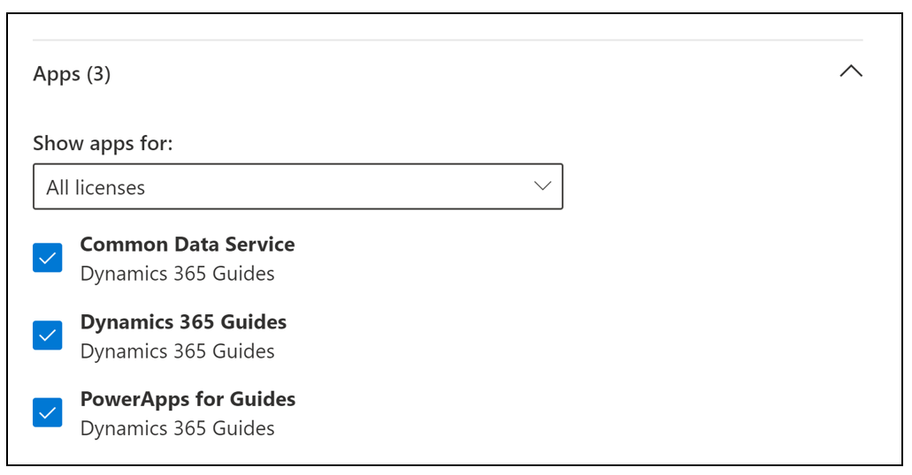

# Dynamics 365 Guides setup, step 1: Buy a subscription or sign up for a free trial

> [!NOTE]
> Before you complete this step of the setup process, be sure to see [Overview of setting up Dynamics 365 Guides](setup.md).

## Two ways to get a Dynamics 365 Guides subscription

There are two ways to get a [!include[cc-microsoft](../includes/cc-microsoft.md)] [!include[pn-dyn-365-guides](../includes/pn-dyn-365-guides.md)] subscription:

- If you have a Microsoft work account, you can go directly to the [Microsoft 365 admin center](https://admin.microsoft.com/AdminPortal/Home) and search for a [!include[pn-dyn-365-guides](../includes/pn-dyn-365-guides.md)] subscription there.

    > [!NOTE]
    > If you can't access the Microsoft 365 admin center link, contact your Dynamics 365 administrator.

- Go to the [Get started](https://aka.ms/GetGuides) page. You can use this page to buy a subscription or sign up for a free 30-day trial. If you sign up for a trial, you can either use credentials for an existing Dynamics 365 account or create new credentials.

    > [!IMPORTANT]
    > If admin permissions aren't associated with your work account, you won't be able to complete step 2 of the setup process, [Install the solution](setup-step-two.md). In this case, you must coordinate the setup with your admin. Alternatively, you can sign up for a free 30-day trial by following the steps on the [Get started](https://aka.ms/GetGuides) page. When you sign up for a trial, you will create a new environment, and the user account that you create will have admin permissions.

## Assign the Dynamics 365 Guides license to user accounts

[!include [rename-banner](~/includes/cc-data-platform-banner.md)]

After you sign up for a [!include[pn-dyn-365-guides](../includes/pn-dyn-365-guides.md)] subscription, you must assign the [!include[pn-dyn-365-guides](../includes/pn-dyn-365-guides.md)] license to user accounts.

1. Open the [Microsoft 365 admin center](https://admin.microsoft.com/AdminPortal/Home).

    

2. Make sure that the [!include[pn-dyn-365-guides](../includes/pn-dyn-365-guides.md)] license is assigned to a user. In the left pane, select **Users**, select **Active users**, and then select the check box for the user that you want to add.

    

3. Select **Manage product licenses**.

    

4. In the dialog box, under **Licenses**, select the **[!include[pn-dyn-365-guides](../includes/pn-dyn-365-guides.md)]** check box.

    
    
5. In the **Apps** list, make sure that the following apps are selected: Microsoft Dataverse, Dynamics 365 Guides, Power Apps for Guides.    
    
    

## What's next?

After you've completed this step of the setup process, move on to step 2, [Install the solution](setup-step-two.md).

If you have trouble with the procedure in this step, you can get help in the following ways:

- Ask a question on our community site, at <https://community.dynamics.com/365/guides>.

- Contact customer service at <https://dynamics.microsoft.com/support/>.
