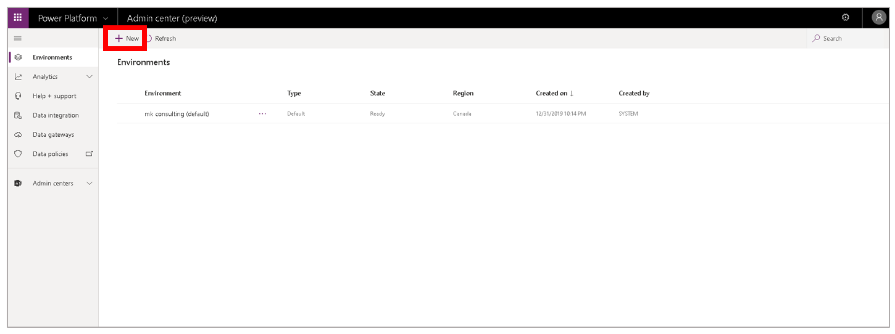
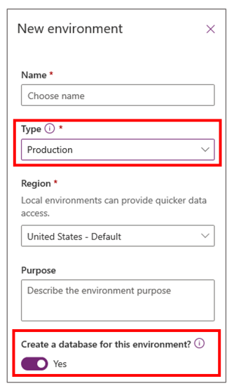
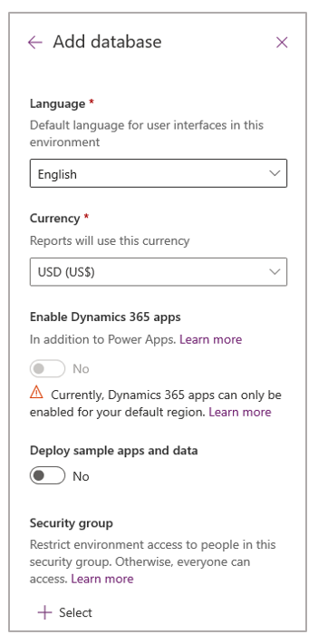
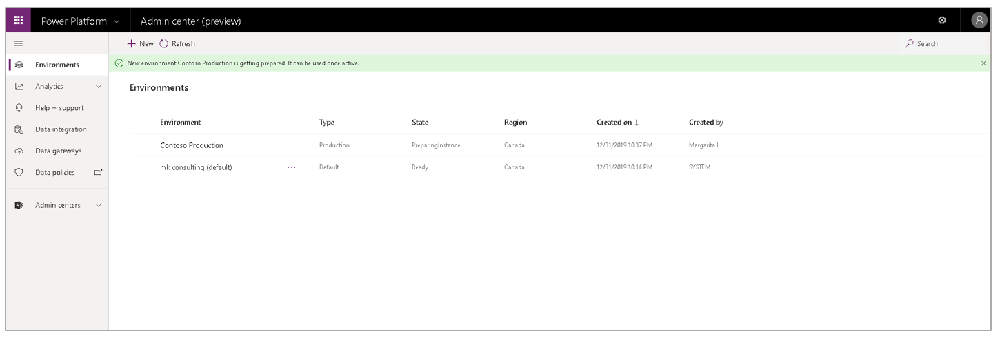
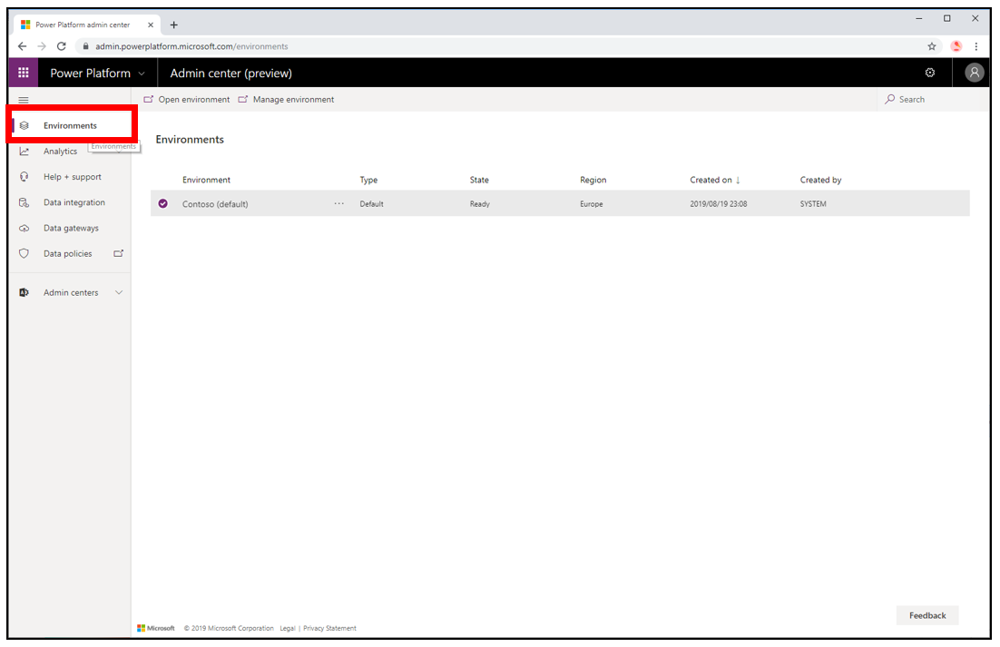
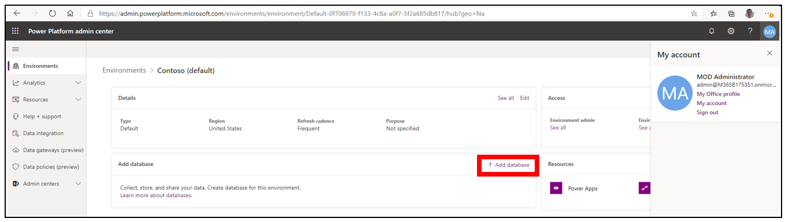
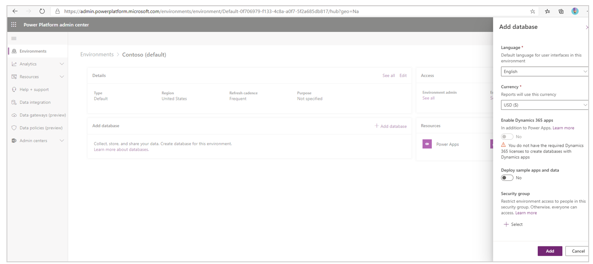
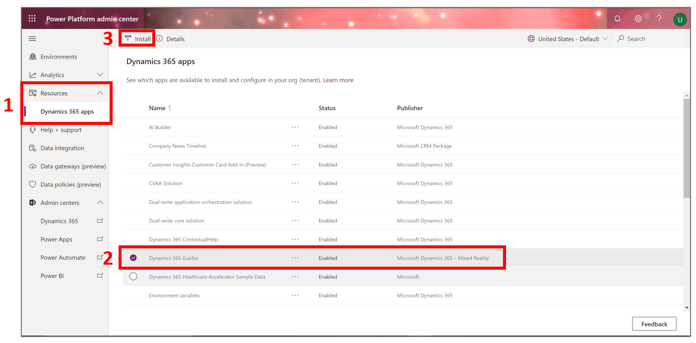
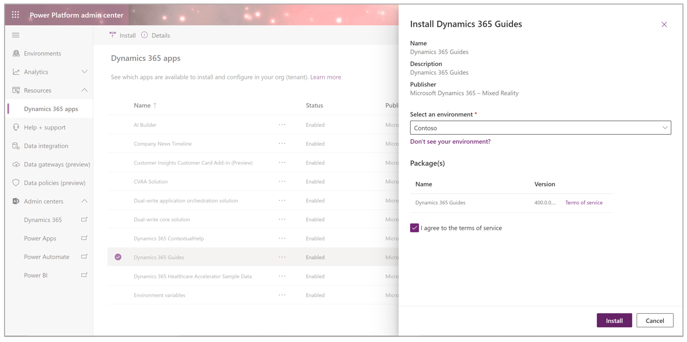

# Dynamics 365 Guides setup, step 2: Install the solution

[!include [rename-banner](~/includes/cc-data-platform-banner.md)]

> [!NOTE]
> Before you complete this step of the setup process, be sure to see step 1, [Buy a subscription or sign up for a free trial](setup-step-one.md).

After getting a [!include[cc-microsoft](../includes/cc-microsoft.md)] [!include[pn-dyn-365-guides](../includes/pn-dyn-365-guides.md)] subscription and assigning licenses, you must create an environment where you can install the [!include[pn-dyn-365-guides](../includes/pn-dyn-365-guides.md)] solution. 

## Production environment or default environment?

The type of environment that you create depends on whether you purchased a [!include[pn-dyn-365-guides](../includes/pn-dyn-365-guides.md)] license.

> [!NOTE]
> If you already have an environment that you want to use (for example, an instance in your company's Dynamics 365 tenant), you can skip ahead to the **Install and configure the solution** procedure later on this page.

- **If you bought a license for [!include[pn-dyn-365-guides](../includes/pn-dyn-365-guides.md)], [set up a production environment](https://docs.microsoft.com/dynamics365/mixed-reality/guides/setup-step-two#set-up-a-production-environment-for-purchased-licenses-only).** A production environment provides you with backup and restore capabilities. 

- **If you haven't purchased a license yet (you have a trial subscription), [set up a default environment](https://docs.microsoft.com/dynamics365/mixed-reality/guides/setup-step-two#set-up-a-default-environment-for-trial-subscriptions-only).**

    > [!IMPORTANT]
    > The Dynamics 365 Guides solution can also be installed on a trial environment. **We don't recommend that you use a trial environment, because that environment, together with all your content, is automatically disabled after the 30-day trial period expires.** You have a seven-day grace period to upgrade to a production environment or migrate your content to another environment.

## Set up a production environment (for purchased licenses only)

> [!IMPORTANT]
> To install or update the solution, you must have the [System Administrator](https://docs.microsoft.com/power-platform/admin/database-security) role, **and** you must have a [Power Apps license](https://docs.microsoft.com/power-platform/admin/signup-question-and-answer) (or a license like a [Dynamics 365 Guides license](setup-step-one.md) that includes a Power Apps license). 
>
> 
>
> When you have a Power Apps license, the **Access Mode** security property is set to **Read-Write**. This setting is required to update the solution. 

1. In the [Power Platform admin center](https://admin.powerplatform.microsoft.com/environments), select **Environments** if it isn't already selected, and then select **New**.

    

    The **New environment** dialog box appears on the right side of the page.

2. In the **New environment** dialog box, follow these steps:

    1. Enter a name for the environment.

    2. In the **Type** field, select **Production**.

        

    3. In the **Region** field, keep the default setting.

    4. Set the **Create a database for this environment?** option to **Yes**. 

    5. Select **Next**.

3. In the **Add database** dialog box that appears on the right side of the page, select your language and currency, and set the **Enable Dynamics 365 apps** option to **Yes**. Keep the default values for the other fields. Then select **Save**.

    
    
    > [!NOTE]
    > If you plan to run Dynamics 365 Remote Assist in this environment, you'll need to obtain a paid Dynamics 365 Remote Assist license, and then set the **Enable Dynamics 365 apps** option when creating this environment. Or you can migrate to a joint environment when you decide to purchase Dynamics 365 Remote Assist.    

    A message is shown that explains that the production environment is being prepared.

    
    
    > [!NOTE]
    > For information about security groups, see [Restrict access to an instance](admin-security.md).

    When the new environment is active, **Ready** appears in the **State** field for the environment. 

    > [!NOTE]
    > If you set up a production environment instead of a default environment, in the remaining procedures in this topic, use the production environment instead of the default environment shown in the illustrations.
    
4. Go to the **Install and configure the solution** procedure below. 

## Set up a default environment (for trial subscriptions only)

> [!IMPORTANT]
> To install or update the solution, you must have the [System Administrator](https://docs.microsoft.com/power-platform/admin/database-security) role, **and** you must have a [Power Apps license](https://docs.microsoft.com/power-platform/admin/signup-question-and-answer) (or a license like a [Dynamics 365 Guides license](setup-step-one.md) that includes a Power Apps license). 
>
> 
>
> When you have a Power Apps license, the **Access Mode** security property is set to **Read-Write**. This setting is required to update the solution. 

1. Open the [Power Platform admin center](https://admin.powerplatform.microsoft.com/environments), and sign in by using the admin user credentials.

2. In the left pane, select **Environments**.

    

3. Select the default environment (for example, Contoso).

    > [!IMPORTANT]
    > The Dynamics 365 Guides solution can also be installed on a trial environment. **We don't recommend that you use a trial environment, because that environment, together with all your content, is automatically disabled after the 30-day trial period expires.** You have a seven-day grace period to upgrade to a production environment or migrate your content to another environment.

4. Select **Add database**.

   

5. In the **Add database** pane that appears on the right side of the screen, select your language and currency, keep the default settings for the other fields, and then select **Add**.

   > [!NOTE]
   > If you see a warning that says, "You do not have the required Dynamics 365 licenses to create databases with Dynamics apps," ignore it.
   
   
   
6. Go to the next procedure: **Install and configure the solution**.

## Install and configure the solution

1. In the [Power Platform admin center](https://admin.powerplatform.microsoft.com/environments), in the left pane, select **Resources** \> **Dynamics 365 apps**, select **Dynamics 365 Guides** in the list, and then select **Install**. 

    > [!NOTE]
    > It might take a few minutes for **Dynamics 365 Guides** to appear in the list.

    

2. In the **Install Dynamics 365 Guides** dialog box, select an environment, select the **I agree to the terms of service** check box, and then select **Install**.

    

    In the Power Platform admin center, the following message is shown: "Dynamics 365 Guides installation started at \<*time*\>, \<*date*\> by \<*name*\> Account."

    

    While the solution is being installed, **Installing** appears in the **Status** field for the app. After the app has been installed, the **Status** field is updated to **Installed**.

    > [!NOTE]
    > The installation process can take up to one hour. The amount of time varies, depending on the time of day and the region. If the status hasn't changed after an hour, refresh the page. If the installation is unsuccessful, the following message is shown: "Installation failed." To try to install again, in the **Error details** dialog box, under **How to troubleshoot**, select the **retry installation** link.
    >
    > 

## What's next?

After you've completed this step of the setup process, move on to step 3, [Download and install the apps](setup-step-three.md).

If you have trouble with any of the procedures in this step, you can get help in the following ways:

- Ask a question on our community site, at <https://community.dynamics.com/365/guides>.

- Contact customer service at <https://dynamics.microsoft.com/support/>.
