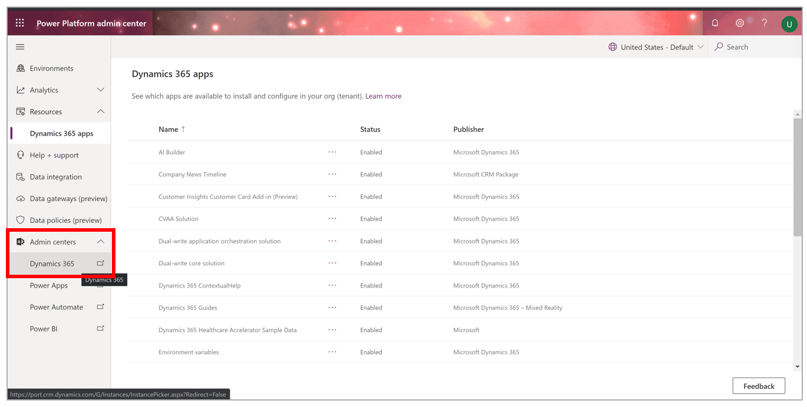
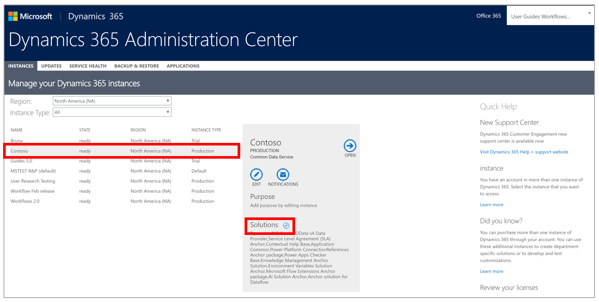

# Dynamics 365 Guides setup, step 2: Install the solution

> [!NOTE]
> Before you complete this step of the setup process, be sure to see step 1, [Buy a subscription or sign up for a free trial](setup-step-one.md).

After getting a [!include[cc-microsoft](../includes/cc-microsoft.md)] [!include[pn-dyn-365-guides](../includes/pn-dyn-365-guides.md)] subscription and assigning licenses, you must create an environment where you can install the [!include[pn-dyn-365-guides](../includes/pn-dyn-365-guides.md)] solution. 

## Production environment or default environment?

The type of environment that you create depends on whether you purchased a [!include[pn-dyn-365-guides](../includes/pn-dyn-365-guides.md)] license.

- **If you bought a license for [!include[pn-dyn-365-guides](../includes/pn-dyn-365-guides.md)], [set up a production environment](https://docs.microsoft.com/dynamics365/mixed-reality/guides/setup-step-two#set-up-a-production-environment-for-purchased-licenses-only).** A production environment provides you with backup and restore capabilities. 

- **If you haven't purchased a license yet (you have a trial subscription), [set up a default environment](https://docs.microsoft.com/dynamics365/mixed-reality/guides/setup-step-two#set-up-a-default-environment-for-trial-environments-only).**

> [!NOTE]
> If you already have an environment that you want to use (for example, an instance in your company's Dynamics 365 tenant), you can skip ahead to the [Change the maximum upload file size](#upload) procedure later in this topic.

## Set up a production environment (for purchased licenses only)

1. In the [Power Platform admin center](https://admin.powerplatform.microsoft.com/environments), select **Environments** if it isn't already selected, and then select **New**.

    

    The **New environment** dialog box appears on the right side of the page.

3. In the **New environment** dialog box, follow these steps:

    1. Enter a name for the environment.

    2. In the **Type** field, select **Production**.

        

    3. In the **Region** field, keep the default setting.

    4. Set the **Create a database for this environment?** option to **Yes**. 

    5. Select **Next**.

3. In the **Add database** dialog box that appears, select your language and currency, keep the default settings for the other fields, and then select **Save**.

    

    > [!NOTE]
    > For information about security groups, see [Control user access to instances](https://docs.microsoft.com/dynamics365/admin/add-instance-subscription#BKMK_man_sec_group).

    A message is shown that explains that the production environment is being prepared.

    

4. After the new environment is active (that is, when **Ready** appears in the **State** field for the environment), go to [Change the maximum upload file size](#upload).

> [!NOTE]
> If you set up a production environment instead of a default environment, in the remaining procedures in this topic, use the production environment instead of the default environment shown in the illustrations.

## Set up a default environment (for trial environments only)

1. Open the [Power Platform admin center](https://admin.powerplatform.microsoft.com/environments), and sign in by using the admin user credentials.

2. In the left pane, select **Environments**.

    

3. Select the **More environment actions** button (**...**) next to the default instance, and then select **Manage environment**.

    

4. Change the name of the environment (for example, enter **Guides\_*anyname***), and then select **Create my database**.

    

5. In the **Create a database for this environment** dialog box, select your currency and language.

    

6. Select **Create database**.

    A "Provisioning database" message is shown while the database is being created and provisioned.

    

    > [!NOTE]
    > Database creation usually takes several minutes. If the "Provisioning database" message is still shown after five minutes, try to refresh the page.

7. After you've created the database, go to the next procedure: [Change the maximum upload file size](#upload).

## Change the maximum upload file size

In the [!include[pn-dyn-365-guides](../includes/pn-dyn-365-guides.md)] PC app, you can upload your own 3D files in addition to videos and 2D images. Because many of these files will be larger than 5 megabytes (MB), you must increase the maximum file size for uploaded files by changing the setting for the size of email attachments.

1. In the [Power Platform admin center](https://admin.powerplatform.microsoft.com/environments), on the **Environments** page, select the newly created environment, select the **More environment actions** (**...**) button, and then select **Settings**.

    

2. On the **Setting** page, under **Email**, select **Email settings**.

    

3. Scroll to the bottom of the page, and then, under **Attachments**, set the **Maximum file size for attachments** field to **131072**. When you've finished, select **Save**.

    

4. Go back to the **Environments** page to prepare for the next procedure.

## Install and configure the solution

1. In the [Power Platform admin center](https://admin.powerplatform.microsoft.com/environments), in the left pane, select **Resources** > **Dynamics 365 apps**, select **Dynamics 365 Guides** in the list, and then select **Install**. 

    

2. In the right pane that appears, select an environment, select the **I agree to the terms of service** check box, and then select **Install**.

    

3. In the Power Platform admin center, the following message is displayed: "Dynamics 365 Guides installation started at <*time*>, <*date*> by <*name*> Account."

    

    While the solution is being installed, **Installing...** will appear in the **Status** field for the app. After the app has been installed, the **Status** field is updated to **Installed**.

    > [!NOTE]
    > The installation process can take up to one hour and varies, depending on the time of day and the region. If the status hasn't changed after an hour, refresh the page. If the installation is unsuccessful, the following message is shown: "Installation failed." To try installing again, on the right side of the screen, under **Error details**, select the **retry installation** link.
    >
    > 
    
### Troubleshoot solution installation

If you have trouble installing and configuring the solution as described above, try the following instead:

1. In the [Power Platform admin center](https://admin.powerplatform.microsoft.com/environments), select **Admin centers**, and then select **Dynamics 365**.

   

2. In the Dynamics 365 Administration Center, select an environment, and then select the **Solutions** button. 

   

3. In the right pane that appears, select an environment, select the **I agree to the terms of service** check box, and then select **Install**.

    

3. Select the Dynamics 365 Guides solution in the list, and then select **Install**.

4. In the **Terms of Service** dialog box, review the terms, and then select **Install**.

    In the Dynamics 365 Administration Center, the following message is shown to indicate that the solution is about to be installed: "Please wait while installation starts. This may take a few minutes."
    
    
    
    While the solution is being installed, **Installation pending** appear in the **Staus** field. After the solution has been installed, the **Status** field is updated to **Installed.**

    > [!NOTE]
    > The installation process can take up to one hour and varies, depending on the time of day and the region. If the status hasn't changed after an hour, refresh the page. If the installation is unsuccessful, the following message is shown: "Solution installation failed. Please try again later. If the problem persists, please contact customer support."
    >
    > 

## Set up user roles for the solution

> [!NOTE]
> Users can take up to one hour to appear in the [!include[pn-dyn-365](../includes/pn-dyn-365.md)] admin center after the licenses are added in the [!include[cc-microsoft](../includes/cc-microsoft.md)] 365 admin center.

1. After the solution has been installed, open the [Power Platform admin center](https://admin.powerplatform.microsoft.com/).

2. On the **Environments** page, select the environment that you created, select the **More environment actions** (**...**) button, and then select **Settings**.

    

3. On the **Settings** page, expand **Users + permissions**, and then select **Users**.

    

    > [!IMPORTANT]
    > You can access [!include[pn-dyn-365-guides](../includes/pn-dyn-365-guides.md)] data through the **Guides Hub** tile. However, we recommend that you not make changes in the Guides Hub. Any changes that you make there can have unintended consequences for the [!include[pn-dyn-365-guides](../includes/pn-dyn-365-guides.md)] apps.

4. On the **Enabled Users** page, select the user, and then select **Manage Roles**.

    

5. In the **Manage User Roles** dialog box, make sure that the **Common Data Service User** check box is selected.

    

6. Select the **[!include[pn-dyn-365-guides](../includes/pn-dyn-365-guides.md)] Author** or **[!include[pn-dyn-365-guides](../includes/pn-dyn-365-guides.md)] Operator** check box, depending on the privileges that you want the user to have.

    

    The following table describes the privileges that each role provides.

    | Role | Description |
    |---|---|
    | Author | Users who have this role can use the PC app and HoloLens app to create, edit, and operate guides. They can also rename and inactivate existing guides. |
    | Operator | Users who have this role can use the HoloLens app to view/operate a guide. They can also save time by skipping the **Select Mode** dialog box when they open a guide. |

7. If you want the user to have admin privileges, select the **System Administrator** check box.

## What's next?

After you've completed this step of the setup process, move on to step 3, [Download and install the apps](setup-step-three.md).

If you have trouble with any of the procedures in this step, you can get help in the following ways:

- Ask a question on our community site, at <https://community.dynamics.com/365/guides>.

- Contact customer service at <https://dynamics.microsoft.com/support/>.
