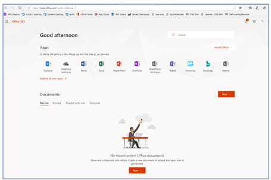
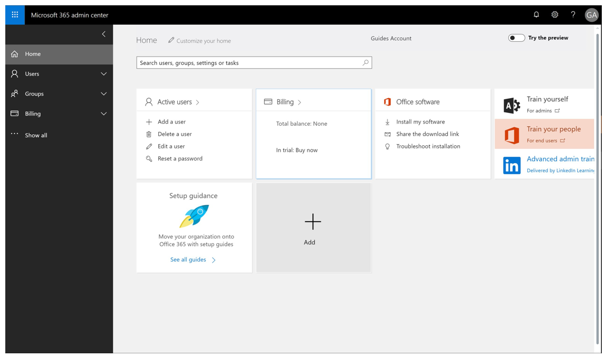
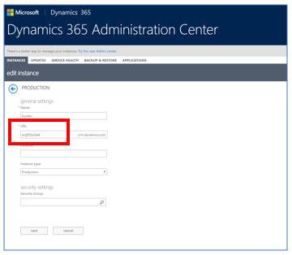

# Sign up to try Dynamics 365 Guides (Preview) for free

We're thrilled to introduce Microsoft Dynamics 365 Guides (Preview)! 

To try out Dynamics 365 Guides (Preview), you need to:

1.	Get a trial subscription.

2.	Create a new Common Data Service (CDS) environment and install the Guides solution.

3.	Install the Guides apps on a Windows 10 PC and HoloLens.

This topic provides step-by-step instructions to get up and running with Guides. It also provides instructions for adding additional users to the trial (optional).

## Subscribe to a free trial

When you sign up for a free Guides trial subscription, you’ll get one month free for up to 25 users. 

You can subscribe in any of the following ways:

- If you’re new to Microsoft, subscribe through the Guides Trial page. Step-by-step instructions for installing the app and signing up for a free trial are provided below. 

- Subscribe through the Microsoft Admin Center. Step-by-step instructions for subscribing are provided below.

- If you’re new to Microsoft, subscribe through the Guides Trial page. Step-by-step instructions for installing the app and signing up for a free trial are provided below. 
 
  - Calling us at 1-888-477-7989, or
  
  - Requesting to be contacted at [http://aka.ms/getmixedreality/](http://aka.ms/getmixedreality/).

### Subscribe through the Guides Trial page

1.	Go to sign up for a Dynamics 365 Guides Trial (NEED TO ADD MARKETING LINK HERE WHEN WE HAVE IT), and then follow the instructions to create your user credentials for the trial.

2.	After signing up, you’ll be prompted to sign in with the credentials you created in Step 1. After signing in, you’ll see the Office 365 landing page:

    
  
3.	In the Office 365 landing page, select the **Admin** icon. This opens the Microsoft 365 Admin Cetner.   
   
4.	In the Microsoft 365 Admin Center, under **Billing**, select **Subscriptions**. MISSING SOMETHING HERE!!!

    
  
    > [!NOTE]
    > You can add licenses for additional users now if you want by selecting the **Assign to users** button, or you can add them later. See step-by-step instructions on adding additional users.ADD BOOKMARK!!! 

5.	When you’re done, go to the next section: Create a new CDS environment and install the Guides solution.ADD BOOKMARK!!!

### Subscribe through the Microsoft 365 Admin Center.

1.	Go to [https://portal.office.com/AdminPortal/Home#/catalog](https://portal.office.com/AdminPortal/Home#/catalog).

2.	Sign in using your company's admin account. If you don't know who your admin is, contact the IT help desk at your company to find out. [Get more advice on admin accounts](https://docs.microsoft.com/en-us/office365/admin/admin-overview/admin-overview?redirectSourcePath=%252fen-us%252farticle%252foffice-365-admin-overview-c7228a3e-061f-4575-b1ef-adf1d1669870&view=o365-worldwide).

3.	Under **Billing** in the left navigation, select **Purchase services**.

4.	Scroll down to the **Other plans** section.

5.	Find the product card for Dynamics 365 Guides (Preview).

6.	On the product card, select **Start free trial**, and then follow the instructions.

7.	Assign licenses to users as described in the next procedure.

### Assign licenses for additional users (optional)

If you want to share Guides with other users in your organization, you’ll need to assign licenses for users in the Microsoft 365 Admin Center or [Partner Center](https://docs.microsoft.com/en-us/partner-center/). Each user you assign a license to will need an Azure Active Directory (Azure AD) account.

1.	In the Microsoft 365 Admin Center, under **Billing** in the left navigation, select **Subscriptions**, and then select **Assign to users.**

2.	Select the users you'd like to assign the trial or subscription to, and then in the **Bulk actions** menu on the right side of the screen, select **Edit product licenses**.
 
3.	In the **Add to existing products** screen, select the **Add to existing product license assignments** option, and then select **Next**.
 
4.	Select the licenses you want to enable for the selected users (Dynamics 365 Guides), and then select **Add**.

   > [!NOTE]
   > After adding licenses, you’ll need to add user accounts. Instructions are provided below.

### Create a CDS environment

Once you have a valid trial subscription, you’ll need to create an environment where you can install the Guides solution. 

1.	Go to the [PowerApps admin center](https://preview.admin.powerapps.com/environments) and sign in with the user credentials created when you signed up for the trial subscription.

2.	In the PowerApps Admin Center, select the **New environment** button.

    
 
3.	Fill in the following details for the environment:

    -	**Environment Name:** Guides_<any name>
    -	**Region:** Choose your region
    -	**Environment Type:** Set it to **Production**
  
    
    
4.	Select the **Create environment** button. 

5.	In the pop-up that appears, select **Create database**.

    
 
6.	In the next pop-up, choose the currency and language.

    
 
    > [!NOTE]
    > If you’re asked to include sample apps and data, clear the check box.
    
7.	Select **Create database.**

8.	In the **PowerApps Admin center>Environments** screen, select the environment that was just created (a production environment, not a default environment). 

    
 
    The following screen will appear while the database is being created and provisioned:
    
    
 
    > [!NOTE]
    > Database creation usually takes several minutes. If, after 5 minutes, the “Provisioning database” message still appears, try refreshing the page.
    
9.	After the database is created, a link to the Dynamics 365 Administration Center appears. Select this link. 

    

The Dynamics Admin Center will appear. This is where you can install the solution and make other configurations.

### Install and configure the Guides solution

1.	Before installing the solution, you need to increase the email attachment size to 128MB (131072kb). To do that: 

    a.	Go to the [Dynamics 365 Administration Center](https://port.crm.dynamics.com/G/Instances/InstancePicker.aspx) and sign in with the user credentials you created when you signed up for the Guides trial.
    
    b.	Select the newly created Guides instance from the list of instances, and then select the **Open** button as shown below: 
    
    
 
2.	In the **Dynamics 365 Settings > Administration** page, select **System Settings**.

    
  
3.	In the **System Settings** page, select the **Email** tab, and then in the **Set file size limits for attachments** field, enter **131072**. Select **OK** when you’re done.

    
 
4.	Go back to the [Dynamics 365 Administration Center](https://port.crm.dynamics.com/G/Instances/InstancePicker.aspx) and select the **Solutions>Edit** button.

    
 
    > [!NOTE]
    > You can also get to the Dynamics 365 Administration Center from the PowerApps portal.
    
5.	Select the Dynamics 365 Guides solution in the list, and then select **Install**. 

    
 
    > [!NOTE]
    > The installation process can take up to 20 minutes. 

#### Set up user roles for the solution

1.	Go to the [Dynamics 365 Administration Center](https://port.crm.dynamics.com/G/Instances/InstancePicker.aspx), select the newly created Guides instance from the list of instances, and then select the **Open** button.
 
2.	In the **Dynamics 365 Settings>Administration** page, under **System**, select **Security**. 

    
 
3.	In the **Security** page, select **Users**.

    
 
4.	Select the user, and then select **Manage** roles. 

    
 
5.	In the **Manage User Roles** dialog box, select the following roles: 

    - Common Data Service User
    
    - Dynamics 365 MR Guides Author
    
    - System Administrator (if you’re adding additional user there’s no need to select System Administrator permission)
    
    
 
### Change the name of the Guides URL (optional)

If you want, you can change the name of the default Guides URL to a more meaningful name.

1.	In the Dynamics 365 Administration Center, select the Guides instance, and then select **Edit**.
 
2.	In the **URL** field, enter a new URL.
 
   
 
## Install the applications
There are two guides applications: 
•	PC authoring application
•	HoloLens application, which has an Author mode and an Operator mode
You can install the apps from the Microsoft Store for Consumers as described below.
Note: If you can’t access the Microsoft Store for Consumers due to company policies, please contact your administrator to distribute the app.
If you are an administrator and you have subscribed and assigned licenses to your users through the Microsoft 365 Admin Center or Partner Center, you can make the apps available through one of the following:
•	Microsoft Store for Consumers
•	Microsoft Store for Business
If you use the Microsoft Store for Business, you can have users install the apps:
•	From your organization’s private store
•	From an email link that you send

### Install the apps from the Microsoft Store for Consumers

#### Install the PC authoring app 
1.	Make sure your Windows 10 PC is running the Fall Creators Update or later (build 10.0.16299 or later).
2.	On your PC, go to Start  > Microsoft Store  , and then search for “Guides.”
3.	In the Microsoft Store, select the Install button for the Guides app to download and install the application.
Note: For instructions on opening and signing in to the app, see the procedure below.

#### Install the HoloLens app
1.	Make sure your HoloLens is running build 10.0.14393.0 or later. HoloLens build 10.0.14393.0 is the minimum that supports Guides. We recommend updating HoloLens to newer versions when available. See Manage updates to HoloLens for instructions on using Windows Update for Business.
2.	On your HoloLens, use the bloom gesture to open the Home menu, and then open the Microsoft Store app and search for “Guides”.
3.	Select Install to download and install the Guides application.
Note: For instructions on opening and signing in to the app, see the procedure below.
Distribute the apps through the Microsoft Store for Business
1.	Go to the Store for Business.
2.	Acquire the app(s).
3.	Choose one of the following distribution methods:
•	Private store
•	Email link
•	Mobile device management

FOR INFORMATION ON OPENING AND SIGNING IN TO THE PC APPLICATION, SEE AUTHORING A GUIDE
FOR INFORMATION ON OPENING AND SINGING IN TO THE HOLOLENS APPLICATION, SEE X AND Y.

SOME OF THIS MIGHT NEED TO GO IN AUTHORING GUIDE
Calibrate your HoloLens
To have the holograms appear in the correct locations, the interpupillary distance (IPD) must be set. This is true for any HoloLens user, whether you’re an author or an operator. In an industrial setting where a hologram is used to direct the operator to do operational tasks, it’s crucial that holograms be aligned properly. Otherwise it can cause operator confusion and can result in costly damage.
If you don’t configure the IPD for each user: 
•	Holograms will be out of alignment by 1 – 2 cm. 
•	Holograms will appear as if they’re sunk into or floating above surfaces they’re sitting on.
•	Holograms will not be stable. As you walk around, you’ll notice that they move.
It’s particularly important for authors to ensure that their IPD is set correctly. Otherwise, all operators using the guide will see misaligned holograms. 
To set your IPD, use the Calibration app included with HoloLens using the following steps: 
1.	Do the bloom gesture to launch the Start menu.
2.	Air tap on Calibration to begin calibrating your HoloLens.
 
3.	Follow the instructions on your HoloLens.
Each user will need to do this calibration after logging into the device. If the HoloLens is running Windows Holographic for Business edition, the IPD setting will be saved on the device. When the user logs into the same HoloLens, their IPD setting will be applied automatically even after switching users—they won’t need to recalibrate. If the HoloLens is running Windows Holographic edition, however, user settings aren’t saved, since this version of the operating system is designed for a single user. Each time you switch users, you’ll need to recalibrate the device. 
To determine which version of the operating system you’re using on HoloLens: 
1.	Do the bloom gesture to launch the Start menu.
2.	Air tap on Settings > System.

 
3.	Air tap About.
 
Tip:  You can save time by setting your IPD with the Windows Device Portal instead of calibrating each time you switch users. For more information, see Use the Windows Device Portal to store your IPDs. 
Open and sign in to the HoloLens application for the first time
After ensuring that your HoloLens is correctly calibrated, you can open the HoloLens application.

## Add additional user accounts (optional)
You’ll need to create a user account for anyone you assign a license to. Create a new user account for anyone on your team who will use Guides as an author or operator. 
To add a user account:
1.	Go to the Office 365 Admin Center.
2.	Select Add a user.
 
You’ll see the New user dialog box:
 
3.	In the New user dialog box, fill in the following user information:
Add the first, last, display name, and user name.
•	Domain. Choose a domain For example, if the user name is Jakob, and his domain is contoso.com, he'll sign in to Guides by entering jakob@contoso.com.
Add the first, last, display name, and user name.a mobile phone number, address, and so on.
•	Password. The system generates a user ID and temporary password for the user. We recommend that you send the temporary credentials to the user via email and have the user change the password at first sign in. To enforce that this happens, select the down arrow, and then select the Make this user change their password when they first sign in check box. 
 Add the first, last, display name, and user name.a mobile phone number, address, and so on.
Password. The system generates a user ID and temporary password for the user. We recommend that you send the temporary credentials to the user via email and have the user change the password at first sign in. To enforce that this happens, select the down arrow, and then select the Make this user change their password when they first sign in check box. 
•	Roles. Expand this section and select the Customized administrator option. Additional users will be customized administrators
 
•	Product licenses. Expand this section, and then turn on the Guides plan. For public preview, you have 25 Guides licenses.
 
4.	Select Add when you’re done.
When you add a user, the user will get an email notification from the Microsoft Online Services Team that includes their user ID and temporary password. They’ll use this information to sign in to the Guides apps.

