# Sign up for Dynamics 365 Guides (Preview)

[!INCLUDE [cc-beta-prerelease-disclaimer](../includes/cc-beta-prerelease-disclaimer.md)]
 
We're thrilled to introduce [!include[cc-microsoft](../includes/cc-microsoft.md)] [!include[pn-dyn-365-guides-preview](../includes/pn-dyn-365-guides-preview.md)]! [Learn about Guides capabilities](index.md).

To get started with [!include[pn-dyn-365-guides](../includes/pn-dyn-365-guides.md)], you need to:

1.	Sign up for the preview.

2.	Create a Common Data Service environment, if you don't already have one.

3. Install the [!include[pn-dyn-365-guides-preview](../includes/pn-dyn-365-guides-preview.md)] solution.

4.	Download and install the [!include[pn-dyn-365-guides](../includes/pn-dyn-365-guides.md)] apps on a [!include[pn-ms-windows-short](../includes/pn-ms-windows-short.md)] 10 PC and [!include[cc-microsoft](../includes/cc-microsoft.md)] [!include[pn-hololens](../includes/pn-hololens.md)].

5. Add additional user accounts (optional).

6. Set up Guides Analytics reports.

This topic provides step-by-step instructions for all of the above.

## Step 1: Sign up for the preview

- Go to [the Getting started page](http://aka.ms/GetGuides), and then follow the instructions to create your user credentials for the preview. After you have your credentials, come back to this page and go to [Step 2: Create a Common Data Service environment](#cds).

    > [!IMPORTANT] 
    > We recommend creating user credentials for the preview even if you have an existing work account. If you're not an admin in the organization, you won't be able to complete Steps 2 and 3. Also, when asked to enter a domain name, don't use your normal work domain. Create a new domain in the form: **guides*YourCompanyName***.
 
## Step 2: Create a Common Data Service environment

After signing up for the preview, you’ll need to create an environment where you can install the [!include[pn-dyn-365-guides-preview](../includes/pn-dyn-365-guides-preview.md)] solution. If you already have a Common Data Service environment, you can skip to [Step 3: Install and configure the Dynamics 365 Guides solution](#configure).

1.	 Go to the [Microsoft 365 Admin Center](https://admin.microsoft.com/AdminPortal/Home).

2.  Make sure that the Dynamics 365 Guides license is assigned to a user. To do that, in the left pane, select **Users**, select **Active users**, and then select the check box for the user you want to add. 

    
    
3.  In the **Guides Account** screen, select the **Edit** button next to **Product licenses**.

     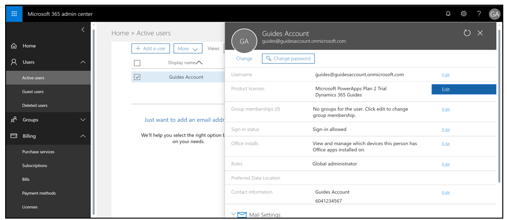

4.  In the **Product licenses** screen, turn the **Dynamics 365 Guides** slider to **On**, and then select **Save**.
  
    
    
5.  Go to the [PowerApps Admin Center](https://preview.admin.powerapps.com/environments), and sign in with the user credentials provided when you signed up for the preview.

6.	In the PowerApps Admin Center, select **New environment**.

    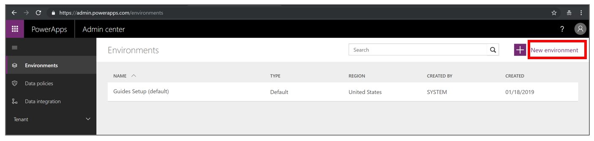
 
7.	Fill in the following details for the environment:

    -	**Environment name:** Guides_*anyname*
    -	**Region:** Don't change - **keep the default setting**
    -	**Environment type:** Set it to **Production**
  
        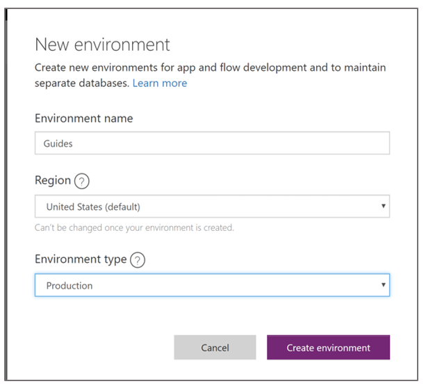
        
    > [!NOTE]
    > Make sure to set **Environment type** to **Production**. Do not set it to **Trial**.
    
8.	Select the **Create environment** button. 

9.	In the dialog box that appears, select **Create database**.

    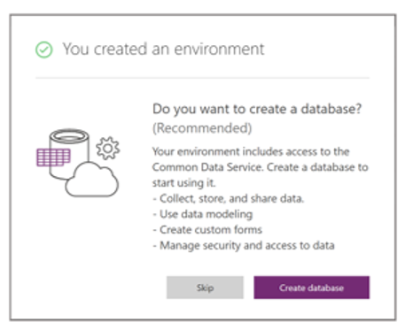   
    
10.	In the next dialog box, choose your currency and language.

    
  
11.	Select **Create database.**

12.	In the **PowerApps Admin center** > **Environments** screen, select the environment that was just created (a production environment, not a default environment). 

    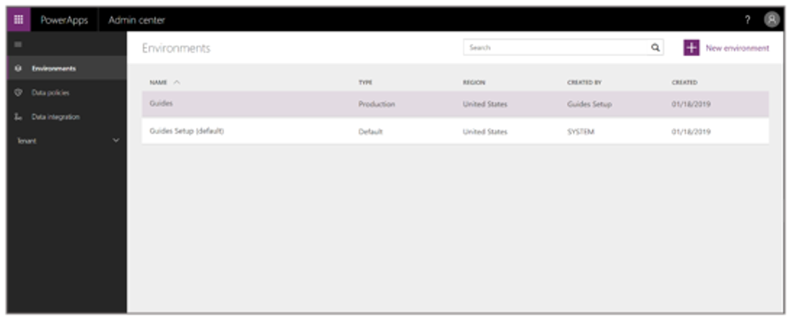
 
    The following screen appears while the database is being created and provisioned:
    
    
 
    > [!NOTE]
    > Database creation usually takes several minutes. If, after 5 minutes, the “Provisioning database” message still appears, try refreshing the page.
    

13.	After the database is created, a link to the Dynamics 365 Administration Center appears. Select this link, and then sign in again with the credentials you created for the preview. You might need to close your browser before signing in. 

    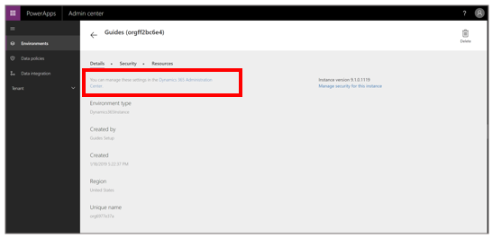

The Dynamics Admin Center appears. This is where you can install the solution and make other configurations.

## Step 3: Install and configure the Dynamics 365 Guides (Preview) solution

In the [!include[pn-dyn-365-guides](../includes/pn-dyn-365-guides.md)] PC application, you can upload your own 3D files, as well as videos and 2D images. Many of these files will be larger than 5 MB, so you need to change the maximum file size for files that are uploaded. To do this, you'll change the setting for the email attachment size to 128 MB (131072 KB). 

1.	Go to the [Dynamics 365 Administration Center](https://port.crm.dynamics.com/G/Instances/InstancePicker.aspx), and sign in with the user credentials you created when you signed up for the [!include[pn-dyn-365-guides-preview](../includes/pn-dyn-365-guides-preview.md)]. 
    
2.	Select the newly created [!include[pn-dyn-365-guides](../includes/pn-dyn-365-guides.md)] instance from the list of instances, and then select **Open** as shown here: 
    
    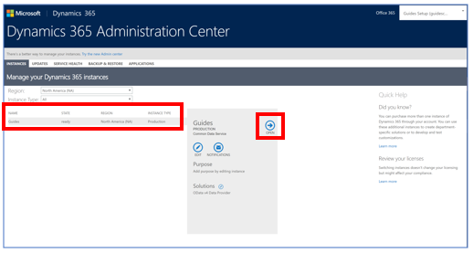
    
    This opens the **[!include[pn-dyn-365](../includes/pn-dyn-365.md)]** screen.
    
3.  In the **[!include[pn-dyn-365](../includes/pn-dyn-365.md)]** screen, select **Settings**, and then select **Advanced Settings**. 

    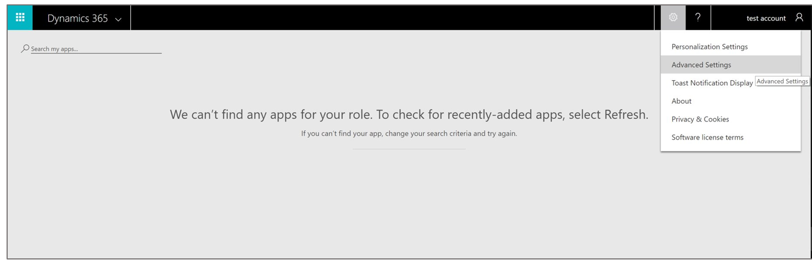
    
4.  In the **[!include[pn-dyn-365](../includes/pn-dyn-365.md)] Business Management** screen, select the **Settings** drop-down list.

     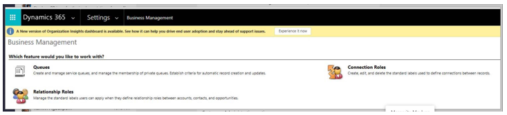
    
5.  Under **System**, select **Administration**.

    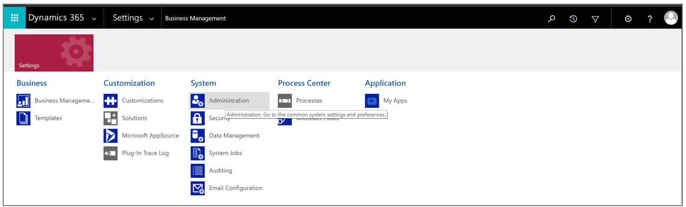
 
6.	In the **[!include[pn-dyn-365](../includes/pn-dyn-365.md)] Settings > Administration** page, select **System Settings**.

    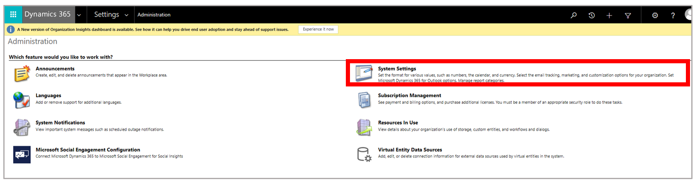
  
7.	In the **System Settings** dialog box, select the **Email** tab, scroll down to the bottom of the dialog box, and then in the **Set file size limits for attachments** field, enter **131072**. Select **OK** when you’re done.

    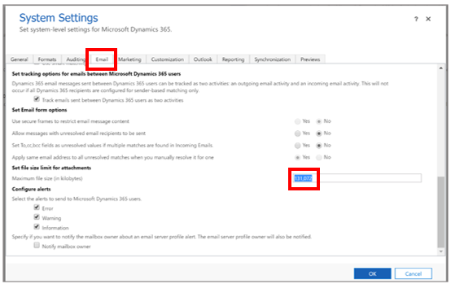
 
8.	Go back to the [Dynamics 365 Administration Center](https://port.crm.dynamics.com/G/Instances/InstancePicker.aspx), and select the small edit button next to **Solutions**.

    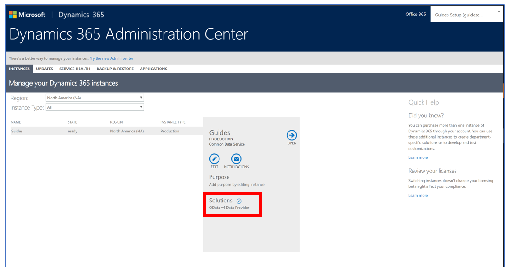
 
    > [!NOTE]
    > You can also get to the [!include[pn-dyn-365](../includes/pn-dyn-365.md)] Administration Center from the PowerApps portal.
    
8.	Select the [!include[pn-dyn-365-guides-preview](../includes/pn-dyn-365-guides-preview.md)] solution in the list, and then select **Install**. 

    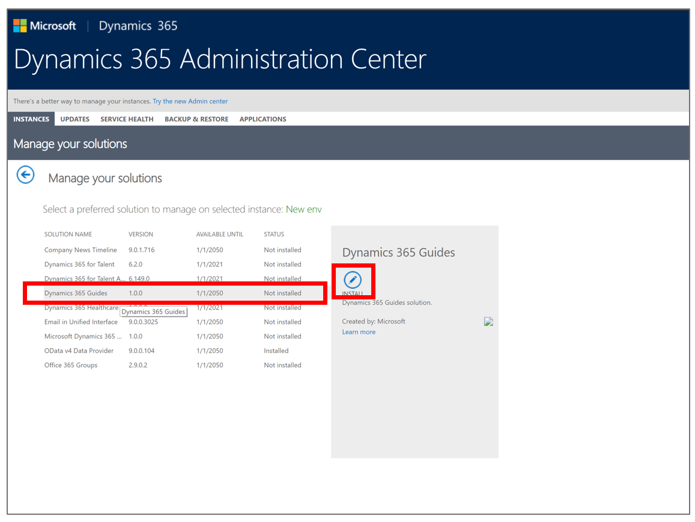
    
9. In the **Terms of Service** dialog box, review the terms, and then select **install** when you're ready.

   In the **[!include[pn-dyn-365](../includes/pn-dyn-365.md)] Administration Center** screen, you'll see the following message highlighted in yellow showing that the solution is about to be installed:

   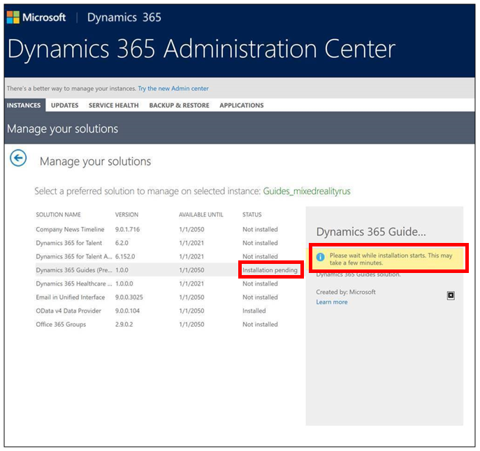
   
   The **Status** field to the left of the yellow message will say **Installation pending** while the solution is being installed. When the solution has finished installing, the **Status** field changes to **Installed**.
 
    > [!NOTE]
    > The installation process can take up to one hour and is variable based on the time of day and region. If the status hasn't changed after an hour, try refreshing your screen. If the installation fails, you'll see this message: 

### Set up user roles for the solution

> [!NOTE]
> It can take up to one hour for a user to appear in the [!include[pn-dyn-365](../includes/pn-dyn-365.md)] admin center after the licenses are added in the [!include[cc-microsoft](../includes/cc-microsoft.md)] 365 admin center. 

1.	After the solution has finished installing, go to the [Dynamics 365 Administration Center](https://port.crm.dynamics.com/G/Instances/InstancePicker.aspx), select the newly created [!include[pn-dyn-365-guides](../includes/pn-dyn-365-guides.md)] instance from the list of instances, and then select **Open**.

2. On the **[!include[pn-dyn-365](../includes/pn-dyn-365.md)]** page, select **Settings**, and then select **Advanced Settings**.

    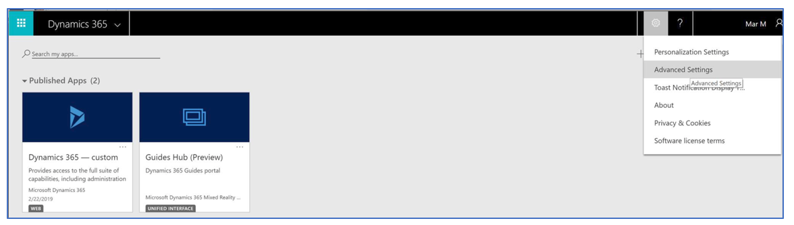
    
    > [!IMPORTANT]
    > You can access [!include[pn-dyn-365-guides](../includes/pn-dyn-365-guides.md)] data through the Guides Hub (Preview) tile in the preceding screen, but we recommend that you not make any changes in the Guides Hub. Any changes you make can have unintended consequences for the [!include[pn-dyn-365-guides](../includes/pn-dyn-365-guides.md)] apps.
 
3.	 In the **[!include[pn-dyn-365](../includes/pn-dyn-365.md)] > Business Management** screen, select the **Settings** drop-down list.
    
     

4.  On the **[!include[pn-dyn-365](../includes/pn-dyn-365.md)] Settings** > **Administration** page, under **System**, select **Security**. 

    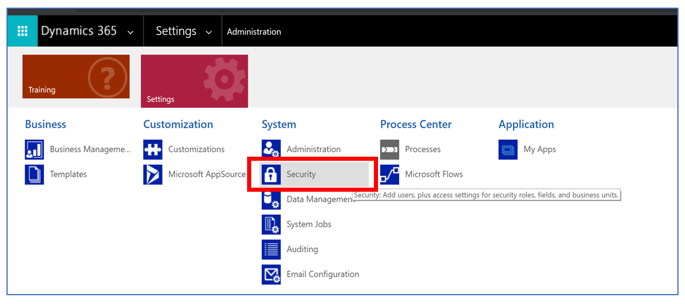
 
4.	On the **Security** page, select **Users**.

    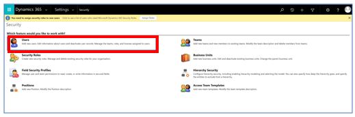
 
5.	Select the user, and then select **Manage** roles. 

    
 
6.	In the **Manage User Roles** dialog box, select the following roles: 

    - Common Data Service User
    
    - [!include[pn-dyn-365-guides](../includes/pn-dyn-365-guides.md)] Author
    
    - System Administrator 
       
      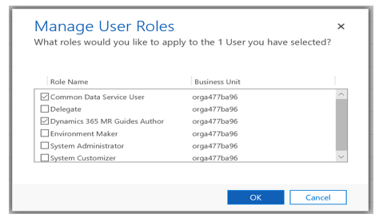
      
      > [!NOTE]
      > Select the System Administrator role if this is the main user/admin. Otherwise, do not select that role.
 
     
## Step 4: Install the applications

There are two [!include[pn-dyn-365-guides](../includes/pn-dyn-365-guides.md)] applications: 

- PC authoring application

- [!include[pn-hololens](../includes/pn-hololens.md)] application, which has an Author mode and an Operator mode

You can install the apps from [!include[cc-microsoft](../includes/cc-microsoft.md)] Store as described in the next section.

> [!NOTE]
> If you can’t access [!include[cc-microsoft](../includes/cc-microsoft.md)] Store due to company policies, please contact your administrator to distribute the app.

If you use [!include[cc-microsoft](../includes/cc-microsoft.md)] Store for Business to distribute your apps, you can have users install the apps from your organization’s private store or from an email link that you send. Instructions are provided later in this topic.

### Install the apps from Microsoft Store

#### Install the PC authoring app 
1.	Check to make sure your [!include[pn-ms-windows-short](../includes/pn-ms-windows-short.md)] 10 PC is running the latest [!include[pn-ms-windows-short](../includes/pn-ms-windows-short.md)] build (must be build 10.0.16299 or later).

2.	On your PC, go to **Start**  > **[!include[cc-microsoft](../includes/cc-microsoft.md)] Store** , and then search for “[!include[pn-dyn-365-guides-preview](../includes/pn-dyn-365-guides-preview.md)].”

3.	In [!include[cc-microsoft](../includes/cc-microsoft.md)] Store, select **Get** for the [!include[pn-dyn-365-guides](../includes/pn-dyn-365-guides.md)] app to download, and install the application.

    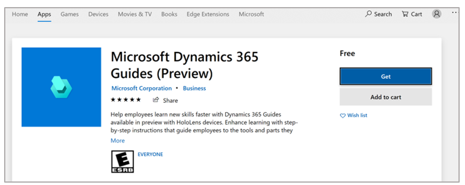

    > [!NOTE]
    > For instructions on opening and signing in to the app, see the [authoring guide](authoring-overview.md).

#### Install the HoloLens app

1.	Make sure [!include[pn-hololens](../includes/pn-hololens.md)] is running build 10.0.14393.0 or later. We recommend updating [!include[pn-hololens](../includes/pn-hololens.md)] to newer versions when available. See [Manage updates to HoloLens](https://docs.microsoft.com/HoloLens/hololens-updates) for instructions on using [!include[pn-ms-windows-short](../includes/pn-ms-windows-short.md)] Update for Business.

2.	On your [!include[pn-hololens](../includes/pn-hololens.md)], use the bloom gesture to open the **Home** menu, and then open the [!include[cc-microsoft](../includes/cc-microsoft.md)] Store app and search for “[!include[pn-dyn-365-guides-preview](../includes/pn-dyn-365-guides-preview.md)]”.

3.	Select **Install** to download and install the [!include[pn-dyn-365-guides](../includes/pn-dyn-365-guides.md)] application.

> [!NOTE] 
> For instructions on opening and signing in to the app, if you're an author, see the [HoloLens authoring topic](hololens-authoring.md). Operators can use the [Dynamics 365 Guides Operator's manual](operator-guide.md).

### Distribute the apps through the Microsoft Store for Business

1.	Go to the [Microsoft Store for Business](https://businessstore.microsoft.com/store).

2.	[Acquire the app(s)](https://docs.microsoft.com/microsoft-store/acquire-apps-microsoft-store-for-business).

3.	Choose one of the following distribution methods:

    - [Private store](https://docs.microsoft.com/microsoft-store/distribute-apps-from-your-private-store)
    
    - [Email link](https://docs.microsoft.com/microsoft-store/assign-apps-to-employees)
    
    - [Mobile device management](https://docs.microsoft.com/microsoft-store/configure-mdm-provider-microsoft-store-for-business)

For information on opening and signing in to the PC application after installing it, see the [authoring guide](authoring-overview.md).

For information on opening and signing in to the [!include[pn-hololens](../includes/pn-hololens.md)] application, go to one of the following, depending on whether you're an author or an operator:

   - [HoloLens authoring](hololens-authoring.md)
   
   - [Operator's manual](operator-guide.md)
   
## Step 5: Add additional user accounts (optional)

You’ll need to create a user account for anyone you assign a license to. Create a new user account for anyone on your team who will use [!include[pn-dyn-365-guides](../includes/pn-dyn-365-guides.md)]. You create user accounts in the [!include[cc-microsoft](../includes/cc-microsoft.md)] 365 Admin Center, and then assign licenses to those users.

### Add a user account

1.	Go to the [Microsoft 365 Admin Center](https://admin.microsoft.com/AdminPortal/Home).

2.	Select **Add a user**.

    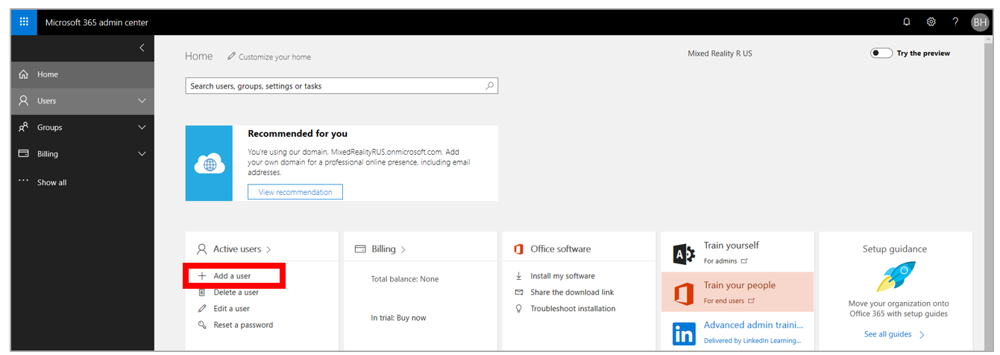
 
    You’ll see the **New user** dialog box:
    
    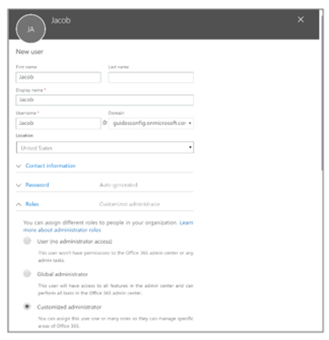
 
3.	In the **New user** dialog box, fill in the following user information:

    - Add the first, last, display name, and user name.

    - **Domain.** Leave the domain as is. It's automatically filled out based on the company you entered when you signed up for the preview. 

    - **Password.** The system generates a user ID and temporary password for the user. We recommend that you send the temporary credentials to the user via email and have the user change the password at first sign in. To enforce that this happens, select the down arrow, and then select the **Make this user change their password when they first sign in** check box. 
    
      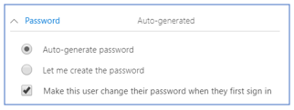

    - **Roles.** Expand this section and select the **User (no administrator access)** option. 
    
      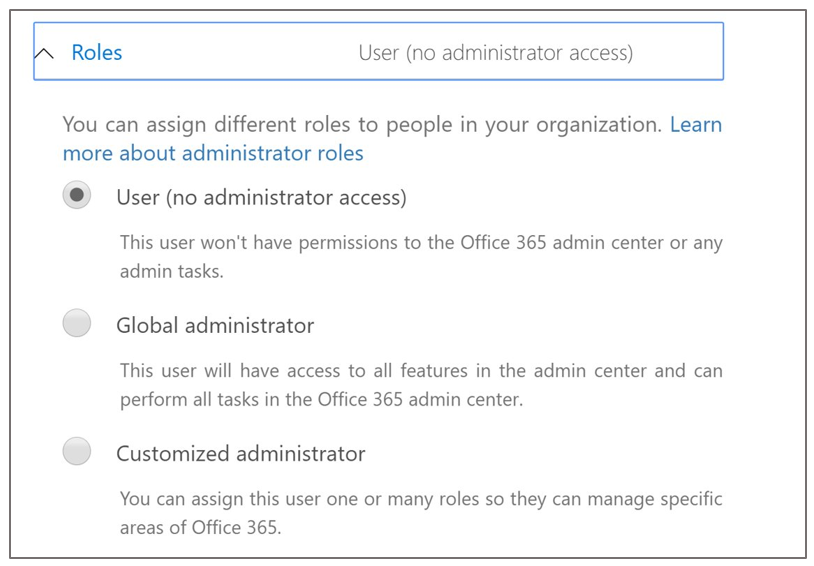
 

    - **Product licenses**. Expand this section, and then turn the **Dynamics 365 Guides** slider to **On**. You can assign up to 25 users.
    
      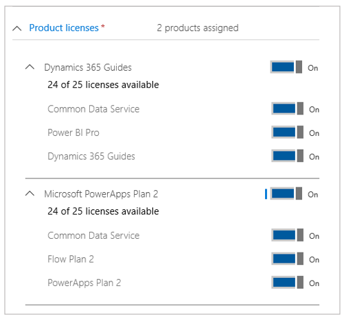
 
4.	Select **Add** when you’re done.

    When you add a user, the user gets an email notification from the [!include[cc-microsoft](../includes/cc-microsoft.md)] Online Services Team that includes their user ID and    temporary password. They’ll use this information to sign in to [!include[pn-dyn-365-guides](../includes/pn-dyn-365-guides.md)].

5. If you haven't already done so, [set up user roles for the solution](#user-roles) as described earlier in this topic.

## Step 6: Set up Guides Analytics reports 

[!include[pn-dyn-365-guides](../includes/pn-dyn-365-guides.md)] includes [!include[pn-power-bi](../includes/pn-power-bi.md)] reports (called Guides Analytics) that you can use to analyze guides processes. You can share these reports within your organization by publishing them to the [!include[pn-power-bi](../includes/pn-power-bi.md)] Service. This allows anyone in your organization with a [!include[pn-power-bi](../includes/pn-power-bi.md)] Pro license to access the report through the [!include[pn-power-bi](../includes/pn-power-bi.md)] Service web interface accessible at [https://powerbi.microsoft.com](https://powerbi.microsoft.com).  

[!include[pn-power-bi](../includes/pn-power-bi.md)] provides several mechanisms for sharing reports with others in your organization. We recommend reading [Ways to share your work in Power BI](https://docs.microsoft.com/power-bi/service-how-to-collaborate-distribute-dashboards-reports) for an overview. A great way to share your reports within your organization in a read-only fashion is to publish them as a [!include[pn-power-bi](../includes/pn-power-bi.md)] app. This involves the following well-documented steps: 

1.	[Create a workspace in the Power BI Service](https://docs.microsoft.com/power-bi/service-create-workspaces). 

2.	[Publish your Guides Analytics reports to this workspace using Power BI Desktop](https://docs.microsoft.com/power-bi/desktop-upload-desktop-files). 

3.	[Publish the contents of your workspace as an app in the Power BI Service](https://docs.microsoft.com/power-bi/service-create-distribute-apps).  

### See also

[Get started with Dynamics 365 Guides in preview](get-started.md) 
[Author a guide](authoring-overview.md) 
[Operator's manual](operator-guide.md) 
[Analyze your guides to improve process efficiencies](analytics-guide.md) 
[FAQ](faq.md)

