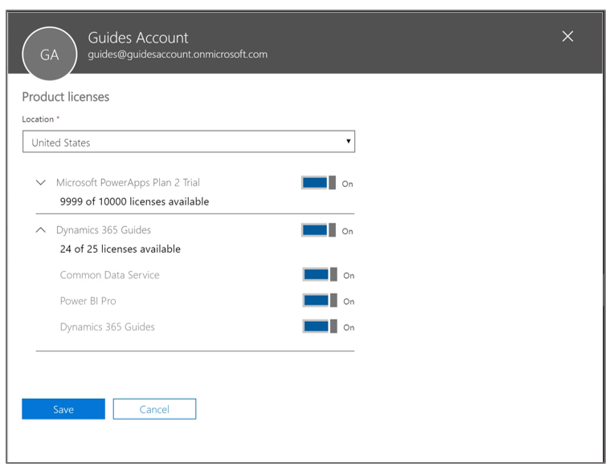
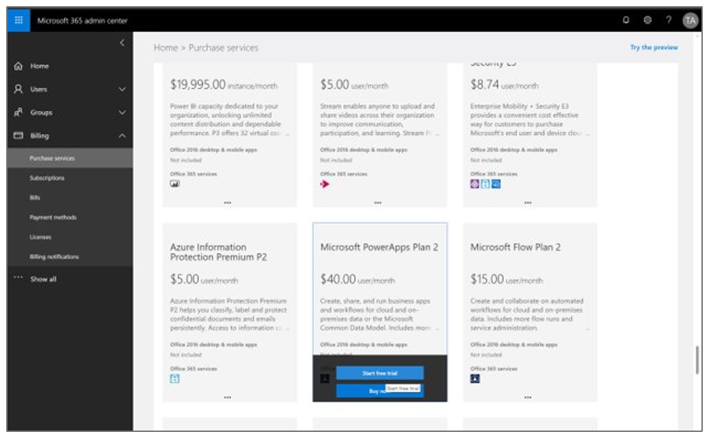
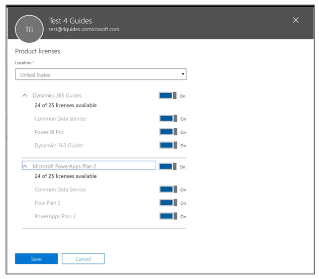

# Sign up for Dynamics 365 Guides Preview

We're thrilled to introduce Microsoft Dynamics 365 Guides Preview! [Learn about Guides capabilities](index.md).

To get started with Guides, you need to:

1.	Sign up for the preview.

2.	Create a Common Data Service (CDS) environment, if you don't already have one.

3.  Install the Guides solution.

4.	Download and install the Guides apps on a Windows 10 PC and Microsoft HoloLens.

This topic provides step-by-step instructions for all of the above.

## Step 1: Sign up for the preview

When you sign up for preview, you’ll get access for up to 25 users. 

You can sign up in either of the following ways:

- If you’re new to Microsoft, sign up through the Guides Getting Started page as described below.  
  
- If you're an existing customer or admin, sign up through the Guides Getting Started page or through the Microsoft Admin Center. Step-by-step instructions for subscribing through the Microsoft Admin Center are provided below.

### Sign up through the Guides Getting Started page

1.	Go to [the Guides Getting started page](http://aka.ms/GetGuides), and then follow the instructions to create your user credentials for the preview.

2.	After signing up, if you want to add users for your preview, follow the steps below.

### Subscribe through the Microsoft 365 Admin Center.

1.	Go to [https://portal.office.com/AdminPortal/Home#/catalog](https://portal.office.com/AdminPortal/Home#/catalog).

2.	Sign in using your company's admin account. If you don't know who your admin is, contact the IT helpdesk at your company to find out. [Get more advice on admin accounts](https://docs.microsoft.com/en-us/office365/admin/admin-overview/admin-overview?redirectSourcePath=%252fen-us%252farticle%252foffice-365-admin-overview-c7228a3e-061f-4575-b1ef-adf1d1669870&view=o365-worldwide).

3.	Under **Billing** in the left navigation, select **Purchase services**.

4.	Scroll down to the **Other plans** section.

5.	Find the product card for Dynamics 365 Guides (Preview).

6.	On the product card, select **Start free trial**, and then follow the instructions.

7.	If you want to add additional users, assign licenses as described in the next procedure.

### Assign licenses for additional users (optional)

If you're an administrator, and you want others in your organization to have access to Guides, you’ll need to assign users in the Microsoft 365 Admin Center. Each user you add will need an Azure Active Directory (Azure AD) account.

1.	In the Microsoft 365 Admin Center, under **Billing** in the left navigation, select **Subscriptions**, and then select **Assign to users.**

2.	Select the users you'd like to assign, and then in the **Bulk actions** menu on the right side of the screen, select **Edit product licenses**.
 
3.	In the **Add to existing products** screen, select the **Add to existing product license assignments** option, and then select **Next**.
 
4.	Select the licenses you want to enable for the selected users, and then select **Add**.

   > [!NOTE]
   > If you didn't assign user licenses before, you’ll need to add user accounts, as described in the next procedure. 
   
### Add additional user accounts (optional)

You’ll need to create a user account for anyone you assign a license to. Create a new user account for anyone on your team who will use Guides. 

To add a user account:

1.	Go to the Microsoft 365 Admin Center.

2.	Select **Add a user**.
 
    You’ll see the **New user** dialog box:
    
    
 
3.	In the **New user** dialog box, fill in the following user information:

    - Add the first, last, display name, and user name.

    - **Domain.** Choose a domain. For example, if the user name is Jakob, and his domain is contoso.com, he'll sign in to Guides by entering jakob@contoso.com.

    - **Password.** The system generates a user ID and temporary password for the user. We recommend that you send the temporary credentials to the user via email and have the user change the password at first sign in. To enforce that this happens, select the down arrow, and then select the **Make this user change their password when they first sign in** check box. 
    
      

    - **Roles.** Expand this section and select the **User (no administrator access)** option. 
    
      
 
    - **Product licenses**. Expand this section, and then turn on the **Dynamics 365 Guides** option. You can assign up to 25 users.
    
      
 
4.	Select **Save** when you’re done.

When you add a user, the user will get an email notification from the Microsoft Online Services Team that includes their user ID and temporary password. They’ll use this information to sign in to Guides.

## Step 2: Create a Common Data Service (CDS) environment

Once you have a valid trial subscription, you’ll need to create an environment where you can install the Guides solution. If you already have a CDS environment, you can skip to [Install and configure Guides solution](#configure).

1.	Go to the [Microsoft 365 Admin Center](https://portal.office.com/AdminPortal/Home).

2.  Under **Billing**, select **Purchase Services**, and then search for **PowerApps Plan 2**.

    

3.  On the Microsoft PowerApps Plan 2 card, select **Start free trial**. 

4.  Now you need to add the PowerApps license to a user. To do that, in the left navigation, select **Users**, select **Active users**, and then select the **Add a user** button. 

    
    
5.  In the **Guides Account** screen, select the **Edit** button next to **Product license**.

     

7.  In the **Product licenses** screen, turn on the **Microsoft PowerApps Plan 2** plan.
  
    
    
7.  Go to the PowerApps Admin Center and sign in with the user credentials created when you signed up for the trial subscription.

8.	In the PowerApps Admin Center, select the **New environment** button.

    
 
9.	Fill in the following details for the environment:

    -	**Environment Name:** Guides_*anyname*
    -	**Region:** Choose your region
    -	**Environment Type:** Set it to **Production**
  
        
    
10.	Select the **Create environment** button. 

11.	In the pop-up that appears, select **Create database**.

       
    
12.	In the next pop-up, choose the currency and language and then clear the **Include sample apps and data** check box.

    

    > [!IMPORTANT]
    > Make sure to clear the **Include sample apps and data** check box.
  
13.	Select **Create database.**

14.	In the **PowerApps Admin center>Environments** screen, select the environment that was just created (a production environment, not a default environment). 

    
 
    The following screen will appear while the database is being created and provisioned:
    
    
 
    > [!NOTE]
    > Database creation usually takes several minutes. If, after 5 minutes, the “Provisioning database” message still appears, try refreshing the page.
    
15.	After the database is created, a link to the Dynamics 365 Administration Center appears. Select this link. 

    

The Dynamics Admin Center will appear. This is where you can install the solution and make other configurations.

## Step 3: Install and configure the Guides solution

In the Guides PC application, you can upload your own 3D files, as well as videos and 2D images. Many of these files will be larger than 5 MB, so you need to change the maximum file size for files that are uploaded. To to this, you'll change the setting for the email attachment size to 128 MB (131072 KB). 

1.	Go to the [Dynamics 365 Administration Center](https://port.crm.dynamics.com/G/Instances/InstancePicker.aspx) and sign in with the user credentials you created when you signed up for the Guides trial. 
    
2.	Select the newly created Guides instance from the list of instances, and then select the **Open** button as shown below: 
    
    
    
    This opens the **Dynamics 365** screen.
    
3.  In the **Dynamics 365** screen, select the **Settings** button, and then select **Advanced Settings**. 

    
 
2.	In the **Dynamics 365 Settings > Administration** page, select **System Settings**.

    
  
3.	In the **System Settings** page, select the **Email** tab, and then in the **Set file size limits for attachments** field, enter **131072**. Select **OK** when you’re done.

    
 
4.	Go back to the [Dynamics 365 Administration Center](https://port.crm.dynamics.com/G/Instances/InstancePicker.aspx) and select the small Edit button next to **Solutions**.

    
 
    > [!NOTE]
    > You can also get to the Dynamics 365 Administration Center from the PowerApps portal.
    
5.	Select the Dynamics 365 Guides solution in the list, and then select **Install**. 

    
 
    > [!NOTE]
    > The installation process can take up to 20 minutes. 

### Set up user roles for the solution

1.	Go to the [Dynamics 365 Administration Center](https://port.crm.dynamics.com/G/Instances/InstancePicker.aspx), select the newly created Guides instance from the list of instances, and then select the **Open** button.
 
2.	In the **Dynamics 365 Settings>Administration** page, under **System**, select **Security**. 

    
 
3.	In the **Security** page, select **Users**.

    
 
4.	Select the user, and then select **Manage** roles. 

    
 
5.	In the **Manage User Roles** dialog box, select the following roles: 

    - Common Data Service User
    
    - Dynamics 365 MR Guides Author    
       
      
 
     
## Step 4: Install the applications

There are two guides applications: 

- PC authoring application

- HoloLens application, which has an Author mode and an Operator mode

You can install the apps from the Microsoft Store for Consumers as described below.

> [!NOTE]
> If you can’t access the Microsoft Store for Consumers due to company policies, please contact your administrator to distribute the app.

If you're an administrator and you have subscribed and assigned licenses to your users through the Microsoft 365 Admin Center or Partner Center, you can make the apps available through one of the following:

- Microsoft Store for Consumers

- Microsoft Store for Business

If you use the Microsoft Store for Business, you can have users install the apps:

- From your organization’s private store

- From an email link that you send

### Install the apps from the Microsoft Store for Consumers

#### Install the PC authoring app 
1.	Make sure your Windows 10 PC is running the Fall Creators Update or later (build 10.0.16299 or later).

2.	On your PC, go to Start  > Microsoft Store , and then search for “Guides.”

3.	In the Microsoft Store, select the **Install** button for the Guides app to download and install the application.

> [!NOTE]
> For instructions on opening and signing in to the app, see the [Authoring guide](authoring-overview.md)

#### Install the HoloLens app

1.	Make sure your HoloLens is running build 10.0.14393.0 or later. We recommend updating HoloLens to newer versions when available. See [Manage updates to HoloLens](https://docs.microsoft.com/en-us/HoloLens/hololens-updates) for instructions on using Windows Update for Business.

2.	On your HoloLens, use the bloom gesture to open the Home menu, and then open the Microsoft Store app and search for “Guides”.

3.	Select **Install** to download and install the Guides application.

> [!NOTE] 
> For instructions on opening and signing in to the app, if you're an author, see the [HoloLens authoring topic](hololens-authoring.md). Operators can use the [Guides Operator's manual](operator-guide.md).

### Distribute the apps through the Microsoft Store for Business

1.	Go to the [Microsoft Store for Business](https://businessstore.microsoft.com/en-us/store).

2.	[Acquire the app(s)](https://docs.microsoft.com/en-us/microsoft-store/acquire-apps-microsoft-store-for-business).

3.	Choose one of the following distribution methods:

    - [Private store](https://docs.microsoft.com/en-us/microsoft-store/distribute-apps-from-your-private-store)
    
    - [Email link](https://docs.microsoft.com/en-us/microsoft-store/assign-apps-to-employees)
    
    - [Mobile device management](https://docs.microsoft.com/en-us/microsoft-store/configure-mdm-provider-microsoft-store-for-business)

For information on opening and signing in to the PC application after installing it, see the [Authoring Guide](authoring-overview.md)

For information on opening and signing in to the HoloLens application, go to one of the following, depending on whether you're an author or an operator:

   - [HoloLens authoring](hololens-authoring.md)
   
   - [Guides Operating manual](operator-guide.md)

### See also

[Get started with Dynamics 365 Guides (Preview)](get-started.md) 
[Authoring a guide](authoring-overview.md) 
[Guides Operator's manual](operator-guide.md) 
[Analyze your guides to improve process efficiencies](analytics-guide.md) 
[FAQ](faq.md)

