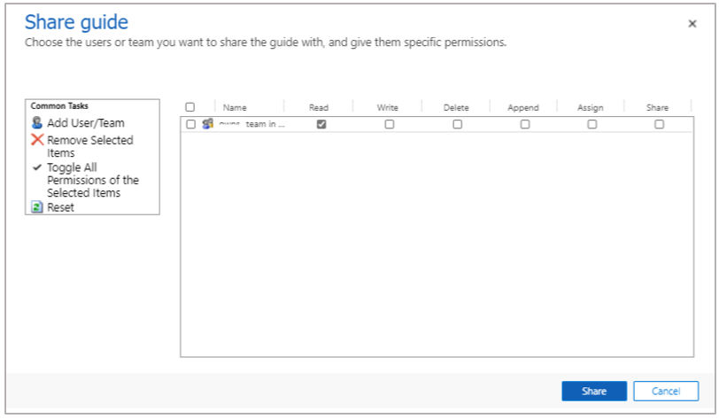

# Share a guide in Dynamics 365 Guides

In Microsoft Dynamics 365 Guides, you can share a guide [by creating an access team](admin-access-teams.md). It's a good idea to structure access teams so that guide ownership is assigned to one or more teams that include the groups of users who need to collaborate on guides as authors, or use the guides as operators. In rare cases, you might want to share a guide with a specific user who is not a member of a team by using the **Share** option. Both sharing methods are described in this article.   

> [!TIP]
> When you share a guide, the content (images, videos, and 3D objects) associated with the guide is not automatically shared. You can use the **All Content** tab in the Guides model-driven app to do bulk operations, such as sharing content. 
>
>  

## Share a guide with an access team

1. Go to <https://make.powerapps.com/>.

2. Select **Apps**.

3. Under **Your Apps**, select **Guides**.

    

4. Find the guide that you want to share, select the check box next to the guide name, and then select **Share**.

    

5. In the **Share guide** page, select **Add User/Team**.

    

6. In the **Look Up Records** dialog box:

    1. In the **Look for** field, select **Team**.

    2. In the **Look in** field, select **All User Access Teams**.

    3. Select the check box next to the name of the access team that you want to share the guide with.

    4. Select **Select**, and then select **Add**.

    

7. In the **Share guide** dialog box, select specific permissions (make sure the team has the **Read** permission), and then select **Share**.

    

## Share a guide with a specific user

Users who have the Share privilege can share guides and guide records that they own with other users.

1. Go to <https://make.powerapps.com/>.

2. Select **Apps**, and then select **Guides**.

    

3. Find the guide that you want to share, select the check box next to the guide name, and then select **Share**.

    

4. In the **Share guide** page, select **Add User/Team**.

    

5. In the **Look Up Records** dialog box, select the check box next to a specific user, select **Select**, and then select **Add**.

    

6. Make sure that the user has the **Read** and **Append** privileges, and then select **Share**.

    

## See also

- [Create an access team](admin-access-teams.md)
- [Assign an Operator or Author role to an individual user](assign-role.md)
- [Assign roles in bulk by using Active Directory groups](admin-assign-role-groups.md)
- [Restrict access to an environment by using security groups](admin-security.md)
= [Learn more about security roles and privileges](https://docs.microsoft.com/dynamics365/customerengagement/on-premises/admin/security-roles-privileges)

[!INCLUDE[footer-include](../includes/footer-banner.md)]

