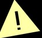
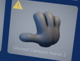

# Step content failed to load message in the HoloLens app

The following message displays in the HoloLens app:

## Cause

The amount and complexity of content added to the step has reached its memory limit, which will result in a poor experience for the operators of the guide. You can't place any additional 3D models at this point. If a model was previously placed in the world, it is represented as an exclamation point icon to authors and operators.

## Solution

Reduce the step complexity. For more information, see:

- [Optimize your 3D models](optimize-models.md)
- [Best practices for working with 3D content](hololens-app-place-holograms.md#best-practices-for-working-with-3d-content)
- 

## Memory constraints when adding 3D models

When you author each guide step, you'll see a warning if the step complexity will likely result in a poor experience for the operator of the guide. 

If you see the "Warning! High step memory usage" message, the 3D models that you place for the step will be displayed but the operator may have a degraded experience (the guide may have low frame rates or there may be noticeable loading times when moving between steps). 

If you continue to add 3D models and HoloLens reaches its memory limit, you'll see the "Step content failed to load" message.

You can't place any additional 3D models at this point. If a model was previously placed in the world, it will be represented as an exclamation point icon to authors and operators. 

The exclamation point will also appear next to the model on the parts shelf to let you know that it failed to load and can't be placed.

For information on reducing step complexity, see [Optimize your 3D models to use with Dynamics 365 Guides and Power Apps](/dynamics365/mixed-reality/guides/3d-content-guidelines/optimize-models).
