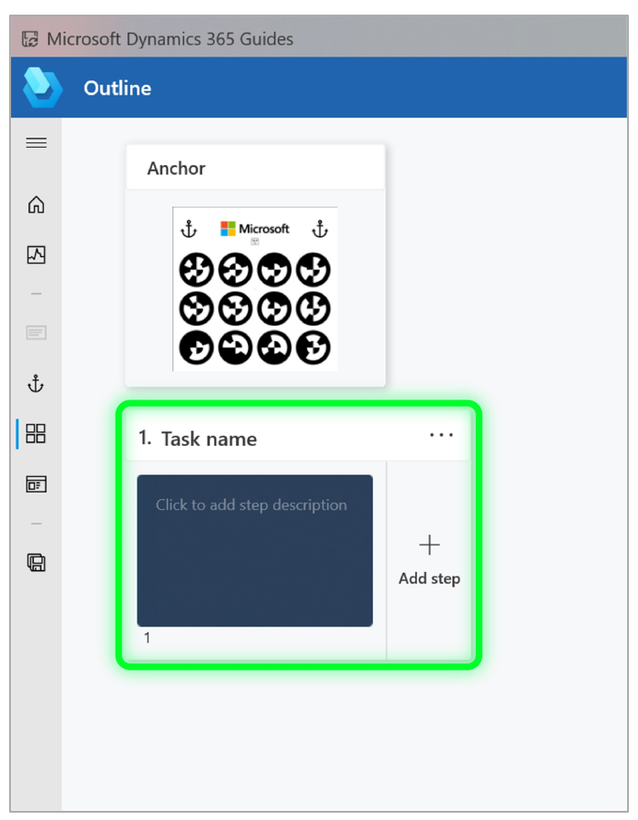

# Structure your guide using the Outline page in the Dynamics 365 Guides PC app

When you open the Dynamics 365 Guides PC app, you see the **Outline** page. This is where you create the framework for your guide by adding as many tasks and steps as you need. *Tasks* are groups of steps. *Steps* are the short, discrete work items that operators do to complete the task. Steps are the central building blocks in [!include[pn-dyn-365-guides](../includes/pn-dyn-365-guides.md)].

When you open the **Outline** page for the first time, you'll see that a single task and step are already created for you. 

The **Outline** page provides a great way to map out your guide at the start, or to get an overall picture of the guide after you’ve added all your tasks and steps. You can also restructure your guide from the **Outline** page by dragging tasks and steps.

In addition to tasks and steps, the **Outline** page shows:

- Customizable operator instructions.

- A special step called a Completion step that lets operators know when they’ve reached the end of the guide. The Completion step includes default text that you can customize as you see fit.

  

## Create a task add start adding instruction text

1. Enter a task name in the **Task name**, and then start typing the instructions for the first step in the box below the task name. When you start typing your text, the **Step Editor** appears.

   

To learn more about using the **Step Editor**, see [Create steps and add 3D models or 2D media](create-steps-assign-media.md).
 
## Best practices for the Outline page

- To provide overall context, add an Overview task at the start of the guide. This task would include just one step that describes what the guide is about. This is also a good place to list all the tasks that the guide covers. 

- Add a step at the beginning and end of each task to let the operator know when they’re starting something new or ending a task, and to make the operator feel successful when they complete a task.

- Don’t be afraid to add lots of steps, but remember to keep them short for best effect. 

- Consider adding steps that show individual tips and tricks. 

- When you move from the PC app to the HoloLens app, you'll be prompted to refresh. It's a good idea to close the guide you're working on when you switch devices. 

Here’s an example of a filled-out **Outline** page:

  
## What's next?

[Anchor your guide to the real world](anchor.md) 
[Create steps and add 3D content or 2D media](create-steps-assign-media.md) 
[Learn about keyboard shortcuts](keyboard-shortcuts-pc-app.md) 

