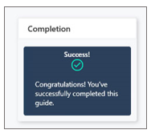
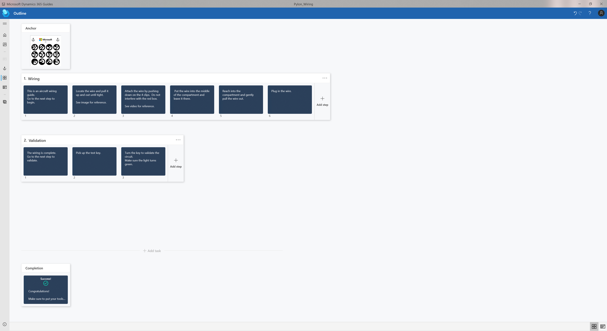
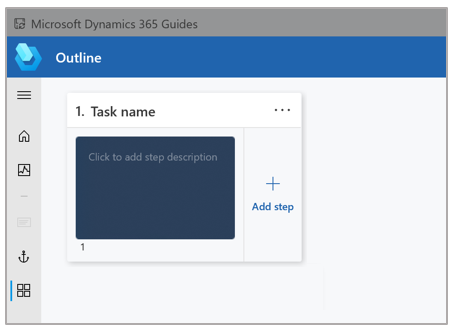

# Structure your guide on the Outline page in the Dynamics 365 Guides PC app

After you [create a guide](create-guide.md) by using the [!include[cc-microsoft](../includes/cc-microsoft.md)] [!include[pn-dyn-365-guides](../includes/pn-dyn-365-guides.md)] PC app, or when you open an existing guide, the **Outline** page appears. On the **Outline** page, you create a framework for your guide by adding as many *tasks* and *steps* as you need. Tasks are groups of steps. Steps are the short, separate work items that operators complete to perform the task. Steps are the central building blocks in [!include[pn-dyn-365-guides](../includes/pn-dyn-365-guides.md)].

> [!NOTE]
> You can also use the **Outline** page to select an anchoring method for the guide or change the existing anchoring method. For information about how to anchor a guide, see [Anchor your guide to the real world](anchor.md).

The **Outline** page provides a great way to map out your guide at the start, or to get an overall picture of the guide after you've added all the tasks and steps. You can also restructure your guide from the **Outline** page by dragging tasks and steps.

The **Outline** page includes a special **Completion** step that is included in all guides. This step lets operators know that they've reached the end of the guide. The **Completion** step includes default text that you can customize as you see fit.

Here's an example of a filled-in **Outline** page.

## Go to other pages from the Outline page

You can use the buttons in the navigation bar on the left side of the **Outline** page to go to other pages in the PC app. The following table describes these buttons.

| Button | Name | Action |
|---|---|---|
|  | Open Navigation | Expand the navigation bar so that it includes a description for each button. |
|  | Home | Go to the **Welcome** page, where you can create a new guide or open an existing guide. |
|  | Analyze | Go to the **Analyze** page, where you can set up Power BI reports (Guides Analytics) to analyze your guides. |
|  | Anchor | Open the **Choose an anchor method** wizard, where you can select an anchoring method for your guide or change the existing anchoring method. |
|  | Step | Go to the **Step Editor** page, where you can add instruction text and supporting 2D or 3D content. |

## Work with tasks and steps

When you open the **Outline** page for a newly created guide, you will notice that a single task and a single step have already been created for you.

The following table describes the actions for working with tasks and steps.

| Action | Steps |
|---|---|
| Change the name of a task. | Enter a new name in the **Task name** box. |
| Enter instruction text for a step. | Enter text in the box below the task name. When you start to enter text, the **Step Editor** page appears. For more information about how to use the Step Editor, see [Create steps and add 3D models or 2D media](create-steps-assign-media.md). |
| Add a new task. | Select **Add task** below the last task or set of steps. Alternatively, select the **Task menu** (**...**) button to the right of the task name, and then select **Insert a task**. |
| Add a new step. | Select **Add step**. |
| Remove a task and its steps. | Select the **Task menu** (**...**) button to the right of the task name, and then select **Remove task and steps**. |
| Change the instruction text for the **Completion** step. | Select the **Completion** step. The **Step Editor** page appears. For more information about how to use the Step Editor, see [Create steps and add 3D models or 2D media](create-steps-assign-media.md). |
| Rearrange tasks or steps. | Drag the task or step to move it where you want. |

## Best practices for the Outline page

- To provide overall context, add an **Overview** task at the beginning of the guide. This task should include just one step that describes what the guide is about. This step is also a good place to list all the tasks that the guide covers.

- At the beginning and end of each task, add a step to let operators know when they've finished something or are starting something new. This type of step can help operators feel successful when they complete a task.

- Don't be afraid to add lots of steps. However, for the best effect, remember to keep the steps short.

- Consider adding steps that show individual tips and tricks.

## What's next?

[Anchor your guide to the real world](anchor.md) 
[Create steps and add 3D content or 2D media](create-steps-assign-media.md) 
[Add a website or Power Apps link to a step](pc-app-website-powerapps-link.md) 
[Create and copy a link to a guide or step](pc-app-copy-link-guide-step.md) 
[Learn about keyboard shortcuts](keyboard-shortcuts-pc-app.md) 
[Deactivate a guide](pc-app-deactivate-guide.md) 
[Learn what makes a great mixed reality guide](great-guide.md)

[!INCLUDE[footer-include](../includes/footer-banner.md)]