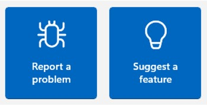
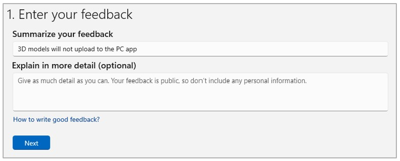
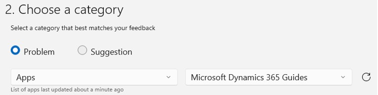
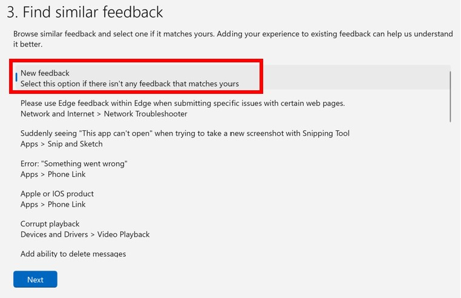
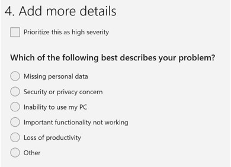
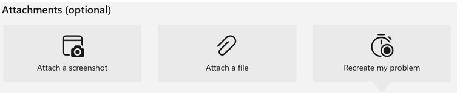
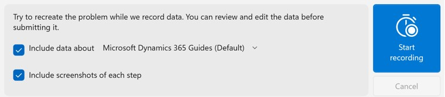

# Submit feedback on Dynamics 365 Guides through the Feedback Hub

If you run into an issue with Dynamics 365 Guides, you can report it through the Feedback Hub app (available for Windows devices). Use the Feedback Hub app to submit screenshots and provide extra telemetry to help Microsoft investigate a problem. You can follow this process on your HoloLens or your PC.

1. Start the Feedback Hub app. If you uninstalled it previously, download the app from the Windows Store.

2. Select **Report a problem**.

     

3. Under **Enter your feedback**, summarize the problem, describe it in more detail, and then select **Next**.

     
    
4. Under **Choose a category**, select **Apps**, and then **Microsoft Dynamics 365 Guides**. If the app isn't listed, start Dynamics 365 Guides on your device, and then 
select the **Refresh** button.

     
 
5. When you're prompted to find similar feedback, take a quick look at the list to see if the same issue has already been reported. If not, select **New 
feedback**.

    

6. Under **Which of the following best describes your problem?**, select the options that you feel are applicable.

     

7. Attach any screenshots and/or 3D models (if permitted by your company policies).

         

8. Tap **Start recording**, and then reproduce the problem. This will attach telemetry data to your feedback and make it easier for Microsoft 
to diagnose the problem. Your data is protected under the [Microsoft Privacy Statement](https://privacy.microsoft.com/privacystatement). 
Return to the Feedback Hub app when you're finished. 

9. After you finish the recording, you have the option to delete  the logs and try again.

     

10. Tap the **Submit** button.

    [!TIP]
    If you're using a Wi-Fi connection, don't shut down your device right away. Allow a few minutes for the logs to upload.

