# Update the Dynamics 365 Guides solution

Some releases of Microsoft [!include[pn-dyn-365-guides](../includes/pn-dyn-365-guides.md)] require an update to the [!include[pn-dyn-365-guides](../includes/pn-dyn-365-guides.md)] solution. 

> [!IMPORTANT]
> To update the Guides solution, you must have a [System Administrator security group role](/power-platform/admin/database-security) and an assigned Guides license. 

When an update is required, the user will see a notification in the **What's new** panel. 

Keep the following in mind:

- Before you update the solution in the Power Platform admin center, make sure that the [!include[pn-dyn-365-guides](../includes/pn-dyn-365-guides.md)] PC and [!include[pn-hololens](../includes/pn-hololens.md)] apps have been updated to the latest version from the [!include[cc-microsoft](../includes/cc-microsoft.md)] Store.

- Updates to the solution must be done when the Guides model-driven app, PC app, and [!include[pn-hololens](../includes/pn-hololens.md)] app is not in use.  

- [Make sure that you back up your environment](/power-platform/admin/backup-restore-environments) before updating your solution. 

To update the solution:

1. Go to the [Power Platform admin center](https://admin.powerplatform.microsoft.com/environments), and sign in by using the [System Administrator security role](/power-platform/admin/database-security) permissions for [!include[pn-dyn-365-guides](../includes/pn-dyn-365-guides.md)]. Admins must also have a [Dynamics 365 Guides license assigned to their user account](./add-users.md). 

2. To select the environment, select **Resources**, and then select **Dynamics 365 apps**. 

   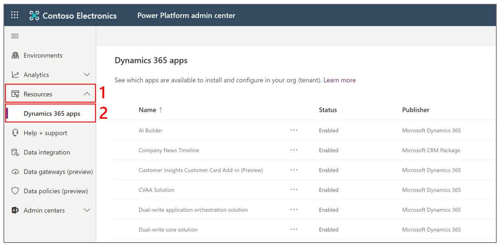

3. Next to **Dynamics 365 Guides**, select the **More application actions** (...) button, and then select **Install**.
 
   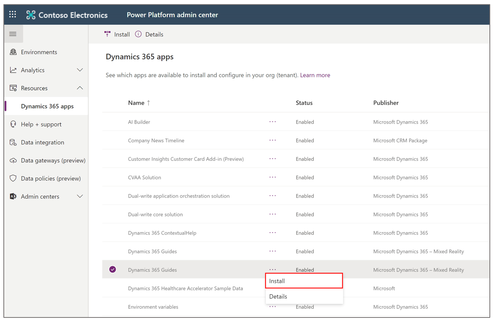  
  
4. In the dialog box that appears, select the environment that you want to update the solution for, select the **I agree to the terms of service** check box, and then select **Install**.  
    
   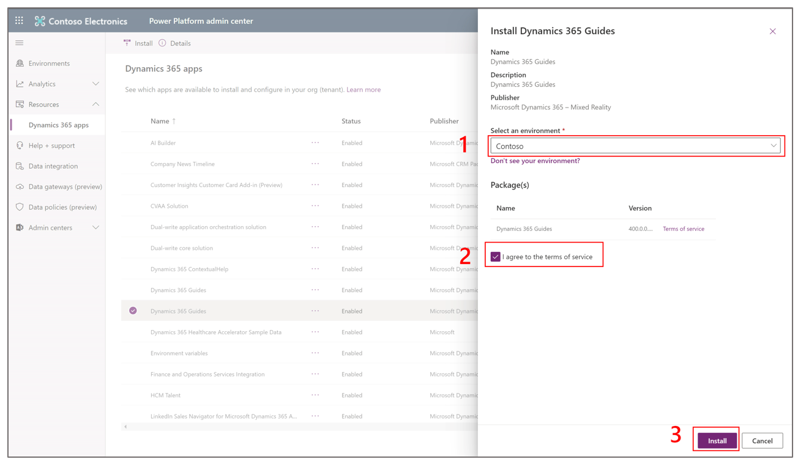  

## Troubleshooting

If you encounter issues while you're upgrading the solution, make sure that you have the [System Administrator security role](/power-platform/admin/database-security). You must have this role to update the solution.

### "Guide can't be opened" error message

As part of the October 1 update of the Dynamics 365 Guides solution, all your guides should automatically be converted from schema v3 or v4 to v5. Schema v5 enables the latest features, such as branching and triggers, and also includes all changes from schema v4 introduced on April 28, 2020.  
 
In rare cases, the conversion of a guide from schema v3 or v4 to v5 might be unsuccessful, for reasons that include but aren't limited to the following:

- A guide was being authored in the PC or HoloLens app when the solution was updated.

- The JSON file has been edited in a way that isn't supported. (For example, the guide doesn't have a task, or too many 3D parts have been programmatically added to the **Step Editor** bin.)

If a guide wasn't successfully converted, authors or operators will receive the following error message when they try to open it: "Guide can't be opened. This guide can't be opened because the schema version is out of date. Contact your admin to update the schema version."

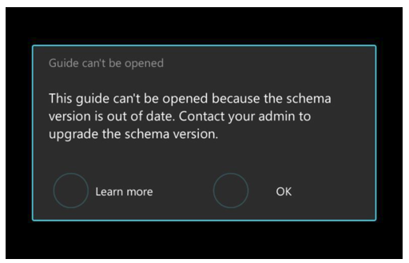

To fix this issue, we recommend that you first try to update the guide schema from v3 to v4.  

> [!NOTE]
> You can't manually update the schema for guides that have already been updated to schema v4. The schema version number appears on the **General** tab when you open a guide in the Guides model-driven app. 

#### Upgrade the schema

1. In the PC app, sign in to the instance that includes the guide where the issue occurs.

2. On the **Analyze** tab, select **Copy** to copy the **Instance URL** value, and then paste the value into the address bar of a web browser.

    

3. Sign in, and then select the **Guides** model-driven app.

    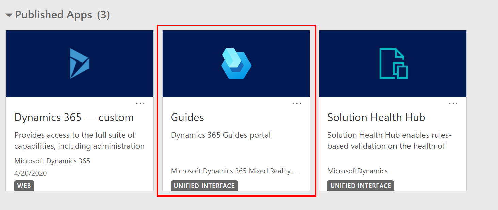

4. Select the guide where the issue occurs.

    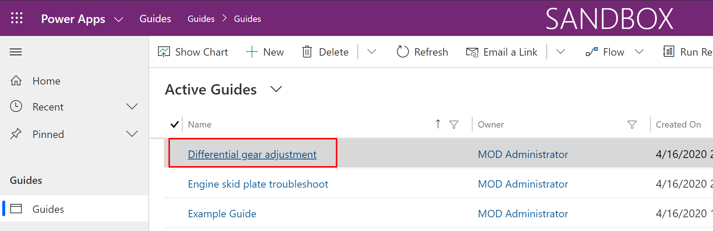

5. At the top of the page, select **Flow**, and then select **Upgrade guide schema**.

    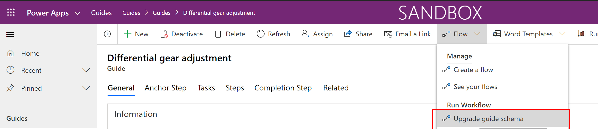
    
>[!NOTE]
>If the issue isn't fixed when you update the guide schema, the guide's JSON file has probably been edited in a way that isn't supported (for example, too many 3D objects have been programmatically added to the **Step Editor** bin). Contact the Dynamics 365 Guides team directly for guidance, through your Microsoft Account team.

### Having trouble accessing an image, video, or 3D object through the Dataverse API or Power Apps after updating to Guides solution version 504.0.0.0?

The 504.0.0.0 Guides solution update changes the way that guide content (images, videos, and 3D objects) is stored in the Microsoft Dataverse. With this update, each file is stored in the new **File** column instead of as an attachment in the **Note** column. This significantly improves performance when loading content in Dynamics 365 Guides and allows you to [access your files more easily on the Power Platform](/powerapps/maker/canvas-apps/controls/control-attachments). 

If an image, video, or 3D object fails to convert correctly to the newest version when you update to the 504.0.0.0 solution (this can happen, for example, if the Dataverse was down during the solution update), it means that the related file is stored using the old method (attached to the **Note** column instead of stored in the new **File** column). This makes it harder to retrieve when using the Power Platform or the Dataverse API. You can check whether your media content has been updated correctly by checking the version number. If it hasn't been updated correctly, you can then do a manual update using the following procedure: 

1.	Go to [make.powerapps.com](https://make.powerapps.com). 

2.	Sign in with your credentials. 

3.	On the Power Apps **Home** page, under **Your apps**, select **Guides**. 

    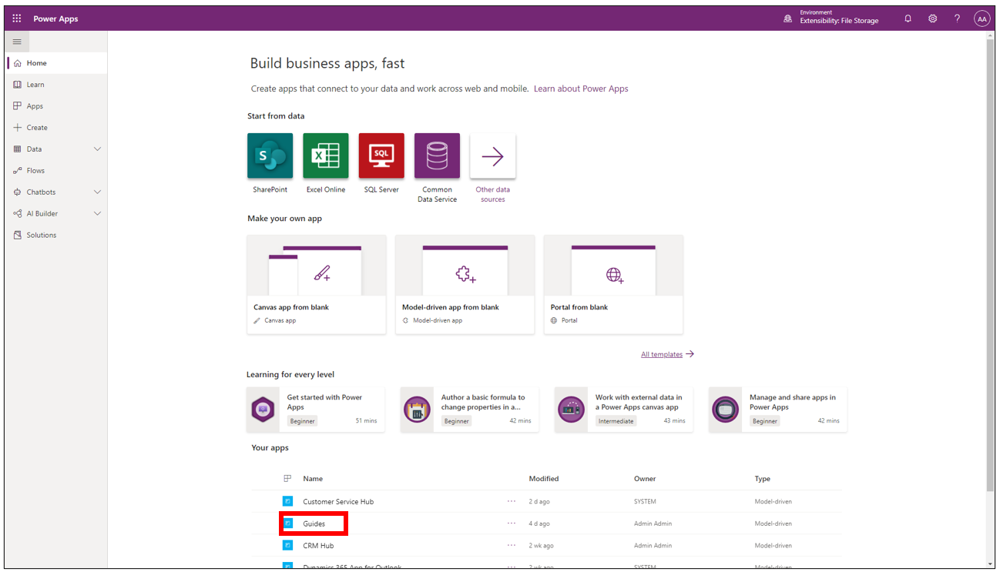
 
4.	In the **Guides** screen, in the left pane under **Library**, select a type of content, and then verify that the number in the **Schema Version** column is **1**. 
    
     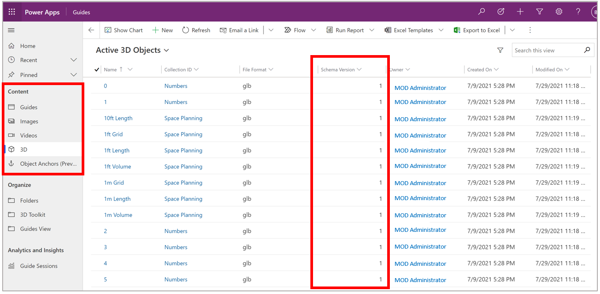
 
5.	To find content that hasn’t been upgraded successfully: 

    a. Select the arrow next to **Schema Version**, and then select **Filter by**.
    
      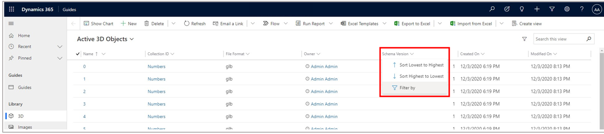
 
    b. In the **Filter by** list, select **Does not equal**, enter **1** in the field below, and then select **Apply**. 
    
      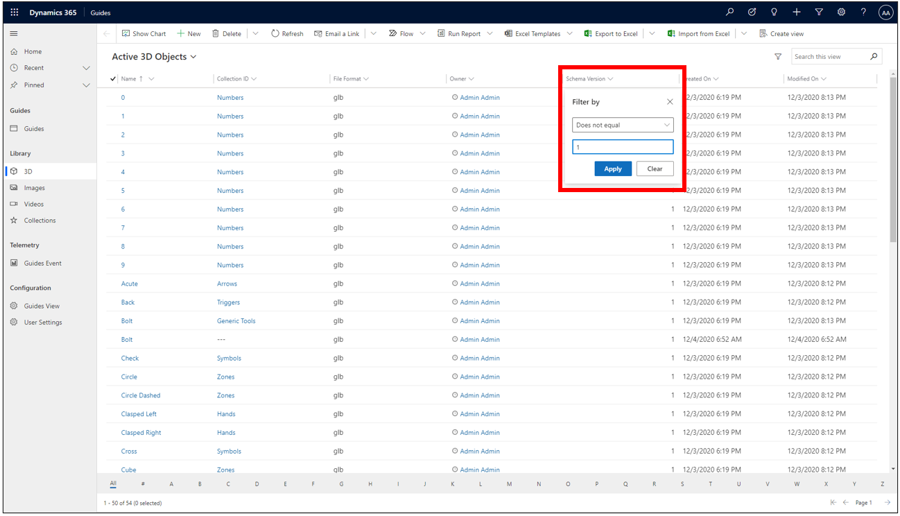

    c. Look for rows in the **Schema Version** column that haven’t been converted. They will either have a **0** or three dashes (**---**). 
    
      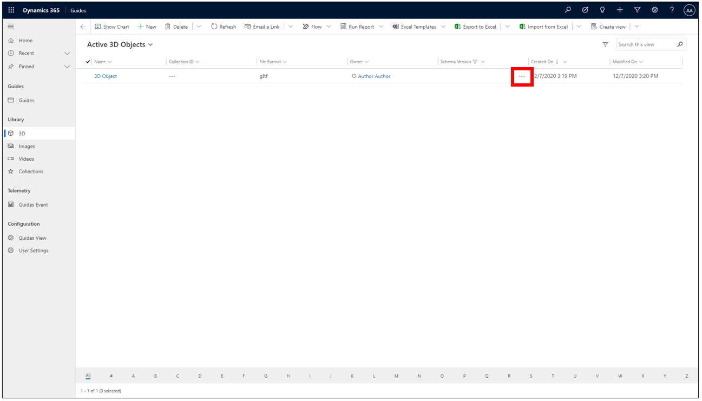
 
6.	To upgrade the content to the new content schema version: 

    a. Select the rows for any items you want to convert. 
    
    b. In the command bar at the top of the screen, select **Flow**, and then select **Upgrade 3D Object Schema**. 
    
     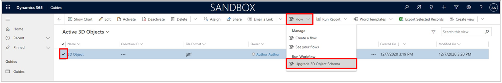
 
7.	In the **Confirm Application of Workflow** dialog box, select **OK**. 

     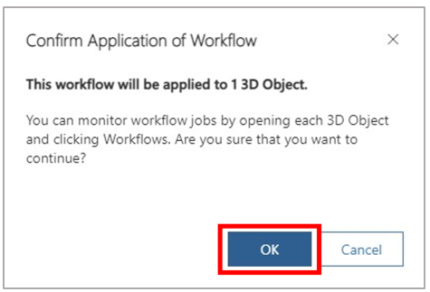
 
8.	To verify the successful conversion of the 3D object, select the arrow next to **Schema Version**, and then select **Clear filter**. 

     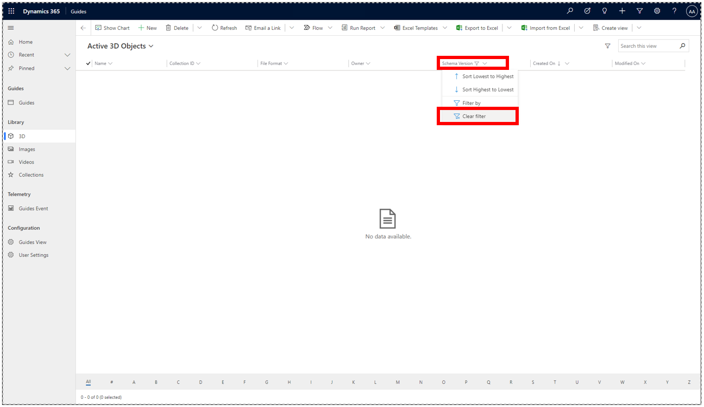
 
    The newly converted row will have a **1** in the **Schema Version** column. 
 
     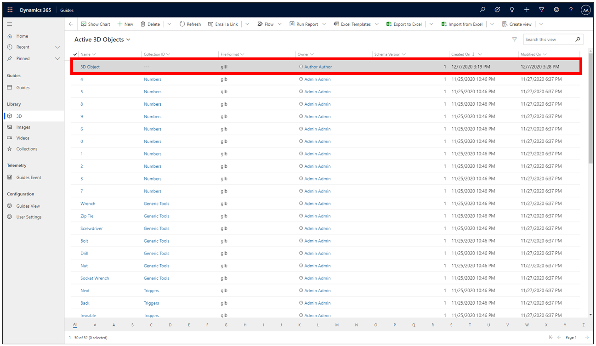

9. Repeat this process for each type of content: images, videos, and 3D objects. 

## See also

[What's new in Dynamics 365 Guides](new.md)

[!INCLUDE[footer-include](../includes/footer-banner.md)]