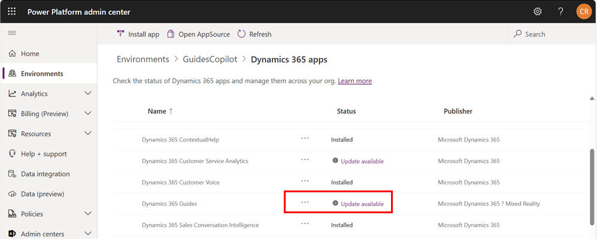

# Update the Dynamics 365 Guides solution

Some releases of Microsoft Dynamics 365 Guides require an update to the Dynamics 365 Guides solution. When an update is required, a notification displays in the **What's new** panel.

> [!IMPORTANT]
> The following prerequisites must be met before upgrading the Dynamics 365 Guides solution.

## Prerequisites

- You have a [System Administrator security group role](/power-platform/admin/database-security) and an [assigned Guides license](./add-users.md).

- The Dynamics 365 Guides PC and HoloLens apps are updated to the latest version from the Microsoft Store.

- The Dynamics 365 Guides model-driven app, PC app, and HoloLens app aren't in use.

- [Make sure that you back up your environment](/power-platform/admin/backup-restore-environments).

## Update the solution

1. Go to the [Power Platform admin center](https://admin.powerplatform.microsoft.com/environments), and sign in using the System Administrator security role permissions for Guides.

1. Select the environment: select **Resources**, and then select **Dynamics 365 apps**.

1. Next to **Dynamics 365 Guides** update available, select the ellipsis (&hellip;), and then select **Update**.

     
  
1. In the dialog box that appears, select the **I agree to the terms of service** check box, and then select **Update**.  

> [!NOTE]
> You can go to the [solution history page to see details about solution installations](/power-apps/maker/data-platform/solution-history).

## Microsoft platforms and Guides

<!--- Dave checking to see if Core Service Scheduling needs to be referenced --->

[!INCLUDE [microsoft-platforms](../includes/microsoft-platforms-dependency.md)]

## Next steps

[What's new in Dynamics 365 Guides](new.md)

[!INCLUDE[footer-include](../includes/footer-banner.md)]
