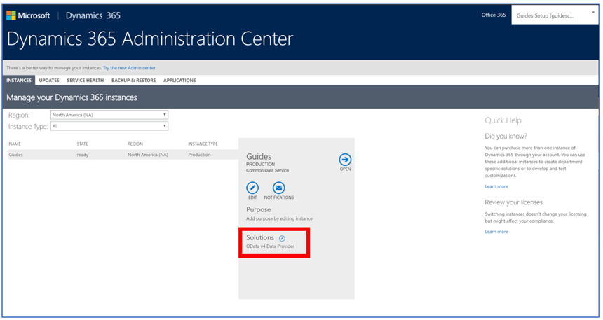

# Upgrade the Dynamics 365 Guides solution (for admins)

This topic is for Dynamics 365 administrators. Some releases of Dynamics 365 Guides require an update to the Dynamics 365 Guides solution. When an update is required, the user will see a notification in the **What's new** panel.

> [!IMPORTANT]
> Keep the following in mind:  - Before updating your Dynamics 365 Guides solution in the Dynamics 365 Admin center, make sure that the Guides PC and HoloLens apps have been updated to the latest version from the store.  - Updates to the solution must be done when the PC and HoloLens apps are not in use.  

To upgrade the solution:

1. Go to the [Dynamics 365 administration center](https://port.crm.dynamics.com/G/Instances/InstancePicker.aspx), and then sign in with 
your administrator credentials (the credentials you created when you signed up for the Dynamics 365 Guides preview, if 
you created a new environment). 

2. Select the **Instances** tab, and then choose an instance that has the Dynamics 365 Guides solution installed.

3. Select the small edit button next to **Solutions** to see the list of solutions. 
 
   
 
4. In the list of solutions, select **Dynamics 365 Guides (Preview)**, and then select **Upgrade**.  
 
   
   
5. Review the Terms of service, and then select **Accept** if you're ready to start the upgrade. 

   The status of the solution changes to **Installation pending,** and then changes to **Installed** when the upgrade is complete. 
 
For more information on upgrading a Dynamics 365 solution, [see Install, update, or remove a preferred solution](https://docs.microsoft.com/dynamics365/customer-engagement/admin/install-remove-preferred-solution).
