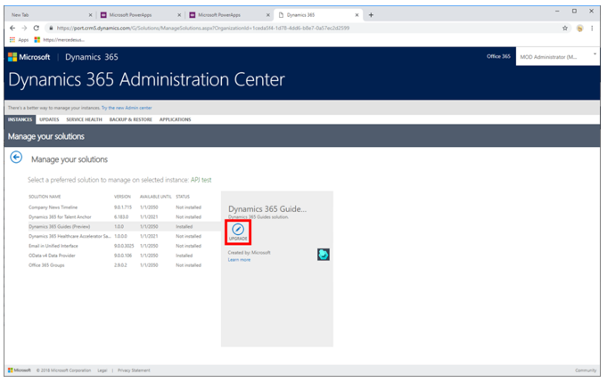
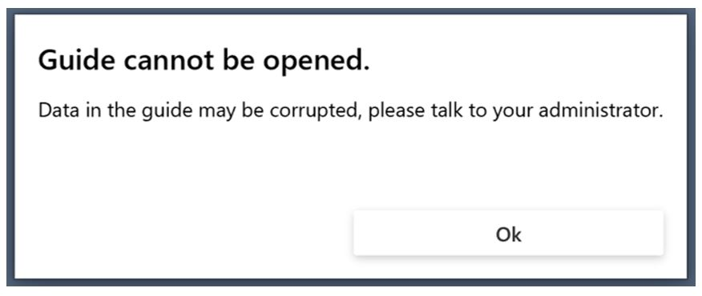

# Upgrade the Dynamics 365 Guides solution

This topic is for [!include[cc-microsoft](../includes/cc-microsoft.md)] [!include[pn-dyn-365](../includes/pn-dyn-365.md)] administrators. Some releases of [!include[pn-dyn-365-guides](../includes/pn-dyn-365-guides.md)] require an update to the [!include[pn-dyn-365-guides](../includes/pn-dyn-365-guides.md)] solution. When an update is required, the user will see a notification in the **What's new** panel.

Keep the following in mind:

- Before you update the solution in the Power Platform admin center, make sure that the [!include[pn-dyn-365-guides](../includes/pn-dyn-365-guides.md)] PC and [!include[pn-hololens](../includes/pn-hololens.md)] apps have been updated to the latest version from the [!include[cc-microsoft](../includes/cc-microsoft.md)] Store.

- Updates to the solution must be done when the PC and [!include[pn-hololens](../includes/pn-hololens.md)] apps are not in use.  

> [!IMPORTANT]
> If you're currently using the public preview version of [!include[pn-dyn-365-guides](../includes/pn-dyn-365-guides.md)], to get the October 2019 release, you'll need to search for the [!include[pn-dyn-365-guides](../includes/pn-dyn-365-guides.md)] solution, and then select **Install** instead of **Upgrade**. This installs the general availability (GA) version of the solution and removes the public preview solution. For more information, see [Transition from public preview to GA](public-preview-transition.md).

To upgrade the solution:

1. Go to the [Power Platform admin center](https://admin.powerplatform.microsoft.com/environments) and sign in with the user credentials that have admin permissions for [!include[pn-dyn-365-guides](../includes/pn-dyn-365-guides.md)]. 

2. To select the environment, select the check mark, select the **More environment actions** (three dots) button, and then select **Manage Solutions**. 

   

3. Select **[!include[pn-dyn-365-guides](../includes/pn-dyn-365-guides.md)]** in the list of solutions, and then select **Upgrade**.
 
      
  
4. Review the Terms of service, and then select **Accept** if you're ready to start the upgrade. 

   The status of the solution changes to **Installation pending,** and then changes to **Installed** when the upgrade is complete. 
   
## Troubleshooting: Manually update the schema for the April 28, 2020 release

As a part of the April 28, 2020 release, all your guides should automatically be converted from schema v3 to v4 as a part of the Dynamics 365 Guides solution update. Schema v4 allows Dynamics 365 Guides content to be stored in entities instead of inside a single JavaScript Object Notation (JSON) file so that you can take advantage of the Common Data Service Web API and Microsoft Power Platform functionality using Dynamics 365 Guides content.

In rare cases, the conversion of a guide from schema v3 to v4 may be unsuccessful, due to reasons including, but not limited to:

- A guide was being authored in the PC or HoloLens app when the solution was being updated.

- The JSON file has been edited in a way that was not supported (for example, the guide doesn’t have a task, or too many 3D parts have been added to the Step Editor bin).

If a guide wasn’t converted successfully, authors or operators will see this error message when they try to open it: “Guide cannot be opened”. 

 

 
For more information about upgrading a [!include[pn-dyn-365](../includes/pn-dyn-365.md)] solution, [see Install, update, or remove a preferred solution](https://docs.microsoft.com/dynamics365/customer-engagement/admin/install-remove-preferred-solution).
