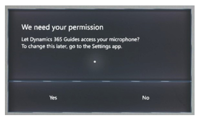
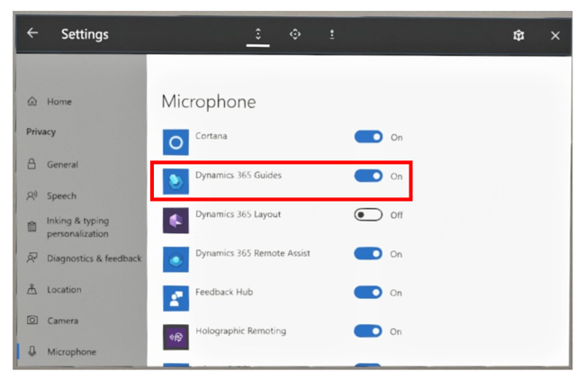

# Use voice commands on HoloLens 2 in Dynamics 365 Guides

You can use voice commands in Microsoft Dynamics 365 Guides as a form of input instead of hand gestures or gaze. Most voice commands 
are contextual; they only work in certain areas of the user interface.  

>[!NOTE]
> Voice commands are not supported on HoloLens 1. For HoloLens 2, voice commands are supported in the following languages: English, Spanish, German, Dutch, French, Italian, 
Japanese, Korean and Chinese. The voice commands you use are consistent with the HoloLens OS display language. To view your display language, go to 
**Settings** > **Time and Language** > **Language**. 

## Provide permission for Dynamics 365 Guides to use the microphone

When you first install Dynamics 365 Guides, the app asks for permission to use the microphone.

Voice commands won't work unless you provide this permission. If you didn't provide this permission when you installed the app, you 
can change them in **Settings** > **Privacy** >, **Microphone**.

## Voice commands

The following table lists the voice commands you can use on HoloLens 2.

|To do this|Say this|On screen|Notes
|---------------------|---------------------------|-------------------------------------------|--------------------------------------|
|Select **Operate** mode|Operate|Select Mode||
|Select **Author** mode|Author|Select Mode||
|Go to the next step|Next step|Step Card||
|Go to the previous step|Go back|Step Card||
|Turn off visibility of 3D parts|Hide 3D parts|Step Card|Requires visible 3D parts to be placed in a step|
|Turn on visibility of 3D parts|Show 3D parts|Step Card|Requires that the 3D parts in the step be hidden|
|Go to your profile|Go to profile|Step Card||
|Go to Settings|Go to settings|Step Card||
|Open the task list|Got to task list|Step Card||
|Go to the anchor step|Re-anchor guide|Step Card||
|Turn on **Follow** mode for instruction card|Follow me|Step Card|**Follow** mode for instruction card must be off|
|Turn off **Follow** mode for instruction card|Place here|Step Card|**Follow** mode for instruction card must be on|
|Exit the guide|Exit guide|Step Card||
|Scroll up the list|Scroll up|Guides List/Task List||
|Scroll down the list|Scroll down|Guides List/Task List||
|Close the window|Close window|Profile/Settings/Task List||

 
