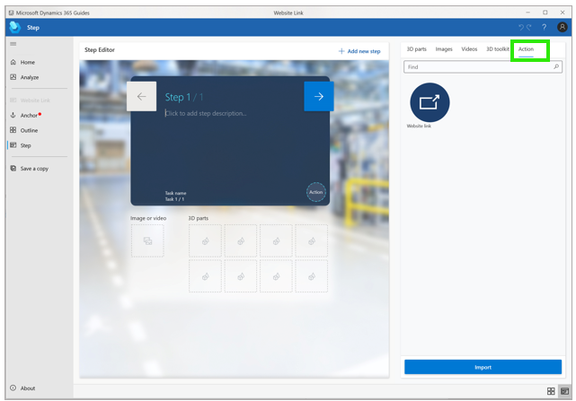
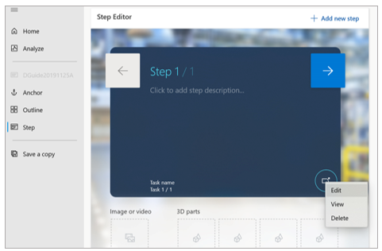

# Add a website or Power Apps link to a guide in Dynamics 365 Guides

You can use the **Actions** tab in the PC app in Microsoft Dynamics 365 Guides to add a website link or a Power Apps link to a Step card.

- **Website link.** Add a website link to a step so that operators can see and interact with information outside of [!include[pn-dyn-365-guides](../includes/pn-dyn-365-guides.md)]. For example, you might want to provide a link to a parts diagram, parts inventory system, analytics dashboard, or information about Internet of Things (IoT) sensors. Website links let authors create a seamless workflow for operators.

- **Power Apps link.** [Power Apps](https://products.office.com/en-us/business/microsoft-powerapps) enables teams to create custom 
applications with low-code tools to solve unique business workflows. By combining Dynamics 365 Guides and Power Apps, you can extend 
Guides capabilities to create a more seamless end-to-end solution that fits the needs of your operators. For example, you can add a 
link to an interactive quiz app, a parts re-ordering app, or an app that provides the latest status on IoT sensors.  

>[!NOTE]
>Operators need a [Power Apps license](https://powerapps.microsoft.com/en-us/pricing/) to run Power Apps from Dynamics 365 Guides. 
Operators must also have [permission](https://docs.microsoft.com/en-us/powerapps/maker/canvas-apps/share-app#share-an-app) to view the app created in Power Apps.

## Add a website link to a step

You can add a single website link to each step.

1. On the right side of the page, select the **Action** tab.

    
 
2. Drag the **Website link** symbol to the **Action** circle in the lower-right corner of the Step card.

    

3. In the **Website link** dialog box, enter a valid URL that begins with **http://** or **https://**, and then select **Save**.

    

4. To view, edit, or delete the link, right-click the **Website link** button in the **Step Editor**.

    

## Add a Power Apps link to a step

Adding a PowerApps link requires two steps:

- Copy the Power Apps link

- Add the link to a step in the PC app

### Copy the Power Apps link

You can link to a published app created in Power Apps if you have edit permissions for that app. 

1.	Go to https://make.powerapps.com.

2.	Select **More Commands (…)** next to the appropriate app, and then select **Edit**.

     SCREEN SHOT GOES HERE
 
3.	In the left pane, select **File**, and then select **Share**. 

     SCREEN SHOT GOES HERE
 
4.	Select the **Share** button.

     SCREEN SHOT GOES HERE 

5.	When the new window opens, select **Cancel** on the bottom right.

     SCREEN SHOT GOES HERE 

6.	Copy the URL displayed under **Web link**. 

### Add a Power Apps link to a step 

When you add a Power Apps link to a step, you add an action to the step. You can add one action per step. 
If the step already includes an action, adding a Power Apps action overwrites the existing action.

1.	Open the PC Authoring app, go to the appropriate step, and then select the **Action** tab.

     SCREEN SHOT GOES HERE

2.	Drag the **Power Apps** graphic to the **Action** circle in the lower-right corner of the Step card.

     SCREEN SHOT GOES HERE

3.	In the **Power Apps** dialog box, paste the Power Apps link, and then select **Save**.

     SCREEN SHOT GOES HERE

4.	To view, edit, or delete the Power Apps link, right-click the **Power Apps** button in the Step card.

     SCREEN SHOT GOES HERE
     
## See also

[Open a website from the Step card (for operators)[() 
[Launch an app created in Power Apps from the Step card (for operators)]()

 
