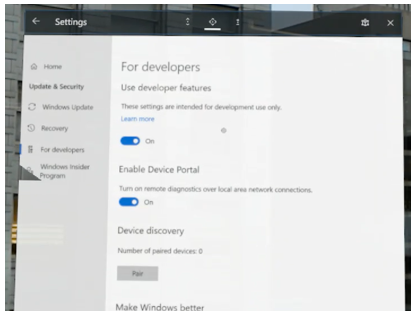
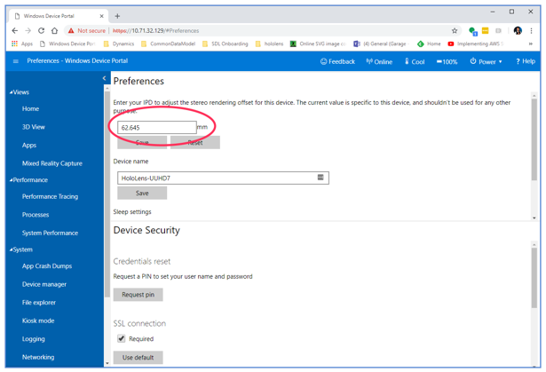

# Use the Windows Device Portal to streamline HoloLens calibration

[!INCLUDE [cc-beta-prerelease-disclaimer](../includes/cc-beta-prerelease-disclaimer.md)]
 
You can use the Windows Device Portal to configure and manage Microsoft HoloLens remotely with Wi-Fi or USB. The Windows Device Portal is a web server on HoloLens that you can connect to from a web browser on your PC. The portal includes many tools that help you manage your HoloLens. The portal also offers a fast way to update interpupillary distance settings (IPDs) when switching users on HoloLens. Updating an IPD via the portal takes about **2 seconds**. Updating the IPD by recalibrating HoloLens takes about **2 minutes**.

To use the portal:

1. Get your IPD by calibrating the HoloLens device. 

2. Write your IPD down.

3. Enter it in the portal every time you switch users on HoloLens. 

## Set up your HoloLens to use the Windows Device Portal

Before accessing the Windows Device Portal, you need to set it up on HoloLens:

1.	Put on your HoloLens device and turn on the power.

2.	Do the bloom gesture to open the **Start** menu.

3.	Gaze at the **Settings** tile, and then do an air tap to select it. Do a second air tap to place the app in your environment. This starts the Settings app.

4.	Select the **Update** menu item.

5.	Select the **For developers** menu item.

6.	Turn on **Developer Mode**.

7.	Scroll down and turn on **Enable Device Portal**.

    
 
## Connect with Wi-Fi

1.	[Connect your HoloLens to Wi-Fi](https://docs.microsoft.com/windows/mixed-reality/connecting-to-wi-fi-on-hololens).

2.	Look up your device's IP address.

    - To find the IP address on the device, go to **Settings > Network & Internet > Wi-Fi > Advanced Options**.
    
    - To find the IP address from a web browser on your PC, go to https://<your_HoloLens_IP_address>.
    
      The browser displays the following message: "There’s a problem with this website’s security certificate." This happens because the certificate issued to the Device Portal is a test certificate. You can ignore this error for now.

      This takes you to the Windows Device Portal. Then you can set the IPD using the procedure later in this topic.

## Connect with USB

1.	[Install the tools](https://docs.microsoft.com/windows/mixed-reality/install-the-tools) to make sure you have Visual Studio Update 1 with the Windows 10 developer tools installed on your PC. This enables USB connectivity.

2.	Connect your HoloLens device to your PC with a micro-USB cable.

3.	From a web browser on your PC, go to [http://127.0.0.1:10080](http://127.0.0.1:10080).

    This takes you to the Windows Device Portal. Then you can set the IPD using the procedure in the next topic.

## Use the Windows Device Portal to update your IPD

Now you’re ready to change the IPD settings for the device using the Windows Device Portal. To obtain your IPD for the first time:

1.	In the Windows Device Portal, go to **System > Preferences**. 

    You’ll see your IPD if you were the person that did the HoloLens calibration.

2.	Write the number down. In the future, whenever you need to change the IPD settings on the device, sign in to the device, go to the Windows Device Portal, and then change the IPD information in this same field. 

    
 
> [!TIP]
> Consider keeping a shared file with all your team members’ IPDs, or have users memorize their IPD. 

[!INCLUDE[footer-include](../includes/footer-banner.md)]