# Workflow example 2: Create a Dynamics 365 Guides 3D object collection and add objects to the collection

In this workflow example, we’ll use Microsoft Power Automate to create a Dynamics 365 Guides 3D object collection. 3D object collections appear as categories (Arrows, Generic Tools, and so on) in the Dynamics 365 Guides 3d toolkit. You can use Power Automate to create a new category for your 3D objects, and then add objects to the collection through the Dynamics 365 Guides model-driven app.

 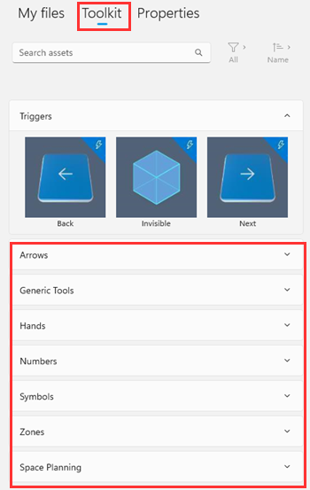
 
**Estimated time to create this workflow:** 10 minutes

## Create a 3D object collection in Power Automate

1. Sign in to [Power Automate](https://us.flow.microsoft.com/en-us/) with the same account that you want to create the 3D object collection in.

2. Select **Create**, and then select **Instant cloud flow** to create a new flow.

    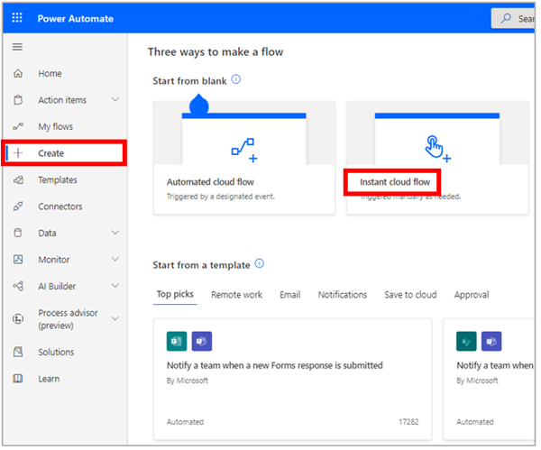
 
    > [!NOTE]
    > You can also set this flow up to trigger automatically, for example, when a record is updated. 
    
3. Give your flow a name, select **Manually trigger a flow**, and then select **Create**. 

    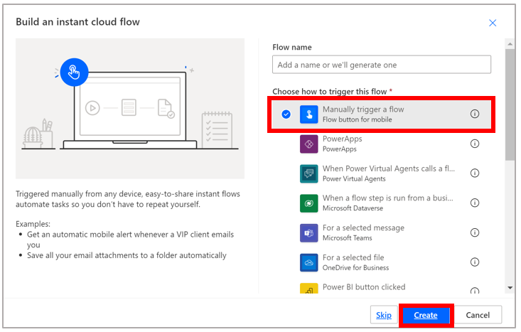
 
4. Select **New step**, and then select the **Add a new row** action.

    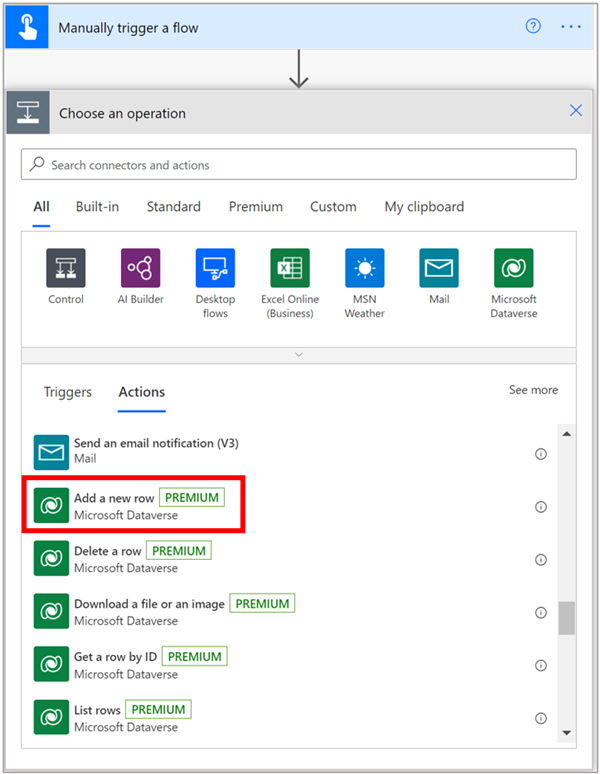
 
    > [!TIP]
    > You can filter the list of Common Data Service actions by selecting the **Common Data Service** button.
    
5. In the **Add a new row** screen, in the **Table name** field, select **3D Object Collections**, enter a name for your new collection in the **Name** field, and then select **Show advanced options** to see all the fields related to adding a new row.

    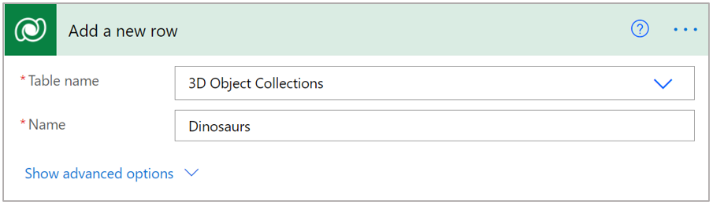
 
6. To get the value for the **Parent ID** field for the new collection, go to the Guides model-driven app, select **Collections**, and then select one of the existing object collections. For example, select the **Arrows** collection.

    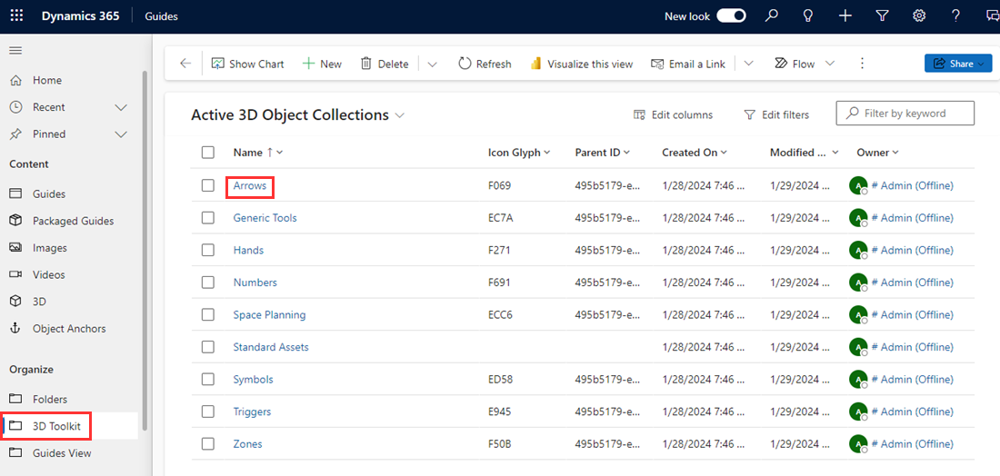
 
7. Copy the value in the **Parent ID** field. 

    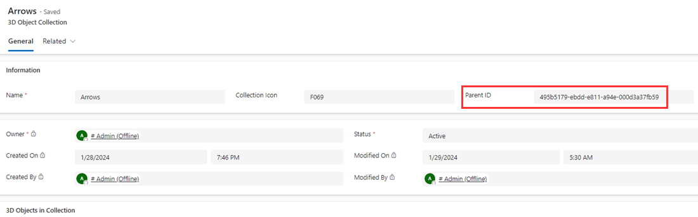
 
8. In the **Add a new row** screen, paste the copied text into the **Parent ID** field.

    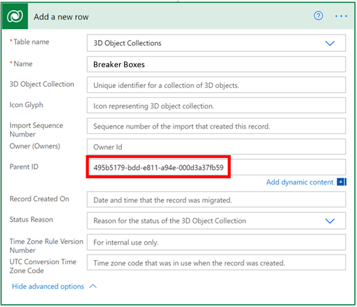
 
9. Fill out other fields in the **Add a new row** screen as follows:

    |Field| Selection|
    |-----------------------------------|-----------------------------------------------|
    |**Record Created On** |**Timestamp.** You can select this value from the dynamic list after placing your cursor in the field. This sets the **Created On** field in the model-driven app.|
    |**Status Reason**| **Active.** ???Add info from Shirley here???|

    The completed Add a new row screen looks like this:
    
    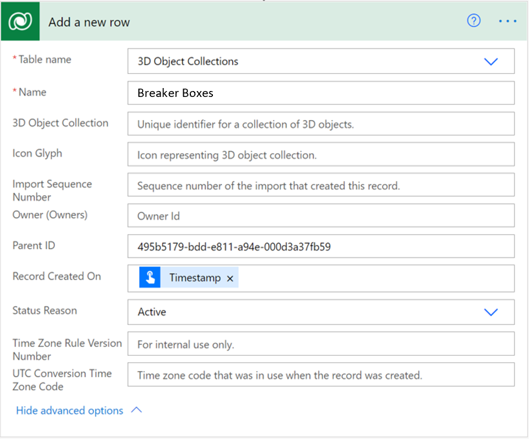
 
10. Select **Save** in the upper-right corner of the screen.

11. To test the flow, in the upper-right corner of the screen, select **Test**, select **Manually**, and then select **Test**. 

    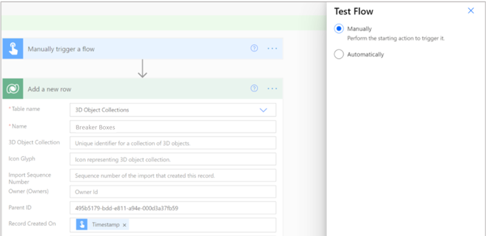
 
12. In the **Run flow** pane, select **Run flow**. 

    If your flow is successful, you’ll see the new category in the **Active 3D Object Collections** screen in the model-driven app.  
    
    

## Add an object to the new 3D object collection

You can add new objects to the collection directly in the model driven-app.

1. Select **Collections**, and then select the new collection.
	
2. In the lower-right corner of the screen, select **Add Existing 3D Object**.

    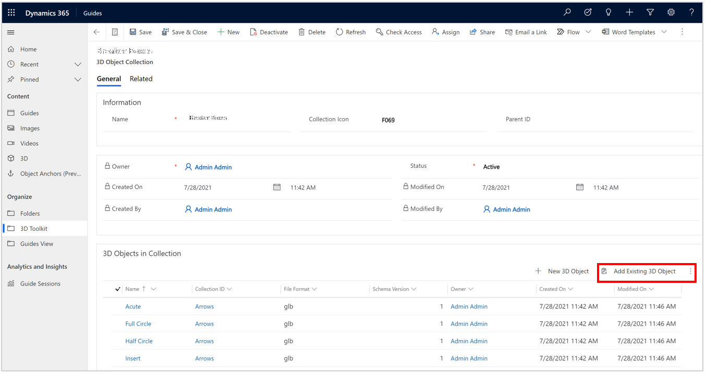
 
3. Use the search box to find the 3D object you want to add to the collection or select it from the **Recent records** list, and then select **Add**. 

    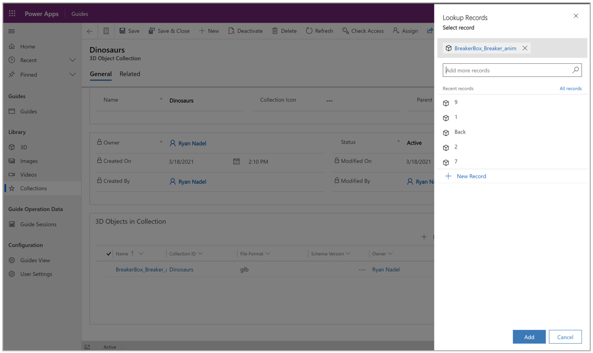
 
    Now when you open the 3d toolkit in the PC app, you’ll see your new 3D object collection and the newly associated object. 
    
    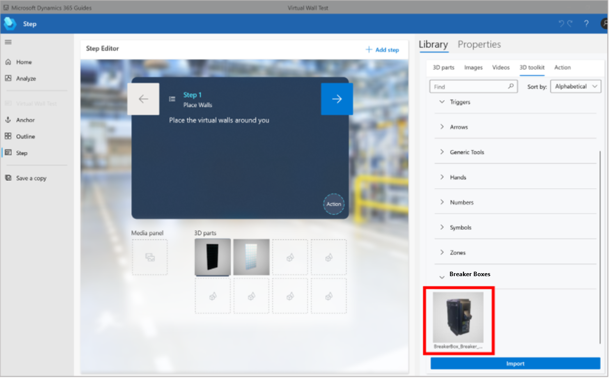
 
## Idea for further customization

You could create a Power Automate flow that automatically adds any new 3D objects uploaded by users on your team to a 3D object collection.

