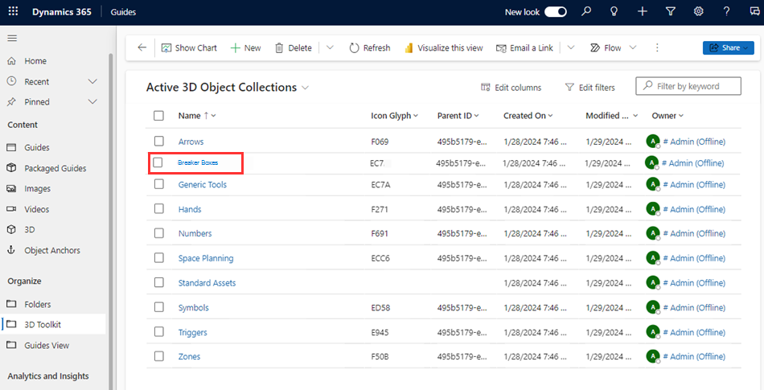

# Workflow example 2: Create a Dynamics 365 Guides 3D object collection and add objects to the collection

In this workflow example, we’ll use Microsoft Power Automate to create a Microsoft Dynamics 365 Guides 3D object collection. 3D object collections appear as categories (such as **Arrows** or **Generic Tools**) in the Dynamics 365 Guides toolkit. Use Power Automate to create a new category for your 3D objects, and then add objects to the collection through the Guides model-driven app.

 

In this example you'll learn how to:

- Get the Parent ID for a 3D object collection

- Use the Parent ID when adding a new record in Power Automate

- Use the Guides model-driven app to add an object

**Estimated time to create the 3D object collection:** 10 minutes

## Prerequisites

- Environment Maker role in Power Platform

## Create a 3D object collection in Power Automate

1. Sign in to [Power Automate](https://us.flow.microsoft.com/en-us/) with the same account that you want to create the 3D object collection in.

1. Select **Create**, and then select **Instant cloud flow** to create a new flow.

    > [!NOTE]
    > You can also set this flow up to trigger automatically, for example, when a record is updated.

1. Give your flow a name, select **Manually trigger a flow**, and then select **Create**.

    

1. Select **+** > **Add an action**, and then select the **Add a new row** action.

    > [!TIP]
    > You can filter the list of Microsoft Dataverse actions by selecting the **Microsoft Dataverse** button.

1. In the **Add a new row** trigger, in the **Table name** field, select **3D Object Collections**, enter a name for your new collection in the **Name** field, and then select **Show advanced options** to see all the fields related to adding a new row.

1. To get the value for the **Parent ID** field for the new collection, go to the [Guides model-driven app](open-model-driven-app.md), select **Toolkit**, and then select one of the existing object collections. For example, select the **Arrows** collection.

    

1. Copy the value in the **Parent ID** field.

1. In the **Add a new row** trigger in Power Automate, paste the copied text into the **Parent ID** field.

1. Fill out other fields in the **Add a new row** screen:

    |Field| Selection|
    |-----------------------------------|-----------------------------------------------|
    |**Record Created On** |**Timestamp.** Select this value from the dynamic list after placing your cursor in the field. This sets the **Created On** field in the model-driven app.|
    |**Status Reason**| **Active.** Dataverse tables should be set to active unless otherwise noted.|

1. Select **Save** in the upper-right corner of the screen.

1. To test the flow, in the upper-right corner of the screen, select **Test**, select **Manually**, and then select **Test**. 

1. In the **Run flow** pane, select **Run flow**.

    If your flow is successful, you’ll see the new category in the **Active 3D Object Collections** screen in the model-driven app.  

    

## Add an object to the new 3D object collection

1. [Open the Guides model-driven app](open-model-driven-app.md).

1. Select **Toolkit**, and then select the new collection.

1. In the lower-right corner of the screen, select **Add Existing 3D Object**.

    

1. Use the search box to find the 3D object you want to add to the collection or select it from the **Recent records** list, and then select **Add**.

   Now when you open the toolkit in the PC app, you’ll see your new 3D object collection and the newly associated object.

   

> [!TIP]
> For further customization, create a Power Automate flow that automatically adds any new 3D objects uploaded by users on your team to a 3D object collection.
