# Workflow example 3: Collect response data for a non-linear guide created in Dynamics 365 Guides

If you have created a [non-linear (branching) guide](pc-app-branching.md) in Microsoft Dynamics 365 Guides, you can collect the data on which responses are selected by the operator. For example, you might have a non-linear guide that provides three choices, based on a gauge temperature reading. 

 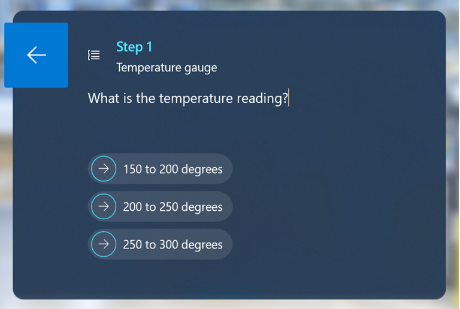

You can count the number of times the Step Id for each response is selected to know how often a particular issue occurs. 

> [!NOTE]
> You must have the Environment Maker role (Power Platform) to create a Microsoft Power Automate flow.

## What you’ll learn in this example

- Find the Step Id for a response step

- Export a guide's event data to Microsoft Excel and match it to Step Id data 

- Set up a condition in Microsoft Power Automate to export the event data for a guide to a particular column in a Microsoft Excel spreadsheet

**Estimated time to complete:** 10 minutes for either workflow solution

## Two ways to collect response data

You can collect response data in two different ways:

- After the guide event (response selection) has been executed 

- In real time with Microsoft Power Automate as the event is executed
 
You’ll need to get the Step Id for each response step, regardless of which method you choose. This example shows you how to get the Step Id and how to use the Step Id for either scenario.

## Get the Step Id for a response step

You can use the Guides model-driven app to get the Step Id for a response step.

1. Go to [make.powerapps.com](https://make.powerapps.com). 

2. Select **Apps**, and then select **Guides**.

     
  
3. Select the appropriate guide in the list. 

     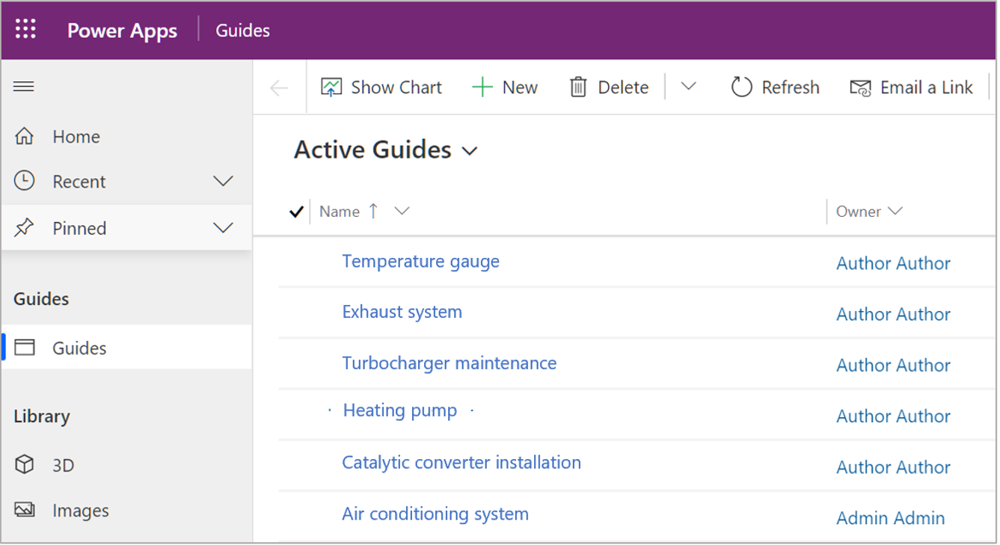
  
4. Select the **Steps** entity to display the step information for the guide. 

    For this example, we have a question step and three response steps.

     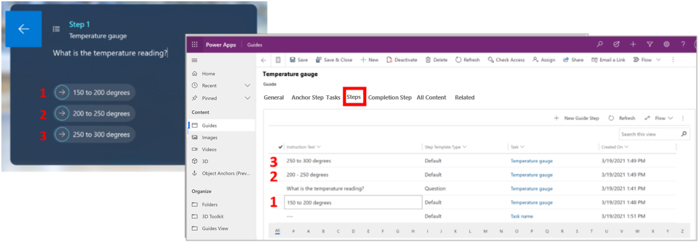
 
    To get the Step Id for a response step, double-click the step in the model-driven app. The Step Id appears at the end of the page url in the resulting screen.

     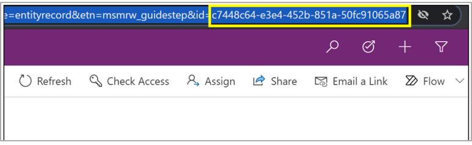
  
## Collect response data after the event has been executed

1. Copy the Step Id for each response step into an Excel spreadsheet. The spreadsheet will look something like this when you’re done:
 
    
 
2. Use the model-driven app to export the guide event data. To do this:

    1. Go to [powerapps.com](https://make.powerapps.com) and select the appropriate instance.

    2. In the left navigation pane, select **Data**, and then select **Tables**.

       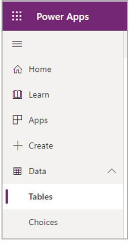
       
    3. On the right side of the screen, change the view to **All** to view all tables.

       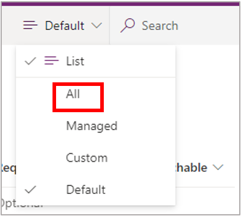
       
    4. Select the **Guide Session Step Visit** table.

       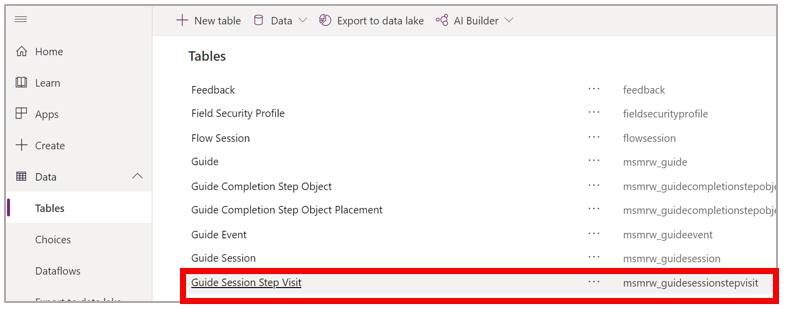
       
    5. At the top of the screen, select **Data**, and then select **Export data**.

       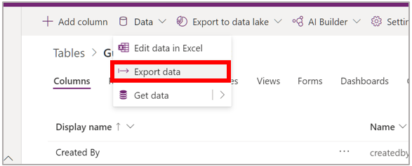
       
       The Step Id information is in column R of the Excel spreadsheet.

       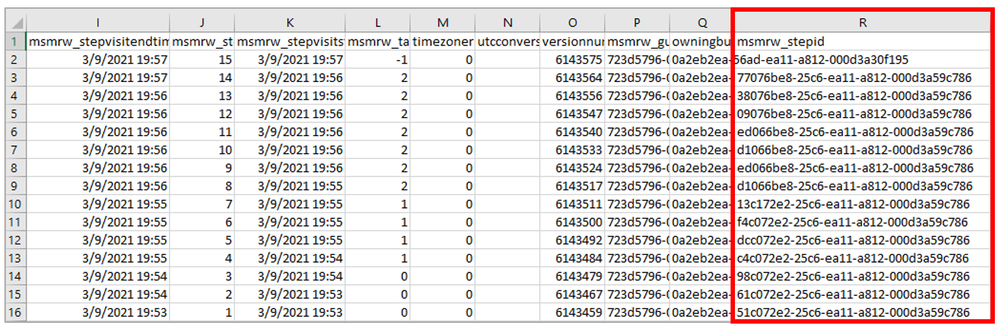
 
3. Parse the **Step Id** column in the exported spreadsheet to check for the Step Id's. For example, the following Excel formula compares the event data in the exported **Guide Session Step Visit** spreadsheet to the Step Ids copied in the first step of this procedure. The formula returns a 1 if it matches an ID or a 0 if it doesn’t.

    =IF(ISNUMBER(SEARCH(B$2,'Guide Session Step Visit'!R2)),1,0) 
 
    The parsed and summed spreadsheet data looks something like this.
 
    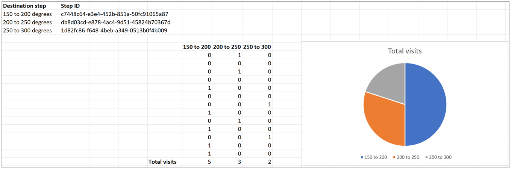

## Collect response data in real time by using Power Automate

Collecting response data in real time by using Power Automate requires four steps:

1. Create an Excel spreadsheet with the appropriate columns

2. Create a Power Automate flow that:

    - Is triggered when the guide event is created (when a user selects a response step)

    - Sets a condition for the guide event **Step Id** field that contains the Step Id 

    - Writes the date to the Excel spreadsheet 
 
### Create the spreadsheet

1. Create an Excel spreadsheet with columns that match your response steps and a column to record the date/time the response was selected. For example, for the temperature gauge guide, the spreadsheet would include these four columns: 

    - Date 

    - 150 to 200 degrees

    - 200 to 250 degrees

    - 250 to 300 degrees

2. After creating the columns, select them, and then select **Insert > Table**. You'll populate this table with the Power Automate flow.

   

### Create the flow

1. Sign in to [Power Automate](https://nam06.safelinks.protection.outlook.com/?url=https%3A%2F%2Fus.flow.microsoft.com%2F&data=04%7C01%7Cv-bholmes%40microsoft.com%7C73759d057d0d49141b2e08d8e3556327%7C72f988bf86f141af91ab2d7cd011db47%7C1%7C0%7C637509303168916711%7CUnknown%7CTWFpbGZsb3d8eyJWIjoiMC4wLjAwMDAiLCJQIjoiV2luMzIiLCJBTiI6Ik1haWwiLCJXVCI6Mn0%3D%7C1000&sdata=hiyg2fP9dF9NgBKNX4e9afLf44Th4vWPaIpAoxW9qfs%3D&reserved=0).
	
2. Select **Create**, and then select **Automated cloud flow**.

    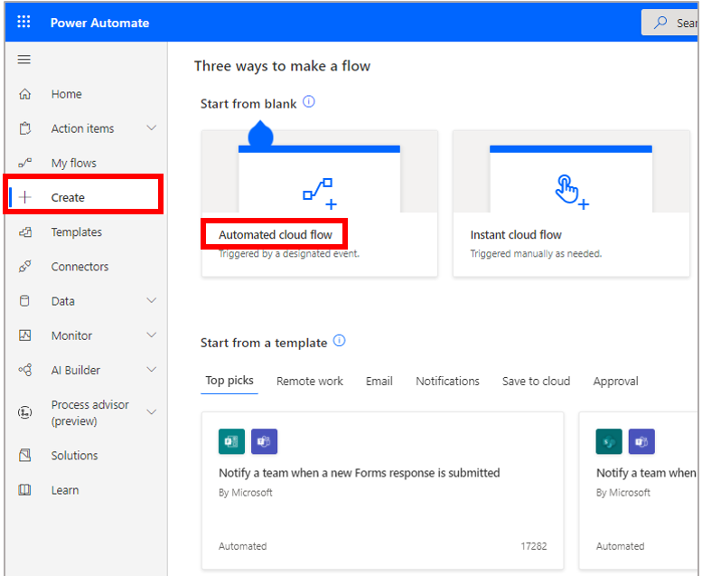
 
3. Give your flow a name, select the **When a row is added, modified, or deleted** trigger, and then select **Create**.

    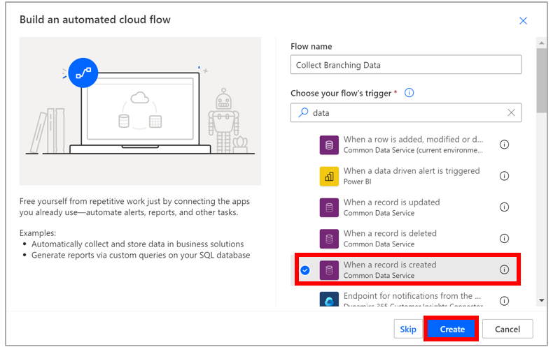
 
    > [!TIP]
    > You can filter the list of triggers to just the Microsoft Dataverse triggers by entering the word **data** in the **Choose your flow’s trigger** box.

4. In the **When a row is added, modified or deleted** trigger:

    1. In the **Change type** field, select **Create**.

    2. In the **Table name** field, select **Guide Session Step Visits**.

    3. Select a scope. 
 
    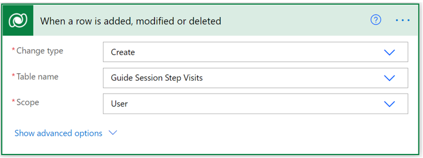
    
5. Select **New step**, and then select **Condition**.

    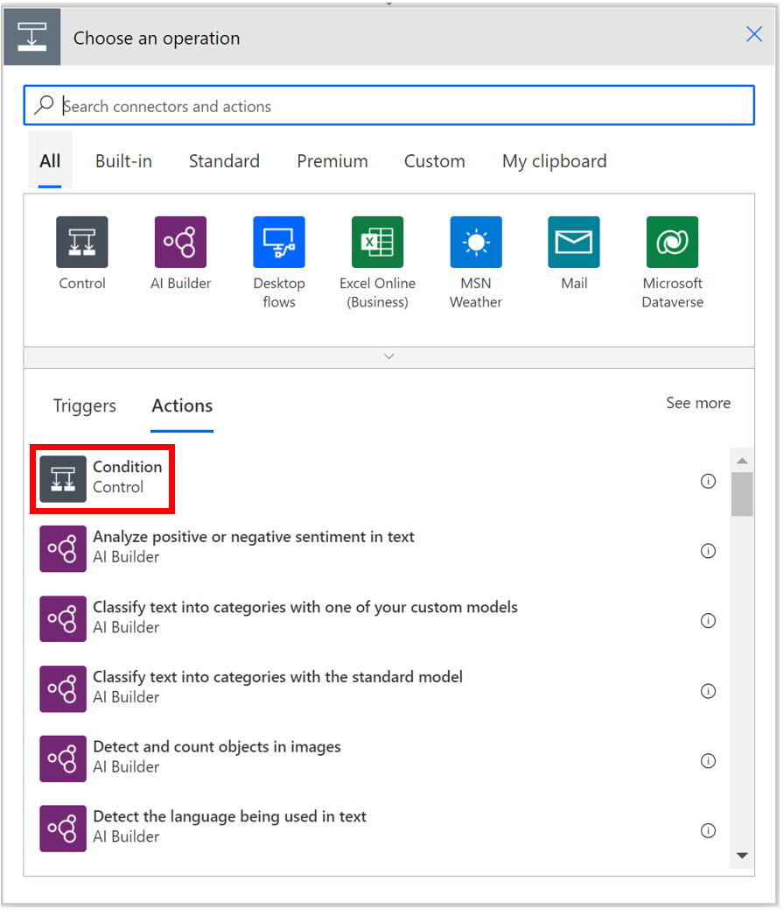

6. Create a condition where the **Step Id** field **contains** one of the response Step Ids. 

    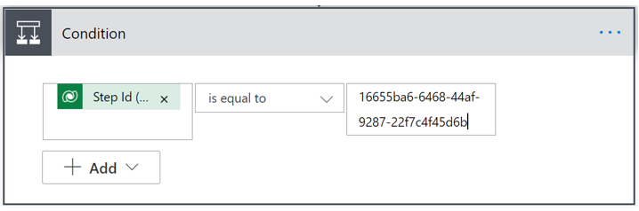
 
7. In the **If yes** box for the condition, select the **Excel Online (Business)** category, and then select the **Add a row into a table** action.

    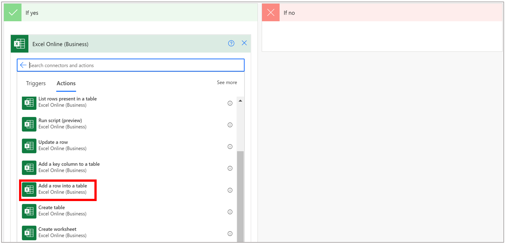

8. Fill out the fields for the **Add a row into a table** action. For example, for the temperature gauge guide, select/enter the following data.

    |Field|	Value|Description|
    |---------------------------|------------------------------|------------------------------------|
    |**Location**|	OneDrive for Business	| Cloud location for the file. You can select OneDrive for Business or a SharePoint site.
    |**Document Library**	|OneDrive	|The library for the cloud location|
    |**File**	|**Guides Response Data.xlxs**|The name of your Excel file|
    |**Table**|	**Table 1**|The table that you created in Microsoft Excel|
    |**Date**|	**Created On** field (you can select this value dynamically after you place the cursor in the field)	|Records the date and time when the selection was made in the guide|
    |**150 to 200 degrees**|1	|Column in the Excel spreadsheet. Enter a **1** if the column aligns with the Step Id in the condition or a **0** if it doesn’t.|
    |**200 to 250 degrees**|0	|Column in the Excel spreadsheet. Enter a **1** if the column aligns with the Step Id in the condition or a **0** if it doesn’t.|
    |**250 to 300 degrees**|0	|Column in the Excel spreadsheet. Enter a **1** if the column aligns with the Step Id in the condition or a **0** if it doesn’t.|

    The following screen shot shows the fields filled in for the Temperature gauge guide. 

    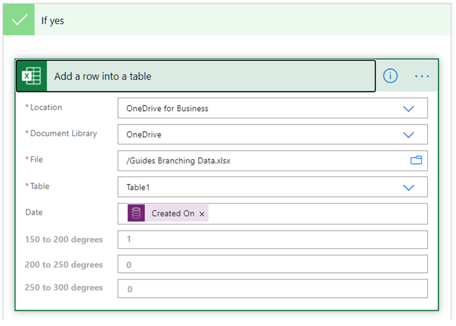
 
    This condition gets the Step Id for the **150 to 200 degrees** step and puts a 1 in the **150 to 200** column in the Excel spreadsheet when the **Step Id** field contains that Step Id.
 
    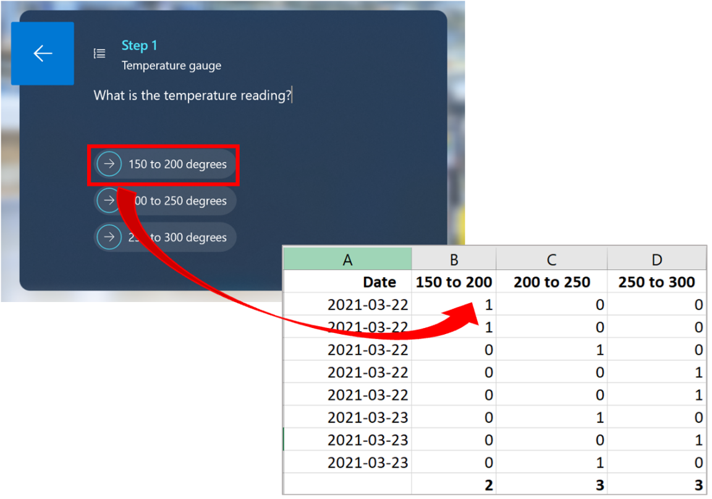
 
    You can then tabulate, graph, and analyze the data in Excel.
    
9. Repeat steps 5 through 8 for the two other response Step Ids. 

### Test the flow

1. Select **Save** in the upper-right corner of the screen.

2. To test the flow, in the upper-right corner of the screen, select **Test**, select **Manually**, and then select **Test**. 

3. In the **Run flow** pane, select **Run flow**. 

