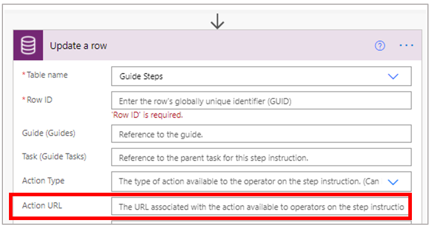
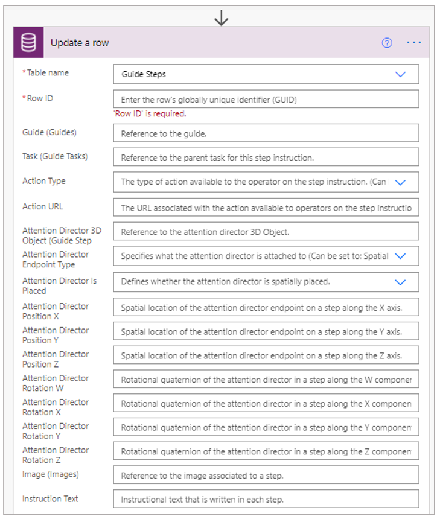

# Overview of workflow examples for Dynamics 365 Guides

When an author creates a guide using the PC and HoloLens apps, all the data required for that guide (instruction text, images, videos, and 3D parts) is stored in the Microsoft Dataverse. Having all of the data available in the Dataverse makes it easy to access that data to create workflow integrations using Microsoft Power Automate or other Microsoft applications.

You might want to use Microsoft Power Automate to:

    - **Work around a limitation.** For example, let’s say that you want to add a link to a step. The Dynamics 365 Guides PC app requires that any url that you enter starts with https:, but you may have a business scenario that requires a url that doesn’t start with https: (for example, a guide stored on a local service). You could use Power Automate as a workaround by choosing the Update a row action and filling out the Action URL option.

 
    - **Automate a process.** For example, let’s say that you create guides focused on car maintenance. If you need to add a new car model, rather than making the updates manually through the PC and HoloLens apps, you can make all the changes at once through Power Automate.

 
## Example workflows

To get an idea for the types of workflows that you can create with Guides and Power Automate, check out these examples:

- [Example 1](workflow-example-1.md)

- [Example 2](workflow-example-2.md)

- [Example 3](workflow-example-3.md)
