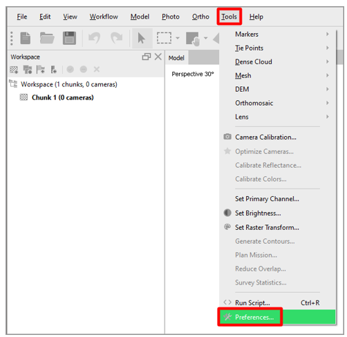
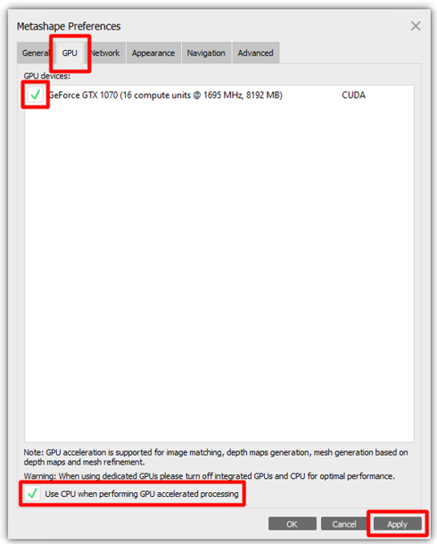
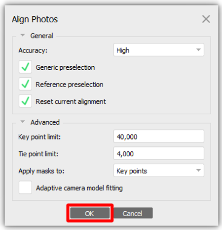
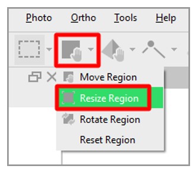
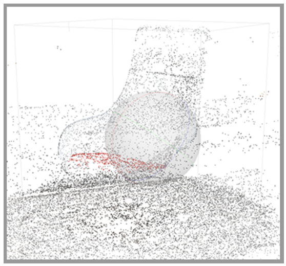
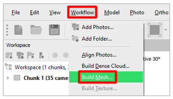
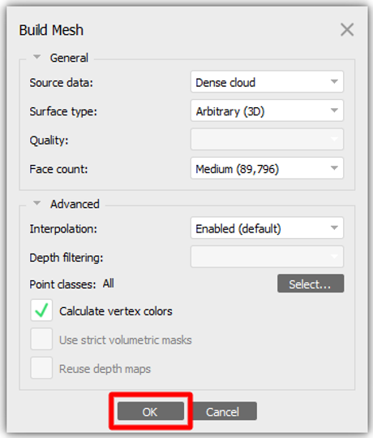
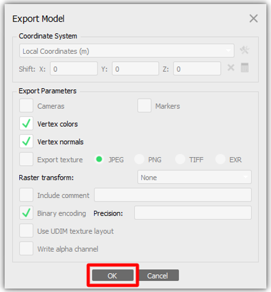
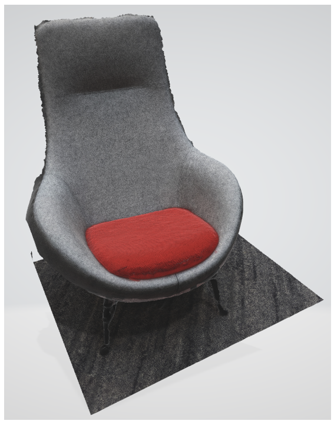

# Use Agisoft Metashape to create 3D models for use in Microsoft Dynamics 365 mixed-reality applications

This tutorial walks you through the process of using Agisoft Metashape photogrammetry software to create a 3D model that can be 
used in Microsoft Dynamics 365 mixed-reality applications.

This document is created strictly for informative purposes to demonstrate how Agisoft Metashape works with Microsoft Dynamics 365 
mixed-reality applications. Microsoft Corporation is not affiliated with, is not a partner to, and does not endorse or sponsor 
Agisoft or any of Agisoft’s products.

## What is Agisoft Metashape?

Agisoft Metashape is a stand-alone software product that photogrammetrically processes digital images and generates 3D spatial 
data for use in Geographic Information System (GIS) applications, cultural heritage documentation, visual effects production, and indirect measurements of objects of various scales. [Learn more about Agisoft Metashape](https://www.agisoft.com/).

## Photography tips

The following tips will help you take quality photos for photogrammetry:

- If possible, take photos in a location where lighting is consistent and doesn't cast shadows.

- Try to keep your own shadow out of the picture.

- Avoid moving objects in the background while taking photos.

- If the camera you're using has a High Dynamic Range (HDR) setting, turn this feature off and try not to adjust the exposure of your photographs while capturing images.

- Take pictures about 1 meter apart while circling the object.

- If it is possible, maintain a perpendicular location to the subject while taking photos.

- If the subject is large, move in a lateral motion from one end of the object to the other, changing the height with each pass until 
you feel you've captured all surfaces.

## Set preferences

For the most part, you can use the default preferences, but there are a few changes to make before getting started.

1. On the **Tools** menu, select **Preferences**.

     

2. On the **General** tab, under **Miscellaneous**, select the **Write log to file** check box, and then enter a location and filename for your log. Select **Apply** when you're done.

    
 
3. On the **GPU** tab, select the check box for any graphics processing units (GPUs) that you have available for processing. If you only have one GPU available, at the bottom of the dialog box, select the **Use CPU when performing GPU accelerated processing** check box. Select **Apply** when you're done.

    
 
4. On the **Advanced** tab, under **Miscellaneous**, select the **Enable fine-level subdivision** and **Enable VBO support** check boxes. If the camera you're using has extensive meta data about location, orientation, and so on, you might want to experiment with the options in the **Export/Import** section. Select **OK** to apply and close the **Preferences** dialog box.

    

## Import photos

Now that our environment preferences are set up, we can begin adding the photos that will be used to construct our 3D model.

To do this, navigate to **Workflow** > **Add Photos** and select the photos that you would like to import.

    
 
## Mask photos

When determining what aspects of your photographs you would like to turn into a 3D model it can be helpful to mask the 3D object.  You may find it beneficial to do this in pictures from different angles.  While it is not necessary to mask your object in every single photo, the more photographs you mask, the more accurate the final result will be.

1.	To add a mask, double-click an image to open it and choose a selection tool such as the “intelligent scissors” and outline the subject you wish to turn into a 3D model.

    
 
2.	Once you have your model outlined, press the **Add Selection** button to create the mask.

    
 
Repeat this step from multiple angles to get a higher quality output.

    

## Align photos

Photogrammetry uses objects that are consistently present in multiple images to create a map of where it thinks the camera was when the photo was taken.  This process is done in the **Align photos** step.

1.	Navigate to **Workflow** > **Align Photos** to open the Align photos menu.

    
 
2.	Once the menu is open you can set your preferences.  Start with the default settings shown below, but feel free to change them to your desired settings.  Once you have your desired settings, click **OK**.

    
 
3.	When you navigate back to the **Model** tab and examine the outcome of your photo alignment it should look like similar to this.

    
 
## Align the region

Now that the photos are all aligned, use the bounding box to trim the size of our 3D object.

1.	Select the **Resize Region** tool from the toolbar.

    
 
2.	Click and drag the spheres at the edge of the region to select only the area that you wish to convert into a 3D model.

    
 
While this step is not required, it can help speed up the next few steps.

## Build dense point cloud

With our photos and point-clouds set up, you can build the dense point cloud.

1.	Navigate to **Workflow** > **Build Dense Cloud** to access the settings menu.

    
 
2.	Begin with the following settings.  If you have a powerful computer, or a lot of downtime, then you can use the **High** quality setting, but for many operations a quality setting of **Medium** will produce quality results.  Once you have your preferences set, click **OK**.

    

## Build mesh

Now that our dense cloud has been built, lets create our mesh.

1.	Navigate to **Workflow** > **Build Mesh** to access the build mesh settings menu.

    
 
2.	Start with the following options selected.  Depending on platform you are aiming to use this 3D model on, you may want to change the face count to match the platform requirements.  Some guidelines to those platforms can be found [here](https://docs.microsoft.com/en-us/dynamics365/mixed-reality/import-tool/optimize-models#performance-targets).

    
 
Click **OK** to build your mesh.

Your point cloud has now been converted to a 3D model.  Examine the results, if you are satisfied with the outcome you can skip from here to export.  If you desire a higher level of detail on the surfaces, then follow the “Build Texture” workflow in the next step.  If you are unhappy with the quality of the shape of the object, you may want to return to the mask photos stage and add more masks to the areas that are missing details.

## Build texture

Adding a texture map to your 3D model can significantly increase the fidelity while maintaining performance.  This step is optional and if you would like you can skip this step and go directly to exporting the 3D model.  If you would like to add a texture, follow the steps below.

1.	Navigate to **Workflow** > **Build Texture** to open the settings menu.

    

2.	You can leave these options at their default values, however you may want to consider reducing the texture size depending on what platform you are aiming to use this model on.  Click **OK** to generate the texture.

    

## Export 3D model

Now that we have created a 3D model that meets are performance and fidelity needs we can export it to the .glb format for use in Microsoft Dynamics 365 Mixed Reality applications.

1.	Navigate to **File** > **Export** > **Export Model** and choose a name and location for the 3D model.

    

2.	Select .glb as the export file type and click **Save**.

    
 
3.	This will open the **Export Model** settings menu.  You can leave the majority of these options as default, but we suggest using .png for the texture.

    
 
Congratulations, you have now created a high-fidelity 3D model from your photos using photogrammetry.

    
 
## View your 3D models in Microsoft Dynamics 365 Mixed Reality Applications

Now that you have prepared your 3d models, you can use the following Microsoft Dynamics 365 experiences to view your 3d model in mixed reality:

[Dynamics 365 Product Visualize](https://docs.microsoft.com/dynamics365/mixed-reality/product-visualize/admin-guide#add-a-model)

[Dynamics 365 Guides](https://docs.microsoft.com/dynamics365/mixed-reality/guides/)

## More information

Several screenshots in this document were taken from the Agisoft Metashape software program in order to provide clear instructions on how to use Agisoft’s software.

You can find more information on Agisoft Metashape here:

[Agisoft_Metashape](https://www.agisoft.com/)

The Microsoft Corporation is not responsible for, and expressly disclaims all liability for damages of any kind arising out of the use of Agisoft Metashape, or reliance on these instructions. This document is created only to provide general information to our customers and does not take into consideration any individualized business plans or specifications.

The use in this document of trademarked names and images is strictly for informative and descriptive purposes, and no commercial claim to their use, or suggestion of sponsorship or endorsement, is made by the Microsoft Corporation. 

 

 

