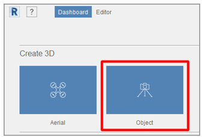
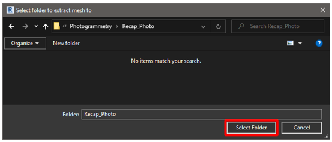
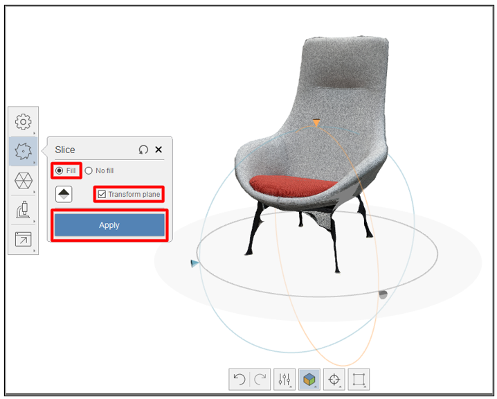
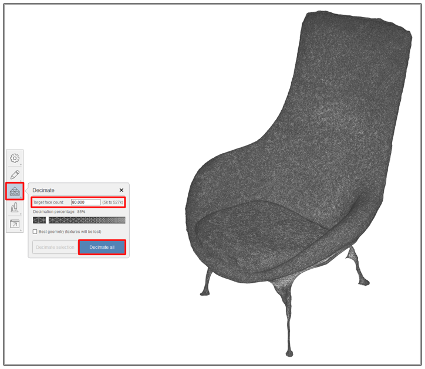
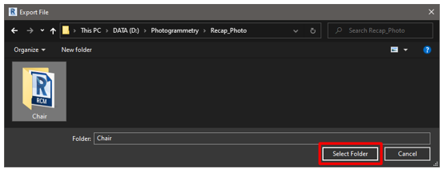
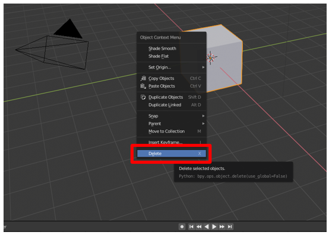
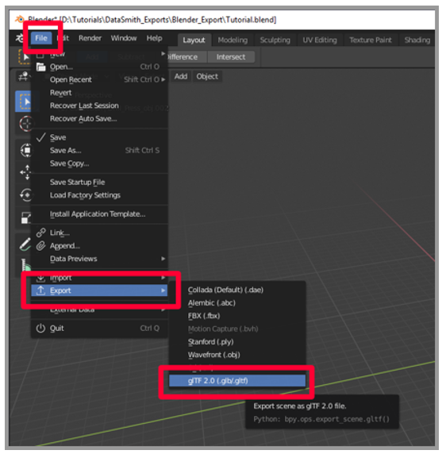
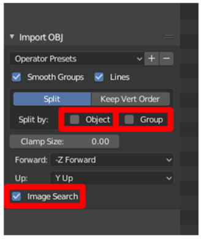
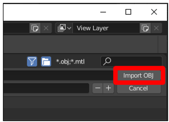
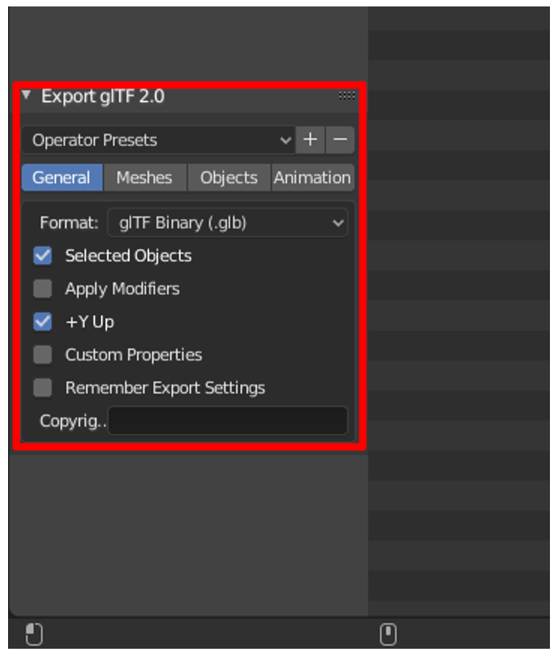

# Use Autodesk Recap Photo to create 3D models for Dynamics 365 mixed-reality applications

This tutorial walks you through the process of using Autodesk Recap Photo photogrammetry software to create 3D models that 
can be used with Microsoft Dynamics 365 mixed-reality applications.

This tutorial is created strictly for informative purposes to demonstrate how Recap Photo works with Microsoft Dynamics 365 
mixed-reality applications. Microsoft Corporation is not affiliated with, is not a partner to, and does not endorse or sponsor 
Autodesk or any of Autodesk’s products.

## What is Autodesk Recap Photo?

Autodesk Recap Photo processes photographs taken from drones to create 3D representations of current conditions of sites, objects, 
and more. [Learn more about Autodesk Recap Photo](https://www.autodesk.com/products/recap/overview).

## Photography tips

The following tips will help you take quality photos for photogrammetry:

- If possible, take photos in a location where lighting is consistent and does not cast shadows.

- Try to keep your own shadow out of the picture.

- Avoid moving objects in the background while taking photos.

- If the camera you're using has a High Dynamic Range (HDR) setting, turn this feature off and try not to adjust the exposure of your photographs while capturing images.

- Take pictures about 1 meter apart while circling the subject.

- If possible, maintain a perpendicular location to the subject while taking photos.

- If the subject is large, move in a lateral motion from one end of the object to the other, changing the height with each pass 
until you feel you've captured all surfaces.

## Start a new project

After launching Autodesk Recap Photo, you'll see the dashboard. 

>[!NOTE]
>You can choose **Aerial** or **Object** to create a new 3D project. This tutorial covers the **Object** workflow.

1. Under **Create 3D**, select **Object**.
 
    

2.	In the screen that appears, click anywhere, as prompted, and then add the photos you want to use to create your 3D model. After importing the photos, select **Create**.

    
 
    You'll see the **Settings** menu for creating your photogrammetry project. You may want to use the Autocrop feature, but for this tutorial we will leave it unchecked and wait to crop the 3D model later.  
    
    >[!NOTE]
    >Recap Photo uses “cloud credits” to provide photogrammetry services. This section of the menu shows you how many cloud credits you have, and how many it takes to process your photographs. [Learn more about Autodesk cloud credits](https://aka.ms/autodesk_cloud_credits). 

3. Give your project a name, and then select **Start** to process your photos. This process will take time, based on the number of photos and your internet connection speed.

    
 
4.	After your 3D model has been processed, it appears in the **My Cloud Drive** section of the dashboard. Select the **Download 
this project from the cloud** button to download your 3D model.

    
 
5.	Choose a location to save your model to, and then select **Select Folder**.
 
    

6.	You'll see a new 3D model with the name you entered. Select the object to open it in the **Editor**.

    
 
    You'll see your 3D model loaded in the **Editor** window.
 
    

## Edit your 3D model

There are several tools on the left side and bottom of the editor interface that you can use to clean up your 3D model if it needs some work.  Explore these tools to clean up the parts of your 3D model that you do not wish to keep.  In this tutorial, we will demonstrate how to remove the floor from this 3D model.

1.	First remove as much of the floor as you can by selecting and deleting everything around the chair with the **Lasso / Fence** tool.

    
 
2.	Use the Lasso tool to select everything but the object you wish to keep. And then press Enter then Delete.  You may have to do this a few times but eventually you will have the majority of the floor removed.

    

3.	To remove the rest of the floor, select the **Slice and Fill** tool.  This will create a slicing plane that can be used to cut away geometry that is below a certain point.  Use the **Transform plane option** to align the plane so that the floor isn’t visible.  Use the **Fill** and **Transform plane** options and click **Apply**.

    
 
This will remove the rest of the floor from your 3D model and fill the mesh on the bottom.

## Decimate your 3D model to increase performance

Now that we have our removed the parts of our mesh we do not wish to keep, we can decimate the mesh to a polygon count that meets our performance needs for our given application.  See [suggested polygon counts and texture sizes](https://docs.microsoft.com/en-us/dynamics365/mixed-reality/import-tool/optimize-models#performance-targets).

1.	Select the **Decimate mesh** tool to access the decimation menu.

    
 
2.	Choose a polygon count that will produce a result that balances your visual fidelity and performance requirements.  Unless precise geometry is very important to you, we suggest that you do not check “Best Geometry” as it will remove your textures.  The textures produced with photogrammetry add significant detail to the 3d model.

    

You now have an 3D model with optimized geometry that is ready for export.

 
## Export the 3D model

Now that our 3D model has been optimized, we can export it into a format that can be converted to a .glb.

1.	Navigate to **Export** > **Export model** in the menu on the left to open the export settings.

    
 
2.	Choose **OBJ** as the export file type in the Advanced Panel, and then set the texture size to 4098x4098.  You can choose a larger or smaller texture size but be aware that this will affect either performance or fidelity.  Once you have your settings properly selected, click **Export**.  

    
 
3.	Choose a location to save your file and click **Select Folder**.

    
 
Your 3D model will now be exported to this folder.

## Convert to a GLB file with Blender

To use our 3D models with Microsoft Dynamics 365 Mixed Reality Applications, they must be in the .GLB format.  There are several DCC applications that can be used to complete this process.  For the purposes of this tutorial we will be using Blender.  

### What is Blender?

[Blender](https://www.blender.org/) is a free, open-source 3D creation suite. It supports the entirety of the 3D pipeline: modeling, rigging, animation, simulation, rendering, compositing and motion tracking, and video editing and game creation.

If Blender is the software that you decide to use to prepare your 3D models, review Blender's website and [download the most current stable version for Windows](https://www.blender.org/download/).

The following steps will show you how to import your OBJ 3D model file and export it out as a .GLB 3D model.

### Import your 3D model into Blender

1.	Launch Blender.  A new scene is automatically created.  Right-click the cube, and then select **Delete** to delete it.

    
 
2.	Select **File** > **Import** > **Wavefront (.obj)** to import the OBJ file.

    
 
3.	Under **Import OBJ**:

     a. Clear the **Object** and **Group** check boxes.  Select the **Image Search** check box.
   
      
 
     b. Select **Import OBJ** on the right side of the screen. This imports the 3D model as one item and searches in the subfolder for any materials.
   
      
 
Now that you have your 3D model imported into Blender, it’s an easy next step to Export it out as a GLB.

### Export your 3D model as a GLB file

The last step is to export the model to a GLB file so it can be used with Dynamics 365 mixed reality apps.

1.	In Blender, select **File** > **Export** > **glTF 2.0**.

     
 
2.	On the **Export** menu, make sure that the GLB format is selected and that the **Selected Objects** check box is selected. Name your file and select **glTF 2.0 (.glb/.gltf)**.

     

## View your 3D models in Microsoft Dynamics 365 mixed-reality applications

Now that you have prepared your 3d models, you can use the following Microsoft Dynamics 365 experiences to view your 3d model in mixed reality:

[Dynamics 365 Product Visualize](https://docs.microsoft.com/dynamics365/mixed-reality/product-visualize/admin-guide#add-a-model)
[Dynamics 365 Guides](https://docs.microsoft.com/dynamics365/mixed-reality/guides/)

## More information

Several screenshots in this document were taken from the Autodesk Recap Photo software program in order to provide clear instructions on how to use Autodesk’s software.

You can find more information on Autodesk Recap Photo and Blender here:

[Autodesk Recap Photo](https://www.autodesk.com/products/recap/overview)
[Blender](https://www.blender.org/)

The Microsoft Corporation is not responsible for, and expressly disclaims all liability for damages of any kind arising out of the use of Autodesk Recap Photo, or reliance on these instructions. This document is created only to provide general information to our customers and does not take into consideration any individualized business plans or specifications.

The use in this document of trademarked names and images is strictly for informative and descriptive purposes, and no commercial claim to their use, or suggestion of sponsorship or endorsement, is made by the Microsoft Corporation. 

 

