# Use Blender to prepare 3D models for use in Microsoft Dynamics 365 Mixed Reality applications

This tutorial provides step-by-step instructions that show you how to:

- Reduce the polygon count of a 3D model so that it matches the performance needs specific to the [performance targets for Dynamics 
365 Mixed Reality applications](https://docs.microsoft.com/dynamics365/mixed-reality/import-tool/optimize-models#performance-targets).

- Combine the 3D model’s multiple materials (colors) into a single texture that can be applied to the model.

- Export the optimized 3D model as a [GLB](https://docs.microsoft.com/dynamics365/mixed-reality/import-tool/#gltf-and-glb-file-formats) file that can be used in Dynamics 365 mixed reality applications.

The combination of reducing polygons and turning multiple materials into a single texture can transform a complex 3D model that 
is resource intensive, into a 3D model that performs well in mixed reality applications.

> [!IMPORTANT]
> This document is created strictly for informative purposes to demonstrate how Blender works with Microsoft Dynamics 365 Mixed Reality 
at Work applications. Your use of third-party applications is subject to terms between you and the third party.  
The Microsoft Corporation is not affiliated with, is not a partner to, and does not endorse or sponsor Blender or any of 
Blender’s products. [There are several other content-creation applications that can be used to prepare your 3D models](https://docs.microsoft.com/dynamics365/mixed-reality/import-tool/convert-models#tools-for-exporting-cad-models).

## What is Blender?

[Blender](https://www.blender.org/) is a free and open source 3D creation suite. It supports the entirety of the 3D pipeline: modeling, rigging, animation, simulation, rendering, compositing and motion tracking, and video editing and game creation. 

If Blender is the software that you decide to use to prepare your assets, review Blender’s website and download the most current stable version for Windows at [Blender](https://www.blender.org/download/).

## Overall steps for preparing a 3D model with Blender

Preparing a 3D for mixed reality with Blender includes the following steps:

1.	Import the model into Blender.

2.	Decimate the model.

3.	Unwrap the model (UV unwrapping).

4.	Assign materials.

5.	Bake the textures.

6.	Export the model.

## Import the model into Blender

1.	Open Blender. A new scene is automatically created.

2.	Right-click the cube and delete it.

    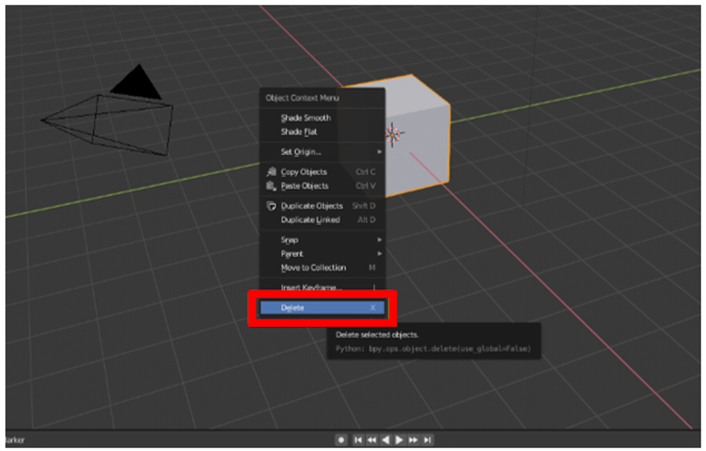 
 
3.	Select **File > Import > Wavefront (.obj)** to import the OBJ file. 

    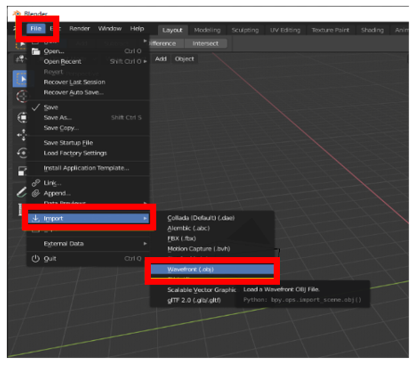

4.	Under **Import OBJ**:

    a. Make sure to clear the **Object** and **Group** check boxes and select the **Image Search** check box.

      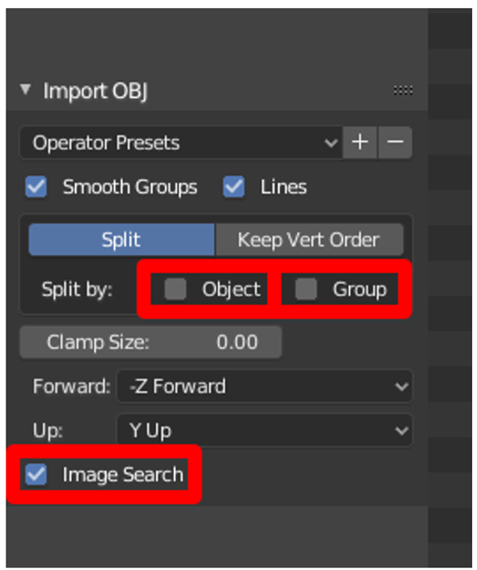
        
    b. Select **Import OBJ** on the right side of the screen. This imports the 3D model as one item and searches in the subfolder for any materials.

      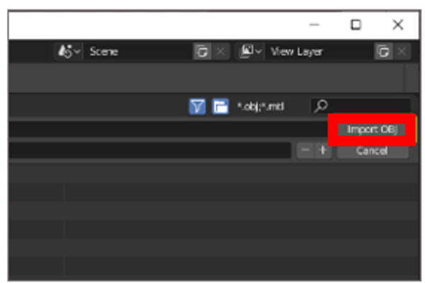
      
      > [!TIP]
      > If the 3D model is extremely large or small, hard to see, and possibly off screen, you can use the mouse wheel to zoom the camera in or out until it’s visible.
      
      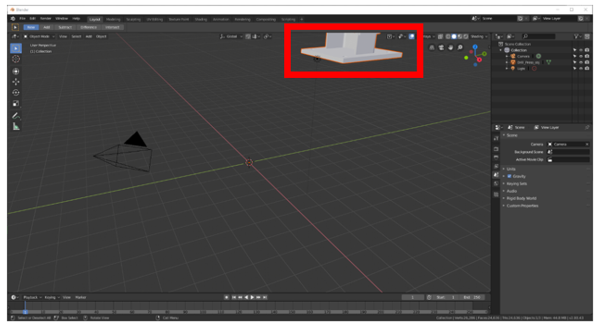      
      
      If the 3D model appears grey, select the **Look Dev** shading option to show the colors.
      
      
      
      You'll see the 3D model with the imported materials.
      
      The **Tris** count (number of polygons) is shown on the bottom right of the screen. 
      
      
      
      If this number falls in line with the [target resolution](https://docs.microsoft.com/dynamics365/mixed-reality/import-tool/optimize-models#performance-targets), you can skip the decimation step and go directly to the **UV Unwrapping** section of this tutorial. If not, continue to the next section and decimate the model.
      
## Decimate the model

To reach application-specific performance goals, you can decimate the model. Decimation is the process of recomputing the surface polygons of the model to create a similar shape with fewer polygons. This reduces visual fidelity but increases performance. The example images below show a high-fidelity model that can be used when you're viewing one or two 3D models at a time on HoloLens, and a low-quality 3D model used when you're viewing ten or more models at a time on HoloLens.

 

To decimate a model:

1.	Select the model, and then select the **Modifiers** menu  in the right tool column.

2.	On the **Modifiers** menu, in the **Add Modifier** list, select **Decimate**.

    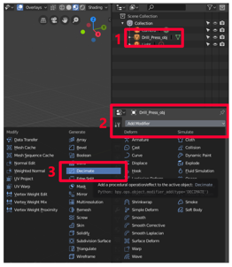 

3.	With your model selected, change the **Ratio** value to a number between 0.0 - 1.0. This setting determines the percentage of polygons (triangles) that are removed. For example, a value of 0.5 reduces the original polygon count to 50%. You’ll see the **Tris** value in the bottom right of the Blender window decrease as you change the ratio. When the number reaches a value that matches your performance goal and looks good, select **Apply**.

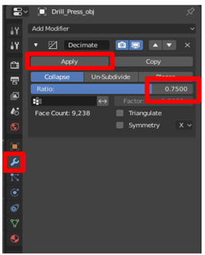 

## Unwrap the model (UV unwrapping)

You can skip this step if your model has only one color.

To visualize the concept of UV unwrapping, imagine cutting out every surface of a 3D model and placing those surfaces flat on a piece of paper. The U and V dimensions represent the vertical and horizontal axes of the piece of paper in the same way that X, Y, and Z represent the three-dimensional axes of a 3D model. Unwrapping the UVs enables you to paint the flattened pieces with the material colors of the model. This painted paper is called a texture, and it’s later wrapped back on top of the model, giving it the illusion of being made from different colored pieces, when it’s actually one item with a colorful texture wrapped around it. This process is called texture baking, which is covered later in this tutorial.  

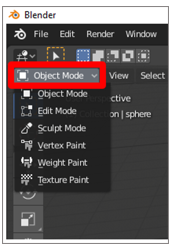 SCREENSHOT GOES HERE: blender-object-mode

To start the process:

1.	Select the model, hover the mouse cursor over the main menu, press **Tab** to enter **Edit Mode**, press **a** to select all, and then select **Smart UV Project** from the **UV** drop-down menu.

    > [!TIP]
    > Enter **Edit Mode** by selecting the **Mode** list in the upper left corner, or press the **Tab** key. Pressing **Tab** while already in **Edit Mode** returns you to **Object Mode**. 

    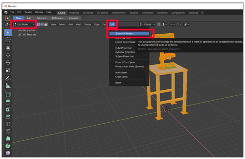 

2.	Keep the default settings for the properties, and then select **OK**.

    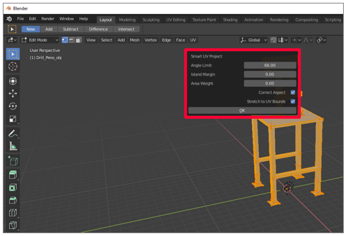 
    
3.	Make sure that you’re in **Edit Mode** (press **Tab**), and that the entire model is still selected (press **a**). When the entire model is selected, it's orange. 

4.	Select the **UV Editor** menu (or press Shift+F10).
  
     
    
5.	On the **UV** tab, select **Pack Islands**.

    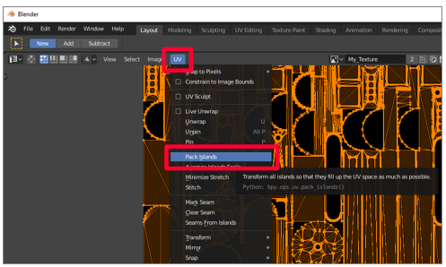 
    
    The outlined pieces are reorganized to represent the surface of the model as efficiently as possible. After packing the islands, the UVs look like this:
    
    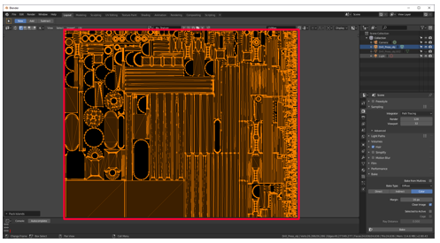 
    
6.	Create a copy of the mesh to bake the texture into. To do this:

    a. Select the model.
    
    b. Right-click the model to open the menu.
    
    c. Select **Duplicate Objects**.
    
    d. Press Spacebar.

    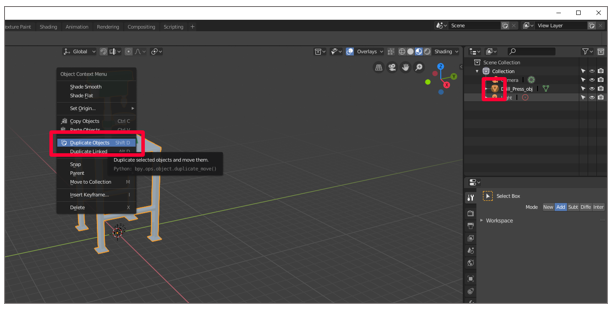 
    
 ## Prepare materials for texture baking
 
 1.	Select the duplicate model, and then go to the materials panel by selecting the Materials tab in the menu on the bottom right. SCREEN SHOT GOES HERE: blender-materials-tab
 
SCREENSHOT GOES HERE: blender-materials-tab-full-screen

2.	Delete all the materials for the duplicate 3D model by selecting the minus sign to the right of the materials  SCREEN SHOT GOES HERE: blender-minus-sign. 

SCREENSHOT GOES HERE: blender-minus-sign-full-screen

3.	To hide the original 3D model and show just the duplicate, select the eye to the right of the original 3D model’s name. Notice that there are no materials on the duplicate 3D model.

    SCREENSHOT GOES HERE: blender-select-eye

4.	Select the plus sign in the materials panel to add a new material to the duplicate.

    SCREENSHOT GOES HERE: blender-plus-sign
    
5.	Select **New** to add a new material to the material slot.

    SCREENSHOT GOES HERE: blender-new
    
6. Hover your mouse over the viewport (main window where the 3D model is shown), press tab to enter **Edit Mode**, press "**a**" to select all, and then select **Assign** from the **Materials** tab SCREEN SHOT GOES HERE: blender-materials-tab.

    SCREENSHOT GOES HERE: blender-assign
    
7.	Select the icon to the left of **Object Mode** SCREEN SHOT blender-object-mode and select **Image Editor**.   

    SCREENSHOT GOES HERE: blender-image-editor
    
8.	Create a new image (select **Add > Image > New**).

    SCREENSHOT GOES HERE: blender-add-image-new
    
9. Save the new image as **My_Texture** or similar name that’s easy to remember, and set the width and height to 1024 px by 1024 px. Leave all other options default. 

    SCREENSHOT GOES HERE: blender-my-texture
    
10.	Select the icon to the left of **View** and go to the **Shader Editor** SCREEN SHOT GOES HERE: blender-shader-editor.

    SCREENSHOT GOES HERE: blender-shader-editor-full-screen

11.	With your duplicate 3D model selected, select **Add > Texture > Image Texture**. Click to place the image texture node in the window.

    SCREENSHOT GOES HERE: blender-image-texture
    
12.	Drag the yellow node link (the yellow dot) labeled **Color** in the image texture window to the **Base Color** yellow node on the **Principled BSDF** node to connect them.

    SCREENSHOT GOES HERE: blender-principled-bsdf
    
13.	In the drop-down menu on the image texture node SCREEN SHOT GOES HERE: blender-image-texture-node, find the texture you just created and select it.

    SCREENSHOT GOES HERE: blender-image-texture-2
    
14.	Select **3D Viewport** at the top left to go to the **3D Viewport** menu.

## Bake the materials into the texture

Now that we have the texture and material set up on the duplicate 3d model, we’re ready to bake the materials from our original 3d model onto that texture. That texture will be wrapped around our duplicate 3d model, giving us a higher performing 3d model with the colors of the original.

1.	Go to the **Render** tab SCREEN SHOT GOES HERE: blender-render-tab.

2.	Select **Cycles** as the render engine.

3.	In the **Bake** drop-down menu, set **Bake type** to **Diffuse**.

4.	Clear the buttons for **Direct** and **Indirect**.

5.	Select the original 3d model, and then hold the shift key and select the duplicate 3d model.

6.	Select the **Selected to Active** check box.

7.	Add a **Ray Distance** value. Start with .01 and increase if the result is missing patches of color.

8.	Select **Bake**.

    SCREENSHOT GOES HERE: blender-bake
    
    The duplicate 3d model will now have the same coloring as the original, but with only one material instead of several. This can significantly reduce draw calls and increase performance.  
    
    To confirm that your bake was successful, you can select the eye icon SCREEN SHOT GOES HERE: blender-eye-icon next to your original model to hide it. Now only the duplicate with one material and texture is visible.
    
    SCREENSHOT GOES HERE: blender-eye-icon-full-screen
    
## Export the model to a GLB file

In this step, we’ll export the model to a GLB file so it can be used with Dynamics 365 Mixed Reality apps.

1.	In Blender, select **File > Export > glTF 2.0**.

    SCREENSHOT GOES HERE: blender-export
    
2. In the **Export** menu, make sure that the GLB format is selected and that the **Selected Objects** check box is selected. Name your file and select **glTF 2.0 (.glb/.gltf)**.

    SCREENSHOT GOES HERE: blender-gltf    

## Viewing 3D models in mixed reality

Now that you have prepared your 3d models, you can learn more about using the following Microsoft Dynamics 365 experiences to view your 3d model in mixed reality here:

[Dynamics 365 Product Visualize](https://docs.microsoft.com/dynamics365/mixed-reality/product-visualize/)

[Dynamics 365 Guides](https://docs.microsoft.com/dynamics365/mixed-reality/guides/)

[Dynamics 365 Layout](https://docs.microsoft.com/dynamics365/mixed-reality/layout/index) via the [Dynamics 365 Import Tool](https://docs.microsoft.com/dynamics365/mixed-reality/import-tool/import-tool)

## More information

Several screenshots in this document were taken from the Blender software program in order to provide clear instructions on how to use Blender’s software.  More information about Blender can be found here: [Blender Foundation](https://www.blender.org/)

The Microsoft Corporation is not responsible for, and expressly disclaims all liability for damages of any kind arising out of the use of Blender, or reliance on these instructions. This document is created only to provide general information to our customers and does not take into consideration any individualized business plans or specifications.
The license terms of the Blender website is found below: [Creative Commons Attribution ShareAlike](https://creativecommons.org/licenses/by-sa/3.0/)

The use in this document of trademarked names and images is strictly for informative and descriptive purposes, and no commercial claim to their use, or suggestion of sponsorship or endorsement, is made by the Microsoft Corporation.

    
