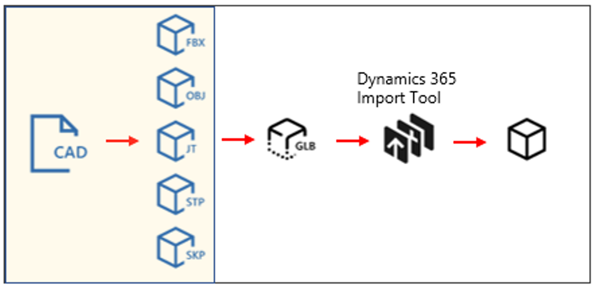

# Convert your 3D (CAD) models

 

To use your 3D models with the Dynamics 365 mixed reality applications, you’ll need to convert them to a file format that supports real-time rasterization. The type of file you convert to depends on the option you’ll choose in the Import Tool.

## Import Tool options and file types

The Import Tool provides two options for preparing your 3D models: 

 

The following table describes the two options and the file formats supported for each:

|Option|Description|Supported file formats|
|------------|-----------------------------------------------------------------|-----------------------------|
|Import using this PC|Use this option if you want to import self-authored models without any optimization.|GLB only|
|Send model to Microsoft|Use this option if you need Microsoft’s assistance in optimizing and converting your 3D model. Microsoft uses a combination of automation and manual steps to prepare the files. |

## Tools for exporting CAD models

CAD models can be exported directly to glTF format or into intermediate formats that can be subsequently processed into glTF files. If your content creation application does not have a glTF exporter, we recommend exporting to [FBX](https://aka.ms/FBXfileformat) or [OBJ](https://en.wikipedia.org/wiki/Wavefront_.obj_file), if available. Third-party applications are available to import FBX or OBJ files and export them as glTF/GLB files. Your use of third-party applications is subject to terms between you and the third party. Microsoft does not endorse any particular third-party application and assumes no responsibility or liability for any third-party application you elect to use.

|Contect creation package|Description|
|-----------------------------------------------|---------------------------------------------------------------|
[Blender.org Blender](https://aka.ms/Blender_2.8)|Native import/export for Blender 2.8 or later|
[Autodesk 3DS Max](https://aka.ms/BabylonJS_Max2Babylon_Installation)|Babylon.JS plug-in for Max 2015 or later|
[Autodesk Maya](https://aka.ms/BabylonJS_Maya2Babylon_Installation)|Babylon.JS plug-in for Maya 2018 or later|
[Trimble Sketchup](https://aka.ms/SketchUp_glTF_Export)|Separate extensions for [import](https://aka.ms/Sketchupimport) and [export](https://aka.ms/sketchupexport)|
|[Allegorithmic Substance Painter](https://aka.ms/SubstancePainter_glTF_Exporter)|Native exporter|
|[SideFX Houdini](https://aka.ms/Houdini_glTF_Exporter)|Native import/export|
|[Maxon Cinema 4D](https://www.maxon.net/en-us/products/cinema-4d/overview/)|Native export|

In situations where a CAD application doesn’t have an export option for FBX, OBJ, or glTF, you can export an intermediate file, such as [JT](https://aka.ms/Jtfileformat) or [STEP](https://aka.ms/STEPfileformat), and then process that file to create a glTF file. 

