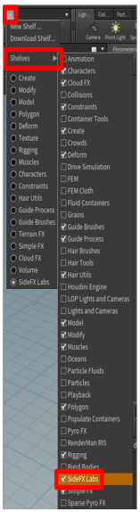

# Use SideFX Houdini to turn point clouds into optimized 3D models for use in Dynamics 365 Mixed Reality applications

This tutorial provides step-by-step instructions that will show you how to: 

- Convert a point cloud into a 3D model.

- Optimize a 3d model by reducing the polygon count so that it matches [performance targets for Dynamics 365 mixed reality applications](optimize-models#performance-targets).

- Export an optimized 3d model as a .GLB file that can be used in Dynamics 365 mixed reality applications.

- Create a processing pipeline template for quickly optimizing point-clouds in the future.

This document is created strictly for informative purposes to demonstrate how SideFX Houdini works with Microsoft Dynamics 365 mixed reality applications.  Your use of third-party applications is subject to terms between you and the third party.  The Microsoft Corporation is not affiliated with, is not a partner to, and does not endorse or sponsor SideFX or any of SideFX’s products.  There are several other [content-creation applications that can be used to prepare your 3D models](convert-models#tools-for-exporting-cad-models). 

## What is Houdini?

Houdini is a 3D procedural content creation tool.  It uses a non-destructive node-based tool system that can be used to design process pipelines and 3D content. 

## Setting up your environment

### Install SideFX Labs extension

SideFX Labs is a testing ground for tools that can be used with SideFX Houdini aimed to help you get up and running quicker with Houdini knowledge and capabilities .  Within this collection of free tools, you can find some specific ones that are useful for converting point-clouds into optimized 3D models.  You must be using Houdini 18 or later to use SideFX Labs.

SideFX provides a tutorial video that will help you install these tools that can be found here: [SideFX Labs Install](https://www.sidefx.com/tutorials/sidefx-labs-installation/)

1.	To install SideFX Labs, first navigate to the top of the window and select the plus symbol SCREEN SHOT GOES HERE  and navigate to **Shelves > SideFX Labs**. Check the box to the left of SideFX Labs.

SCREEN SHOT GOES HERE

 
2.	You will now have a SideFX Labs toolbar that has one icon called **Update toolset**.  Click on this icon to launch the installer.

SCREEN SHOT GOES HERE 

3.	Click update to install the tools.  It is packaged with Houdini and does not require an internet connection to install.  If you are connected to the internet, then you can change the release to a later release.  If you want to check out the latest features, then you can uncheck the “Production Builds Only” option and you will be able to install the absolute latest builds of SideFX Labs.

SCREEN SHOT GOES HERE

You will know that your install was successful if more tools show up in the toolbar. You are now ready to use SideFX Labs tools and can continue with the tutorial.

### Setting up AliceVision for Photogrammetry

There is an existing plugin for Houdini users to leverage AliceVision for photogrammetry, follow [this tutorial from SideFX](https://www.sidefx.com/tutorials/alicevision-plugin/) to correctly install and set up AliceVision.

[AliceVision](https://alicevision.org/) is a Photogrammetric Computer Vision Framework which provides 3D Reconstruction and Camera Tracking algorithms, which can be found on GitHub. It is being developed by the post-production company called **Mikros Image**, about whom you can find more information here: [About AliceVision](https://alicevision.org/#about) – [SideFX](https://www.sidefx.com/tutorials/alicevision-plugin/)

## Importing point-clouds into SideFX Houdini

Houdini can import point-clouds of a file type .ply.  If you do not have a .ply file format, but do have a .pts file format, it is possible to manually convert your file format.

### Manually converting .pts files to .ply files.

You can open your .pts file in a file editor of your choice and add the following heading to your file to convert it from a .pts file to a .ply file.  

************************
ply
format ascii 1.0
element vertex 534993 WHY WAS THIS HIGHLIGHTED IN YELLOW?
property float x
property float y
property float z
property uchar intensity
property uchar red
property uchar green
property uchar blue
end_header
************************
(Note: the element vertex highlighted above in the header is the number that appears at the top of your .pts file.  This is the total number of points in your point cloud and should be placed in the header and removed from the file after the header.)
Below is a side by side view of what the top of your original .pts file and the top of your modified .ply files will look like before and after the heading is added.  The element vertex count is highlighted in red:

|Top of .pts file|Top of .ply file|
|---------------------------------------------------------------|------------------------------------------------------------------|
|SCREEN SHOT GOES HERE|SCREEN SHOT GOES HERE|

*The numbers on the left most of the images indicate respective line number.*

Once you have correctly modified your .pts file, save it with the file extension .ply and you will now be able to import your point-cloud into Houdini.

### Import your .ply file

1.	Open Houdini. A new scene will automatically be created.  We will be building a chain of nodes that process our point cloud into a 3D model.  These nodes will be constructed in the bottom right windowpane highlighted below.

SCREEN SHOT GOES HERE 

2.	Right click in the bottom right windowpane to open the tab menu (you can also just press TAB). In the **TAB menu**, navigate to **Import > File**.  Left click to place this node into the Geometry pane.

SCREEN SHOT GOES HERE

 
3.	Double click the center of the **File1** icon or press **I** to drill down to the file selection part of this node. Click the **File Chooser** button and choose the file you wish to import.

SCREEN SHOT GOES HERE 

4.	A file browser will pop up. Browse to the location of the file you need to import, select your .ply point-cloud file, and then click the **Accept** button. 

SCREEN SHOT GOES HERE

 
5.	You can now see your point-cloud in the viewport.  If you cannot, try zooming out with the mouse wheel until you can see the entire point-cloud.

SCREEN SHOT GOES HERE

 
## Preparing point-clouds

### Re-orienting point-clouds

Sometimes your point-cloud will import in the wrong orientation.  You can easily fix this by adding a transformation node in the node tree on the bottom right of the Houdini window.  

1.	To add a transform node, right-click inside the geometry pane to access the TAB menu and navigate to **Manipulate > Transform**.

SCREEN SHOT GOES HERE

2.	Place the “transform” node below the “file” node, left mouse click and hold the dot on the bottom of the “file” node and drag it to the dot on the top of the “transform” node to link them.  Once you have them linked, left mouse click the right side of the “transform” node.  Doing this will turn it blue and set the View window to the transform node so that you can see your model after it has been transformed. 

SCREEN SHOT GOES HERE

 
>[!TIP]
>Tip: In Houdini, you can Select the right side of each node to view the model during that stage of the process.  This is helpful is you ever need to go back and look at your 3D model in a previous state to make changes that occurred during that state.
3.	Now that you have your transform node set up properly, correct the rotation of your model.  You do this by adding values to the “Rotate” row of value in the options pane above the node pane.  Often you can replace the x value with “270” and the model will rotate to the correct position.  If this does not produce an acceptable result, try with different values.

SCREEN SHOT GOES HERE

 
4.	You should now see your point-cloud oriented correctly.  If you would like to center your point-cloud over the origin, you can add an **axis align** node after your transform node.  To place the node, hover your mouse over the Geometry pane, press tab and navigate to **Labs > Geo  Labs Axis Align**.  

SCREEN SHOT GOES HERE

 
5.	Connect the output of your **transform** node to the input of your axis align node.  Leaving the values at default will set your point-cloud on top of the origin point, an ideal place to have your 3D model.

SCREEN SHOT GOES HERE 

Next, we will clean up the point-cloud.

### Cleaning up point-clouds

If your point-cloud has stray points that you would like to remove, you can select and delete individual or groups of points.

1.	To start, change the “geometry select” method to **points** and the “select” tool to **Lasso Picking**. You can use a different method if you prefer, but for this demo we will be using these settings.

SCREEN SHOT GOES HERE 

2.	Once you have your selection set up, select the points that you wish to delete.

SCREEN SHOT GOES HERE 

 
3.	Press the **Delete** key to remove these points from your point cloud.  When you do this, a new node called “blast” will appear connected to the bottom of the last node you were operating on.

SCREEN SHOT GOES HERE 

 
4.	Continue to remove points until your point-cloud reaches a satisfactory level of cleanliness.  Each deletion will add a new “blast” node that can be viewed or removed at any time.

SCREEN SHOT GOES HERE 

 
## Convert your point-cloud to a mesh

Now that our point-cloud has been imported and is oriented correctly, we will convert it to a mesh.  To do this we will use a the “Particle Fluid Surface” node. That can be found in the tab menu we accessed earlier.

1.	In the Geometry windowpane, click the left mouse button and then navigate to **Fluid > Particle Fluid Surface**, select the node and add it to the geometry windowpane. 

SCREEN SHOT GOES HERE 

2.	Connect it to the transform node by left mouse button holding the output node and dragging the connector to the left input node.  Click on the far-right tab of the pariclefluidsurface1 node to activate this node in the viewport.
 
SCREEN SHOT GOES HERE 

  
Once this step is complete your point-cloud will be rendered as a mesh in the viewport. Above the Geometry tab the Surfacing tab will be open in the upper right pane.

SCREEN SHOT GOES HERE 

 
3.	If the points in your point-cloud have color data connected to them, then you can use those color attributes by adding the letters **Cd** to the end of the **Transfer Attributes** text box.  Once you add this attribute you will see color come through on your mesh.

SCREEN SHOT GOES HERE 

 
4.	Sometimes the mesh may generate with issues such as holes as shown below.  You can adjust both the **Particle Separation** and **Voxel Scale** sliders until a satisfactory result has been produced. 

SCREEN SHOT GOES HERE  

 
5.	Once you have your mesh rendering in a way that you like there are a couple things we must do to prepare for decimation.  First, in the output tab change the **Convert to** drop down from **Surface Polygon Soup** to **Surface Polygons**. This will allow us to remesh and decimate our mesh.

SCREEN SHOT GOES HERE 

 
6.	Next add a **remesh** node so that the mesh is converted into triangles.  This will allow us to decimate the 3D model to a poly count that meets your performance requirements.  To do this, right mouse click in the Geometry pane and navigate to **Polygon -> Remesh**.

SCREEN SHOT GOES HERE  

7.	Connect the **remesh** node to the left input node of the **particlefluidsurface** node.  Click the middle of the **remesh** node to activate it in the pane above the geometry pane and click the far-right tab to activate the model in the viewport.  You should now be able to edit the properties of the remesh and see those edits represented in the viewport.

SCREEN SHOT GOES HERE 

 
8.	You can play with the element sizing controls here by either staying with the default **Uniform** option in **edge lengths**, or choosing **adaptive** and changing the **relative density slider** among others if you feel that it produces a better looking mesh.

SCREEN SHOT GOES HERE 

## Decimate the 3D model

To reach application-specific goals, we may need to decimate the 3D model.  Decimation is the process of recomputing the surface polygons of the model to create a similar shape with less polygons. There is a reduction in visual fidelity when doing this, but also an increase in performance. The example images below show the difference between a high-quality model used for low scene complexity on HoloLens, and a low-quality model used for high scene complexity.

|High-poly 3D model|	Low-poly 3D model|
|---------------------------------------------------------------|--------------------------------------------------------------|
|SCREEN SHOT GOES HERE |SCREEN SHOT GOES HERE |
|500,000 triangles|8,000 triangles|

1.	In the Geometry pane on the lower right, tap the Tab key to bring up the tab menu again.  Navigate to **Polygon > PolyReduce** and to select the PolyReduce node.  Place the node in the Geometry pane.

SCREEN SHOT GOES HERE 

 
2.	Connect the output from the **remesh** node to the top-left input node of the **polyreduce** node.  Select the **polyreduce** node by clicking in the middle and click the far-right tab to activate the **polyreduce** node in the viewport.  Once you have done this, change the **Reduction Amount** tab’s **Target** dropdown to **Output Polygon Count** and adjust the polygon count to an amount that is within your performance requirements and maintains an acceptable visual fidelity.

SCREEN SHOT GOES HERE 

 
Our point-cloud has now been converted to an optimized 3D mesh.  In the next step we will bake a high-resolution texture to the 3D model to recover some of the visual fidelity that existed before decimation.

## Bake a high-resolution texture to our low poly mesh

One downside to reducing the number of polygons that are in a mesh is that much of the detail can be lost.  However, there is a method of capturing the detail that exists on your high-poly 3D model and applying it as a texture layered on top of your low-poly model known as “texture baking”.  Texture baking basically takes a picture of all the surfaces of your high-poly model and stitches those pictures into a quilt that is draped on top of your low-poly model.  Doing this gives you the performance of a low-poly 3D model while maintaining some of the finer details of your high-poly 3D model.  The steps below will walk you through this process.

1.	Add the **Labs AutoUV** node to the scene by right clicking in the geometry pane and navigating to **Labs > UV > Labs Auto UV** and change the method to **UV unwrap**.

SCREEN SHOT GOES HERE 

2.	Connect the **polyreduce output node** to the **AutoUV input node**.

SCREEN SHOT GOES HERE 

3.	Change your Viewport to **Vertical split** by clicking the **Viewport Layout** button and selecting **Two Views Side by Side**.

SCREEN SHOT GOES HERE 

 
4.	In the left ViewPane, set the view to **UV view** by left mouse clicking the drop down and navigating to **Set View > UV viewport**.

SCREEN SHOT GOES HERE 

 
You will now see your unwrapped UVs in the left pane and your 3D model in the right pane.

SCREEN SHOT GOES HERE 

5.	Add the **Labs Maps Baker** node to the geometry pane by navigating to **Labs > Output > Labs Maps Baker (Beta)**.

SCREEN SHOT GOES HERE 

 
6.	Connect the **AutoUV output** node to the **LOW Resolution input** node of the **maps baker** node.

SCREEN SHOT GOES HERE  

7.	Connect the **particle fluid surface output** node to the **HIGH resolution input** node of the **maps baker node**.

SCREEN SHOT GOES HERE 

 
8.	Select the **maps_baker** node and change the preview channel to **diffuse** and **check diffuse** in the **Transfer** section of **Bake options**.

SCREEN SHOT GOES HERE  

>[!TIP]
>Save your project in a specific folder by clicking the file chooser highlighted in the image above.  When we bake our texture, the .png texture file will be output into a render folder that is created in the root of the saved project.  Saving your project into its own folder will make the baked texture easy to find.

9.	Highlight the **Maps Baker** node and click **Bake** in the options pane.

SCREEN SHOT GOES HERE 

 
10.	Right mouse click in the Geometry pane to access the TAB menu and navigate to **Managers >Material Network** to add a **Material Network** node to your scene.  

SCREEN SHOT GOES HERE 

11.	Double click the **matnet** node to open the **VEX Builder** Pane.

SCREEN SHOT GOES HERE 

 
12.	Add a Principled Shader material by right mouse clicking in the VEX Builder pane and navigate to **Shaders > Principled Shaders**.

SCREEN SHOT GOES HERE 

 
13.	In the options pane, navigate to the **Surface** tab and change the **roughness** to **0.6** and **Metallic** to **0.1**.  You can set these values to whatever you like.  We have found these values in conjunction with leaving the other values at their default values to be a good starting point.

SCREEN SHOT GOES HERE  

14.	Next navigate to the **Texture** tab and under **Base Color** select the **Use Texture** box.  Now click on the **File Chooser** icon and select the ***_color.png** texture that we baked out into the render folder earlier.  Our principled shader is now ready for use.  There are lots of opportunities in this material network for advanced users to further modify the material, but for this tutorial we will be using this configuration.

SCREEN SHOT GOES HERE  

15.	Click the back arrow in the **Vex Builder** pane to navigate back to our **Geometry** Pane.

SCREEN SHOT GOES HERE  

16.	Place a **Material** node into the geometry pane by navigating to **Material > Material**.

SCREEN SHOT GOES HERE  

17.	Next, connect the output of your **AutoUV** node to the input of the **Material** node.

SCREEN SHOT GOES HERE  

18.	With the **Material** node selected, click the **operator chooser** button and select the **Principled Shader** we just created by navigating to **file1 > matnet1** and selecting the **principledshader1** operator.

SCREEN SHOT GOES HERE  

19.	If you click the right side of the node to activate it in your viewport you will see the texture rendered on top of your low-poly 3D model.  If it looks acceptable, we can move on to exporting the 3D model.
 
SCREEN SHOT GOES HERE 

## Export the model to a GLB file

In this step, we’ll export the model to a GLB file so it can be used with Dynamics 365 mixed reality apps. 

1.	In the Geometry window, right mouse button click to bring up the Tab menu.  Navigate to **Export > ROP GLTF Output**.

SCREEN SHOT GOES HERE  

2.	Drag a connection from the **material1 output** node to the **rop_gltf input** node.

SCREEN SHOT GOES HERE 

  
3.	In the top pane, change **Export Type** to **GLB**. 

SCREEN SHOT GOES HERE 

 
4.	Next to the Output File field, click the **File Chooser** and choose a name and destination for the **GLB**.  Make sure to add “.glb” to the end of your file name.

SCREEN SHOT GOES HERE  

5.	Next, click the **Render to Disk** button to finalize the export and to create the **GLB** file.

SCREEN SHOT GOES HERE 

 
Congratulations! You have officially taken a point-cloud and converted it into a mixed reality ready 3D model.

## Creating a template

An advantage to using Houdini is all of the steps that are used to prepare the 3D model exist in the application, even export to the glTF format.  This node tree can be reused to create more 3D models from point clouds.  While you will have to click bake and maybe adjust a few values to tweak everything to your liking, the majority of the processing is automated and we can rapidly create more 3D models.  

1.	The first thing we will do is replace whatever geometry is currently being used with a default geometry.  This makes our template file lightweight so that it will load quickly when we open it.  To do this, do the following:

    a.	Click on your file icon to activate the geometry file menu in the upper pane.
    
    b.	Once activated, change the “Geometry File” field to say “default.bgeo” and click **Reload Geometry**.
    
    c.	This will refresh the geometry so that it is now a generic cube.
    
    d.	Go ahead and change the file name to something generic like “Template” as well.
    
        SCREEN SHOT GOES HERE 
        
 
2.	With our template setup, save your file as something memorable like “Prep_Template.”  To save the file go to **File > Save**.

SCREEN SHOT GOES HERE  

3.	Your Template is now ready.  Close Houdini so that we can perform a complete walkthrough using our template.

### Using the template

1.	Now that our template is ready, Launch Houdini and open your template file by going to File > Open, and selecting the template we saved in the previous section.

SCREEN SHOT GOES HERE 

 
2.	Click on the center of the geometry file node to switch to the File context menu above, and then click the “Open floating file chooser” button to select your .ply point cloud file.

SCREEN SHOT GOES HERE 

 
3.	Click the “Reload Geometry” button to load your point-cloud into your scene.

SCREEN SHOT GOES HERE 

 
4.	Once your point-cloud loads return to the **Maps Baker** node and click **bake** to bake a new texture for your 3D model.

SCREEN SHOT GOES HERE 

5.	Click the right tab of the **Material** Node to view what your baked model looks like.

SCREEN SHOT GOES HERE  

6.	  If you are satisfied with the 3D model, navigate to the **rop_gltfB** node and export your 3D model by clicking **Render to Disk**.  
SCREEN SHOT GOES HERE  

7.	If you are not satisfied with how your model looks, then try adjusting the options in the **particle fluid surface**, **remesh**, and **polyreduce** nodes.  Once your model looks acceptable, bake your texture again and export your 3D model.

## Viewing your 3D model in mixed reality

Now that you have prepared your 3d models, you can learn more about using the following Microsoft Dynamics 365 experiences to view your 3d model in mixed reality here: 

[Dynamics 365 Product Visualize](https://docs.microsoft.com/dynamics365/mixed-reality/product-visualize/) 

[Dynamics 365 Guides](https://docs.microsoft.com/dynamics365/mixed-reality/guides/) 

[Dynamics 365 Layout](https://docs.microsoft.com/dynamics365/mixed-reality/layout/index) 
 
### More information 
 
Several screenshots in this document were taken from the Houdini software program in order to provide clear instructions on how to use Houdini’s software.  More information about Houdini can be found here: [SideFX](https://www.sidefx.com/tutorials/alicevision-plugin/)
 
The Microsoft Corporation is not responsible for, and expressly disclaims all liability for damages of any kind arising out of the use of Houdini, or reliance on these instructions. This document is created only to provide general information to our customers and does not take into consideration any individualized business plans or specifications. 
 
The use in this document of trademarked names and images is strictly for informative and descriptive purposes, and no commercial claim to their use, or suggestion of sponsorship or endorsement, is made by the Microsoft Corporation. 

