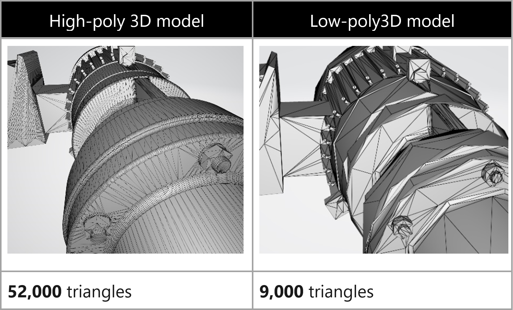
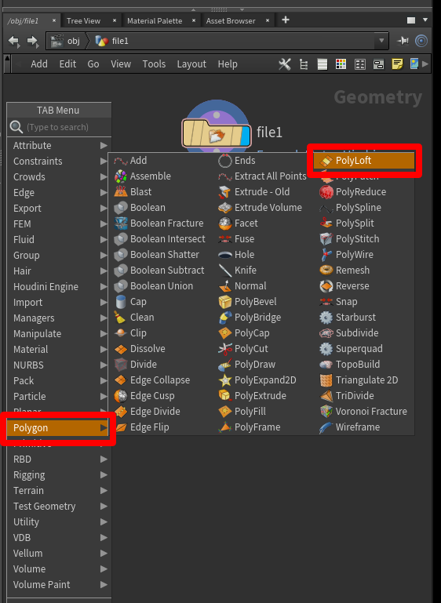
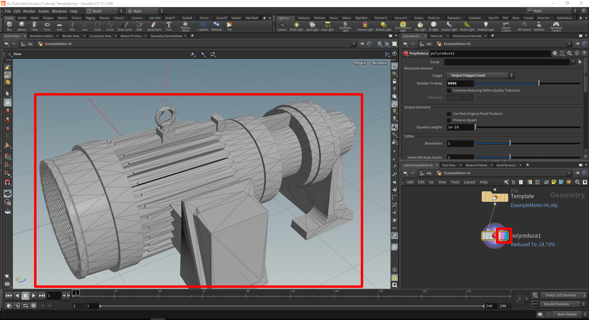
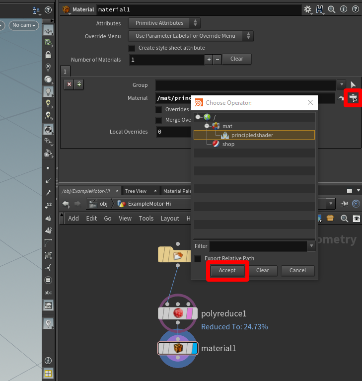

# Use SideFx Houdini to prepare 3D models for use in Dynamics 365 mixed reality applications

This tutorial provides step-by-step instructions that will show you how to:

- Optimize a 3D model by reducing the polygon count so that it matches [performance targets for Dynamics 365 mixed 
reality applications](https://docs.microsoft.com/dynamics365/mixed-reality/import-tool/optimize-models#performance-targets).  

- Add the correct material to a 3D model. 

- Export an optimized 3d model as a .GLB file that can be used in Dynamics 365 mixed reality applications. 

- Create a processing pipeline template for quickly optimizing other 3D models in the future. 

>[!IMPORTANT]
> This document is created strictly for informative purposes to demonstrate how SideFX Houdini works with Microsoft 
Dynamics 365 Mixed Reality at Work applications.  Your use of third-party applications is subject to terms between you 
and the third party.  The Microsoft Corporation is not affiliated with, is not a partner to, and does not endorse or sponsor 
SideFX or any of SideFX’s products.  There are several other content-creation applications that can be used to prepare your 3D models.

## What is Houdini? 

Houdini is a 3D procedural content creation tool. It has a non-destructive node-based tool system that can be used to design process pipelines. 

## Import a 3D model into Houdini

1. Open Houdini 17.5. 

    

   A new scene will automatically be created.   
 
2. Right-click in the bottom right window pane to open the **TAB** menu (or press TAB).    

3. In the **TAB** menu, go to **Import > File**. Select to place this in the Geometry pane. 

    
 
4. Double-click the center of the **File1** icon or press **I** to drill down to the file selection part of this node. Select the **File chooser** button, and then choose the file you want to import. 

    
 
5. A file browser will pop up. Browse to the location of the file you need to import, select the file requiring reduction, and then select **Accept**.  

    
 
   The model appears in the viewport. 
   
    
   
## Decimate a 3D model

To reach application-specific goals, you may need to decimate a 3D model. Decimation is the process of recomputing the surface polygons of the model to create a similar shape with less polygons. There is a reduction in visual fidelity when doing this, but also an increase in performance. The example images below show the difference between a high-quality model used for low-scene complexity on HoloLens, and a low-quality model used for high-scene complexity. 

 

1.	In the **Geometry** pane on the lower right, tap the Tab key to open the **TAB** menu again. 

    

2. Select **Polygon > PolyReduce**, and then press Enter to select the PolyReduce node. Click beneath the **File** node to place it.
 
   A new node named **polyreduce1** appears in the **Geometry** window near the imported geometry node.
   
    
 
3.	Select the bottom gray dot on the node of the imported geometry and drag a connection line to the leftmost top dot on the polyreduce1 node. A red arrow appears on the dot on the polyreduce1 node.

    
 
5. Select the center of the polyreduce1 node and look at the options available in the tab above the **Geometry** window.

    
 
6.	Select the **Target** window and choose **Output Polygon Count**. This enables you to specify a polygon count that meets the desired polygon targets.

    

7.	To see the results, make sure the polyreduce1 node is selected, and the **Template** (pink) and **Display** (blue) bars are filled by selecting each bar. 

   The model changes to show much less detail.
   
    

There is some wiggle room with the polygon counts for use on mixed reality devices. You can use the **Number to keep** slider to fine-tune the look of the model. Experiment with this slider to get the look you like with the polygon count you need.

## Add a material with a principled shader

You can add a shader to the model to define how shiny and smooth the model appears, giving it a more realistic appearance. 

1.	Open the **Material Palette** tab (in the same window pane as the node system), select **Principled Shader**, and then drag it to the open grey space.

    
 
2.	Right-click **Principled Shader**, and then select **Assign to Selected Objects or Geometry**.

    
 
3.	Highlight the entire model by selecting the window, and then select **Assign**.

    
 
4.	In the **Geometry** window, you'll see that a material1 node has been created and linked below the polyreduce1 node.

    
  
5.	Select the open floating operator chooser in the upper pane, select **principledshader**, and then select **Accept**.

    
 
### Adjust material properites

You can adjust visible properties like the color of the material in the window pane above the **Material Palette** when you have the **Principled Shader** highlighted. For example, start with Roughness at 0.8 and Metallic at 0.2 for CAD models.

SCREEN SHOT GOES HERE: 18-houdini-adjust-materials

To change the color of the 3D model:

1. Select the color swatch button located to the right of **Base Color** (see screen shot above). 

2. In the **Color Editor** dialog box, pick a color. You can pick from previous colors, the mixer wheel located in the upper-left of the editor, or from the sliders located on the bottom right. 

   SCREEN SHOT GOES HERE: 19-houdini-color-editor

3. When you're satisfied with the color choice, close the **Color Editor** dialog box.

## Export the model to a GLB file

In this step, we’ll export the model to a GLB file so it can be used with Dynamics 365 mixed reality apps. 

1.	In the **Geometry** window, press the Tab key to bring up the **TAB** menu. 

2. Select **Export > ROP GLTF Output**, press Enter, and then select below the **material1** node to place the **rop_glft1** node.

   SCREEN SHOT GOES HERE: 20-houdini-export-rop-gltf 

3.	Drag a connection from the **material1** node to the **rop_gltf1** node.

   SCREEN SHOT GOES HERE: 21-houdini-rop-connection
  
4.	In the top pane, in the **Export Type** field, select **glb**. 

   SCREEN SHOT GOES HERE: 22-houdini-export-glb
 
5.	Next to the **Output File** field, select the **File Chooser** button, and then choose a name and destination for the GLB file.  Make sure to add **.glb** to the end of the file name.

   SCREEN SHOT GOES HERE: 23-houdini-file-chooser
 
6.	Select **Render to Disk** to finalize the export and create the GLB file.

   SCREEN SHOT GOES HERE: 24-houdini-render-to-disk
 
## Create a template

Now that the node tree is set up, you can use it as a template to quickly prepare 3D models.

The first thing you need to do is replace whatever geometry is currently being used with a default geometry. This makes the template file lightweight so that it will load quickly when you open it. To do this:

1.	Select the file icon to activate the geometry file menu in the upper pane.

2.	Change the **Geometry File** field to say **default.bgeo**, and then select **Reload Geometry**.

   This refreshes the geometry so that it's a generic cube.
   
3.	Change the file name to something generic like **Template**.

   SCREEN SHOT GOES HERE: 25-houdini-template
 
4.	On the **File** menu, select **Save**, and then save the file as something memorable like **Prep_Template**.  

   SCREEN SHOT GOES HERE: 26-houdini-file-save

5.	The template is ready. Close Houdini to try it out.

### Use a template

1.	Launch Houdini, open the template file by selecting **File > Open**, and then select the template.

   SCREEN SHOT GOES HERE: 27-houdini-open-template
 
2.	Select the center of the geometry file node to switch to the **File** context menu above, and then select **File chooser** button to select xxx.  

   SCREEN SHOT GOES HERE: 28-houdini-file-chooser2
 
3.	When the geometry is loaded, select the red sphere on the **polyreduce1** node, and then the blue tab to the far right. 

   SCREEN SHOT GOES HERE: 29-houdini-reduction-tools

   This shows you what the reduced poly model looks like in the view window, and provides access to the reduction tools.
 
4.	When the model reaches a quality that meets your requirements, select the **rop_gltf1** node, select the **File chooser** button, and then choose a location and name for the file you're exporting. Be sure to include the .glb extension in the file name.

   SCREEN SHOT GOES HERE: 30-houdini-rop-gltf
 
5.	Select **Render to Disk** to create the 3D model.
 
   SCREEN SHOT GOES HERE: 31-houdini-render-to-disk2

6.	Repeat this process with the rest of your 3D models to rapidly produce optimized assets ready for use in Dynamics 365 mixed reality applications.

## View a 3D model in a Dynamics 365 mixed reality application

After preparing your 3D models, you can learn more about using the following Microsoft Dynamics 365 applications to view your 3D models in mixed reality: 

[Dynamics 365 Product Visualize (Preview)](https://docs.microsoft.com/dynamics365/mixed-reality/product-visualize/)
[Dynamics 365 Guides](https://docs.microsoft.com/dynamics365/mixed-reality/guides/) 
[Dynamics 365 Layout](https://docs.microsoft.com/dynamics365/mixed-reality/layout/index) via the [Dynamics 365 Import Tool (Preview)](https://docs.microsoft.com/dynamics365/mixed-reality/import-tool/import-tool) 
 
## More information 
 
Several screenshots in this document were taken from the Houdini software program in order to provide clear instructions on how to use Houdini’s software.  More information about Houdini can be found here: [SideFX Houdini](https://www.sidefx.com/) 
 
The Microsoft Corporation is not responsible for, and expressly disclaims all liability for damages of any kind arising out of the use of Houdini, or reliance on these instructions. This document is created only to provide general information to our customers and does not take into consideration any individualized business plans or specifications. 
The license terms of the Blender website is found below: Creative Commons Attribution ShareAlike 
 
The use in this document of trademarked names and images is strictly for informative and descriptive purposes, and no commercial claim to their use, or suggestion of sponsorship or endorsement, is made by the Microsoft Corporation. 

 

