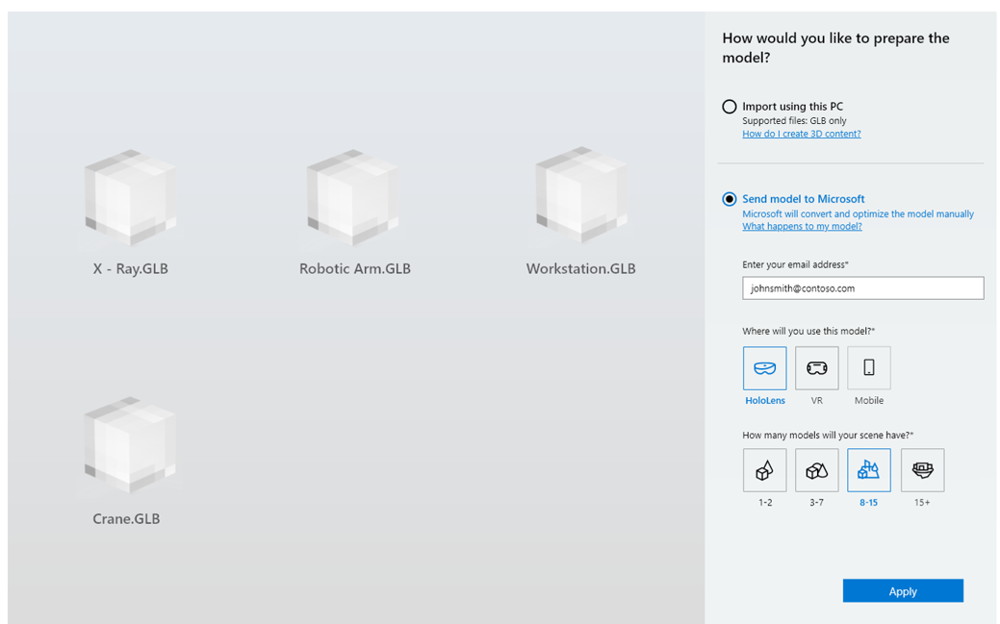
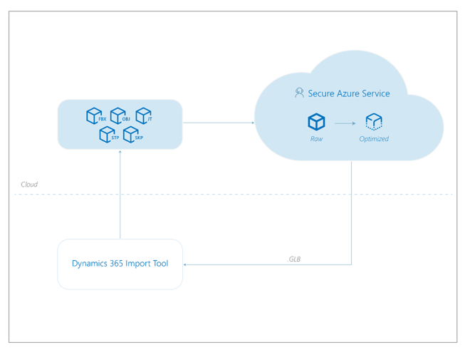

# Use the Dynamics 365 Import Tool

 

Use the Import Tool to prepare your 3D models and Visio layouts to use in the Dynamics 365 mixed reality applications. You can also use the Import Tool to upload the 3D models and layouts for use with HoloLens, immersive headsets, and mobile devices.

## Requirements for using the Import Tool

- [A subscription to Dynamics 365 Layout](https://docs.microsoft.com/en-us/dynamics365/mixed-reality/layout/buy-and-deploy-layout). The Layout subscription includes a subscription to the Import Tool.

  > [!TIP] 
  > You can try Layout and the Import Tool for free for up to 90 days: 
  
  - [Learn more about the free 90-day Layout trial](https://docs.microsoft.com/en-us/dynamics365/mixed-reality/layout/try-layout-free).
  
  - [Learn more about the free 90-day Import Tool (Preview) trial](try-import-tool-free.md).

- A [HoloLens](https://www.microsoft.com/hololens) running the [Windows 10 April 2018 Update](https://support.microsoft.com/en-us/help/12643) and/or a [Windows Mixed Reality immersive headset](https://www.microsoft.com/en-us/windows/windows-mixed-reality). 

- A [Windows Mixed Reality-ready PC](https://www.microsoft.com/en-us/windows/windows-mixed-reality-devices#wmrpcs) running the [Windows 10 April 2018 Update](https://support.microsoft.com/en-us/help/12643).

- An internet connection.

## Install the Import Tool

How you install the Import Tool depends on how your administrator chooses to distribute the app. Your admin may have you install the app from the Microsoft Store, from your organization’s private store, through an email link, or another method.

To install the Import Tool from the Microsoft Store:

- On your PC, go to **Start**  > **Microsoft Store**  , search for “Dynamics 365 Import Tool (Preview)," and then install the app. [Or go directly to the store url](https://www.microsoft.com/en-us/p/microsoft-dynamics-365-import-tool-preview/9nbf1cgb7khx?rtc=1&activetab=pivot:overviewtab).

## Import Tool how to

The Import Tool provides two options for preparing your 3D models: 

 
 
If you choose the **Import using this PC** option, you’ll need to prepare your models yourself using the instructions in the previous sections of this guide. 

If you choose the **Send model to Microsoft** option, Microsoft will convert and optimize your model for you and will provide a download link when the model is ready.

### Import using this PC option

1.	On your PC, open the Import Tool.

2.	Select **Models** > **PC**, and then select **Add models**.

3.	Go to the folder where your models are saved, and then select the models you want to import (up to 25 at a time).

4.	Select **Open**.

5.	Select **Import using this PC**.

     

6.	Select **Apply**.

    > [!NOTE]
    > The **Import using this PC** option isn’t available if any of your source models are not in GLB file format.

### Send models to Microsoft option

1.	On your PC, open the Import Tool.

2.	Select **Models** > **PC**, and then select **Add models**.

3.	Go to the folder where your models are saved, and then select the model you want to import.

4.	Select **Open**.
 
5.	Select **Send model to Microsoft**.

    

6.	Under **Enter your email address**, enter the email address where Microsoft can contact you when the model is ready.

7.	Under **Where will you use this model?**, choose the target device. You can only choose one type of target device at this time.

8.	Under **How many models will your scene have?**, select the appropriate option for your scene complexity. 

9.	Select **Apply** to send the model to Microsoft.

    Microsoft will send you the following email notification to confirm that the model has been sent:
    
     

    Microsoft will update you on the progress of the manual optimization through email and will let you know when the model is ready to download.

### What happens to my model when I send it to Microsoft?

When you send your model to Microsoft, it’s uploaded to a secure location. Microsoft prepares the model using a combination of automated and manual steps. Microsoft will provide a download link when the model is ready. After you download it, your model is deleted from the secure storage area.  

 

### Download a model after it’s been converted and optimized by Microsoft

1.	Open the Import Tool.

2.	Right-click the model that was submitted for manual processing, and then select **Download from Microsoft**.

     

### Locate your converted assets

Files created with the Import Tool are stored locally. To find the files on your local drive:

1.	Open the Import Tool.

2.	Right-click a model, and then select **Open file location**.

    

### Provide feedback on the quality of processed 3D models

You can provide feedback on the quality of processed 3D models if you're not satisfied.

1.	Select the **Models** or **All** tab, and then select the model you want to provide feedback on.

2.	At the bottom of the **Properties** tab, under **How does the model look?**, select **Looks good** or **Looks broken** to record your feedback.

     

    > [!NOTE] 
    > You can't update feedback after you submit it.

