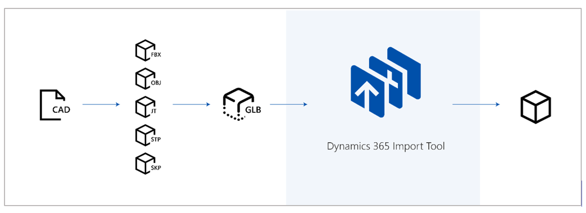
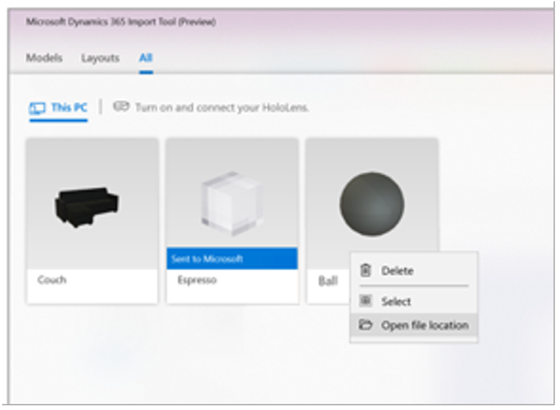
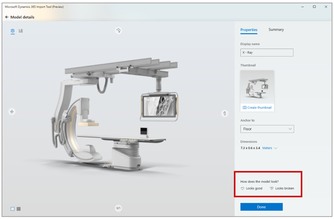

# Use Dynamics 365 Import Tool (Preview)

Use [!include[cc-microsoft](../includes/cc-microsoft.md)] [!include[pn-dyn-365-import-tool](../includes/pn-dyn-365-import-tool.md)] to prepare your 3D models to use in [!include[pn-dyn-365](../includes/pn-dyn-365.md)] mixed-reality applications. 

> [!div class="mx-imgBorder"]
>  

Before you use the [!include[pn-dyn-365-import-tool](../includes/pn-dyn-365-import-tool.md)], you need to convert and optimize your models. For more information, see these topics:

- [Convert your 3D models](convert-models.md)
- [Optimize your 3D models](optimize-models.md)
- [Best practices for 3D models](best-practices.md)

## Import your models with the Dynamics 365 Import Tool (Preview)

1.	On your PC, open [!include[pn-dyn-365-import-tool](../includes/pn-dyn-365-import-tool.md)].

2.	Select **Models** > **PC**, and then select **Add models**.

3.	Go to the folder where your models are saved, and then select the models you want to import (up to 25 at a time).

4.	Select **Open**.

#### If you encounter file access errors when importing files

3D models sometimes reference other files in your file system, such as textures and materials files. Your imported 3D model might not look correct if Dynamics 365 Import Tool (Preview) can’t access these files, in which case, you might see this error dialog box:

> [!div class="mx-imgBorder"]
>  

There are two primary reasons why Dynamics 365 Import Tool (Preview) might not have access to these files:

- **No permissions**. For the safety and security of your files, Windows 10 does not allow all Windows Store applications full access to the files in your system. To allow Dynamics 365 Import Tool (Preview) access to your files, select **Grant permissions**, go to the folder(s) that contains the files, and then select the folder(s). This grants access to all files in the folder. Alternatively, you can move your 3D models and all their referenced files to the **3D Objects** folder.

- **Missing files**. Dynamics 365 Import Tool (Preview) expects the files to appear in the exact file paths listed in the dialog box. If files are not there, they will be marked as missing. Move the missing files to locations indicated in the dialog box, or update the original 3D model.

## Locate your converted assets

Files created with [!include[pn-dyn-365-import-tool](../includes/pn-dyn-365-import-tool.md)] are stored locally. To find the files on your local drive:

1.	Open [!include[pn-dyn-365-import-tool](../includes/pn-dyn-365-import-tool.md)].

2.	Right-click a model, and then select **Open file location**.

    > [!div class="mx-imgBorder"]
    > 

## Provide feedback on the quality of processed 3D models

You can provide feedback on the quality of processed 3D models if you're not satisfied.

1.	Select the **Models** or **All** tab, and then select the model you want to provide feedback on.

2.	At the bottom of the **Properties** tab, under **How does the model look?**, select **Looks good** or **Looks broken** to record your feedback.

    > [!div class="mx-imgBorder"]
    >  

    > [!NOTE] 
    > You can't update feedback after you submit it.
    
## Do I need to be connected to Wi-Fi to use Dynamics 365 Import Tool (Preview)?

[!include[pn-dyn-365-import-tool](../includes/pn-dyn-365-import-tool.md)] requires users to be signed in with their Active Directory account to access the application. Users need to be connected to Wi-Fi the very first time the application is launched. After the first launch, they need to be connected to Wi-Fi once every 30 days so that the application can validate that the user has a valid Active Directory account for continued use of the application.

### See also
[Overview of Dynamics 365 Import Tool (Preview)](index.md) 
[Convert 3D models](convert-models.md) 
[Optimize 3D models](optimize-models.md) 
[Best practices for converting and optimizing models](best-practices.md) 
[Tutorials for converting and optimizing 3D models](tutorials-overview.md) 

