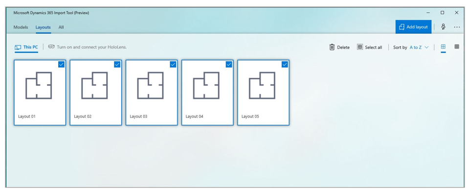

# Work with Dynamics 365 Layout

With [!include[cc-microsoft](../includes/cc-microsoft.md)] [!include[pn-dyn-365-layout](../includes/pn-dyn-365-layout.md)], you can work with floor plans created with [!include[cc-microsoft](../includes/cc-microsoft.md)] [!include[pn-visio](../includes/pn-visio.md)], or you can create a layout with the [!include[pn-hololens](../includes/pn-hololens.md)] app. You can use [!include[pn-dyn-365-import-tool](../includes/pn-dyn-365-import-tool.md)] to make either type of layout available for immersive headsets. 

## Import a Microsoft Visio floor plan

To work with a [!include[pn-visio](../includes/pn-visio.md)] floor plan in [!include[pn-dyn-365-layout](../includes/pn-dyn-365-layout.md)], take these three steps:

1.	Install the [!include[pn-visio](../includes/pn-visio.md)] add-in for [!include[pn-dyn-365-layout](../includes/pn-dyn-365-layout.md)]. 

2.	Export the floor plan to [!include[pn-dyn-365-layout](../includes/pn-dyn-365-layout.md)].

3.	Make the floor plan available for immersive headsets or [!include[cc-microsoft](../includes/cc-microsoft.md)] [!include[pn-hololens](../includes/pn-hololens.md)] using [!include[pn-dyn-365-import-tool](../includes/pn-dyn-365-import-tool.md)].

### Install the Visio add-in for Dynamics 365 Layout

1.	Open [!include[pn-dyn-365-import-tool](../includes/pn-dyn-365-import-tool.md)].

2.	Select **Settings**, and then select the 32-bit or the 64-bit download. Choose the one that matches your version of [!include[pn-visio](../includes/pn-visio.md)].

    > [!div class="mx-imgBorder"]
    >  

3.	Open [!include[pn-visio](../includes/pn-visio.md)], and then select **File** > **Options** > **Add-ins**.

4.	Next to **Manage**, select **COM Add-ins**, and then select **Go**.

5.	Select **[!include[pn-visio](../includes/pn-visio.md)] Add-in for [!include[pn-dyn-365-layout](../includes/pn-dyn-365-layout.md)]**, and then select **Add**.

### Export the floor plan to Dynamics 365 Layout

After you’ve created the floor plan in [!include[pn-visio](../includes/pn-visio.md)], select the **Layout** tab, select **Export**, and then save your floor plan.

### Make the floor plan available for immersive headsets or HoloLens

1.	In [!include[pn-dyn-365-import-tool](../includes/pn-dyn-365-import-tool.md)], select **This PC** > **Add layout**, and then navigate to the floor plan.

2.	Select the floor plan, and then select **Open**.

    If you’re using an immersive headset connected to the same PC, the floor plan shows up automatically in [!include[pn-dyn-365-layout](../includes/pn-dyn-365-layout.md)]. You don’t need to do anything more.

    If you’re using [!include[pn-hololens](../includes/pn-hololens.md)]:
    
    a.	Connect your [!include[pn-hololens](../includes/pn-hololens.md)] to your PC using the USB cable.

    b.	Open [!include[pn-dyn-365-import-tool](../includes/pn-dyn-365-import-tool.md)] on the PC, and then select **This PC** > **Layouts**.

    c.	Select the check box on the layouts you want to copy, and then select **Send**.
    
       > [!div class="mx-imgBorder"]
       >  
    
    d.	On [!include[pn-hololens](../includes/pn-hololens.md)], open [!include[pn-dyn-365-layout](../includes/pn-dyn-365-layout.md)]. You’ll find your floor plan on the **Layouts** tab.
    
## Import layouts created with the HoloLens Layout app to use with immersive headsets

1.	Connect your [!include[pn-hololens](../includes/pn-hololens.md)] to your PC using the USB cable.

2.	Open [!include[pn-dyn-365-import-tool](../includes/pn-dyn-365-import-tool.md)] on the PC, and then select **[!include[pn-hololens](../includes/pn-hololens.md)] name** > **Layouts**.

3.	Select the check boxes for the layouts you want to copy, and then select **Send**.

## Import layouts created with the immersive Dynamics 365 Layout app to use with the HoloLens Layout app

To use the layout on [!include[pn-hololens](../includes/pn-hololens.md)], you need to move it there:

1.	Connect your [!include[pn-hololens](../includes/pn-hololens.md)] to your PC using the USB cable.

2.	Open [!include[pn-dyn-365-import-tool](../includes/pn-dyn-365-import-tool.md)] on the PC, and then select **This PC** > **Layouts**.

3.	Select the check boxes for the layouts you want to copy, and then select **Send**.

4.	On [!include[pn-hololens](../includes/pn-hololens.md)], open [!include[pn-dyn-365-layout](../includes/pn-dyn-365-layout.md)]. You’ll find your layouts on the **Layouts** tab.

## Import 3D models to use with HoloLens

1.	Connect your [!include[pn-hololens](../includes/pn-hololens.md)] to your PC using the USB cable.

2.	Open [!include[pn-dyn-365-import-tool](../includes/pn-dyn-365-import-tool.md)] on the PC, and then select **This PC** > **Models**.

3.	Select the check boxes for the 3D models you want to copy, and then select **Send**.

4.	On [!include[pn-hololens](../includes/pn-hololens.md)], open [!include[pn-dyn-365-layout](../includes/pn-dyn-365-layout.md)]. You’ll find your 3D models on the **Models** tab.

## Import 3D models to use with immersive headsets

If you used [!include[pn-dyn-365-import-tool](../includes/pn-dyn-365-import-tool.md)] to import your 3D models, they’re already available for immersive headsets. You can find them in your **3D objects** folder. 

### See also
[Overview of Dynamics 365 Import Tool (Preview)](index.md) 
[Convert 3D models](convert-models.md) 
[Optimize 3D models](optimize-models.md) 
[Best practices for converting and optimizing 3D models](best-practices.md) 
[Use Dynamics 365 Import Tool (Preview)](import-tool.md)
    

[!INCLUDE[footer-include](../includes/footer-banner.md)]