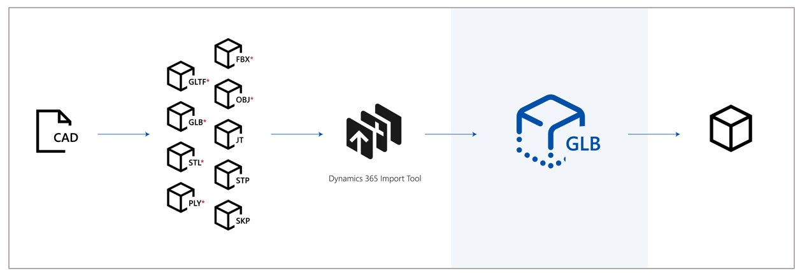

# Optimize your 3D models

 

For best rendering and best possible real-time performance, your 3D models need to be converted and may need to be optimized before using the Import Tool. 

Third-party applications that convert CAD files often have tools that can optimize content as well. 

The following table lists software tools that you can use to convert and/or optimize your CAD files or intermediate files into GLB files.

|Software|Import|Export|Convert/transcode|Optimization|
|---------------------------------|----------------------------------------|--------------------|--------------------|-------------------|
|[PiXYZ Software](https://aka.ms/Pixyz)|STEP, Catia, JT, OBJ, FBX, and more|glTF 2.0|Yes|Yes|
|[Maxon Cinema 4D](https://aka.ms/MaxonCinema4D)|SOLIDWORKS, STEP, Catia, JT, and IGES|FBX, glTF 2.0 (beta)|Yes|Yes|
|[Simplygon Studios](Simplygon Studios)|FBX, OBJ|FBX|No|Yes|
|[Unreal Datasmith](https://aka.ms/UnrealDatasmithsoftware)|STEP, Catia, JT, OBJ, FBX, and more|FBX|Yes|No|
|[Autodesk Inventor](https://aka.ms/AutodeskInventorSoftware)|STEP, Catia, JT, OBJ, FBX, and more|FBX, OBJ|Yes|Yes|

Here's an example of CAD, converted, and optimized 3D models.

|CAD|Converted to GLB|Optimized GLB|
|------------------------------------------|----------------------------------------------|----------------------------------------------|
|| 
|| 
||
|Original CAD file|52,000 triangles|9,000 triangles|

## Performance targets

The Dynamics 365 mixed reality applications can be used on HoloLens, immersive headsets, and mobile devices. The goal is to provide the highest possible visual fidelity without adversely affecting performance. 

The following table lists some general conservative targets to aim for when acquiring or authoring 3D models for a range of hardware. When in doubt, target the mid-range profile for a balance of fidelity and performance. 

||Low-scene complexity screenshot|Medium scene complexity screenshot|High scene complexity screenshot|
|--------------|---------------------------|-----------------------------------|-----------------------------------|
| HoloLens|**Objects:** 1-3 per scene  **Triangles:** <100,000  **Materials:** 1-2 per object|**Objects:** 4-10 per scene  **Triangles:** <30,000  **Materials:** 1-2 per object|**Objects:** 10+ per scene  **Triangles:** <10,000  **Materials:** 1-2 per object|
|  Immersive headsets|**Objects:** 1-3 per scene  **Triangles:** <15,000  **Materials:** 1-2 per object|**Objects:** 4-10 per scene  **Triangles:** <500,000  **Materials:** 1-2 per object|**Objects:** 10+ per scene  **Triangles:** <150,000  **Materials:** 1-2 per object|
|  Mobile|**Objects:** 1-3 per scene  **Triangles:** <500,000  **Materials:** 1-2 per object|Not applicable|Not applicable|

## Import Tool limitations

- Existing transforms of your model off of the 3D origin (0,0,0) will not be preserved, however relative offsets between models that are imported as one instance will be preserved.  Import tool creates a bounding box that encompasses all geometry in the imported scene and places a new origin point at the center of the bottom surface of that bounding box.

- Transparency in materials such as glass in a 3D model are not supported.

