# Use Pixyz Studio to prepare 3D models for use in Dynamics 365 mixed-reality apps

This tutorial outlines a general process for using Pixyz Studio (2020.1 Update 2 r16) to convert Computer-Aided Design (CAD) parametric assets into polygon-based [.GLB](https://www.khronos.org/gltf/) files that perform well in Dynamics 365 mixed-reality apps. (See [Optimize your 3D models](https://docs.microsoft.com/dynamics365/mixed-reality/import-tool/optimize-models#performance-targets) for information about performance targets.) Keep in mind that every asset and use case is different, so you may need to adjust the process accordingly. 

> [!IMPORTANT]
> This document is created strictly for informative purposes to demonstrate how Pixyz Studio (2020.1 Update 2 r16) works with Dynamics 365 mixed-reality apps. This document was last updated November 2020. Your use of third-party applications is subject to terms between you and the third party. Microsoft Corporation is not affiliated with, is not a partner to, and does not endorse or sponsor Pixyz or any of Pixyz’s products. There are [other content-creation apps](https://docs.microsoft.com/dynamics365/mixed-reality/import-tool/convert-models#tools-for-exporting-cad-models) you can use to prepare your 3D models.

## What is Pixyz Studio?

[Pixyz Studio](https://www.pixyz-software.com/studio/) helps companies and 3D users re-use their CAD data for any visualization scenario.

## Import a CAD asset into Pixyz Studio

1. Open Pixyz Studio, and then on the top-left side of the toolbar, select **Wizard** to start the Import wizard.

    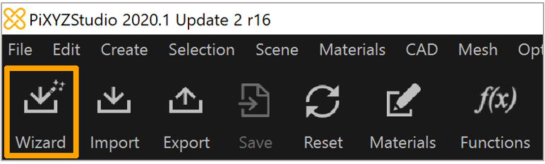
 
2. In the **Import Wizard** dialog box, use the following settings to create a high-quality [tessellation](https://en.wikipedia.org/wiki/Tessellation_(computer_graphics)) as a starting point:

    |Field|Value|Sub-value|
    |------------------------------|--------------------------------------|----------------------|
    |Preset|Default||
    |Coordinate System|Right Handed: On||
    ||Y-up: Off||
    |Import Options|Load Hidden Parts: Off||
    ||Load PMI: Off||
    ||Hierachy Mode: Full||
    |Tesellation Settings|Repair CAD: On, 0.1mm||
    ||Tessellation Quality, High|Max Sag: On, 0.1mm|
    |||Max Angle: On, 15 deg|
    |Material Assignment|Transfer CAD Materials On Parts|     
    
   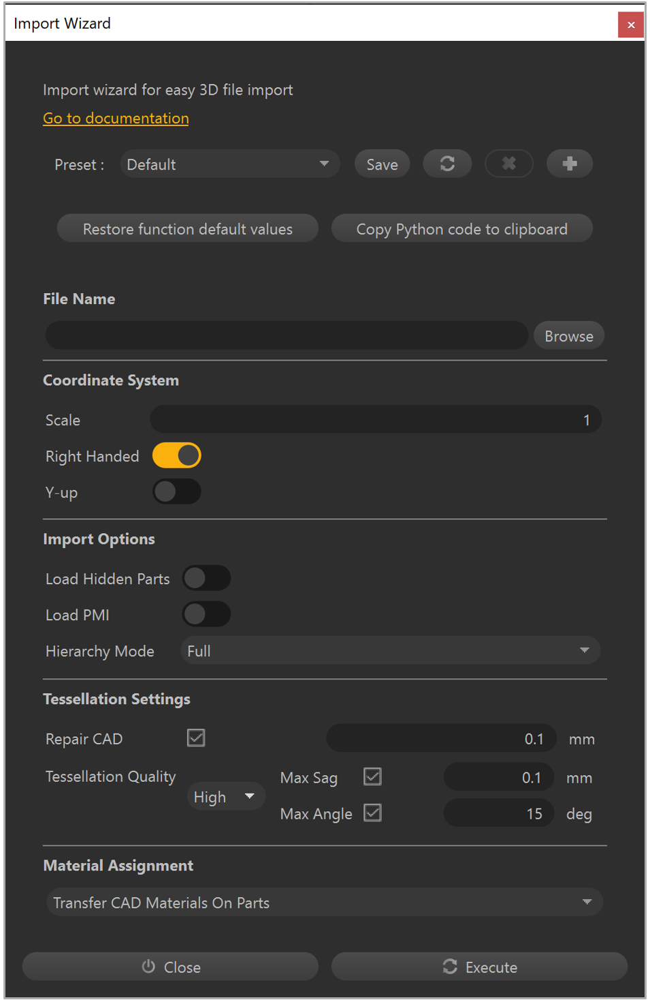
       
3. Select **Execute**.

## Scene cleanup

Start by manually removing all parts and assemblies that are not required for the mixed-reality app.

1. In the Viewer or the Product Structure (Tree), select **Occurrences**.

2. Press Delete on the keyboard to delete the selection from the scene.

> [!NOTE]
> Tools in the **Selection** menu such as **Select Instances**, **Select Similar**, and **Select By Max Size** can be very useful for quickly selecting multiple occurrences to delete.

After removing all the unnecessary parts and assemblies, you can use the following commands to clean up leftover occurrences, materials, textures, and lines:

•	**Scene** > **Delete Empty Occurrences**

•	**Materials** > **Clean Unused Materials**

•	**Materials** > **Clean Unused Textures**

•	**Mesh** > **Delete Lines**

> [!NOTE]
> If lines are important for your scenario, you can use **Mesh** > **Create Textures From Lines** on co-planar lines to bake a textured polygon to use in mixed-reality apps. See the [Pixyz documentation](https://www.pixyz-software.com/documentations/html/2020.1/studio/api/Algo.lineToTexture.html) for more information.

## Remove features

If there are holes in any of the parts or assemblies that aren’t required for your scenario, you can remove them for potentially large polygon savings.

1. Select the parts and assemblies that have the holes you want to remove.

    > [!NOTE] 
    > If you don’t make a selection, Pixyz runs the **Remove Holes** command on the entire scene.

2. Select **Optimize Mesh** > **Remove Holes**.

3. In the **Remove Holes** window, select the types of holes you want to remove:

    - **Through Holes:** Holes that go through a surface and come out the other side.

    - **Blind Holes:** Holes that go into a surface but stop part way through.

    - **Surfacic Holes:** Holes that are cut into a surface but don’t have any depth.
    
    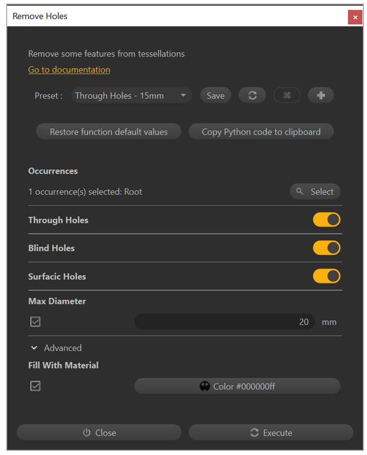
 
4. Enter a number (in millimeters) for the **Max Diameter** field. Holes with a diameter below this value that match the types you set will be removed.

5. Optionally, select the **Fill With Material** check box to select a material to fill holes. This leaves the appearance of a hole but provides better performance due to the reduction in polygons.

## Hierarchy cleanup

At this point, consider whether you need to break up models into pieces to export as separate [.GLB](https://www.khronos.org/gltf/) files for animation purposes or for progressively hiding/showing in mixed-reality apps.

1. Select the parts and assemblies that you want to merge.

2. Select **Scene** > **Merge Parts** to combine them into a single occurrence.

3. Select **Scene** > **Delete Empty Occurrences** to remove any occurrences left behind in the merge process.

4. Select **Scene** > **Rake Tree** to flatten the hierarchy down to a root node. Any remaining occurrences in the scene will be children.

> [!TIP]
> These additional merge operations on the **Scene** menu might also be useful depending on your scenario:

- **Merge Final Level**

- **Merge By Tree Level**

- **Merge Parts By Assemblies**

- **Merge Parts By Name**

- **Merge Parts By Materials**

## Optimize your mesh

To fully optimize your mesh, start by using the **Hidden Removal** command, and then based on your scenario, use the **Decimate to Quality** or **Decimate to Target** command.

### Hidden Removal command

Use the **Hidden Removal** command to do a visibility test to determine which polygons can be removed without affecting the look of the model.

1.	Select **Optimize Mesh** > **Hidden Removal**.

2.	In the **Level** field, select **Polygons**.

    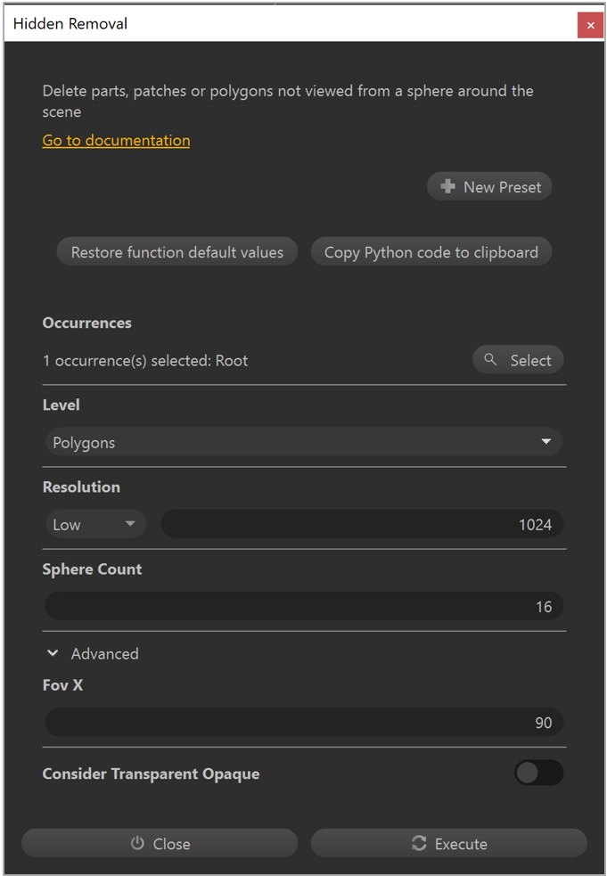
 
3.	Set the **Resolution** field to **Low**. This setting is sufficient for most assets. However, if the asset contains many important small details, consider increasing it to 
**Medium** or **High**.

4.	Select **Execute**.

> [!NOTE] 
> If you have determined that your asset requires multiple pieces, hide the overlapping pieces before using the **Hidden Removal** command to prevent creating holes in adjacent pieces.

### Decimate to Quality command

Use the **Decimate to Quality** command to reduce polygons based on a perceived quality target. Consider how each piece of the asset will be used in mixed reality:

- Is it the focus of the mixed-reality experience?

- Are the fine details important to convey the information in mixed reality?

- Is it for context or supporting visuals?

To use the **Decimate to Quality** command:

1. Select the piece you want to optimize.

2. Select **Optimize Mesh** > **Decimate To Quality**.

3. In the **Decimate** window, in the **Preset** field, select **Medium**.

    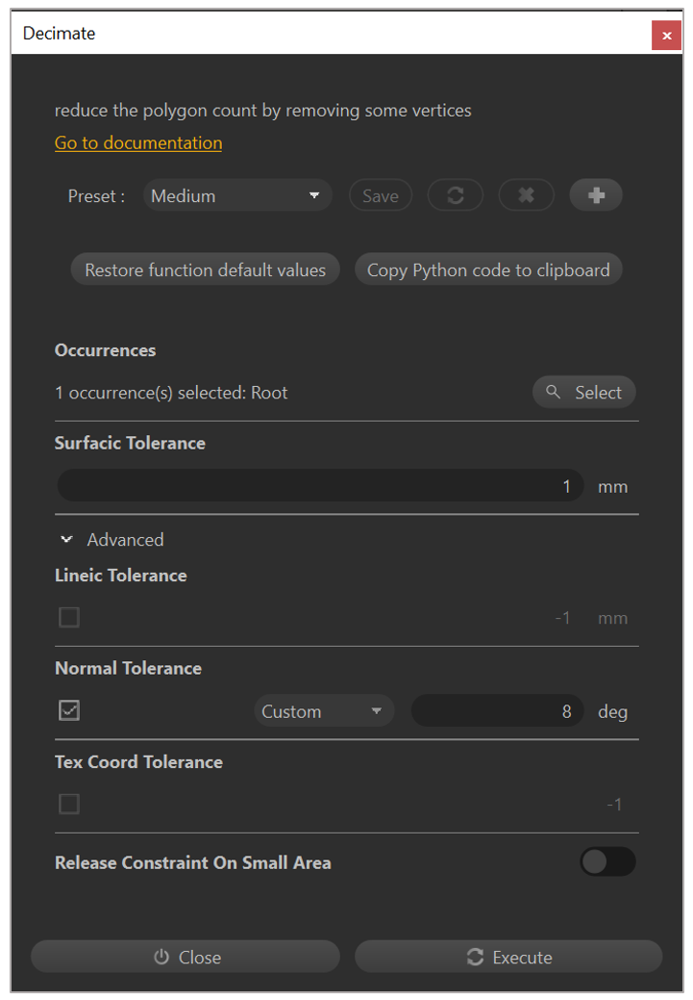
 
4. Set the **Surfacic Tolerance** field to **1mm**.

5. Select **Execute**.

> [!NOTE] 
> The above settings provide a good balance of quality and polygon reduction for most assets. Use the **Low** preset when details are important, or the piece is the focus of the mixed-reality experience. The **Strong** preset works well for supporting visuals.

### Decimate to Target command

If you have a specific polygon count that you’re aiming for, the **Decimate To Target** command is a good alternative to the **Decimate To Quality** command.

1. Select the piece that you want to optimize.

2. Select **Optimize Mesh** > **Decimate To Target**.

3. In the **Target Triangle Count** field, enter the number of triangles that you’re targeting.

    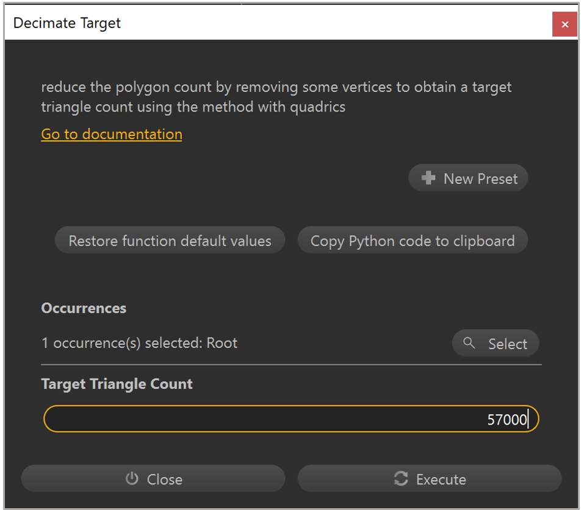
 
4. Select **Execute**.

> [!NOTE] 
> If you don’t make any selection, the **Decimate to Target** command applies to the entire scene.

## Reduce draw calls

In addition to reducing polygon count and hierarchy complexity, draw calls should be minimized to ensure good performance at runtime. Materials with different colors and surface qualities can be baked into texture maps so that complex objects can be rendered in a single draw call. You can do this by creating UVs, normals and tangents, baking texture maps, creating a new material based on the texture bakes, and finally, by applying the new material.

> [!IMPORTANT]
> You need to use all of the commands in this section to reduce draw calls.

### UV generation

1. Select a piece from your scene.

2. Select **UVs** > **Generate UV By Unwrapping**.

3. In the **Automatic UV Mapping** window, set the **Channel** field to **0** (the primary UV set).

    
 
4. Move the **Forbid Overlapping** toggle to the **On** position to create a unique UV unwrap, which is required for texture baking.

5. Select **Execute**.

> [!NOTE] 
> Turn on **Checker** on the top toolbar to visualize the results of the UV unwrap in the Viewer. Select 
**UVs** > **UV Viewer** to see the UV layout.

### Create normals and tangents

Normals and tangents are required for final model rendering as well as for the texture-baking process. Do all of the following steps, in order, to create normals and tangents:

1.	Select a piece that already has a UV layout.

2.	Select **Mesh** > **Create Normals**.

3.	Select **Mesh** > **Orient Normals**.

4.	Select **Mesh** > **Create Tangents**.

### Bake texture maps

After generating UVs and creating normals and tangents, you can bake the textures.

1. Select a piece that already has UVs, normals, and tangents.

2. Select **Optimize Mesh** > **Bake Texture Maps**.

3. In the **Bake Maps** window, select the **+** button to add a texture map.

4. In the **Maps to Bake** list, select **Diffuse**.

    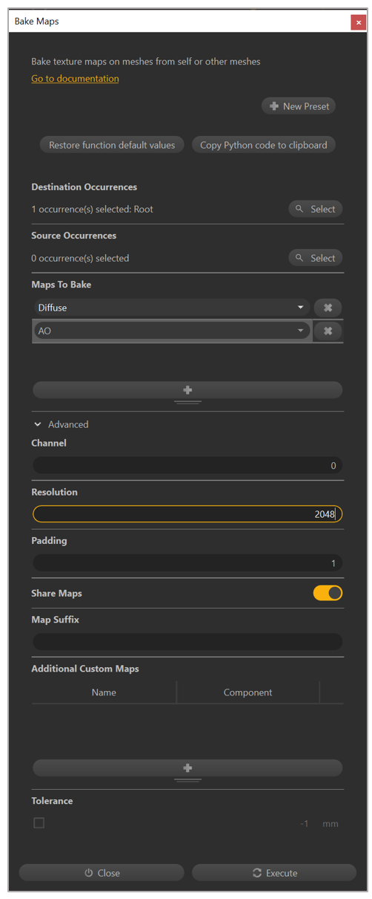

5. Repeat steps 3 and 4, as necessary, for any additional texture maps.

6. Set the **Channel** field to **0** to use the primary UV set for baking textures.

7. Set the **Resolution** field to 2048 to bake high-resolution textures for detailed pieces.

8. Select **Execute**.
 
> [!NOTE] 
> You can use a texture resolution of 1024 or 512 on simple objects to keep the runtime memory usage and final .GLB file size to a minimum.

### Create and apply materials

You need to apply baked texture maps to a Physically Based Rendering (PBR) material, which can then be applied to the asset for [glTF](https://www.khronos.org/gltf/)-compliant rendering in mixed-reality apps.

1.	Select **Materials** > **Material Editor**.

2.	Select **Add**.

3. In the **Choose a material pattern** list, select **PBR**.

4. Select **OK**.

    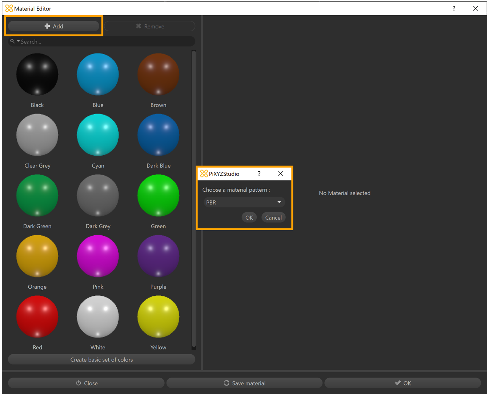
 
5. Enter a **Name** for the material.
    
6. Next to **albedo**, select the **Color** list and change it to **Texture**.

7. In the **Image** field, select **Undefined**.

    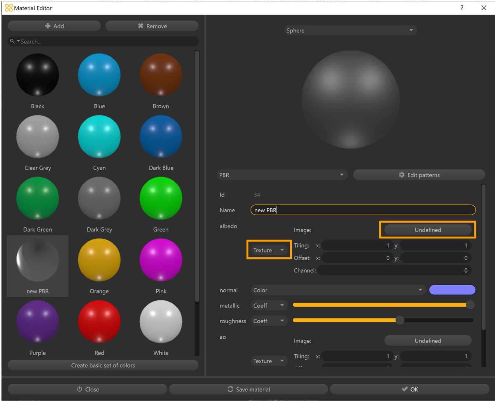

8. In the **Texture Library** window, select the baked **Diffuse** texture map.

9. Select the **Select** button to confirm the texture selection.

    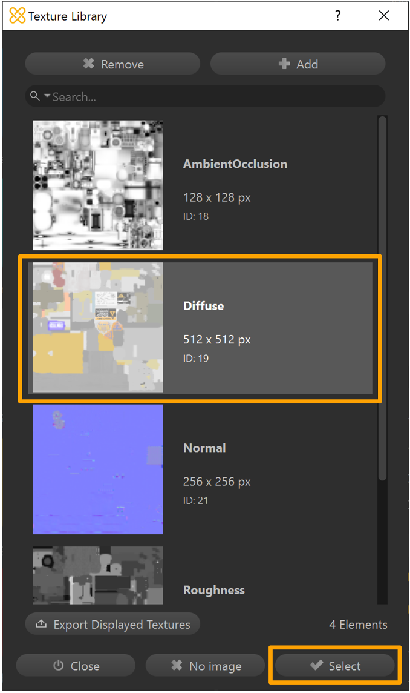

10. Repeat steps 6-9, as necessary, for any additional texture maps.

11.	Select **Save material** to add it to the material library of the scene.

     

12.	Select **OK** to close the **Material Editor** window.

13.	Select the piece you want to apply the material to.

14.	On the **Inspector** tab, under **Occurrence Properties**, select the **No Material** button. (Ignore the materials in the **Occurrence Components** section.)

    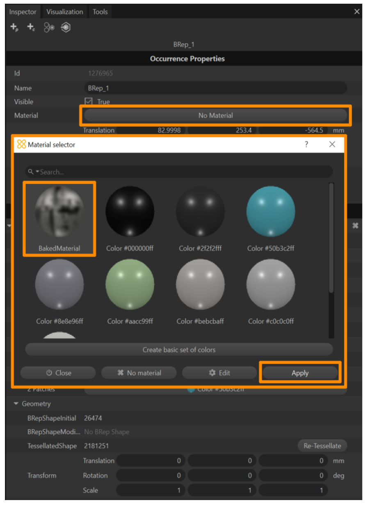
 
15.	In the **Material selector** window, select the new material.

16.	Select **Apply**.

     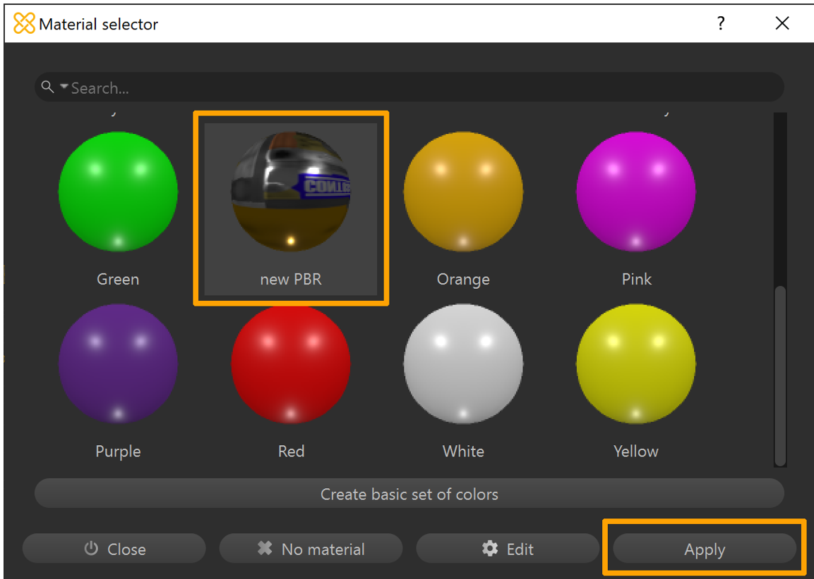

## Export the model to a GLB file

At this point, you have a fully optimized model that’s ready to export as a .GLB file for use in Dynamics 365 mixed-reality apps.

1.	Select the piece you want to export.

2.	Select **File** > **Export Selection**.

3.	Select a location on your device where you want to export your file.

4.	Enter a name for the file.

5.	Select **GLTF Binary (&ast;.glb)** as the file type.

    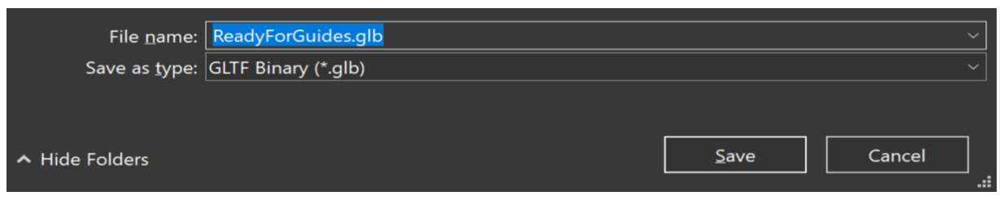
 
6.	Select **Save**.

7.	Repeat steps 1-6, as necessary, to export multiple pieces to .GLB files.

8.	On the toolbar, select **Export**.

> [!NOTE] 
> If nothing is selected, the entire scene will be exported to a single .GLB file.

## Preview an exported GLB file

You can preview the resulting .GLB file(s) with the [3D Viewer](https://www.microsoft.com/store/productId/9NBLGGH42THS) on Windows, where you can visualize the individual texture channels and view stats such as triangle count and draw calls to confirm the asset exported as expected.

1. Open 3D Viewer.

2. Drag and drop a .GLB file into the viewport (or select **File** > **Open** to browse for a .GLB file).

3. Select the **Stats & Shading** tab on the right side of the screen to start visualizing different components of the .GLB file.

4. Use the check boxes to turn the different viewport visualizations on or off.

5. If your device has a camera, you can move the **Mixed reality** slider to the **On** position and place the asset to preview it in your world.

    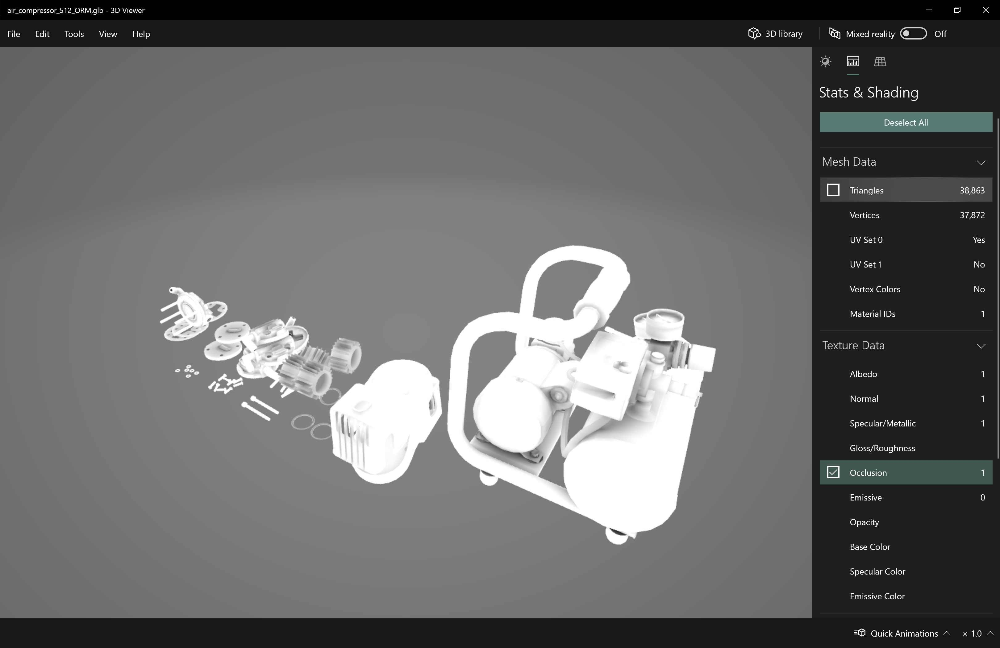
    
> [!TIP]
> The [Babylon.JS Web Viewer](https://sandbox.babylonjs.com/) is another great option if uploading the asset is not a concern.

If the asset requires any additional editing or animation work in another staging application, consider using [.FBX](https://www.autodesk.com/products/fbx/overview) as an intermediate file format. FBX is an [Autodesk](https://www.autodesk.com/) exchange format designed to preserve additional authoring data that might be required by your staging application.

## View a 3D model in a Dynamics 365 mixed-reality app

After preparing your 3D models, you can learn more about using the following Dynamics 365 apps to view your 3D models in mixed reality:

- [Dynamics 365 Guides](https://docs.microsoft.com/dynamics365/mixed-reality/guides/)

- [Dynamics 365 Layout](https://docs.microsoft.com/dynamics365/mixed-reality/layout/) via [Dynamics 365 Import Tool (Preview)](https://docs.microsoft.com/dynamics365/mixed-reality/import-tool/import-tool)

- [Dynamics 365 Product Visualize](https://docs.microsoft.com/dynamics365/mixed-reality/product-visualize/)

## More information

Several screenshots in this document were taken from the Pixyz Studio (2020.1 Update 2 r16) software program to provide clear instructions on how to use Pixyz’s software. [Learn more about Pixyz Studio](https://www.pixyz-software.com/studio/).

Your use of any third-party application is subject to terms between you and the third party. Microsoft Corporation is not affiliated with, is not a partner to, and does not endorse or sponsor Pixyz or any of Pixyz’s products. Microsoft Corporation is not responsible for, and expressly disclaims all liability for damages of any kind arising out of the use of Pixyz Studio, or reliance on these instructions. This document is created only to provide general information to our customers and does not take into consideration any individualized business plans or specifications or updates to Pixyz Studio that may have been made after the date the tutorial was prepared.

The use in this document of trademarked names and images is strictly to attribute the application to Pixyz Studio and for informative and descriptive purposes, and no commercial claim to their use, or suggestion of sponsorship or endorsement, is made by Microsoft.

    

