# Prepare Dassault SolidWorks 3D models for use in Dynamics 365 mixed reality applications

There are several ways you can optimize 3D models for mixed reality by using Dassault Systèmes SolidWorks. This tutorial provides you with easy-to-follow procedures for each of these methods. Some of the procedures are redundant, so you may not need to use them all. Experiment with each procedure and decide what best suits your use case. 
 
Sections of this tutorial are for 2019 and later only, and assume you’ve successfully installed the SolidWorks XR Exporter onto your local PC.  
 
> [!IMPORTANT]
> This document is created strictly for informative purposes to demonstrate how Dassault Systèmes SolidWorks works with Microsoft Dynamics 365 mixed reality applications. Your use of third-party applications is subject to terms between you and the third party. The Microsoft Corporation is not affiliated with, is not a partner to, and does not endorse or sponsor Dassault or any of Dassault Systèmes' products. [There are several other content-creation applications that can be used to prepare your 3D models](https://docs.microsoft.com/dynamics365/mixed-reality/import-tool/convert-models#tools-for-exporting-cad-models). 

## What is Dassault Systèmes SolidWorks? 
 
SolidWorks 2019 provides the breadth of tools to tackle the most complex problems, and the depth to finish critical detail work. New features help you improve your product development process to get innovative products into production faster.  [Read more about SolidWorks](https://www.solidworks.com/). 
 
## Optimize 3D models in SolidWorks 

The features in this tutorial have been identified as ways to optimize 3D models for use in Dynamics 365 mixed reality applications. Depending on how complex your model is, you may be able to just export it as a GLB file or you may need to use a combination of several features. 
 
## Remove features with the Simplify tool 

If your 3D model is extremely complex and you're having performance issues, you can optimize it with the **Simplify** tool.  The **Simplify** tool provides a wide range of options for simplifying your models to different levels, including internal part removal, small part removal, defeaturing and more. [Learn more about using the Simplify tool](https://help.solidworks.com/2018/English/SolidWorks/sldworks/t_simplifying_parts.htm). 

To remove features with the **Simplify** tool:

1. To access the **Simplify** tool, select **Tools > Find/Modify > Simplify**. 

   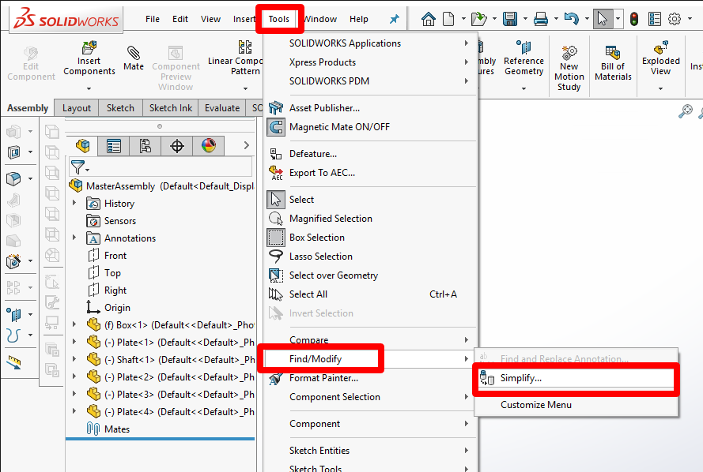 
 
2. Choose from the following options: 

   - **Features**. Decide which features you want to search for. Select fillets, chamfers, and holes as these features create lots of polygons when transcoded.
   
   - **Feature Parameter or Volume Based.**  When you select the **Feature Parameter** option, SolidWorks selects objects whose parameters (such as Fillet Radius) are smaller than the value in the **Simplification factor** field. When you select the **Volume Based** option, SolidWorks selects objects if the feature volume is less than the volume of a part times the value in the **Simplification factor** field. Either method works fine. Selecting the **Volume Based** option and entering a value of 0.1 for the **Simplification factor** field provides a great first pass. If you don’t find many objects, increase the **Simplification factor** value and try again. Select **Find Now** to see the results. 
   
       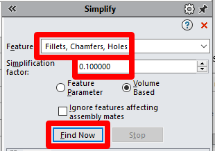 

3. Select the **All** check box, and then select **Suppress**. 
    
    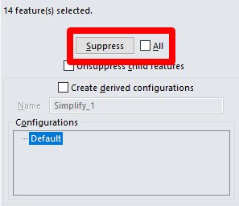 
 
   The features selected are removed from the model. If you find that features were removed that you want to keep, you can undo the process by clearing the **All** check box, and selecting just the items you want to remove. 

## Remove small parts with the Defeature tool

The **Defeature** tool provides another optimization option. You can use this tool for both part removal (simplifying geometry) and for creating a silhouette of your model.  

1. To access this tool, select **Tools > Defeature**. 
     
    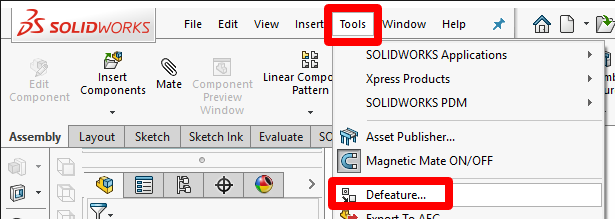 
 
2. At this point, you can choose to simplify your geometry or create a silhouette. 
     
### Simplify geometry

1. Select the **Simplify Geometry** button, and then select the **Next** button.  
     
    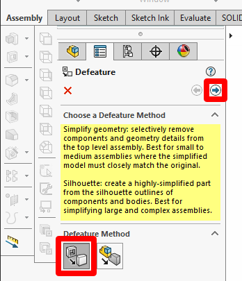 
    
2. Select the **Internal components** check box, select the **Small components** check box, and then enter a percentage to use. We suggest starting with 1%. This will often remove nuts, bolts, and washers from an assembly while leaving the more visually important components. You can increase this percentage if you need to remove more. Select the **Next** button when you're ready to move forward.
     
    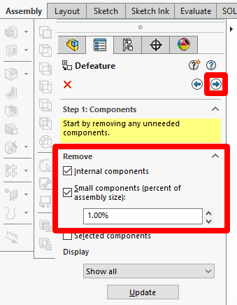 
    
4. Select the **Next** button again to skip adding motion to the assemblies. 
     
    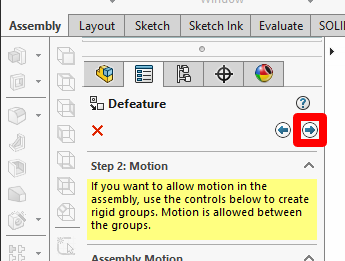 
    
5. If you want to retain the detail for specific geometry areas, select them in the model. Otherwise, they'll be optimized. You can also select the check boxes under **Auto-Select** to retain all holes or holes of a specific size. Select the **Next** button when you're done.
    
    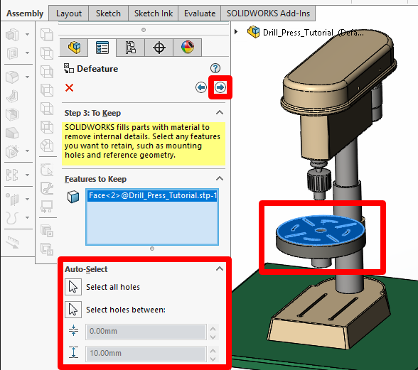 
    
6. The tool "defeatures" the model. If there's anything that was missed that you want to remove, select it in the following screen. When you're done, select the **Next** button. 
     
     
    
7. If the optimized model meets your needs, select **Save as a new document**, and then select the green check mark. 
    
    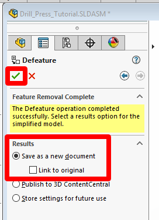 
 
8. Name your model, and then select **Save**. The model is saved as a single SolidWorks part file. 

### Create a silhouette

Another option for optimizing your model is the **Silhouette** tool. This tool is useful when you just need to understand the basic shape of a complex model.  

1. To access the tool, select **Tools > Defeature**.
     
     
    
2. Select the **Silhouette** button. 
     
    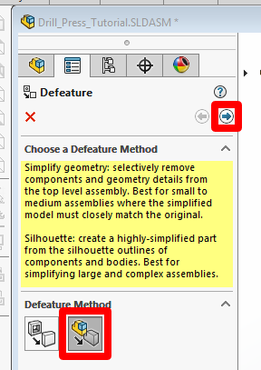 
 
3. Highlight the entire model (or portions of the model if you only want to modify certain parts), select an option under  **Simplification Method**, and then select **Add Group**. For this example, we selected the **Tight Fit Outline** option, but feel free to experiment with other options. 
    
     
 
4. You'll see a preview window that shows what your silhouetted model will look like. When the model looks the way you want, select the **Next** button.   
    
     
 
5. Select **Save as a new document**, and then select the green check mark to save the model.  
     
     

## Save an assembly as a part

Another technique is to save the 3D model assembly as a part file (.asm -> .prt). When you do this, you can choose to hide internal geometry, which increases the performance of your 3D model and also helps maintain confidentiality about the inner workings of your designs.  

1. Select the master assembly (or a subassembly), and then select **File -> Save As**. 

2. In the **Save as type** field, select **Part**.

3. Under **Geometry to save**, select **Exterior faces**. This creates a part that only has the exterior faces showing. Any internal parts are filled, and the item becomes solid. 
    
     
    
4. Select **Save**.

## Export the 3D model as a GLB file 
 
After you optimize a 3D model, you can easily export it directly from SolidWorks as a GLB file.  

- Select **File > Save As**, and then select **Extended Reality Binary (.glb)** as the file type. 
   
   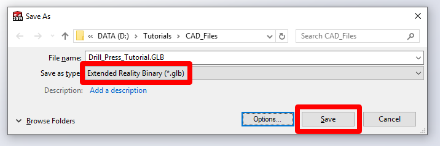 
   
## Other conversion options 

If you don't have SolidWorks 2019 and the XR exporter plugin, you need to do one of the following to convert your 3D model into an optimizable format: 

- If you don't need to see material color, you can export your model as an STL file and import it directly into Dynamics 365 Import Tool (Preview). If it doesn't perform well, you can import the STL file into a Digital Content Creation (DCC) application and optimize it further. [See a list of tutorials on how to optimize your 3D models with DCC applications](tutorials-overview.md). 

- If you want to see material colors on your final product, you need to send your 3D model through a transcoder before optimizing it further. [This 3ds Max tutorial walks you through the optimization and conversion process](3ds-max.md).  

## View your 3D model in Dynamics 365 mixed reality applications
 
After you prepare your 3D models, you can use the following Microsoft Dynamics 365 applications to view your 3D model in mixed reality: 

[Dynamics 365 Product Visualize](https://docs.microsoft.com/dynamics365/mixed-reality/product-visualize/admin-guide#add-a-model)  
[Dynamics 365 Guides](https://docs.microsoft.com/dynamics365/mixed-reality/guides/)  
[Dynamics 365 Layout](https://docs.microsoft.com/dynamics365/mixed-reality/layout/index) via [Dynamics 365 Import Tool (Preview)](https://docs.microsoft.com/en-us/dynamics365/mixed-reality/import-tool/import-tool)  
 
## More information 
 
You can find more information on these products here: 
 
[Dassault Systèmes Solidworks 2019](https://www.solidworks.com/)  
[Extended Reality (XR) Exporter](https://www.solidworks.com/beta/exporter.htm) 
 
Several screenshots in this document were taken from the Dassault Systèmes SolidWorks software program to provide clear instructions on how to use Dassault’s software.  More information about Dassault Systèmes SolidWorks can be found here: [Dassault Systèmes SolidWorks](https://www.solidworks.com/) 
 
The Microsoft Corporation is not responsible for, and expressly disclaims all liability for damages of any kind arising out of the use of Dassault Systèmes Solidworks, or reliance on these instructions. This document is created only to provide general information to our customers and does not take into consideration any individualized business plans or specifications. 
 
The use in this document of trademarked names and images is strictly for informative and descriptive purposes, and no commercial claim to their use, or suggestion of sponsorship or endorsement, is made by the Microsoft Corporation.  
