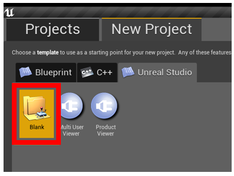
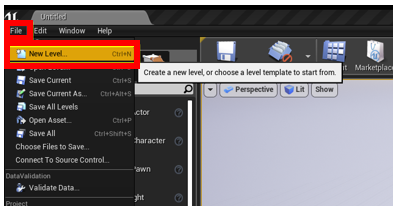
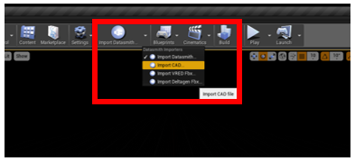

# Tutorial 1: Unreal Datasmith, Blender, and Dynamics 365 Import Tool

This tutorial provides step-by-step instructions that show you how to:

- Convert (transcode) a CAD 3D model into a polygonal 3D model.

- Decimate the polygonal 3D model so that it has polygon counts that match the performance needs specific to the targeted Dynamics 365 mixed reality application.

- Combine the 3D model materials (colors) into a texture that can be baked into the model. This step eliminates the multitude of draw calls necessary to render individual materials.

- Export the optimized 3D model as a glTF/GLB file that can be used in Dynamics 365 mixed reality applications.

The combination of transcoding, decimation, and texture baking converts a CAD file into a highly performant polygonal 3D model that can be used in Dynamics 365 mixed reality applications. 

In this tutorial, we’ll show you how to use:

1.	[Epic Games Unreal Engine Datasmith](https://aka.ms/UnrealDatasmithOverview) to convert the 3D model to an OBJ file.

2.	[Blender 2.8 Beta](https://aka.ms/blender2.8) to optimize and convert the OBJ file to a GLB file.

3.	[The Dynamics 365 Import tool](import-tool.md) to prepare the model for HoloLens.

## What is Datasmith?

Datasmith is a tool inside the Unreal Engine that converts native CAD 3D models into exportable OBJ and FBX 3D models. 
At the end of the Datasmith part of the tutorial, you’ll find links to additional tutorials from Unreal that can assist you in more advanced optimization techniques and how to fix issues you may encounter when importing your CAD 3D models into Datasmith.

## What is Blender?

Blender is a content creation platform that optimizes models by decimating the polygon count and baking materials into textures. In the Blender part of the tutorial, we’ll take the OBJ file that was converted from native CAD format with Datasmith, optimize it through decimation and texture baking, and finally convert it to a GLB file to meet the requirements for Dynamics 365 mixed reality applications.

## Convert the CAD model with Datasmith

In this part of the tutorial, we’ll convert a native CAD file into an OBJ file.

Here are the overall steps:

1.	Set up a new project and scene.

2.	Import the model into the project.

3.	Reorient the model (if needed).

4.	Export the model as an OBJ file.

Datasmith can import multiple file formats, including several native CAD formats. For a list of all supported formats, [see supported file formats for Datasmith](https://aka.ms/UnrealDatasmithsoftware).

### Set up a new project and scene

1.	Select **Launch Unreal Engine** from the Epic Games Welcome page.

    
    
 2.	Select **New Project**, and then select the **Blank** button.
 
    
    
    This will open a blank scene that we’ll replace with an empty level.
    
    
    
 3.	On the **File** menu, select **New Level**.
    
    
    
 4. Select **Empty Level**.
    
    
    
## Import the model into the project

1.	In the **Import Datasmith** drop-down list at the top of the screen, select **Import CAD**.
    
    
    

### See also
[Overview of Dynamics 365 Import Tool (Preview)](index.md) 
[Convert 3D models](convert-models.md) 
[Optimize 3D models](optimize-models.md) 
[Best practices for converting and optimizing 3D models](best-practices.md) 
[Use the Import Tool](import-tool.md)
