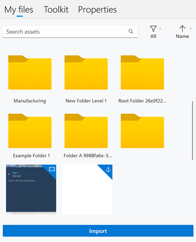

### Import a file by using a drag-and-drop operation

1. Open Windows File Explorer, and go to the folder that contains the 3D models, images, or videos that you want to import.

1. In the PC app on the right side of the page, select the **My files** tab.

    

1. Open the folder where you want to import the item.

1. Drag the files to the folder.

### Import a file by using the Import command

1. In the PC app on the right side of the page, select the **My files** tab.

1. Open the folder where you want to import the item.

1. Select **Import**.

    

1. Find the files that you want to import, and then select **Open**. The file is added to folder.

> [!NOTE]
> If you have trouble importing a custom 3D part, image, or video, [enable Guides to work in the background](../guides/known-issues-pc-app.md#cant-upload-3d-content-or-other-assets).