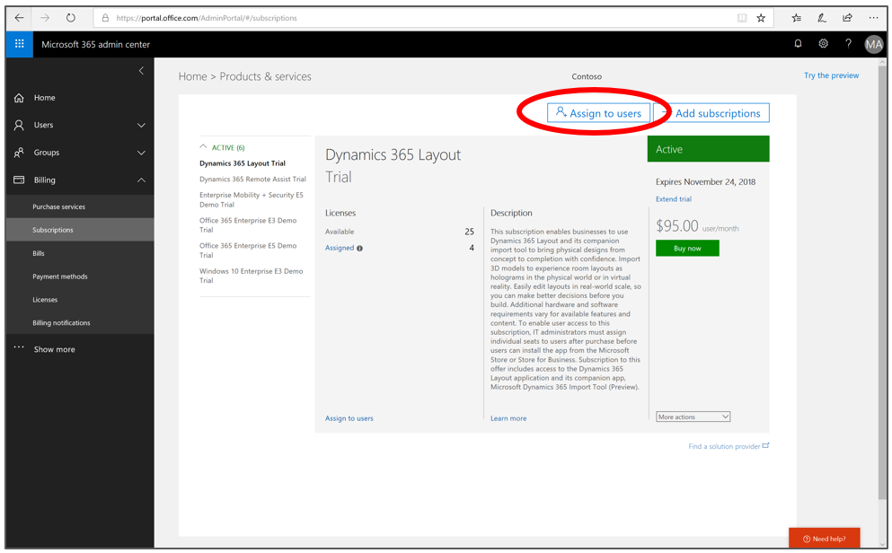
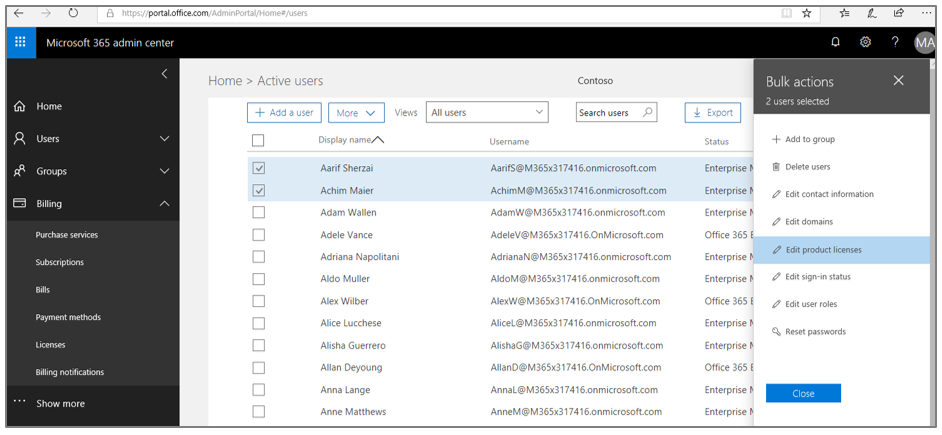
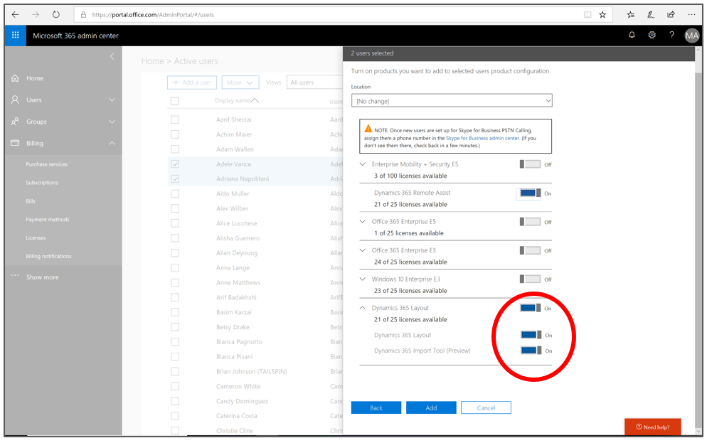

# Deploy Dynamics 365 Layout

With [!include[pn-dyn-365-layout](../includes/pn-dyn-365-layout.md)] you can bridge the gap between the real and digital worlds to complete crucial tasks faster, safer, and more efficiently, and create new ways to connect with customers and partners.

>[!IMPORTANT]
>[!include[pn-dyn-365-layout](../includes/pn-dyn-365-layout.md)] is being discontinued as a separate application. For more information, see [Announcing the transition of Dynamics 365 Layout](https://aka.ms/LayoutTransition).

## Assign licenses to users

If you already have a subscription to [!include[pn-dyn-365-layout](../includes/pn-dyn-365-layout.md)] and want to assign additional users, each user you assign a license to will need an [!include[pn-azure-active-directory](../includes/pn-azure-active-directory.md)] ([!include[pn-azure](../includes/pn-azure.md)] AD) account.

### Assign a license to a user in the Microsoft 365 Admin Center

1. In the [!include[pn-microsoft-365-admin-center](../includes/pn-microsoft-365-admin-center.md)], under **Billing** in the left navigation, select **Subscriptions**, and then select **Assign to users**.

   
   
2. Select the users you'd like to assign the trial or subscription to, and then in the **Bulk actions** menu on the right side of the screen, select **Edit product licenses**. 

   
   
3. In the **Assign products** screen, select the **Add to existing product license assignments** option, and then select **Next**.

   
   
4. Select the licenses you want to enable for the selected users, and then select **Add**.

   

## Make the Dynamics 365 Layout app available to your users

After you’ve assigned licenses to your users through the [!include[pn-microsoft-365-admin-center](../includes/pn-microsoft-365-admin-center.md)] or Partner Center, you can make [!include[pn-dyn-365-layout](../includes/pn-dyn-365-layout.md)] available through one of the following:

-   [!include[cc-microsoft](../includes/cc-microsoft.md)] Store for Consumers

-   [!include[cc-microsoft](../includes/cc-microsoft.md)] Store for Business

If you use [!include[cc-microsoft](../includes/cc-microsoft.md)] Store for Business, you can have users install the app
in any of the following ways:

-   From your organization’s private store

-   From an email link that you send

-   Through mobile device management (MDM)

### Install Dynamics 365 Layout from Microsoft Store for Consumers

For information on installing [!include[pn-dyn-365-layout](../includes/pn-dyn-365-layout.md)] from the [!include[cc-microsoft](../includes/cc-microsoft.md)] Store for Consumers,
see the [Dynamics 365 Layout user guide](../layout/user-guide.md). Users will need to install both [!include[pn-dyn-365-layout](../includes/pn-dyn-365-layout.md)] and the [Dynamics 365 Import Tool (Preview)](../layout/user-guide.md).

> [!NOTE]
> <ul><li>When users launch Dynamics 365 Layout, they’ll need to use the same Azure AD account that the admin assigned in the Microsoft 365 admin center.</li>
> Dynamics 365 Layout requires users to be online once every 30 days to validate their subscription.</li></ul>

### Distribute the app through Microsoft Store for Business

1.  Go to [Microsoft Store for Business](https://businessstore.microsoft.com/store).

2.  [Acquire the app](/microsoft-store/acquire-apps-microsoft-store-for-business).

3.  Choose one of the following distribution methods:

    -   [Private store](/microsoft-store/distribute-apps-from-your-private-store)
    -   [Email link](/microsoft-store/assign-apps-to-employees)
    -   [Mobile device management](/microsoft-store/configure-mdm-provider-microsoft-store-for-business)

### See also
[Overview of Dynamics 365 Layout](../layout/index.md) 
[Dynamics 365 Layout user guide](../layout/user-guide.md) 

[!INCLUDE[footer-include](../includes/footer-banner.md)]