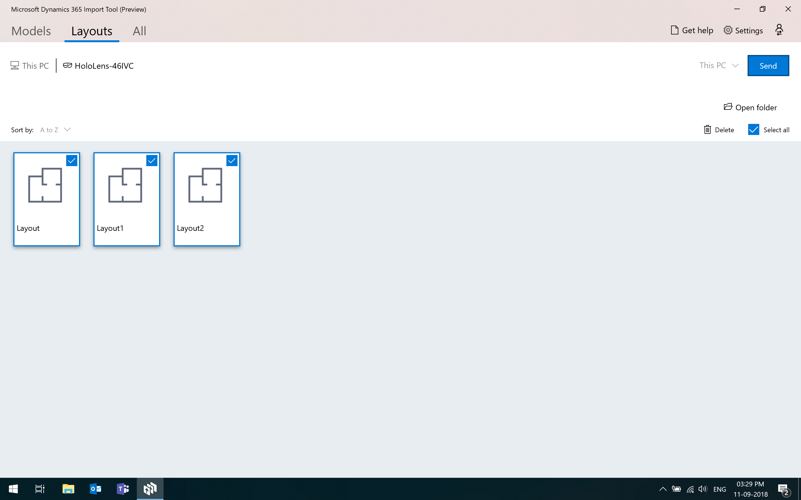
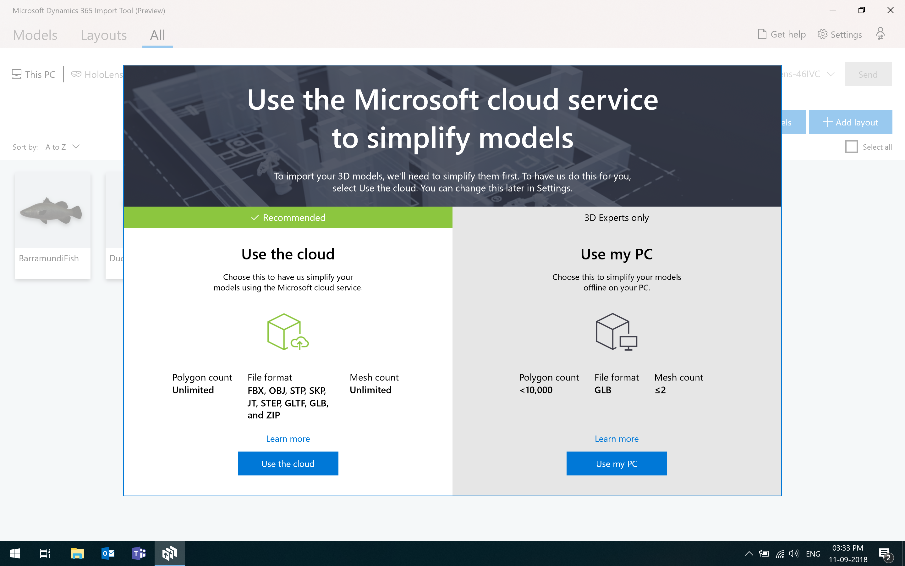
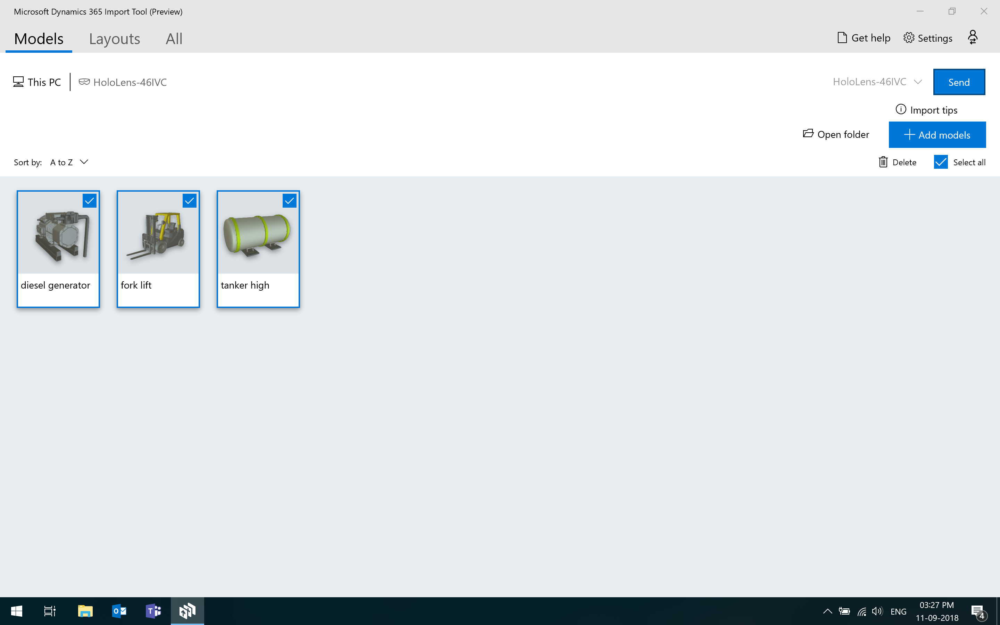
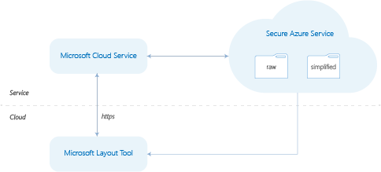

# Dynamics 365 Layout User Guide

Use Microsoft Dynamics 365 Layout to create and design space plans on HoloLens
or on a Windows Mixed Reality immersive headset. Import 3D models and design,
edit, and collaborate virtually, on a real-world scale.

Need more help? [Check out the Layout FAQ](faq.md) for answers to common questions.

[Watch how-to videos about Layout.](https://go.microsoft.com/fwlink/p/?linkid=2021489)

## What you’ll need

-   [A subscription to Layout.](../licensing/buy-and-deploy.md) The Layout subscription also includes the
    Microsoft Dynamics 365 Import Tool (Preview) for PC.

-   A [HoloLens](https://www.microsoft.com/hololens) running the [Windows 10
    April 2018 Update](https://support.microsoft.com/en-us/help/12643) and/or
    a [Windows Mixed Reality immersive
    headset](https://www.microsoft.com/en-us/windows/windows-mixed-reality). 

-   A [Windows Mixed Reality-ready
    PC](https://www.microsoft.com/en-us/windows/windows-mixed-reality-devices#wmrpcs)
    running the [Windows 10 April 2018
    Update](https://support.microsoft.com/en-us/help/4028685).

-   An internet connection.

## Install the apps

How you install Layout and the Import Tool depends on how your administrator
chooses to distribute the apps. Your admin may have you install the app from the
Microsoft Store for Consumers, from your organization’s private store, through
an email link, or another method. 

The following table describes the app/tool, and how to install them from the
public store.

| **App**     | **Device**            | **Use to**                            | **To install from Microsoft store** |
|-------------|-----------------------|---------------------------------------------|-------------------------------------|
| Layout      | HoloLens              | <ul><li>Create layouts by scanning your surroundings </li><li>Place models in your layouts </li></ul>     | On your HoloLens, go to **Start**  \> **Microsoft Store** , search for “Dynamics 365 Layout," and then [install the app](https://www.microsoft.com/store/apps/9N20MQ2V3XCW).      |
| Layout      | Mixed reality headset | Place models in layouts imported from HoloLens or Microsoft Visio | 1. On your PC go to **Start**  \> **Microsoft Store** , search for “Dynamics 365 Layout," and then [install the app](https://www.microsoft.com/store/apps/9N20MQ2V3XCW).   2. Connect your mixed reality headset to the PC and find the app on the mixed reality **Start** menu.     |
| Import Tool | PC                    | <ul><li>Transfer floorplans from Microsoft Visio to HoloLens or Windows Mixed Reality</li><li>Transfer layouts between HoloLens and Windows Mixed Reality </li><li>Process 3D models for use on HoloLens </ul>| On your PC go to **Start**  \> **Microsoft Store** , search for “Dynamics 365 Import Tool (Preview)," and then [install the app](https://www.microsoft.com/store/apps/9NBF1CGB7KHX).      |

## Use Layout

To use Layout, you create space layouts on your HoloLens or PC, and then use a
HoloLens or Windows Mixed Reality immersive headset to place 3D models in the
layouts. The Layout app comes with a set of preinstalled models, and you can
also add your own.

### Create a layout

There are two ways to create a layout:

-   Use [Microsoft Visio](https://products.office.com/en-us/visio/) to design a
    floor plan, and then export it to HoloLens or Windows Mixed Reality.

-   Use Layout on your HoloLens to scan a space.

#### Create a layout with Microsoft Visio 

**Step 1: Download and install the Visio Add-in for Microsoft Dynamics 365
Layout**

1.  Open the Import Tool.

2.  Select **About**, and then select the 32-bit or the 64-bit download (choose
    the one that matches your version of Visio).
    
    > [!div class="mx-imgBorder"]
    >  

3.  Open Visio, and then select **File** \> **Options** \> **Add-ins**.

4.  Next to **Manage**, select **COM Add-ins**, and then select **Go**.

5.  Select **Visio Add-in for Dynamics 365 Layout**, and then select **Add**.

**Step 2: Create your floor plan with Microsoft Visio**

-   When the floor plan is ready, select the **Layout** tab, select **Export**,
    and then save your floor plan.

**Step 3: Import your floor plan using the Import Tool**

1.  In the Import Tool, select **This PC** \> **Add layout**, and then navigate
    to the floor plan.

2.  Select the floor plan, and then select **Open**.

    The floor plan will show up automatically in Layout on a mixed reality immersive
headset connected to the same PC.

To use the layout on HoloLens, you’ll need to move it there:

1.  Connect your HoloLens to your PC using the USB cable.

2.  Open the Import Tool on the PC, and then select **This PC** \> **Layouts**.

3.  Select the check box on the layouts you want to copy, and then select
    **Send**.
    
    > [!div class="mx-imgBorder"]
    > 

4.  On HoloLens, open the Layout app. You’ll find your layout on the **Layouts**
    tab.

#### Create a layout with HoloLens

1.  On your HoloLens, open the Layout app.

2.  Select **New layout**, and then follow the instructions for scanning your
    space and creating a layout.

To move the layout to your PC so you can open it on a mixed reality immersive
headset: 

1.  Connect the HoloLens to the PC using the USB cable.

2.  Open the Import Tool, and then select the HoloLens name.

3.  Select the check box on the layout you want to send to your PC, and then
    select **Send**.
    
    > [!div class="mx-imgBorder"]
    > 

## Convert 3D models for use on HoloLens or Windows Mixed Reality headsets

To use 3D models on HoloLens or your immersive headset, you’ll need to convert
them to the correct file format using the Import Tool, and then move them to the
device you want to use them on.

1.  On your PC, open the Import Tool.

2.  Select **Models** \> **This PC**, and then select **Add models**.

3.  If this is the first time you’ve used the Import Tool, choose how you want
    to simplify your models (you can change this later in the app settings):

    -   To use the Microsoft cloud service, select **Use the cloud**. (You'll
        need an internet connection for this option.)

    -   To use your PC, select **Use my PC**. (With this option, there are
        [limits on the file types](#file-types-and-guidelines) you can import.)
        
        > [!div class="mx-imgBorder"]
        > 

4.  Navigate to the folder where your models are saved, and then select the
    models you want to add (up to 25 at a time).

5.  Select **Open** to start simplifying your models. This might take a while,
    depending on how many you've selected.

If you're using a Windows Mixed Reality immersive headset, your imported models
will show up automatically in Layout.

To use your models on HoloLens, you’ll need to copy them to the device:

1.  On your PC, open the Import Tool.

2.  Connect your HoloLens to the PC, and then sign in to the HoloLens.

3.  In the Import Tool, select **This PC** \> **Models**, and then select the
    check boxes on the models you want to send to HoloLens.
    
    > [!div class="mx-imgBorder"]
    > 

4.  Select **Send**.

### File types and guidelines

There are different limits on the types of files you can import, depending on
whether you use the cloud or your PC to convert the files. Using the cloud
service simplifies the conversion process. If you use the PC option, you’ll need
to adhere to a number of prerequisites.

#### For the cloud service

|  Item           |     Description                          |
|-----------------|------------------------------|
| **File format** | <ul><li>FBX (version 7.5 or earlier) </li><li>OBJ </li><li>SKP (version 18 or earlier) </li><li>JT (versions 8 and 9) </li><li>STP, STEP (versions AP203 and AP214) </li><li>GLTF, GLB </li><ul><li>Version 2.0 </li><li>Supported extensions:<ul><li>Input:<ul><li>MSFT_texture_dds</li><li>KHR_materials_pbrSpecularGlossiness</li></ul><li>Output<ul><li> MSFT_packing_occlusionRoughnessMetallic </li><li>MSFT_packing_normalRoughnessMetallic</li><li>MSFT_texture_dds (supported but not used)</ul></ul></ul><li>ZIP</li> |
| **External files**     | If your model references external files, such as the following, you'll need to create a ZIP file containing the model and the files it references to import the model:  <ul><li>Textures (PNG, TGA, etc.) </li><li>Materials (MTL) </li><li>Other parts </li></ul> The ZIP file should only contain the above file formats and their dependent external files.   |   
| **Textures**   | Textures are unembedded. Zip your file with the unembedded textures. You can only zip one model at a time with its textures.           |   
| **Model orientation**  | <ul><li>Floor-associated objects: the model’s +Y axis should point up and the +Z axis should point forward. </li><li>Ceiling-associated objects: the model’s +Y axis should point down and the +Z axis should point forward. </li><li>Wall-associated objects: the model’s +Y axis should point away from the wall and the +Z axis should point up the wall.</li></ul> |   

See the next section in this topic to learn how the cloud service works.

#### For the PC

|  Item           |     Description                          |
|-----------------|------------------------------|
| **File format** | GLB file formats only, with the following limitations: <ul><li>No more than 1 material per mesh </li><li>No more than 1 set of UVs per mesh </li><li>No more than 2 meshes </li><li>No more than 10,000 total polygons (triangles). Less than 5,000 is recommended. </li><li>Maximum texture size of 2,048 x 2,048 (512 x 512 recommended) </ul> |
| **Textures**     | Textures are embedded. Export your model from your CAD program as a single self-contained file.   **Note:** Emissive, occlusion, specular, and gloss textures will be ignored.    | 
| **Polycount**         | Less than 10,000 polygons per model                                                                 |  
| **Mesh**              | Export your model as \<=2 meshes with 1 material per mesh                                           | 
| **Model orientation** | <ul><li>Floor-associated objects: the model’s +Y axis should point up and the +Z axis should point forward.</li><li>Ceiling-associated objects: the model’s +Y axis should point down and the +Z axis should point forward. </li><li>Wall-associated objects: the model’s +Y axis should point away from the wall and the +Z axis should point up the wall.</ul> |  

## Best practices for importing 3D models 

-   When you’re creating a 3D model using 3D creation tools, make sure that the
    model is not too far off from the center (the origin of the grid).

-   When exporting from 3D creation tools, if available, choose the “embed
    texture option” in FBX export. If not available, include the FBX file and
    any image files in a ZIP archive and use the resulting ZIP as your import
    file.

The Import Tool is designed to import 3D models that can be individually used in
any spatial design layout. It is not optimized for importing intact scenes or
layouts (complete buildings files with multiple models already positioned). Also
note that:

-   Models with interiors will not be preserved.

-   Existing offsets in models, any transforms off the 3D origin (0,0,0), or
    relative offsets from other models will be preserved on export and
    subsequent import.

-   Any usage of layers for grouping or defining model colors will not be
    preserved.

-   Any use of “hatching” in AutoCAD will not be preserved.

-   Imported models that are comprised of multiple individual sub-objects will
    result in a single combined mesh to enable more efficient interaction with
    the complete model.

## How does the Microsoft cloud service work?

When you convert a 3D model, the Import Tool uploads the raw model to
the Microsoft cloud service, which is hosted on a Microsoft Azure web service.
The cloud service transcodes and simplifies the model and then returns the
simplified models to the Import Tool, restricting access via the use of
obfuscated URLs.

-   Both the raw model and the simplified model are transferred by using the
    HTTPS protocol.

-   Both the raw model and the simplified model are hosted on Azure Blob
    storage.

-   Both the raw model and the simplified model are purged from Azure Blob
    storage after 24 hours.

-   The simplified model is fetched via an obfuscated URL by using the HTTPS
    protocol.

    

## Work with models

On HoloLens and in Windows Mixed Reality, you can place, move, copy, resize, and
rotate 3D models.

### On HoloLens

| **To**       | **Do this**                                                                                                                                                                                                              |
|--------------|--------------------------------------------------------------------------------------------------------------------------------------------------------------------------------------------------------------------------|
| Place        | Select **Models**, and then gaze and air tap to select the model you want to place. Use gaze to move the model, and then air tap again to place it.                                                                      |
| Move         | Gaze at a model, and then tap and hold it. Move your hand to reposition the model, then release.                                                                                                                         |
| Copy         | Gaze and air tap to select the model, and then select **Copy**. Move the model where you want it, and then air tap to place it. Select **Done**.                                                                         |
| Resize       | Gaze and air tap to select a model, and then select **Resize**. Tap and hold any edge of the model, and then move your hand in or out.                                                                                   |
| Rotate       | Gaze and air tap to select the model. Select one of the rotation arrows to rotate 90 degrees. For more precise rotation, tap and hold the round rotation control, and then move your hand to rotate.                     |
| Multi-select | Gaze at an empty spot. Tap and hold, and then move your hand diagonally to form a rectangle around all the models you want to select. Gaze at any of the models you’ve selected to see what you can do with all of them. |

### **On an immersive headset**

| **To**       | **Do this**                                                                                                                                                                                                                                                                          |
|--------------|--------------------------------------------------------------------------------------------------------------------------------------------------------------------------------------------------------------------------------------------------------------------------------------|
| Place        | Select **Models** on the app menu. Point your controller at the model you want, and then pull and hold the trigger to pick it up. Point to where you want to place the model, and then let go of the trigger.                                                                        |
| Move         | Point at the model and pull and hold the trigger. Move your controller, and then let go of the trigger to place it.                                                                                                                                                                  |
| Copy         | Select the model, and then select **Copy**. Point your controller to where you want to place the copy, and then pull the trigger again to place it. To place multiple copies, just point and select again—no need to go back to the original. Select **Done** on the last copy.      |
| Resize       | Select the model, and then select **Resize**. Point at one edge of the object, and then pull and hold the trigger. Drag the edge, and then release the trigger.                                                                                                                      |
| Rotate       | Point and pull the trigger to select the model. Then point at one of the rotation arrows and pull the trigger to rotate the model 90 degrees. For more precise rotation, use the round rotation control: point, pull, and hold the trigger, and then move your controller to rotate. |
| Multi-select | Point your controller at an empty spot. Pull and hold the trigger and drag to form a rectangle around the models you want to select. Point at any of the models you’ve selected to see what you can do with all of them. |

# Improve perfomance when your assets don't require texture or multiple colors

In certain scenarios, textures or multiple colors may not be important for visualizing 3D assets. In these cases, to improve perfomance you may want to turn off textures and use a single color. You can do this by using the Performance setting. 

To turn the Performance setting on or off:

- Select **Settings,** select **Performance,** and then select the **Simplify objects by using just one color** option.

### See also
[How-to videos](https://go.microsoft.com/fwlink/p/?linkid=2021489) 
[FAQ](faq.md) 
