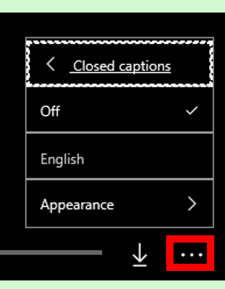

# How-to videos for Dynamics 365 Layout

Watch these short videos to get up and running with [!include[pn-dyn-365-layout](../includes/pn-dyn-365-layout.md)].

Looking for more help? Check out our [User guide](user-guide.md).

> [!TIP]
> To turn on closed captions for videos, select the **More options** (...) button, select **Closed captions**, and then select **English**.   Dynamics 365 Layout is not available in languages other than English at this time.

## Dynamics 365 Layout for HoloLens

<iframe src="https://www.microsoft.com/en-us/videoplayer/embed/RE2EWQP" frameborder="0" allowfullscreen=""></iframe>

 

<iframe src="https://www.microsoft.com/en-us/videoplayer/embed/RE2EK2u" frameborder="0" allowfullscreen=""></iframe>

 

<iframe src="https://www.microsoft.com/en-us/videoplayer/embed/RE2EZt5" frameborder="0" allowfullscreen=""></iframe>

## Dynamics 365 Layout for Windows Mixed Reality

<iframe src="https://www.microsoft.com/en-us/videoplayer/embed/RE2EOUG" frameborder="0" allowfullscreen=""></iframe>

 

<iframe src="https://www.microsoft.com/en-us/videoplayer/embed/RE2EK2x" frameborder="0" allowfullscreen=""></iframe>

 

<iframe src="https://www.microsoft.com/en-us/videoplayer/embed/RE2EK2w" frameborder="0" allowfullscreen=""></iframe>

## Dynamics 365 Import Tool (Preview) for PC

<iframe src="https://www.microsoft.com/en-us/videoplayer/embed/RWqjaR" frameborder="0" allowfullscreen=""></iframe>

 

<iframe src="https://www.microsoft.com/en-us/videoplayer/embed/RWqDZa" frameborder="0" allowfullscreen=""></iframe>

### See also
[Overview of Dynamics 365 Layout](index.md) 
[User guide](user-guide.md) 
[FAQ](faq.md) 
