# Use Autodesk 3ds Max to prepare 3D content for Dynamics 365 mixed-reality applications

When preparing CAD files for Microsoft Dynamics 365 mixed-reality apps, you can run into numerous performance and quality roadblocks that prevent a smooth transition from CAD to real time. The 3ds Max program is a digital content creation (DCC) suite that has a unique ability to bridge parametric models and real-time polygon modeling. This tutorial demonstrates how to use the 3ds Max conversion and optimization capabilities to prepare 3D CAD models for use in mixed reality.  

> [!IMPORTANT]
> This document is created strictly for informative purposes to demonstrate how Autodesk 3ds Max works with Dynamics 365 mixed-reality apps. Your use of third-party applications is subject to terms between you and the third party. Microsoft Corporation is not affiliated with, is not a partner to, and does not endorse or sponsor Autodesk or any of Autodesk's products. There are [other content-creation apps](convert-models.md#tools-for-exporting-cad-models) you can use to prepare your 3D models.

## What is Autodesk 3ds Max?

Autodesk 3ds Max is 3D modeling and rendering software for design visualization, games, and animations. [Read more about Autodesk 3ds Max](https://www.autodesk.com/products/3ds-max/overview).

## Import a file into 3ds Max

1. Open a new scene in 3ds Max, and then on the **File** menu, select **Import** > **Import** to import your 3D model.

   

2. Check the import options to ensure the scene will be imported as expected. Import settings might differ depending on the type of file you import. You can usually keep the default values, with the following exceptions:

   - Set **Hierarchy Mode** to **Flattened**.

   - Set **Mesh Resolution** somewhere between **&ndash;6** and **&ndash;10**.

   - If your model is imported sideways, import it again with **Up Axis** set to **Y-Up**.

   

## Optimize a 3D model

If the polygon count is too high (see [Performance targets](optimize-models.md#performance-targets)), the model won't perform well in mixed-reality apps. To improve performance, you can optimize the 3D model by reducing the polygon count. To see the polygon count, first set up the viewport to show polygon statistics.

### Show polygon statistics

1. To view the number of polygons in your scene, select **+** in the upper-left corner of any viewport window to open the **Configure Viewports** options.  

   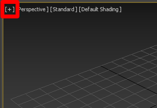

   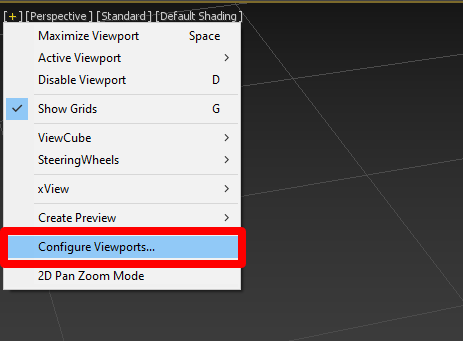

2. In the **Viewport Configuration** screen, select the **Statistics** tab.

3. Under **Setup**, select the **Polygon Count** check box, and then select the **Total + Selection** option. Under **Application**, select the **Show Statistics in Active View** check box. When you're done, select **OK**.

   

   You'll see the total polygon count of your model and the total polygon count of any objects that you've selected.

   

### Add an Edit Poly modifier

Adding an **Edit Poly** modifier helps eliminate shading issues that occur during modification. To add an **Edit Poly** modifier:

- Select all parts of your 3D model, and then apply the **Edit Poly** modifier.

   

### Select objects with high polygon counts

The best way to reduce the size of your model&mdash;while maintaining visual fidelity&mdash;is to find the objects that have the highest polygon count and reduce them the most. Objects such as screws and grills can have thousands of polygons that are rarely seen.

1. Select the **Name** button to open the **Select from Scene** window.

   

2. Select **Customize** > **Configure Columns**.

   

3. Drag **Faces** next to **Name** to activate the column.

   

4. Select the **Faces** tab a few times so that your objects are now sorted from the highest face count to the lowest.

   >[!TIP]
   > You can also search at the top of the **Select from Scene** menu. If your model has lots of fillets, try searching for those. Fillets use lots of polygons and can be reduced without affecting the overall visual fidelity of the model.

5. Select the objects that have the highest face counts, and then select **OK**.

   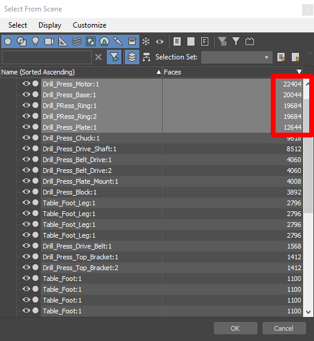

You now have selected the objects with the highest polygon counts. For the example model, about 123,000 of the 195,000 total polygons exist in five objects. The next section in this topic shows how to reduce the polygon count of these objects.

   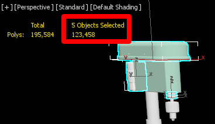

### Reduce the polygon count

1. Open the **Modifier List** located on the right side of the viewport.  
   

2. Select **ProOptimizer** from the list.
  
3. Select **Calculate** to unlock the **Optimization Level** value adjustments. Try different values for **Vertex %** that range from **10%** through **30%** until you find the highest level of reduction that still maintains a visual fidelity that meets your standards.

   

4. On the **Edit** menu, select **Select Invert**, and then add a **ProOptimizer** to the rest of your model. Follow the same steps as you did before, but don't go as low as 10% through 30%. Reduce these other objects until you reach a polygon count that matches the recommended [performance targets](optimize-models.md#performance-targets) for your specific use case and still provides good visual fidelity.

   

   > [!TIP]
   > You can be as granular with what you reduce as you like. If you want specific parts of your model to have higher fidelity, select them and raise the percentage value to meet your needs. Try different techniques until you find one that works best for you.

## Work with curved surfaces 

When curved surfaces are present on 3D models, they might appear faceted. You can soften the appearance of these surfaces by using **Smooth**.

1. On the **Edit** menu, select **Select All** to select all 3D models in the scene.

   

2. In the **Modifier List**, select **Smooth**.

   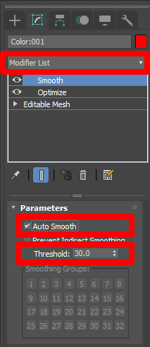

3. Under **Parameters**, select the **Auto Smooth** check box, and then adjust the **Threshold** value until the faceted surfaces appear smooth.  The default threshold is 30.0, which is usually pretty good.

   > [!NOTE]
   > You can also apply the **Smooth** modifier to individual 3D models if they each require a different threshold.

At this point, your model might be optimized enough for use in mixed reality. If you think it will work fine in this form, you can skip to [exporting your model as a GLB file](#export-the-3d-model). If the model is still too complex and has lots of materials, go to the next section.

## Set up materials

Not all CAD materials are compatible with real-time apps, so they must be converted first. In this section, we'll change the materials to a GLB-friendly material type called **Physical Material**. This material is very flexible and is compatible with mixed-reality technology.  

> [!NOTE]
> If your 3D model has 10 or more materials, performance might be an issue. To fix this, skip to [Bake textures](#bake-textures), later in this tutorial.

1. On the **Rendering** menu, select **Scene Converter**.

   

2. In the **Scene Converter** dialog box, expand **Materials**, and then select **Standard Material to Physical Material**.

   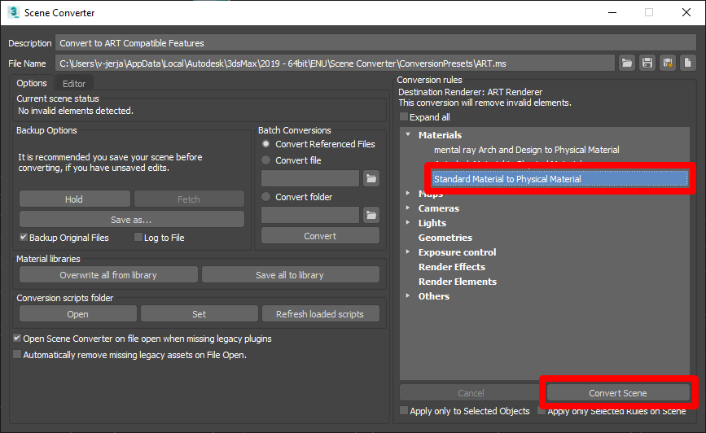

3. Select **Convert Scene**.

## Add or modify existing materials

In cases where you want fine control over materials, you can apply and change material characteristics such as color and reflection.  

1. On the **Rendering** menu, select **Material Editor** > **Compact Material Editor**. This gives you control over how the materials will look.

   

2. The **Material Editor** window includes blank material slots that appear as grey spheres. To load a slot for inspection, select the eye dropper, and then select the 3D model you want to look at.

   

   The important parameters to look at are **Base Color** and **Reflections**. **Reflections** is controlled by the **Metalness** and **Roughness** values&mdash;the surface finish of the material.

   - To apply a material to another 3D model, drag the active material ball on top of the 3D model you want to change.

     

   - To inspect another material, either use the eyedropper again to overwrite the current material slot, or select a new slot to easily switch back and forth between materials.

## Bake textures

If there are more than ten materials on the 3D model, combining them into a single material can increase performance. You can do this by "baking" material colors into a single image map. This is optional, but it's a good idea if you find that you experience performance issues when viewing your 3D model. The goal is to have one object with the colors of the original 3D model, and another that represents the combined 3D models to bake to.

  > [!NOTE]
  > * This process only works if the materials haven't yet been converted to **Physical Material**.
  > * Baking, UVs, and texture maps are complex. The goal of this tutorial isn't to make you an expert in texture baking, but to help you get through the process so that you can use your 3D models with Dynamics 365 mixed-reality apps. For this reason, this tutorial doesn't go into a lot of detail about texture baking.

### Prepare the 3D model

1. Choose a single object from your model hierarchy, rename it to **Original** and add an **Edit Poly** modifier to it.

2. Go to the object selection.

3. Attach all the 3D models by selecting one object and adding another **Edit Poly** modifier to it. It doesn't matter which 3D model you select.

  	

4. Under the **Tool** menu, select the button to the right of the **Attach** button. This button shows the available models in the scene that you can combine together.

   

5. Select all the 3D models in the attach list, and then select **Add**. 

   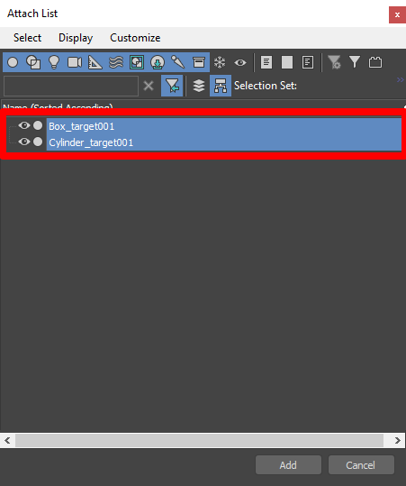

6. When prompted, select **Match Material IDs to Material**, and then select **OK**.

   

   All the individual meshes are now combined into one.

7. Rename the mesh **Original** or something similar. Going forward in this tutorial, we'll refer to this mesh as the original mesh.

### Unwrap UVs

1. Unwrap the duplicate 3D model by selecting and applying the **Unwrap UVW** modifier from the **Modifier List** for your original mesh. Select **Polygon** in the drop-down list, to edit the UV faces.

   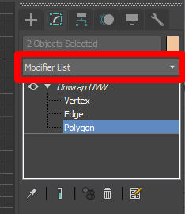

2. Under **Edit UVs**, select **Open UV Editor**.

   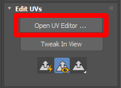

3. In the **Edit UVWs** window, select **Mapping** > **Flatten Mapping**.

   

4. In the option box that appears, give the UVs some padding by setting **Spacing** to **0.003**, select the check box for **By Material IDs**, and then select **OK**.

   

### Create a copy of the original mesh

Now that the original mesh has been prepared, you need to create a copy of it to bake the texture to.

1. To clone the 3D model, select it, and then select **Edit** > **Clone**.

   

2. Select **Copy**, and then rename the object so that you know it's the cloned object.

   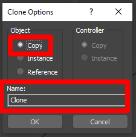

<!--note from editor: I renamed this H3 so we wouldn't have two identical headings in this topic.-->
### Bake texture onto the cloned mesh

1. Select the cloned mesh (the one you want to bake the texture onto).

2. On the **Rendering** menu, select **Render To Texture**.

   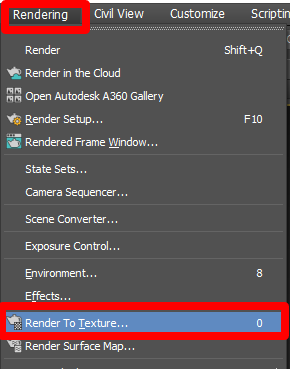

3. Set up the **Render to Texture** menu in the following ways:

   a. Under **Output**, set **Path** to the location where the map will bake. You can leave the default setting if you don't have a specific destination in mind.

     

   b. Change the **Render Settings** to **3dsmax.scanline.no.advanced.lighting.high**.

     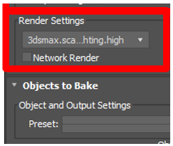

   c. When you're prompted to **Select Preset Categories**, leave the entries all highlighted, and then select **Load**.

      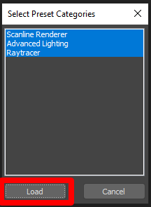

   d. Under **Projection Mapping**, do the following:

>>>i. Select the **Enabled** check box, select **Pick**, select the original source 3D models you want to bake the color from, and then select **Add**.

>>>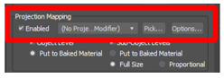

>>>ii. Select the **Options** button next to the **Pick** button, and then in the **Method** section, select the **UV Match** option, clear the **Use Cage** check box, and close the window.
 
>>>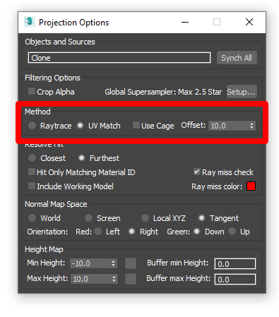

   d. Under **Mapping Coordinates**, select the **Use Existing Channel** option, and then set the channel to **1**.

   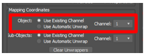

   e. Under **Output**, select **Add**, select **DiffuseMap**, and then select **Add Elements**.

   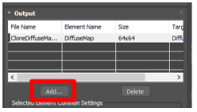

   f. Select the three dots next to **File Name and Type**, and then select **.png**.

   

   g. In the pop-up menu, select the **RGB 24 bit** option, clear the **Alpha channel** check box, and then select **OK**.

   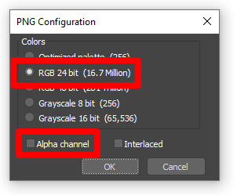 
 
   h. In the **Target Map Slot** field, select **Diffuse Color**.

    

   i. Select the **Use Automatic Map Size** check box.

   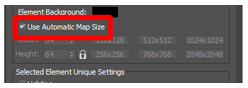

   j. Under **Automatic Map Size**, select the **Nearest power of 2** check box.

   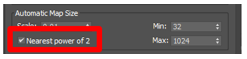

   k. After everything is set correctly, select **Render** to bake the diffuse color map. A preview window might appear, but the final map is automatically saved to the output location.

   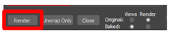 

   The full group of settings for the **Rendering** menu looks like this:

   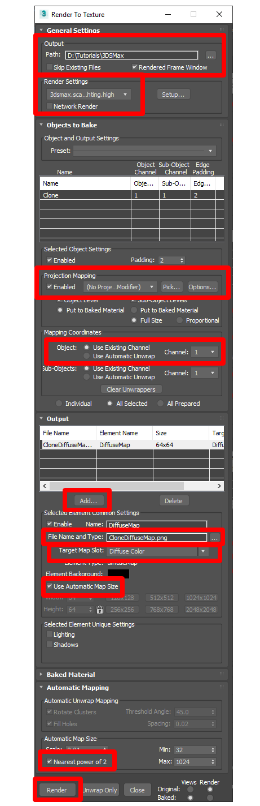
 
4. If you go to the location where your .png was saved and open it, the baked map might look something like this:
 
   

## Apply the texture

1. Select **Rendering** > **Material Editor** > **Compact Material Editor** to open the Compact Material Editor.

   

2. Set up a new material slot in the material editor.  

3. Select one of the gray spheres and drag it to the unwrapped 3D model. At this point, the model will appear gray because it has just one material on it.

4. Select the **Standard** button to open **Material/Map Browser**.

   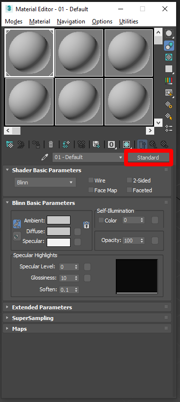

5. Select **Materials** > **General** > **Physical Material**.

   

6. Set the **Roughness** value to **0.1** and the **Metalness** value to **0.9**.

   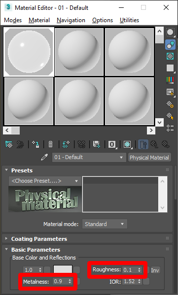

7. To attach the baked color map, select the option box  next to the **Base Color and Reflections** color selector, and then select **Maps** > **General** > **Bitmap** from the list of options.

   

8. When prompted to **Select Bitmap Image File**, select the texture you created earlier.

   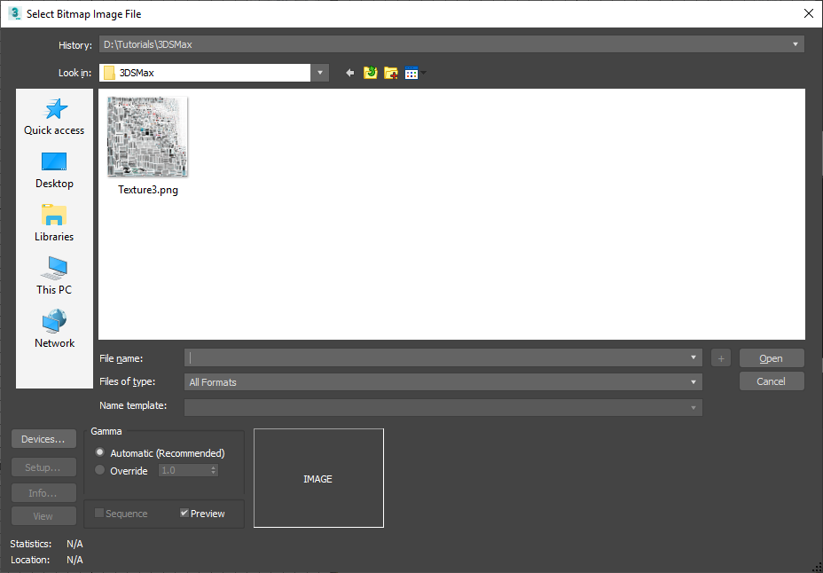

9. To view the new texture on the model, in the viewport, go to: **User Defined** > **Materials** > **Shaded Materials with Maps**.

   

10. Hide the original 3D model so you can see the optimized 3D model with its texture.

    

## Export the 3D model

1. Select the cloned model.

2. On the **Babylon** menu, select [Babylon File Exporter](https://doc.babylonjs.com/resources/3dsmax).

     

3. Make sure **glb** is selected under **Output format**, and then select the **Export only selected** check box so all necessary or selected 3D models are exported.  

   

4. Select **Export**.

## View the 3D model in Dynamics 365 mixed-reality apps

After you've prepared your 3D models, you can use the following Dynamics 365 apps to view them in mixed reality:

[Dynamics 365 Product Visualize](../product-visualize/index.md)  
[Dynamics 365 Guides](../guides/index.md)

### More information

Several screenshots in this document were taken from the Autodesk 3ds Max software program in order to provide clear instructions on how to use Autodesk's software. [Learn more about Autodesk](https://www.autodesk.com/).

You can find more information about these products here:

[Autodesk 3ds Max](https://area.autodesk.com/crush-it-3ds-max-2/?mktvar002=759224&&mkwid=sKU4V0FKc%7cpcrid%7c300714295428%7cpkw%7cmax%203ds%7cpmt%7ce%7cpdv%7cc%7cslid%7c%7cpgrid%7c23187845595%7cptaid%7ckwd-37564256%7c&intent=3ds+Max+-+Brand&utm_medium=cpc&utm_source=google&utm_campaign=GGL_3DS+MAX_US_BR_SEM_EXACT&utm_term=max%203ds&utm_content=sKU4V0FKc%7cpcrid%7c300714295428%7cpkw%7cmax%203ds%7cpmt%7ce%7cpdv%7cc%7cslid%7c%7cpgrid%7c23187845595%7cptaid%7ckwd-37564256%7c&addisttype=g&s_kwcid=AL!8131199977!3!300714295428!e!!g!!max%203ds&gclid=EAIaIQobChMItvLZ4ZC64wIVDtRkCh1r-A0VEAAYASAAEgJhwfD_BwE&gclsrc=aw.ds)  
[Babylon Exporter for 3ds Max](https://doc.babylonjs.com/resources/3dsmax)  

Microsoft Corporation is not responsible for, and expressly disclaims all liability for damages of any kind arising out of the use of Autodesk 3ds Max, or reliance on these instructions. This document is created only to provide general information to our customers and does not take into consideration any individualized business plans or specifications.

The use in this document of trademarked names and images is strictly for informative and descriptive purposes, and no commercial claim to their use, or suggestion of sponsorship or endorsement, is made by Microsoft.  

[!INCLUDE[footer-include](../includes/footer-banner.md)]
