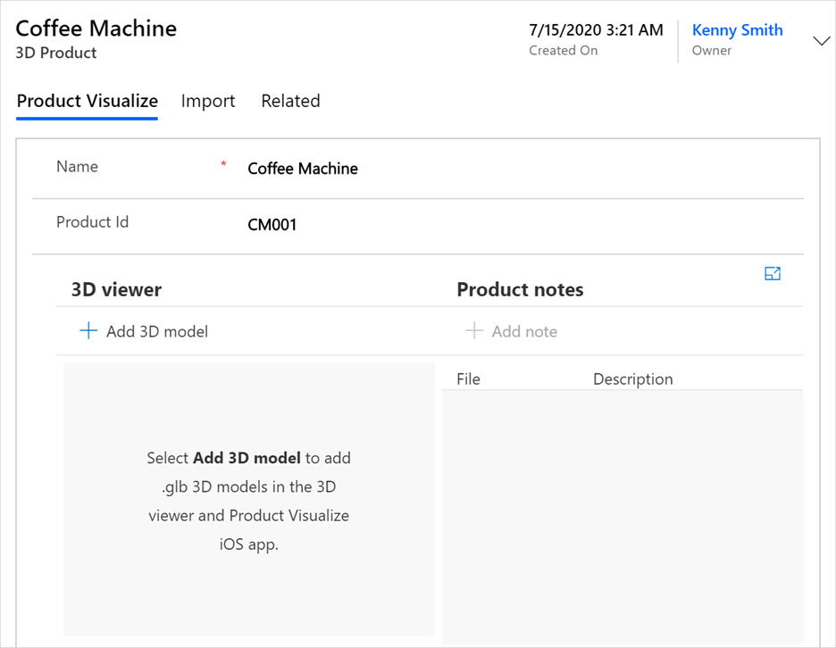

# Add a 3D product

[!INCLUDE [cc-beta-prerelease-disclaimer](../includes/cc-beta-prerelease-disclaimer.md)]

1.  [Sign in to Dynamics 365 Product Visualize Hub](sign-in-app.md).

2.  In the left pane, select **3D product catalog**.

    

3.  On the toolbar at the top of the page, select **New**.

4.  On the **New 3D Product** page, give the product a **Name** and **Product Id**.

5.  Select **Save**.

    

### See also

[Sign in to Dynamics 365 Product Visualize Hub](sign-in-app.md) 
[Add 3D models to a product](add-3d-model-product.md) 
[Add a note to a model](add-note-model.md) 
[Create a mixed-reality session](create-mr-session.md) 
[Add a product to a mixed-reality session](add-product-mr-session.md) 
[Set up Microsoft Teams](setup-ms-teams.md)

[!INCLUDE[footer-include](../includes/footer-banner.md)]
