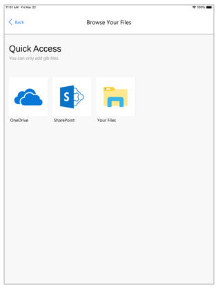

# Add your own 3D model to an existing Dynamics 365 Sales product

[!INCLUDE [cc-beta-prerelease-disclaimer](../includes/cc-beta-prerelease-disclaimer.md)]

If you have a 3D model stored in Microsoft SharePoint or OneDrive, or on your local device, it's simple to add it to a product included in a Dynamics 365 Sales opportunity from Microsoft Dynamics 365 Product Visualize (in preview).

> [!NOTE]
> 3D models must be in GLB format to link them to a product.

## Add a 3D model to a product

1.	Navigate to the **My Open Opportunities** screen, and then tap **View Models** at the upper-right corner of the screen.

    
 
2.	On the **Browse Your Files** screen, tap the service where the 3D model is stored, or tap **Your Files** to access the files on your device.

    
 
    > [!NOTE]
    > If you tap **SharePoint**, you'll see a list of the SharePoint sites associated with your Dynamics 365 sign-in credentials.

3.	When prompted to link the model, tap **Confirm**.
 
    When the model is ready, you'll see a **Success!** message, and then you'll see the screen where you selected the model so you can add additional models if you want.
    
### See also

[Open the app and sign in](sign-in.md) 
[Place and manipulate 3D models](manipulate-models.md) 
[Add a note to your 3D model](add-note.md) 
[Show or hide layers in a 3D model](layers.md) 
[Explore sample 3D models](explore-samples.md) 
[View 3D models stored on your device](browse-models.md) 
[Download 3D models to use offline](download-models.md)
