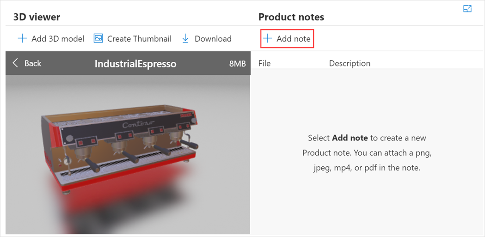
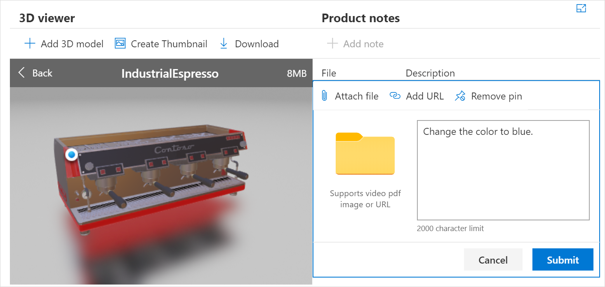

# Add a note to a model

[!INCLUDE [cc-beta-prerelease-disclaimer](../includes/cc-beta-prerelease-disclaimer.md)]

1.  [Sign in to Dynamics 365 Product Visualize Hub](sign-in-app.md).

2.  In the left pane, select **3D product catalog**.

3.  On the **Active 3D Products** page, select your product.

4.  Under **3D viewer**, select the model to which you want to add a note.

5.  Under **Product details**, select **Add note**.

    

6.  To attach a PDF, an image, or a short video, select **Attach file**, and then select the file by using your file browser. 

    To remove the attachment, select **Remove attachment**.

7.  To include a link to a website, select **Add URL**, and then enter the website address in the text field. The URL must start with http:// or https://.

    To remove the URL, select **Remove URL**.

8.  To attach your note to a specific point on the 3D model, select **Pin to model**, and then click on the model. A note anchor pin is added where you attached the note.

    To remove the anchor pin, select **Remove pin**.

9.  To add a text message, enter the message in the text field.

    

10. Select **Submit**. The added note is displayed under **Product details**.

    

## Manage notes

After you've added notes to your model, you can edit or delete them.

1.  [Sign in to Dynamics 365 Product Visualize Hub](sign-in-app.md).

2.  In the left pane, select **3D product catalog**.

3.  On the **Active 3D Products** page, select your product.

4.  Under **3D viewer**, select the model that has the note you want to edit or delete.

    - To edit a note, select **Edit note**  beside the corresponding note.

    - To delete a note, select **Delete note**  beside the corresponding note.

### See also

[Sign in to Dynamics 365 Product Visualize Hub](sign-in-app.md) 
[Add a 3D product](add-3d-product.md) 
[Add 3D models to a product](add-3d-model-product.md) 
[Create a mixed-reality session](create-mr-session.md) 
[Add a product to a mixed-reality session](add-product-mr-session.md) 
[Set up Microsoft Teams](setup-ms-teams.md)

[!INCLUDE[footer-include](../includes/footer-banner.md)]
